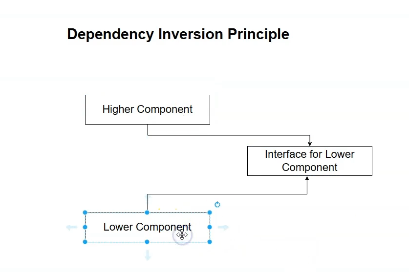

## Organizing Minimal API Endpoints with Extension Methods in ASP.NET Core

### Overview

- As your Minimal API project grows, putting all endpoints in **`Program.cs`** becomes hard to maintain.
- To keep the codebase clean and modular, **organize endpoints into separate static classes using extension methods**.
- This approach improves maintainability and separates concerns.

---

### How to Organize Endpoints

1. **Create an `Endpoints` folder:**
   - Example: Create a folder named `Endpoints` in your project.

2. **Create a static class for related endpoints:**

```c#
public static class EmployeeEndpoints
{
public static void MapEmployeeEndpoints(this WebApplication app)
{
app.MapGet("/employees", () => { /* handler logic / });
app.MapGet("/employees/{id:int}", (int id) => { / handler logic / });
app.MapPost("/employees", (Employee employee) => { / handler logic / });
app.MapPut("/employees/{id:int}", (int id, Employee employee) => { / handler logic / });
app.MapDelete("/employees/{id:int}", (int id) => { / handler logic */ });
}
}


```


3. **Call the extension method in `Program.cs`:**

```c#
var builder = WebApplication.CreateBuilder(args);
var app = builder.Build();

app.MapEmployeeEndpoints(); // Call to organized endpoint mappings

app.Run();

```

---

### Important Notes

- Your extension methods receive a `WebApplication` instance (`this WebApplication app`) to register routes.
- You may need to add explicit `using` directives for namespaces like:
- `Microsoft.AspNetCore.Http`
- `Microsoft.AspNetCore.Http.Results`
- This pattern allows for organizing endpoints by feature or domain (e.g., employees, departments).
- Keeps `Program.cs` clean and focused on app configuration and middleware setup only.

---

### Benefits

| Benefit                 | Description                                           |
|-------------------------|-------------------------------------------------------|
| Maintainability         | Easily locate and work on endpoints by feature       |
| Clean `Program.cs`      | Separation of concerns; no business logic in startup  |
| Scalability             | Supports adding new modules (e.g., Departments) easily|
| Readability             | Group related routes logically for better clarity     |

---

### Summary

Using extension methods to organize Minimal API endpoints is a popular and effective approach to:

- Modularize endpoint registrations
- Reduce clutter in `Program.cs`
- Facilitate team collaboration by feature areas

---

## Introduction to Dependency Injection in ASP.NET Core Minimal APIs

### Overview

- Current issue: Your API endpoint classes (e.g., EmployeeEndpoints) tightly depend on concrete implementations like a static EmployeeRepository.
- This tight coupling means the API code knows and depends directly on data access code, making maintenance harder and preventing independent team work.
- For example, renaming or changing the repository requires updating all API references, and teams cannot work independently on API and data layers.

---

### What Is Dependency Injection?

- Dependency Injection (DI) is a design practice that:
  - **Decouples components** by inverting control—API layers do not create or directly depend on repositories.
  - Enables **looser coupling and easier testing**.
  - Allows you to inject dependencies, like repositories or services, into your API handlers.

---

### Why Is DI Important Here?

- Without DI, your Minimal API handlers directly use static or concrete repository classes.
- This leads to **tight coupling**:
  - API code tightly integrated with data access code.
  - Difficult to maintain or extend independently.
  - Hard to replace implementations (like switching databases or using mocks for tests).

---

### How to Fix Dependency Problems

- Apply **Dependency Inversion Principle**:
  - Depend on abstractions (interfaces), not concrete classes.
- Use ASP.NET Core’s built-in **Dependency Injection container** to inject dependencies into your handlers.
- This approach follows **Inversion of Control (IoC)**, handing control of object creation and lifetime management to the framework.

---

### Summary Table

| Concept                     | Explanation                                         |
|-----------------------------|-----------------------------------------------------|
| Problem                     | Tight coupling between API and repository layers    |
| Solution                    | Apply Dependency Injection and Dependency Inversion |
| Benefit                    | Loose coupling, maintainability, testability        |
| ASP.NET Core DI Container    | Built-in IoC container; register services in Startup/Program |
| Injection in Minimal APIs    | Inject dependencies via handler method parameters   |

---

### Next Steps

- Upcoming lessons will cover:
  - Dependency Inversion Principle in detail.
  - How to register and inject dependencies in Minimal APIs.
- Goal: Decouple API endpoint logic from data access logic, enabling clean, modular architecture.

---

**Summary:**  
Decoupling via dependency injection helps maintain clean code, supports team collaboration, and allows flexible, testable API design in ASP.NET Core Minimal APIs.


## Dependency Inversion Principle (DIP) in ASP.NET Core Minimal APIs

### Problem Recap

- The API definition layer (high-level component) currently depends directly on the concrete EmployeeRepository (low-level component).
- This causes **tight coupling**, making maintenance, testing, and independent development difficult.

---

### What Is the Dependency Inversion Principle?

- DIP states:  
  **High-level modules should not depend on low-level modules. Both should depend on abstractions.**
- Instead of the API directly referencing a concrete repository, both the API and the repository depend on a shared abstraction (usually an interface).
- This inversion breaks the direct dependency between the high-level (API code) and low-level (data access) modules.
- 

---

### Illustration

- **Before DIP:**  
  - API → depends on → EmployeeRepository (concrete class)
- **After DIP:**  
  - API → depends on → IEmployeeRepository (interface)  
  - EmployeeRepository → implements → IEmployeeRepository  
  - Both depend on the abstraction, not each other.

---

### Implementation Steps

1. **Convert repository to instance class** (not static).  
2. **Define an interface** (e.g., `IEmployeeRepository`) representing repository operations.  
3. **Make repository implement this interface.**  
4. In API endpoints (`EmployeeEndpoints`), **depend on the interface, not the concrete class**.  
5. Use Dependency Injection to provide the concrete implementation at runtime (covered later).

---

### Benefits

- **Decoupling:** API no longer tightly coupled to repository implementation.  
- **Maintainability:** Changes in repository implemention don't impact API code.  
- **Testability:** Mock interfaces for easier unit testing.  
- **Team Independence:** Separate teams can work on API logic vs. data access.

---

### Summary Table

| Aspect               | Before DIP                          | After DIP                          |
|----------------------|-----------------------------------|----------------------------------|
| Dependency           | API → Concrete Repository          | API & Repository → Interface      |
| Coupling             | Tight                            | Loose                            |
| Maintainability      | Harder due to direct dependency   | Easier with abstraction           |
| Testability          | Difficult                        | Easier with mocking interfaces    |
| Team Collaboration   | Coupled teams                    | Independent teams                 |

---

### Next Steps

- Learn how to register implementations in ASP.NET Core's Dependency Injection container.
- Inject repository interface into endpoints.
- Understand **Inversion of Control (IoC)** principle to complete decoupling.

---

**Summary:**  
The Dependency Inversion Principle forms a foundation for maintainable, extensible Minimal API architectures by focusing dependencies on abstractions rather than concretes.

## Inversion of Control (IoC) Principle in ASP.NET Core Minimal APIs

### Problem Recap

- The API layer (higher component) depends on an interface (`IEmployeeRepository`) for data access.
- However, without IoC, the API might still **instantiate the concrete repository** directly inside its code.
- This breaks Dependency Inversion Principle because the high-level component controls creation of the low-level component.

---

### What Is Inversion of Control (IoC)?

- IoC is a design principle shifting control of:
  - Object creation
  - Dependency management  
  **from the application code itself to an external container or framework.**

- Instead of higher components instantiating dependencies manually, **the container (framework) instantiates and injects them**.

---

### Illustration Without IoC

```c#
public class EmployeeEndpoints
{
public static void MapEmployeeEndpoints(this WebApplication app)
{
var employeeRepository = new EmployeeRepository(); // Manual creation (bad)

    app.MapGet("/employees", () =>
    {
        var employees = employeeRepository.GetAll();
        return employees;
    });
}
}


```

- Even though we depend on interface type, we still create concrete instance manually.
- High-level component still controls lower component’s lifecycle → tight coupling.

---

### How IoC Fixes It

- With IoC, **the framework creates and injects the concrete repository**.
- The API code only refers to the abstraction (`IEmployeeRepository`).
- Creation and disposal of dependencies are handled **externally by the DI container**.

---

### How It Works in ASP.NET Core

- Register the abstraction and concrete type in DI container:

```c#
builder.Services.AddTransient<IEmployeeRepository, EmployeeRepository>();

```
- The framework automatically injects `IEmployeeRepository` wherever needed, e.g., in Minimal API handlers:

```c#
app.MapGet("/employees", (IEmployeeRepository repo) =>
{
var employees = repo.GetAll();
return employees;
});

```

- Neither the API code nor the repository manages construction; container manages it.

---

### Benefits

| Aspect                  | Without IoC                         | With IoC                                  |
|-------------------------|------------------------------------|-------------------------------------------|
| Dependency control      | Handled by API code (tight coupling) | Handled by DI container (loose coupling)  |
| Object lifecycle       | Manually controlled                | Framework controlled                       |
| Testability            | Difficult, hard to mock            | Easy with DI                              |
| Maintenance            | Changes affect many places         | Changes isolated, interface-based         |

---

### Summary Diagram Revisited

High-level API component --> Interface (Abstraction) <-- Low-level Repository implementation
↑ ↑
IoC Container (ASP.NET Core DI) manages creation and injection


---

### Next Steps

- Learn the **DI container setup** in `Program.cs`.
- Explore different service lifetimes (`Transient`, `Scoped`, `Singleton`).
- Practice injecting dependencies into Minimal API route handlers.

---

**Summary:**  
IoC in ASP.NET Core shifts responsibility for creating and managing dependencies away from your API code into the built-in DI container, enhancing flexibility, testability, and maintainability in Minimal APIs.

## Dependency Injection Lifetime Management in ASP.NET Core Minimal APIs

### Overview

- When using Dependency Injection (DI) in ASP.NET Core, the **framework controls the lifespan (lifetime) of your service objects**.
- You configure how long instances live when you register services in the DI container.
- ASP.NET Core offers **three main lifetimes** to manage service lifetimes and control resource usage and behavior:
  1. **Singleton**
  2. **Transient**
  3. **Scoped**

---

### 1. Singleton Lifetime

- A **singleton service** is created **once for the entire lifetime of the application**.
- Every time the service is requested, the **same instance** is returned.
- Use singleton for **shared, thread-safe, stateful** services or **in-memory data stores** (e.g., repositories with in-memory lists).
- **Example:**  
```c#
builder.Services.AddSingleton<IEmployeeRepository, EmployeeRepository>();
```
- Benefits:
- Sharing same instance avoids data inconsistency.
- Ideal for costly-to-create services or shared state.

---

### 2. Transient Lifetime

- A **transient service** is created **every time it is requested** from the DI container.
- Suitable for lightweight, stateless services where separate instances are preferred.
- **Example:**

```c#
builder.Services.AddTransient<IMyService, MyService>();
```
- In middleware pipelines, each component requesting the service gets a new instance.
- Generally the safest and most commonly used lifetime.

---

### 3. Scoped Lifetime

- A **scoped service** is created **once per HTTP request** and reused throughout that request.
- When a new HTTP request begins, a new instance is created.
- Useful for services that maintain state during a request, e.g., database context.
- **Example:**
```c#
builder.Services.AddScoped<IDbContext, DbContext>();
```
- Useful for resource sharing during request processing but isolation between different requests.

---

### When to Use Each Lifetime?

| Lifetime   | When to Use                                         | Example Use Case                     |
|------------|----------------------------------------------------|------------------------------------|
| Singleton  | Shared, application-wide state, expensive creation | Configuration, logging, in-memory cache |
| Transient  | Lightweight, stateless, always fresh instances     | Simple utility services             |
| Scoped     | Per-request state, dependency for database context | Database contexts, user sessions    |

---

### How It Works in ASP.NET Core

- ASP.NET Core creates and disposes services according to these lifetimes automatically.
- Middleware components and Minimal API handlers receive the properly scoped instances.
- Choosing wrong lifetime can cause issues:
- E.g., Singleton service with transient dependencies can cause unintended shared state.

---

### Summary Diagram

Application Startup -------------------------------------------|
|
Singleton: one instance shared --------------------------------|
|
HTTP Request ---------------------------------------------------|
|
Scoped: one instance per HTTP request --------------------------------|
|
Transient: new instance every time requested -------------------|


---

### Conclusion

- Proper lifetime management is essential for predictable and efficient DI behavior.
- Register services with `.AddSingleton()`, `.AddScoped()`, or `.AddTransient()` depending on your use case.
- Singleton keeps one instance for app lifetime; Scoped keeps one per request; Transient creates new instances on every injection.
- For in-memory repositories, **Singleton** is recommended to maintain consistent data state.

---

If you want example code or more detailed recommendations on service lifetimes, just ask!


