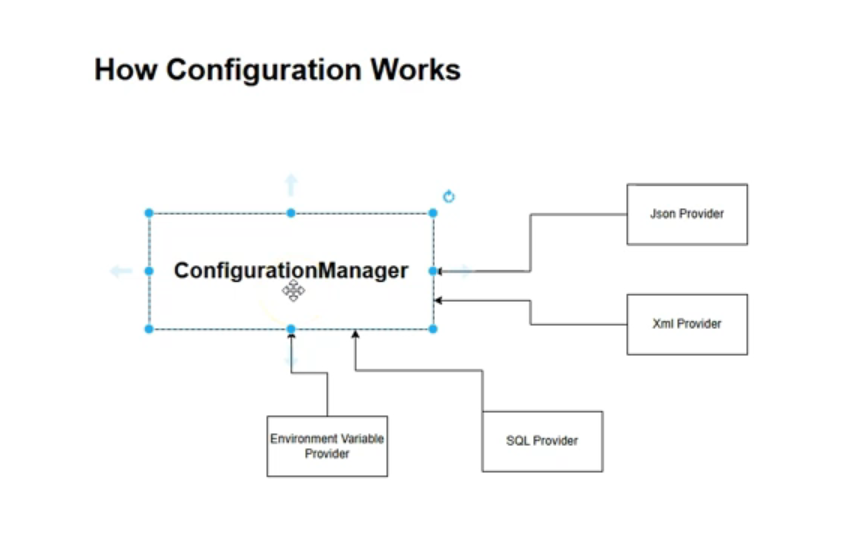
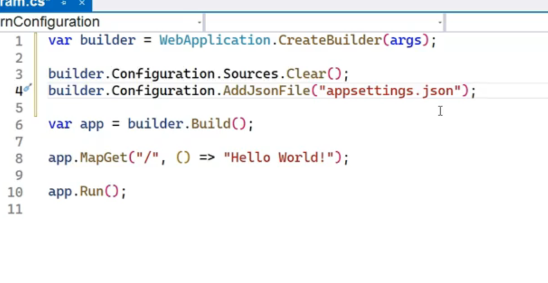
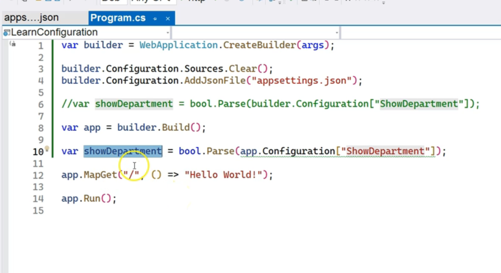

# Configuration System in ASP.NET Core

#### 1. The Core Architecture: A Plugin-Based System

The configuration system in ASP.NET Core is not tied to a single file format or source. It uses a central `ConfigurationManager` that can be extended with various "providers." Each provider is responsible for reading configuration data from a specific source.

- 

* **Configuration Manager:** The main class that aggregates data from all registered providers and exposes a unified set of key-value pairs to the application.
* **Configuration Providers:** These are the "plugins" that do the actual work of reading data. Examples include:
    * JSON Provider (reads from `.json` files)
    * XML Provider (reads from `.xml` files)
    * Environment Variables Provider (reads from the system's environment variables)
    * Custom providers (e.g., a provider to read from a SQL database).

**Diagram: Configuration Architecture**

This diagram illustrates how different providers feed data into the central `ConfigurationManager`, which the application then consumes.

```
+--------------------------+     reads     +------------------------+
|       appsettings.json   | <---------- |      JSON Provider     |
+--------------------------+             +------------------------+
                                                     |
+--------------------------+     reads     +------------------------+      |      +---------------------+
| Environment Variables    | <---------- | Env. Variable Provider | -----> | Configuration Manager | -----> | ASP.NET Core App  |
+--------------------------+             +------------------------+      |      +---------------------+      (via DI)
                                                     |
+--------------------------+     reads     +------------------------+      |
|    SQL Database          | <---------- |   Custom SQL Provider  | ----->
+--------------------------+             +------------------------+
```


#### 2. Default Providers and the Order of Precedence

When you create a new ASP.NET Core project, a set of default providers is automatically registered in a specific order. This order is critical because **providers registered later will override the values of providers registered earlier**.

- 

The default hierarchy is generally as follows (from lowest to highest precedence):

1. **`appsettings.json`**: Base configuration for all environments.
2. **`appsettings.{Environment}.json`**: Environment-specific settings (e.g., `appsettings.Development.json` or `appsettings.Production.json`). Values here override those in `appsettings.json`.
3. **User Secrets**: Used during development to store sensitive data (like API keys or connection strings) outside the project folder. Overrides the `appsettings` files.
4. **Environment Variables**: Overrides all the file-based providers.
5. **Command-line Arguments**: (Not mentioned in the transcript, but is part of the default chain). Has the highest precedence.

**Diagram: Configuration Override Hierarchy**

```
      HIGHEST PRECEDENCE (Overrides all below)
+-------------------------------------------------+
|              Environment Variables              |
+-------------------------------------------------+
|                    User Secrets                 |  (Development only)
+-------------------------------------------------+
|      appsettings.{Environment}.json             |  (e.g., appsettings.Development.json)
+-------------------------------------------------+
|      appsettings.json                           |
+-------------------------------------------------+
       LOWEST PRECEDENCE (Base configuration)
```


#### 3. Customizing Configuration Providers

Developers have full control over the configuration stack. You can clear the default providers and build your own chain. This is done in `Program.cs` using the `builder.Configuration` object.

**Code Example: Clearing Defaults and Adding a Specific Provider**

The following code demonstrates how to remove all default providers and explicitly add back only the provider for `appsettings.json`.

```csharp
// In Program.cs of an ASP.NET Core application

var builder = WebApplication.CreateBuilder(args);

// 1. Clear all the default configuration sources that ASP.NET Core adds automatically.
builder.Configuration.Sources.Clear();

// 2. Add back only the specific providers you want.
// In this case, we are only adding the provider for appsettings.json.
// The app will now be unable to read from environment variables or user secrets
// unless they are explicitly added back.
builder.Configuration.AddJsonFile("appsettings.json");

var app = builder.Build();

app.MapGet("/", () => "Hello World!");

app.Run();
```


***

### Key Points for Interviews

This table highlights the core concepts from the transcript that are valuable in a technical interview setting.


| Concept | Key Point \& "Why It's Important" | Potential Interview Questions |
| :-- | :-- | :-- |
| **Configuration Providers** | ASP.NET Core uses a flexible provider model to load configuration from various sources (JSON, XML, environment variables, etc.). This makes the system extensible and adaptable to different deployment environments. | "How does ASP.NET Core load configuration? What is a 'provider'?" <br/> "Can you give examples of different configuration providers?" |
| **Configuration Hierarchy** | Configuration sources are layered, and sources added later override the values from sources added earlier. This allows you to set base values and override them for specific environments (e.g., Development vs. Production). | "What is the purpose of having both `appsettings.json` and `appsettings.Development.json`?" <br/> "If a setting is defined in `appsettings.json` and also as an environment variable, which value will the application use? Why?" |
| **`IConfiguration`** | The final, aggregated configuration is made available to the application through the `IConfiguration` interface, which is typically accessed via **Dependency Injection**. | "How would you access a configuration value from within a controller or service?" |
| **User Secrets** | A specific tool and provider for storing sensitive data during local development. It keeps secrets out of source control, enhancing security. | "What are User Secrets and when should you use them?" <br/> "Why is it a bad practice to store connection strings directly in `appsettings.json`?" |
| **Customizing Configuration** | Developers can clear the default providers and build a custom configuration stack using methods like `AddJsonFile`, `AddXmlFile`, `AddEnvironmentVariables`, etc., on the `ConfigurationManager`. | "How would you load configuration settings from a custom XML file that is not named `appsettings.xml`?" |


# Accessing Configuration Values

### Summary

This transcript details the practical methods for accessing configuration values within an ASP.NET Core application. It covers reading settings in different parts of the `Program.cs` file, injecting the `IConfiguration` service into application code (like minimal API endpoints), and retrieving both simple and complex, nested configuration values. The two primary techniques for accessing nested data—using a colon-separated key path and using the `GetSection()` method—are explained and demonstrated with clear code examples.

***

### Main Points \& Technical Breakdown

#### 1. Accessing Configuration in `Program.cs`

Configuration values are needed both during service registration and within the middleware pipeline. ASP.NET Core provides access in both places.

* **Before `builder.Build()`:** Use the `builder.Configuration` object to access settings needed for service configuration.
* **After `builder.Build()`:** Use the `app.Configuration` object to access settings needed within the middleware pipeline.
- 

**Diagram: `Program.cs` Structure \& Configuration Access**

```
+-------------------------------------------------+
| // Service Registration & Configuration        |
| var builder = WebApplication.CreateBuilder(args); |
|                                                 |
| // Access config here for services             |
| var setting = builder.Configuration["MyKey"];   |
|                                                 |
+-------------------------------------------------+
              |
              v
       var app = builder.Build();
              |
              v
+-------------------------------------------------+
| // Middleware Pipeline Configuration           |
|                                                 |
| // Access config here for middleware           |
| var setting = app.Configuration["MyKey"];       |
|                                                 |
| app.Run();                                      |
+-------------------------------------------------+
```


#### 2. Accessing Configuration in Application Code via Dependency Injection

The standard way to access configuration in your application logic (e.g., controllers, services, minimal API handlers) is by injecting the `IConfiguration` interface. The `ConfigurationManager` class, which holds the aggregated settings, implements this interface.

**Code Example: Injecting `IConfiguration` into a Minimal API Endpoint**

```csharp
// In Program.cs

// The IConfiguration service is injected directly into the handler's parameters.
app.MapGet("/", (IConfiguration config) =>
{
    // Access a configuration value using the injected 'config' object.
    string? setting = config["ShowDepartment"];
    return $"Hello World! The 'ShowDepartment' setting is: {setting}";
});
```

* **Note:** In class-based controllers (MVC, Web API) or services, you would inject `IConfiguration` via the constructor.


#### 3. Accessing Nested Configuration Values

Modern configuration is often hierarchical, especially when using JSON. ASP.NET Core provides two main ways to access these nested values.

First, consider this example `appsettings.json` file:

```json
{
  "DisplaySettings": {
    "ShowDepartment": true,
    "ShowEmployees": false,
    "SubSettings": {
      "SubSetting1": 1,
      "SubSetting2": 10
    }
  }
}
```

**Method 1: Using a Colon-Separated Path**

You can access any nested value by constructing a key string where each level is separated by a colon (`:`).

**Code Example:**

```csharp
// Inject 'IConfiguration config' as shown before.

// Access a first-level child
var showEmployees = config["DisplaySettings:ShowEmployees"]; // Returns "false"

// Access a second-level child
var subSetting1 = config["DisplaySettings:SubSettings:SubSetting1"]; // Returns "1"
```

**Method 2: Using `GetSection()`**

The `GetSection()` method allows you to retrieve a specific part of the configuration tree as an `IConfigurationSection` object. This object also implements `IConfiguration`, so you can query it for its own keys or even call `GetSection()` on it again.

**Diagram: `GetSection()` Isolating a Configuration Branch**

```
            config (IConfiguration)
                   |
                   +-- "DisplaySettings" (Section)
                             |
                             +-- "ShowDepartment": true
                             |
                             +-- "ShowEmployees": false
                             |
                             +-- "SubSettings" (Section)
                                       |
                                       +-- "SubSetting1": 1
```

When you call `config.GetSection("DisplaySettings")`, you get a new configuration object representing just the `DisplaySettings` branch.

**Code Example:**

```csharp
// 1. Get the parent section
IConfigurationSection displaySection = config.GetSection("DisplaySettings");

// 2. Access keys relative to that section
var showDept = displaySection["ShowDepartment"]; // Returns "true"

// You can still use the colon syntax on the section for deeper nesting
var subSetting2 = displaySection["SubSettings:SubSetting2"]; // Returns "10"
```


***

### Key Points for Interviews

This table highlights the core concepts from the transcript that are valuable in a technical interview setting.


| Concept | Key Point \& "Why It's Important" | Potential Interview Questions |
| :-- | :-- | :-- |
| **`IConfiguration` Interface** | This is the primary abstraction for accessing configuration values. It is registered in the Dependency Injection container, allowing for loose coupling and making your components more testable. | "How do you access configuration settings in an ASP.NET Core controller or service?" |
| **Accessing Simple Values** | The most direct way to get a value is using the string indexer: `config["MyKey"]`. All values are returned as strings and must be parsed to their target type (e.g., `bool.Parse()`). | "If you read a boolean value from `appsettings.json` using the configuration indexer, what data type will you get back?" |
| **Nested Configuration (Colon Syntax)** | A colon (`:`) is used to traverse hierarchical configuration data (e.g., `config["Parent:Child"]`). This is the standard convention for accessing nested JSON properties. | "Your `appsettings.json` has a 'Logging' object with a 'LogLevel' child object inside it. How would you write the key to access the 'Default' property within 'LogLevel'?" |
| **`GetSection()` Method** | `GetSection("Key")` retrieves a specific branch of the configuration tree. This is useful for organizing code by passing only the relevant configuration section to a specific service or feature. | "What is the difference between using `config["Logging:LogLevel:Default"]` and `config.GetSection("Logging").GetSection("LogLevel")["Default"]`?" |
| **Configuration in `Program.cs`** | `builder.Configuration` is used for service setup, while `app.Configuration` is used for middleware configuration. This reflects the two main stages of application startup. | "Where would you read a database connection string in `Program.cs` if you need it to register Entity Framework's `DbContext`?" |


# Overriding Configuration Values

### Summary

This transcript explains the critical concept of **configuration value overriding** in ASP.NET Core. It details how the layered configuration system uses a specific order of precedence, where providers registered later override the values from providers registered earlier. The primary purpose of this design is to enhance security by allowing developers to keep sensitive data, like connection strings and API keys, out of source control. The lesson demonstrates this by showing how values in `appsettings.Development.json` override `appsettings.json`, and more importantly, how environment variables can override values from all file-based providers.

***

### Main Points \& Technical Breakdown

#### 1. The Override Hierarchy

ASP.NET Core registers several configuration providers by default in a specific sequence. This order determines which value is used when the same configuration key exists in multiple sources. The rule is simple: **the last provider registered wins.**

The default order of precedence (from lowest to highest) is:

1. `appsettings.json` (Base settings)
2. `appsettings.{Environment}.json` (e.g., `appsettings.Development.json`)
3. User Secrets (For local development)
4. Environment Variables
5. Command-line arguments (Highest precedence)

**Diagram: Configuration Override Flow**

```
                                     FINAL VALUE USED BY APP
                                               ^
                                               | (Highest Precedence)
+----------------------------------------+     |
|         Environment Variables          | ----- (Overrides files & secrets)
+----------------------------------------+     |
|               User Secrets             | ----- (Overrides files)
+----------------------------------------+     |
|   appsettings.{Environment}.json       | ----- (Overrides base appsettings.json)
+----------------------------------------+     |
|            appsettings.json            | ----- (Lowest Precedence)
+----------------------------------------+
```


#### 2. Demonstration 1: Overriding with `appsettings.Development.json`

The application's current environment (e.g., "Development", "Production") is typically set in `launchSettings.json`. If the environment is "Development", the `appsettings.Development.json` file is loaded *after* the base `appsettings.json` file.

**Code Example:**

* **`appsettings.json`:**

```json
{
  "DisplaySettings": {
    "SubSettings": {
      "SubSetting1": 1
    }
  }
}
```

* **`appsettings.Development.json`:**

```json
{
  "DisplaySettings": {
    "SubSettings": {
      "SubSetting1": 5 // This value will be used in the Development environment
    }
  }
}
```


When the application runs in the Development environment, the value for `DisplaySettings:SubSettings:SubSetting1` will be `5`, not `1`.

#### 3. The "Why": Security and Environment-Specific Configuration

The primary motivation for the override system is **security**. It allows you to commit a "safe" version of `appsettings.json` to source control (with placeholder values or local credentials) and use more secure, machine-specific sources for sensitive production data.

**Diagram: Secure Configuration Strategy**

```
+----------------------------------+          +----------------------------------+
|           Source Control         |          |          Production Server       |
|            (e.g., Git)           |          |         (e.g., Azure App Service)|
+----------------------------------+          +----------------------------------+
|                                  |          |                                  |
|   appsettings.json               |          |   Environment Variables          |
|   {                                |          |   {                                |
|     "ConnectionString": "local-db" |          |     "ConnectionString": "prod-db"  |
|   }                                |          |   }                                |
|                                  |          |                                  |
+----------------------------------+          +----------------------------------+
              |                                               ^
              | Checks in                                     | Reads from
              v                                               |
+---------------------------------------------------------------------------------+
|                                 Your Application                                |
|        (When deployed, it reads the production connection string from           |
|         the environment variable, overriding the local one from the file)       |
+---------------------------------------------------------------------------------+
```


#### 4. Demonstration 2: Overriding with Environment Variables

Environment variables have a higher precedence than all file-based providers. This makes them ideal for storing secrets in hosting environments like Docker or Azure.

To map a nested JSON key to an environment variable, you replace the colon (`:`) with a double underscore (`__`) on some platforms, but many modern systems and terminals also support the colon directly. The transcript uses the colon for simplicity.

**Example Setup:**

1. **JSON Value (`appsettings.Development.json`):**

```json
{ "DisplaySettings": { "SubSettings": { "SubSetting2": 10 } } }
```

2. **Set Environment Variable:**
    * **Variable Name:** `DisplaySettings:SubSettings:SubSetting2`
    * **Variable Value:** `500`
3. **Result:** The application will read the value `500` for this key, completely ignoring the `10` from the JSON file.

* **Important Note:** After setting a system-level environment variable, you may need to **restart your IDE (Visual Studio) or your computer** for the changes to be picked up by the application process.

***

### Key Points for Interviews

This table summarizes the core concepts discussed in the video, which are highly relevant for technical interviews.


| Concept | Key Point \& "Why It's Important" | Potential Interview Questions |
| :-- | :-- | :-- |
| **Configuration Overriding** | Configuration sources are layered. Providers loaded later override the values of providers loaded earlier. This is the fundamental principle of the ASP.NET Core configuration system. | "Explain how configuration value overriding works in ASP.NET Core." |
| **Default Provider Order** | The default order is `appsettings.json` -> `appsettings.{Env}.json` -> User Secrets -> Environment Variables -> Command-line args. Knowing this order is key to predicting which configuration value will be used. | "If a key is present in both `appsettings.json` and as an environment variable, which one wins and why?" |
| **Security Best Practices** | The override hierarchy is designed to keep secrets out of source control. Store sensitive data like connection strings, passwords, and API keys in **User Secrets** for local development and **Environment Variables** (or a managed key vault) for production. | "What is the recommended way to manage a database connection string with a password for a production application?" |
| **Environment Variables for Nested Keys** | To set a hierarchical JSON value as an environment variable, you use a specific delimiter. The convention is often `Parent__Child`, but many systems now support `Parent:Child` directly. | "How would you set an environment variable to override the `Default` log level inside the `Logging:LogLevel` section of `appsettings.json`?" |
| **Role of `launchSettings.json`** | This file is used only for local development to configure the environment (via `ASPNETCORE_ENVIRONMENT`) and other launch profiles. It is not used in production. | "What is the purpose of the `ASPNETCORE_ENVIRONMENT` variable and where do you typically set it for local development?" |

# Using the Options Pattern

### Summary

This transcript introduces a more robust and maintainable way to work with configuration in ASP.NET Core: the **strongly-typed configuration** approach, often referred to as the **Options Pattern**. Instead of using error-prone "magic strings" to access individual settings (e.g., `config["Section:Key"]`), this method involves creating C\# classes that mirror the structure of the configuration file. These classes are then populated with configuration data and registered with the dependency injection container, allowing them to be injected directly into services and controllers with full type safety and IntelliSense support.

***

### Main Points \& Technical Breakdown

#### 1. The Problem with String-Based Access

Accessing configuration with string keys like `configuration["DisplaySettings:SubSettings:SubSetting1"]` has several drawbacks:

* **No Compile-Time Safety:** A typo in the string key will only be discovered at runtime, leading to bugs.
* **Poor Readability:** Long, complex keys can make code hard to read and maintain.
* **No IntelliSense:** The developer gets no autocompletion help, increasing the chance of errors.


#### 2. The Solution: Strongly-Typed Configuration

The solution involves a three-step process: **Model, Bind, and Inject**.

**Step 1: Model the Configuration with C\# Classes**
Create Plain Old C\# Objects (POCOs) whose property names and structure match the keys in your `appsettings.json` file.

* **`appsettings.json` Structure:**

```json
{
  "DisplaySettings": {
    "ShowDepartment": true,
    "ShowEmployees": false,
    "SubSettings": {
      "SubSetting1": 1,
      "SubSetting2": 10
    }
  }
}
```

* **Corresponding C\# Classes:**

```csharp
// Class for the nested 'SubSettings' object
public class SubSettings
{
    public int SubSetting1 { get; set; }
    public int SubSetting2 { get; set; }
}

// Class for the top-level 'DisplaySettings' section
public class DisplaySettings
{
    public bool ShowDepartment { get; set; }
    public bool ShowEmployees { get; set; }
    // The property 'SubSettings' is of type 'SubSettings' class
    public SubSettings SubSettings { get; set; } = new();
}
```


**Step 2: Bind Configuration and Register with Dependency Injection**
In `Program.cs`, you bind the configuration section to an instance of your class and then register that instance as a singleton in the service container.

**Diagram: The Bind and Register Process**

```
+---------------------+      GetSection("DisplaySettings")      +----------------------+      Bind()      +---------------------+      AddSingleton()      +----------------------+
| appsettings.json    | --------------------------------------> | IConfiguration       | -------------> | DisplaySettings Obj | ---------------------> | DI Container         |
| (Source Data)       |                                         | (In-memory tree)     |                | (Populated)         |                      | (Ready to be injected)|
+---------------------+                                         +----------------------+                +---------------------+                      +----------------------+
```

* **Code in `Program.cs`:**

```csharp
var builder = WebApplication.CreateBuilder(args);

// 1. Create a new instance of the settings class
var settings = new DisplaySettings();

// 2. Bind the "DisplaySettings" section from configuration to the instance.
//    Using nameof() is a best practice to avoid hardcoding strings.
builder.Configuration.GetSection(nameof(DisplaySettings)).Bind(settings);

// 3. Register the populated object as a singleton in the DI container.
//    Now, any part of the app can request a 'DisplaySettings' object.
builder.Services.AddSingleton(settings);

// ... rest of Program.cs
```

*Note: A more common approach is to use `builder.Services.Configure<DisplaySettings>(...)`, which handles both binding and registration, but the manual approach shown in the transcript is also valid and illustrative.*

**Step 3: Inject and Use the Strongly-Typed Object**
Instead of injecting `IConfiguration`, you can now directly inject your `DisplaySettings` class.

* **Code Example: Consuming Settings in a Minimal API Endpoint**

```csharp
// Instead of (IConfiguration config), we inject (DisplaySettings settings)
app.MapGet("/settings", (DisplaySettings settings) =>
{
    // Access properties with type safety and IntelliSense!
    var departmentStatus = settings.ShowDepartment;
    var employeeStatus = settings.ShowEmployees;
    var subSettingValue = settings.SubSettings.SubSetting2;

    return new
    {
        ShowDepartments = departmentStatus,
        ShowEmployees = employeeStatus,
        SubSetting2 = subSettingValue
    };
});
```


This method is cleaner, safer, and significantly more developer-friendly.

***

### Key Points for Interviews

This table highlights the core concepts from the transcript that are valuable in a technical interview setting.


| Concept | Key Point \& "Why It's Important" | Potential Interview Questions |
| :-- | :-- | :-- |
| **Options Pattern / Strongly-Typed Configuration** | The practice of mapping configuration sections to strongly-typed C\# objects (POCOs). This is the recommended approach for accessing structured configuration data. | "What is the Options Pattern in ASP.NET Core?" <br/> "Why would you use strongly-typed configuration instead of `IConfiguration` directly?" |
| **`Configuration.Bind()`** | The key extension method that populates an object's properties from a configuration section. It maps keys to property names (case-insensitively). | "How do you map a section from `appsettings.json` to a C\# class?" |
| **Benefits of Strong Typing** | The main advantages are **type safety** (compiler catches errors), **IntelliSense** (autocompletion), and **improved maintainability** and readability by eliminating "magic strings." | "What are the benefits of using strongly-typed configuration?" |
| **Dependency Injection** | The strongly-typed settings object is registered with the DI container (usually as a singleton or via `IOptions<T>`), making it easily injectable across the application. | "How do you make your strongly-typed settings class available to your controllers and services?" |
| **Comparison to `IConfiguration`** | `IConfiguration` is good for simple, flat key-value pairs or for accessing configuration during startup. The Options Pattern is superior for accessing complex, hierarchical configuration sections within the application. | "When might you still use `IConfiguration` even if you have set up the Options Pattern?" |


