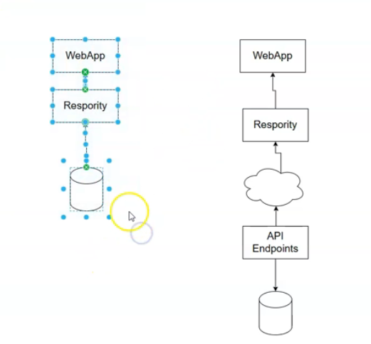
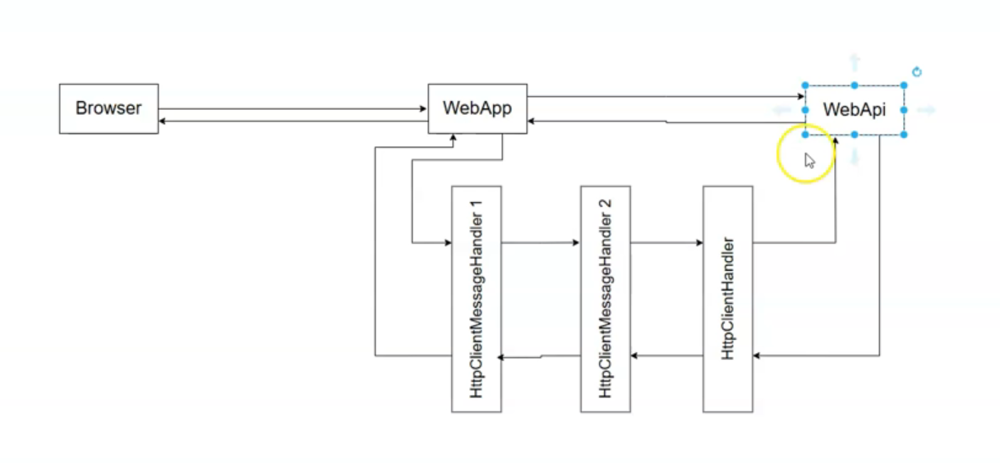

# Consuming APIs with IHttpClientFactory

This guide explains how to consume a Web API endpoint from an ASP.NET Core web application using `IHttpClientFactory`. The instructor refactors an existing controller action, which previously fetched data directly from an in-memory repository, to instead make an HTTP call to a separate Web API project. The process involves setting up the solution to run both projects, registering `IHttpClientFactory` via dependency injection, using it to create an `HttpClient` instance, making an asynchronous GET request, and deserializing the JSON response into a C\# object, while handling potential case-sensitivity issues.

***

### Main Points \& Technical Breakdown

#### 1. Solution Setup

The solution is configured to run two projects simultaneously: a **Web API** project that serves data and a **Web Application** project that consumes it. This separation is crucial for building scalable and maintainable applications.

**Configuration Steps:**

* In Visual Studio, right-click the Solution and select **Configure Startup Projects**.
* Choose **Multiple startup projects**.
* Set the Web API project to start first, followed by the Web Application. This ensures the API is running and available before the web app tries to call it.

**Diagram: Application Architecture**

```
+------------------------+      HTTP Request       +------------------------+      Data Access      +---------------------+
| ASP.NET Core           | ----------------------> | ASP.NET Core           | -------------------> | In-Memory Repository|
| Web Application        | (via IHttpClientFactory)| Web API                |                      | (Departments)       |
| (Consumer)             |                         | (Provider)             |                      |                     |
+------------------------+                         +------------------------+                      +---------------------+
```


#### 2. Introducing `IHttpClientFactory`

Instead of directly instantiating `HttpClient` (e.g., `new HttpClient()`), which can lead to issues like socket exhaustion, the recommended approach is to use `IHttpClientFactory`. It manages the lifecycle of `HttpClient` instances efficiently.

* **Why `IHttpClientFactory`?** It pools and reuses `HttpClientMessageHandler` instances, preventing resource leaks and DNS issues that can occur with improper `HttpClient` management.


#### 3. Step-by-Step Implementation

The process of consuming the API involves three main steps: registration, injection, and execution.

**Step 1: Register `IHttpClientFactory` in `Program.cs`**
The factory must be registered with the application's service container. This is a one-time setup.

```csharp
// In Program.cs of the Web Application project

var builder = WebApplication.CreateBuilder(args);

// Add services to the container.
builder.Services.AddControllersWithViews();

// Register the IHttpClientFactory
builder.Services.AddHttpClient();

var app = builder.Build();
// ... rest of the configuration
```

**Step 2: Inject `IHttpClientFactory` into the Controller**
The factory is injected into the controller's constructor, making it available for use in any action method.

```csharp
// In DepartmentsController.cs

public class DepartmentsController : Controller
{
    private readonly IHttpClientFactory _httpClientFactory;

    // Inject the factory via the constructor
    public DepartmentsController(IHttpClientFactory httpClientFactory)
    {
        _httpClientFactory = httpClientFactory;
    }

    // ... action methods
}
```

**Step 3: Consume the API Endpoint in an Action Method**
The original method that called the repository is replaced with code that performs an HTTP request.

**Diagram: API Call Flow**

```
Controller Action Starts
          |
          v
_httpClientFactory.CreateClient()  // Get an HttpClient instance
          |
          v
client.BaseAddress = ...         // Set the API base URL
          |
          v
await client.GetAsync(...)       // Make the async HTTP GET call
          |
          v
response.EnsureSuccessStatusCode() // Check for HTTP errors (e.g., 404, 500)
          |
          v
await response.Content.ReadAsStringAsync() // Read JSON payload as a string
          |
          v
JsonSerializer.Deserialize<Department>(...) // Convert JSON string to C# object
          |
          v
Return View(department)
```

**Code Example: Refactored `Details` Action Method**

Here is the complete code demonstrating how to fetch a department by its ID from the API.

```csharp
// In DepartmentsController.cs

// The action method must be async and return a Task
public async Task<IActionResult> Details(int id)
{
    // 1. Create an HttpClient instance using the factory
    var client = _httpClientFactory.CreateClient();

    // 2. Set the base address of the Web API
    client.BaseAddress = new Uri("https://localhost:7123/"); // URL from API's launchSettings.json

    // 3. Make the asynchronous GET request to the specific endpoint
    var response = await client.GetAsync($"api/departments/{id}");

    Department? department = null;
    if (response.IsSuccessStatusCode)
    {
        // 4. Check for a successful response (HTTP 2xx status code)
        response.EnsureSuccessStatusCode();

        // 5. Read the response content (JSON) as a string
        var responseString = await response.Content.ReadAsStringAsync();

        // 6. Deserialize the JSON string into a Department object
        //    Crucially, configure the deserializer to ignore case differences
        //    between the JSON properties (e.g., "departmentId") and C# properties (e.g., "DepartmentId").
        department = JsonSerializer.Deserialize<Department>(responseString,
            new JsonSerializerOptions { PropertyNameCaseInsensitive = true });
    }

    // 7. Pass the deserialized object to the view
    return View(department);
}
```


#### 4. Handling JSON Deserialization

A common challenge is the case-sensitivity of JSON. Web APIs often return JSON with camelCase property names (e.g., `departmentName`), while C\# properties typically use PascalCase (e.g., `DepartmentName`).

To handle this, `JsonSerializerOptions` is used with `PropertyNameCaseInsensitive = true`. This tells the deserializer to match properties regardless of their casing.

***

### Key Points for Interviews

This table highlights the core concepts from the transcript that are valuable in a technical interview setting.


| Concept | Key Point \& "Why It's Important" | Potential Interview Questions |
| :-- | :-- | :-- |
| **`IHttpClientFactory`** | It is the modern, recommended way to create `HttpClient` instances in ASP.NET Core. It manages the handler lifecycle to prevent common issues like **socket exhaustion** and **DNS problems**. | "Why should I use `IHttpClientFactory` instead of `new HttpClient()`?" <br/> "What problems does `IHttpClientFactory` solve?" |
| **Asynchronous Programming (`async`/`await`)** | Network calls (like HTTP requests) are I/O-bound and unpredictable. Using `async`/`await` prevents blocking the request thread, improving application **scalability and responsiveness**. | "Why is it critical to use `async` and `await` when making API calls?" <br/> "What happens if you block on an async call?" |
| **Dependency Injection (DI)** | `IHttpClientFactory` is registered and provided by the DI container. This promotes loose coupling and makes code more testable and maintainable. | "How would you make `IHttpClientFactory` available in your controller?" |
| **API Response Handling** | Always check the `HttpResponseMessage` for success before processing the body. `response.EnsureSuccessStatusCode()` is a convenient way to throw an exception for non-successful (non-2xx) status codes. | "What is the first thing you should do after receiving a response from an API call?" |
| **JSON Deserialization** | Converting a JSON string to a C\# object is a common task. A key detail is handling **case-sensitivity mismatches** between JSON properties and C\# properties using `JsonSerializerOptions`. | "You're calling an API that returns JSON with camelCase properties. How do you deserialize that into your PascalCase C\# model?" |
| **Microservices/SOA Architecture** | Separating the UI (Web App) from the business logic/data access (Web API) is a fundamental principle of microservices. It allows for independent deployment, scaling, and technology choices for each service. | "What are the benefits of having a separate Web API project for your data instead of accessing the database directly from your web app?" |


# Configuring Named Clients with `IHttpClientFactory`

## Overview

This video refactors the previous API client implementation by creating a **named client** using `IHttpClientFactory`. This moves hardcoded configuration, like the API's `BaseAddress`, out of the controller and centralizes it in `Program.cs`, leading to cleaner, more maintainable code.

## Key Points

- **Problem**: The API's `BaseAddress` was hardcoded in the controller action, mixing configuration with application logic.
- **Solution**: Use a named `HttpClient` to centralize client configuration in `Program.cs`.
- **Implementation**:
    - In `Program.cs`, modify `builder.Services.AddHttpClient()` to accept a name (e.g., "API") and a configuration action.
    - Inside the action, set the `BaseAddress` and any other default settings (like request headers).
- **Usage**:
    - In the controller, call `_clientFactory.CreateClient("API")` to get a pre-configured `HttpClient` instance.
    - The controller no longer needs to know the specific `BaseAddress`.


## Code Implementation

### 1) Configure the Named Client in `Program.cs`

Move the client configuration from the controller to the dependency injection container setup.

```csharp
// Program.cs

builder.Services.AddHttpClient("API", client =>
{
    client.BaseAddress = new Uri("https://localhost:7147/");
    // You can add other default configurations here, for example:
    // client.DefaultRequestHeaders.Add("Accept", "application/json");
});
```


### 2) Refactor the Controller to Use the Named Client

The `Details` action is now simpler, as it just requests the named client from the factory.

```csharp
// DepartmentsController.cs
public class DepartmentsController : Controller
{
    private readonly IHttpClientFactory _clientFactory;

    public DepartmentsController(IHttpClientFactory clientFactory)
    {
        _clientFactory = clientFactory;
    }

    [HttpGet]
    public async Task<IActionResult> Details(int id)
    {
        // 1. Create the client by name
        var client = _clientFactory.CreateClient("API");
        // BaseAddress is already configured!

        // 2. Make the async GET request
        var response = await client.GetAsync($"departments/{id}");

        // ... (the rest of the code remains the same)
        response.EnsureSuccessStatusCode();
        var responseString = await response.Content.ReadAsStringAsync();
        var options = new System.Text.Json.JsonSerializerOptions
        {
            PropertyNameCaseInsensitive = true
        };
        var model = System.Text.Json.JsonSerializer.Deserialize<Department>(responseString, options);

        return View(model);
    }
}
```


## Interview Quick Reference

| Concept | Why It's Important | Key Takeaway for Interviews |
| :-- | :-- | :-- |
| **Named `HttpClient`** | Allows you to define and pre-configure multiple `HttpClient` instances for different APIs. It separates configuration from usage, adhering to the Single Responsibility Principle. | "I use named clients with `IHttpClientFactory` to define configurations for different APIs. This keeps my controllers clean and centralizes all API endpoint details like base URLs and default headers in `Program.cs`." |
| **Centralized Configuration** | Placing configuration logic (like API URLs) in `Program.cs` or `appsettings.json` makes the application easier to manage, deploy, and update, especially in different environments (Dev, Staging, Prod). | "Centralizing configuration is a best practice. For API clients, this means I can change an API's address in one place without touching the business logic in my controllers. This is crucial for maintainability." |
| **Separation of Concerns** | Controllers should handle application flow and user requests, not the low-level details of `HttpClient` setup. Named clients help enforce this separation. | "My controllers are responsible for orchestrating actions, not for knowing API URLs. By using named clients, I delegate the responsibility of client configuration to the startup logic, making my code more modular and testable." |
| **`IHttpClientFactory` Flexibility** | The factory pattern provides multiple ways to configure clients (basic, named, typed). Named clients are a good middle ground for when you need distinct configurations without the overhead of creating a new typed class. | "Depending on the complexity, I choose the appropriate client type. For simple, one-off calls, a basic client is fine. For shared configurations, I use named clients. For encapsulating all API logic, I use typed clients." |


# Refactoring API Calls into a Repository

## Overview

This video demonstrates encapsulating API communication logic within a dedicated repository class. Instead of the controller directly using `IHttpClientFactory`, it will now depend on a new repository that hides the implementation details of calling the remote API. This adheres to the Repository Pattern and improves separation of concerns.
- 

## Key Points

- **Architectural Goal**: The web application's controller should depend on a repository for data, not on the low-level details of how that data is fetched (e.g., via HTTP).
- **New Repository**: A new `DepartmentsApiRepository` class is created to handle all API communication for departments.
- **Dependency Injection**:
    - `IHttpClientFactory` is now injected into the `DepartmentsApiRepository`, not the `DepartmentsController`.
    - The new repository (`DepartmentsApiRepository` and its interface `IDepartmentsApiRepository`) is registered with the DI container, typically with a `Transient` lifetime.
- **Refactoring**:
    - The API-calling logic (creating a client, making the request, deserializing the response) is moved from the controller into a `GetDepartmentByIdAsync` method in the new repository.
    - The controller is simplified to just inject and call the new repository, making it "thin" and focused on application flow.


## Code Implementation

### 1) Create the API Repository and its Interface

The new repository encapsulates all `HttpClient` logic.

```csharp
// Interface
public interface IDepartmentsApiRepository
{
    Task<Department> GetDepartmentByIdAsync(int id);
    // ... other methods will be added later
}

// Implementation
public class DepartmentsApiRepository : IDepartmentsApiRepository
{
    private readonly IHttpClientFactory _clientFactory;

    public DepartmentsApiRepository(IHttpClientFactory clientFactory)
    {
        _clientFactory = clientFactory;
    }

    public async Task<Department> GetDepartmentByIdAsync(int id)
    {
        var client = _clientFactory.CreateClient("API");
        var response = await client.GetAsync($"departments/{id}");

        response.EnsureSuccessStatusCode();

        var responseString = await response.Content.ReadAsStringAsync();
        var options = new System.Text.Json.JsonSerializerOptions
        {
            PropertyNameCaseInsensitive = true
        };
        return System.Text.Json.JsonSerializer.Deserialize<Department>(responseString, options);
    }
}
```


### 2) Register the New Repository in `Program.cs`

Make the repository available for dependency injection.

```csharp
// Program.cs

// The named client from the previous step
builder.Services.AddHttpClient("API", client =>
{
    client.BaseAddress = new Uri("https://localhost:7147/");
});

// Register the new repository
builder.Services.AddTransient<IDepartmentsApiRepository, DepartmentsApiRepository>();
```


### 3) Refactor the Controller to Use the Repository

The controller is now much cleaner and is decoupled from `HttpClient` logic.

```csharp
// DepartmentsController.cs
public class DepartmentsController : Controller
{
    // The controller now depends on the repository, not the factory
    private readonly IDepartmentsApiRepository _departmentsApiRepository;

    public DepartmentsController(IDepartmentsApiRepository departmentsApiRepository)
    {
        _departmentsApiRepository = departmentsApiRepository;
    }

    [HttpGet]
    public async Task<IActionResult> Details(int id)
    {
        // The controller's logic is now a simple, single call
        var model = await _departmentsApiRepository.GetDepartmentByIdAsync(id);
        return View(model);
    }
}
```


## Interview Quick Reference

| Concept | Why It's Important | Key Takeaway for Interviews |
| :-- | :-- | :-- |
| **Repository Pattern for API Clients** | It encapsulates data access logic and promotes separation of concerns. The controller is decoupled from *how* data is fetched, making the system more modular and testable. | "I use the Repository Pattern to abstract my data sources. Whether the data comes from a local database or a remote API, my controller's code remains the same; it just calls a method like `GetByIdAsync`. All the `HttpClient` logic is hidden inside the repository." |
| **Thin Controllers** | Controllers should orchestrate the flow of a request, not contain complex business logic or data access implementation details. This makes them easier to read, test, and maintain. | "I practice keeping my controllers 'thin' by delegating business logic to services and data access to repositories. A controller's primary job is to handle the HTTP request, call the appropriate service or repository, and return a view or response." |
| **Dependency Injection in Repositories** | Injecting dependencies like `IHttpClientFactory` into a repository follows the Inversion of Control (IoC) principle, making the repository easy to unit test with mock dependencies. | "By injecting `IHttpClientFactory` into my repository's constructor, my repository isn't responsible for creating its own dependencies. This allows me to easily provide a mock factory during unit testing to simulate API calls without a live network connection." |
| **Service Lifetimes (Transient)** | Choosing the correct DI lifetime is crucial. Since `HttpClient` instances from the factory are designed to be short-lived, a `Transient` lifetime for the repository is a safe and common choice. | "I typically register my API repositories as `Transient`. Because `IHttpClientFactory` efficiently manages the underlying handlers, creating a new repository and `HttpClient` instance for each request is a reliable pattern that avoids potential state-related issues." |


# `HttpClient` Middleware Pipeline and Custom `HttpMessageHandler`

## Overview

This video explains that `HttpClient` operates as a middleware pipeline, similar to the ASP.NET Core request pipeline. Each component in this pipeline is an `HttpMessageHandler`. This pattern allows for cross-cutting concerns like authentication, logging, or header manipulation to be handled in a modular and reusable way before a request is sent to the final network destination. A custom handler is created to validate the presence of a required API key header.
- 

## Key Points

- **`HttpClient` as a Pipeline**: When you send a request, it passes through a chain of `HttpMessageHandler` instances. The last one in the chain, the primary `HttpClientHandler`, is responsible for the actual network communication.
- **Custom Handlers**: You can insert your own custom handlers into this pipeline to inspect or modify requests and responses. These custom handlers typically inherit from `DelegatingHandler`.
- **Use Case (API Key)**: A common use case is to create a handler that automatically adds an authentication token or API key to every outgoing request for a specific client, or validates its presence.
- **Implementation**:
    - Create a class that inherits from `DelegatingHandler`.
    - Override the `SendAsync` method to implement your custom logic.
    - Register the custom handler in the DI container (e.g., as `Transient`).
    - Attach the handler to a named `HttpClient` in `Program.cs` using `.AddHttpMessageHandler<T>()`.


## Code Implementation

### 1) Create a Custom `HttpMessageHandler`

This handler checks if a specific header exists. If not, it short-circuits the request and returns a `400 Bad Request` response.

```csharp
// Handlers/ValidateApiHeaderHandler.cs
public class ValidateApiHeaderHandler : DelegatingHandler
{
    protected override async Task<HttpResponseMessage> SendAsync(
        HttpRequestMessage request,
        CancellationToken cancellationToken)
    {
        if (!request.Headers.Contains("x-api-key"))
        {
            return new HttpResponseMessage(System.Net.HttpStatusCode.BadRequest)
            {
                Content = new StringContent("The API key header (x-api-key) is required.")
            };
        }

        return await base.SendAsync(request, cancellationToken);
    }
}
```


### 2) Register and Attach the Handler in `Program.cs`

First, register the handler with the DI container. Then, chain `.AddHttpMessageHandler()` to the named client configuration to add it to the pipeline.

```csharp
// Program.cs

// Register the handler for DI
builder.Services.AddTransient<ValidateApiHeaderHandler>();

// Configure the named client and attach the handler
builder.Services.AddHttpClient("API", client =>
{
    client.BaseAddress = new Uri("https://localhost:7147/");
})
.AddHttpMessageHandler<ValidateApiHeaderHandler>();
```

**Note:** The order of chained `.AddHttpMessageHandler()` calls matters. The first one added is the outermost in the pipeline (it runs first).

## Interview Quick Reference

| Concept | Why It's Important | Key Takeaway for Interviews |
| :-- | :-- | :-- |
| **`HttpMessageHandler` Pipeline** | It provides a powerful, modular way to manage cross-cutting concerns for outgoing HTTP requests, such as authentication, logging, retries, or caching. It mirrors the familiar ASP.NET Core middleware pattern. | "I use `HttpMessageHandler` pipelines to apply common logic to all requests made by an `HttpClient`. For instance, I can create a handler to attach a bearer token for authentication, ensuring that every request is authenticated without cluttering my service or repository code." |
| **`DelegatingHandler`** | This is the base class for custom message handlers. Its purpose is to receive a request, perform some action, and then delegate the request to the *next* handler in the chain by calling `base.SendAsync()`. | "By inheriting from `DelegatingHandler`, I can intercept the request pipeline. My handler can modify the request before calling `base.SendAsync()` to pass it down the chain, and it can inspect or modify the response after the call returns." |
| **Short-Circuiting a Request** | A handler can decide not to proceed with a request and immediately return a response. This is useful for validation, like checking for an API key, without making an unnecessary network call. | "In my custom handlers, I can implement validation logic. If a request is invalid (e.g., missing a required header), I can short-circuit the pipeline by returning an `HttpResponseMessage` directly, which prevents a failed call to the remote API and provides immediate feedback." |
| **Registering and Chaining Handlers** | Handlers are registered in the DI container and then attached to a specific `HttpClient` configuration. The order in which they are added defines their execution order. | "I register my handlers in `Program.cs` and attach them to the appropriate named or typed client using `.AddHttpMessageHandler()`. The order is important, as it defines the flow of the request, similar to how middleware is ordered in the ASP.NET Core pipeline." |


# Using Polly for Transient Fault Handling

## Overview

This video introduces the Polly library, a resilience and transient-fault-handling library for .NET. It demonstrates how to integrate Polly into the `HttpClient` pipeline to automatically handle temporary network errors by implementing a retry policy. This makes the application more robust when communicating with remote APIs.

## Key Points

- **Problem**: Remote API calls can fail due to transient issues like network hiccups or temporary server unavailability.
- **Solution**: Use Polly to define resilience policies, such as "wait and retry," to automatically handle these failures.
- **Integration**: Polly integrates with `IHttpClientFactory` as another `HttpMessageHandler` in the pipeline.
- **Installation**: The functionality is added by installing the `Microsoft.Extensions.Http.Polly` NuGet package.
- **Configuration**: Policies are configured in `Program.cs` by chaining a policy builder method like `.AddTransientHttpErrorPolicy()` to the `HttpClient` registration.
- **Handler Order**: It is crucial to place the Polly handler *after* any validation handlers (like an API key checker). You only want to retry on actual network or server errors, not on requests that will always fail validation.


## Code Implementation

### 1) Install the Polly NuGet Package

In the client application project, install the Polly integration package for `HttpClient`.

```bash
# Package Manager Console
Install-Package Microsoft.Extensions.Http.Polly

# or .NET CLI
dotnet add package Microsoft.Extensions.Http.Polly
```


### 2) Configure the Retry Policy in `Program.cs`

Chain the `.AddTransientHttpErrorPolicy()` method to the named client configuration. This example configures a policy that retries three times with increasing delays.

```csharp
// Program.cs

// Register the custom validation handler
builder.Services.AddTransient<ValidateApiHeaderHandler>();

// Configure the named client and attach handlers in the correct order
builder.Services.AddHttpClient("API", client =>
{
    client.BaseAddress = new Uri("https://localhost:7147/");
})
// 1. Outermost handler: custom validation. It runs first.
.AddHttpMessageHandler<ValidateApiHeaderHandler>()
// 2. Innermost handler (before the network call): Polly for retries.
.AddTransientHttpErrorPolicy(policy =>
    policy.WaitAndRetryAsync(new[]
    {
        TimeSpan.FromMilliseconds(100),
        TimeSpan.FromMilliseconds(200),
        TimeSpan.FromMilliseconds(300)
    }));
```

**Note:** The order matters. The validation handler is added first, so it runs first. The Polly handler is added second, so it wraps the final network call.

## Interview Quick Reference

| Concept | Why It's Important | Key Takeaway for Interviews |
| :-- | :-- | :-- |
| **Polly Library** | Polly is the standard library for building resilient applications in .NET. It provides policies to handle transient faults like network errors, which are common in distributed systems. | "I use Polly to implement resilience strategies like Retry, Circuit Breaker, and Timeout. It helps make my application more robust by gracefully handling temporary failures when communicating with other services." |
| **Transient Faults** | These are temporary errors (e.g., brief network loss, a server being momentarily busy) that are likely to be resolved if the operation is retried. | "Polly is specifically designed to handle transient faults. Instead of letting a temporary glitch fail an entire operation, a retry policy can often resolve the issue without the user even noticing." |
| **Retry Policy** | A fundamental resilience pattern. It automatically re-attempts a failed operation a configured number of times, often with a delay between attempts (e.g., exponential backoff). | "I configure Polly's `WaitAndRetryAsync` policy to handle transient HTTP errors. For example, I might set it to retry three times with a short delay, which is often enough to recover from a temporary network issue." |
| **Circuit Breaker Policy** | A more advanced pattern. After a certain number of consecutive failures, the circuit "opens," and further requests fail immediately for a set period. This prevents an application from repeatedly trying to call a service that is known to be down. | "For critical dependencies, I would use Polly's Circuit Breaker pattern. If an API is unresponsive, the circuit breaker prevents my app from overwhelming it with retries, allowing the downstream service time to recover." |
| **Handler Order in Pipeline** | The order in which `HttpMessageHandler`s are added is critical. Authentication/validation handlers should come before resilience handlers like Polly. | "I always place validation handlers *before* Polly handlers in the pipeline. You don't want to retry a request that's guaranteed to fail because of an invalid API key. Retries should only be for unexpected, transient network or server errors." |


# Assignment: Implement All CRUD API Endpoints in `DepartmentsController`

## Goal

The goal of this assignment is to complete the migration of the `DepartmentsController` to use the new `DepartmentsApiRepository` for all of its data operations (Create, Read, Update, Delete). This will fully decouple the web application from any local data source, making it a true client to the Web API.

## What To Do

1. **Extend the `IDepartmentsApiRepository` Interface**:
Add the method signatures for getting all departments, adding, updating, and deleting a department. Ensure they are all `async` and return `Task`.
2. **Implement the New Methods in `DepartmentsApiRepository`**:
Implement the logic for each of the new interface methods by making the appropriate HTTP calls (`GET`, `POST`, `PUT`, `DELETE`) to the Web API endpoints.
3. **Refactor the `DepartmentsController`**:
    - Remove the dependency on the old `IDepartmentsRepository`.
    - Update all action methods (`Index`, `Create` [POST], `Edit` [POST], and `Delete` [POST]) to call the corresponding `async` methods on `IDepartmentsApiRepository`.

## Code Implementation Guide

### 1) The Completed `IDepartmentsApiRepository` Interface

```csharp
public interface IDepartmentsApiRepository
{
    Task<IEnumerable<Department>> GetDepartmentsAsync();
    Task<Department> GetDepartmentByIdAsync(int id);
    Task AddDepartmentAsync(Department department);
    Task UpdateDepartmentAsync(Department department);
    Task DeleteDepartmentAsync(int id);
}
```


### 2) The Completed `DepartmentsApiRepository` Class

This class will contain all the logic for communicating with the API.

```csharp
public class DepartmentsApiRepository : IDepartmentsApiRepository
{
    private readonly IHttpClientFactory _clientFactory;
    private readonly JsonSerializerOptions _options;

    public DepartmentsApiRepository(IHttpClientFactory clientFactory)
    {
        _clientFactory = clientFactory;
        _options = new JsonSerializerOptions { PropertyNameCaseInsensitive = true };
    }

    public async Task<IEnumerable<Department>> GetDepartmentsAsync()
    {
        var client = _clientFactory.CreateClient("API");
        var response = await client.GetAsync("departments");
        response.EnsureSuccessStatusCode();
        return await response.Content.ReadFromJsonAsync<IEnumerable<Department>>(_options);
    }

    public async Task<Department> GetDepartmentByIdAsync(int id)
    {
        var client = _clientFactory.CreateClient("API");
        var response = await client.GetAsync($"departments/{id}");
        response.EnsureSuccessStatusCode();
        return await response.Content.ReadFromJsonAsync<Department>(_options);
    }

    public async Task AddDepartmentAsync(Department department)
    {
        var client = _clientFactory.CreateClient("API");
        var response = await client.PostAsJsonAsync("departments", department);
        response.EnsureSuccessStatusCode();
    }

    public async Task UpdateDepartmentAsync(Department department)
    {
        var client = _clientFactory.CreateClient("API");
        var response = await client.PutAsJsonAsync($"departments/{department.Id}", department);
        response.EnsureSuccessStatusCode();
    }

    public async Task DeleteDepartmentAsync(int id)
    {
        var client = _clientFactory.CreateClient("API");
        var response = await client.DeleteAsync($"departments/{id}");
        response.EnsureSuccessStatusCode();
    }
}
```

**Note**: Using `ReadFromJsonAsync` and `PostAsJsonAsync` are modern extension methods that simplify JSON serialization/deserialization.

### 3) The Final `DepartmentsController`

The controller should now only depend on `IDepartmentsApiRepository`.

```csharp
public class DepartmentsController : Controller
{
    private readonly IDepartmentsApiRepository _departmentsApiRepository;

    public DepartmentsController(IDepartmentsApiRepository departmentsApiRepository)
    {
        _departmentsApiRepository = departmentsApiRepository;
    }

    public async Task<IActionResult> Index()
    {
        var model = await _departmentsApiRepository.GetDepartmentsAsync();
        return View(model);
    }

    public async Task<IActionResult> Details(int id)
    {
        var model = await _departmentsApiRepository.GetDepartmentByIdAsync(id);
        return View(model);
    }
    
    public IActionResult Create()
    {
        return View(new Department());
    }

    [HttpPost]
    public async Task<IActionResult> Create(Department department)
    {
        if (ModelState.IsValid)
        {
            await _departmentsApiRepository.AddDepartmentAsync(department);
            return RedirectToAction(nameof(Index));
        }
        return View(department);
    }

    [HttpPost]
    public async Task<IActionResult> Edit(Department department)
    {
        if (ModelState.IsValid)
        {
            await _departmentsApiRepository.UpdateDepartmentAsync(department);
            return RedirectToAction(nameof(Index));
        }
        return View("Details", department);
    }

    [HttpPost]
    public async Task<IActionResult> Delete(int id)
    {
        await _departmentsApiRepository.DeleteDepartmentAsync(id);
        return RedirectToAction(nameof(Index));
    }
}
```


## Acceptance Criteria

- The `DepartmentsController` no longer references the old `IDepartmentsRepository`.
- All department-related actions (viewing list, viewing details, adding, updating, deleting) work correctly and interact with the remote Web API.
- The application feels and behaves the same to the end-user, but its data source is now fully managed through the API.


## Interview Quick Reference

| Concept | Why It's Important | Key Takeaway for Interviews |
| :-- | :-- | :-- |
| **Complete API Client Abstraction** | The web app is completely unaware that its data comes from an HTTP API. This loose coupling allows the data source to be changed (e.g., to gRPC or a different database) with minimal changes to the main application logic. | "I ensure my application logic is fully abstracted from the data source. By implementing a complete repository for my API client, the controller interacts with a simple interface, making the system modular and easy to maintain or refactor." |
| **HTTP Verbs for CRUD** | Mapping CRUD operations to the correct HTTP verbs (`GET`, `POST`, `PUT`, `DELETE`) is fundamental to building RESTful APIs and clients. | "I map my CRUD operations to standard HTTP verbs: `GET` for reads, `POST` for creates, `PUT` for full updates, and `DELETE` for removals. This follows REST conventions and makes the API predictable for any client." |
| **Asynchronous Controller Actions** | Since all data access is now a network call, every controller action that interacts with the repository must be `async`. This is critical for application performance and scalability. | "Every action method that performs I/O, such as calling an API, must be asynchronous. I use `async Task<IActionResult>` in my controllers to ensure the request thread is not blocked, which is essential for a responsive and scalable application." |
| **`HttpContent` and Serialization** | For `POST` and `PUT` requests, the C\# object must be serialized into a format the API understands (usually JSON) and sent in the request body. Libraries like `System.Net.Http.Json` simplify this. | "For sending data in `POST` or `PUT` requests, I use helper methods like `PostAsJsonAsync`, which handle the serialization of my C\# objects to JSON and the creation of the appropriate `HttpContent` for the request body." |

