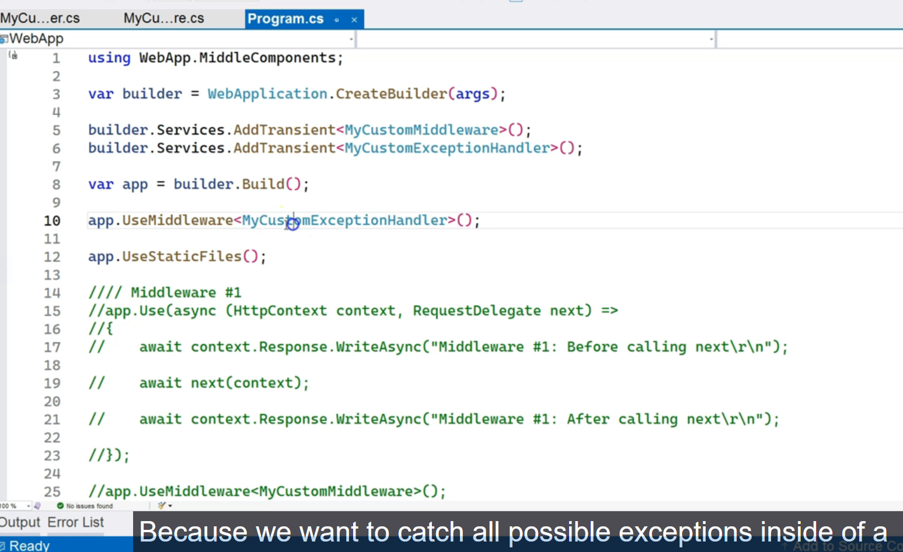

# Exception Handling Middleware

### Summary

This transcript revisits a previously created custom exception handling middleware and demonstrates a crucial enhancement: **adding logging**. The lesson explains that while showing a user-friendly error message is important, it is equally critical for developers to have a persistent, detailed record of any unhandled exceptions. This is achieved by injecting the standard `ILogger<T>` interface into the middleware and using it to log the full exception details at a `Critical` severity level within the `catch` block. This ensures that every error is captured for diagnostics without changing the user-facing error page.

***

### Main Points \& Technical Breakdown

#### 1. The Context: A Custom Exception Handling Middleware

The starting point is an existing `IMiddleware` implementation designed to catch unhandled exceptions.

* **Placement:** It is registered as the **very first middleware** in the `Program.cs` pipeline. This is essential so that its `try...catch` block wraps the execution of all subsequent middleware and endpoints.
* **Functionality:** It calls `await next(context)` inside a `try` block. If any downstream component throws an exception, the `catch` block executes, sets the response status code, and writes a friendly error message to the user.


#### 2. The Enhancement: Integrating Logging

The middleware is improved by injecting `ILogger<T>` via its constructor. This follows standard dependency injection practices and decouples the middleware from any specific logging implementation.

**Diagram: Exception Handling and Logging Flow**

This diagram shows how the request flows and how an exception is handled.

```
Request Flow:
Client ---> [ExceptionHandler] ---> [Middleware 2] ---> [Endpoint]
              (try block starts)

Exception Flow:
                                                         [Endpoint] --(throws Exception)--> [Middleware 2]
                                                                                                 |
                                                                                                 v
             (catch block executes) <------------------------------------------------------ [ExceptionHandler]
             /                  \
            /                    \
           v                      v
+-----------------+      +---------------------+
|   Logs the error  |      |  Sends user-friendly|
| (to Console/File) |      |   error response    |
+-----------------+      +---------------------+
                                      ^
                                      |
                                   Client
```

- 


#### 3. Implementation Details

The implementation involves two key parts: injecting the logger and using it in the `catch` block.

* **Constructor Injection:** The `ILogger<MyCustomExceptionHandler>` is injected, automatically setting the log category to the name of the middleware class.
* **Logging the Exception:** Inside the `catch` block, before sending the response to the user, the exception is logged.
    * **Log Level:** `LogCritical` is used, as an unhandled exception represents a severe application failure.
    * **Log Content:** It's crucial to log the full exception details using `exception.ToString()`, which includes the message, type, and the invaluable **stack trace**. This provides developers with the full context needed to diagnose the problem.

**Code Example: The Improved `MyCustomExceptionHandler`**

```csharp
using Microsoft.Extensions.Logging;

public class MyCustomExceptionHandler : IMiddleware
{
    // 1. Inject the logger via the constructor
    private readonly ILogger<MyCustomExceptionHandler> _logger;

    public MyCustomExceptionHandler(ILogger<MyCustomExceptionHandler> logger)
    {
        _logger = logger;
    }

    public async Task InvokeAsync(HttpContext context, RequestDelegate next)
    {
        try
        {
            await next(context);
        }
        catch (Exception ex)
        {
            // 2. Log the exception with Critical level and full details
            _logger.LogCritical(
                ex,
                "An unhandled exception was thrown. Message: {ErrorMessage}",
                ex.Message
            );

            // 3. Send the user-friendly response (existing functionality)
            context.Response.StatusCode = 500;
            context.Response.ContentType = "text/html";
            await context.Response.WriteAsync($"<h1>An error occurred: {ex.Message}</h1>");
        }
    }
}
```

The log output will contain the full stack trace, allowing the developer to see exactly where the exception originated (e.g., `Program.cs, line 50`) and how it was caught by the middleware (`MyCustomExceptionHandler.cs, line 19`).

***

### Key Points for Interviews

This table highlights the core concepts from the transcript that are valuable in a technical interview setting.


| Concept | Key Point \& "Why It's Important" | Potential Interview Questions |
| :-- | :-- | :-- |
| **Middleware Order** | An exception handling middleware **must be the first** component registered in the pipeline (`app.UseMiddleware<...>`) to ensure it can catch exceptions from all subsequent middleware and endpoints. | "Where do you place a custom exception handling middleware in the ASP.NET Core pipeline, and why is the order so important?" |
| **Logging in Middleware** | Middleware fully supports **dependency injection**. You should inject services like `ILogger<T>` through the constructor to follow best practices for decoupling and testability. | "How can a custom middleware class get access to the application's logging service?" |
| **Choosing the Right Log Level** | Unhandled exceptions are severe failures. They should be logged at a high severity level, such as **`Error`** or **`Critical`**, to ensure they are captured and prioritized in monitoring systems. | "What log level is appropriate for an unhandled exception caught in a global exception handler?" |
| **Logging Exception Details** | Always log the full exception object (`exception.ToString()` or pass the exception object itself to the logger), not just `exception.Message`. The **stack trace** is essential for debugging. | "When logging a caught exception, what information is most important to include in the log message?" |
| **Separation of Concerns** | The exception handler has two responsibilities: **logging for the developer** and **providing a response for the user**. Logging the detailed error while sending a generic, user-friendly response is a key security and design pattern. | "What are the two main responsibilities of a well-designed global exception handler?" |


# Using Built-In Exception Handler

### Summary

This transcript explains how to use the built-in exception handling middleware provided by ASP.NET Core as a replacement for a custom-built one. It highlights the framework's environment-aware approach, which uses two different strategies for handling exceptions: the detailed **Developer Exception Page** for development and a user-friendly, redirect-based handler for production. The lesson walks through the process of setting up a custom error page using Razor Pages, accessing the original exception details within that page using `IExceptionHandlerPathFeature`, and, most importantly, logging the full exception for developers while presenting a clean error message to the end-user.

***

### Main Points \& Technical Breakdown

#### 1. Environment-Specific Exception Handling

The recommended practice is to handle exceptions differently based on the application's current environment (`Development` vs. `Production`). This is configured in `Program.cs`.

* **For Development:** Use `app.UseDeveloperExceptionPage()`. This middleware catches unhandled exceptions and displays a detailed, developer-focused HTML page with the exception type, message, stack trace, and request information. It should **never** be used in production as it exposes sensitive application details.
* **For Production:** Use `app.UseExceptionHandler("/Error")`. This middleware catches an unhandled exception and then **re-executes the request pipeline** to the specified path (e.g., `/Error`). This allows you to render a custom, user-friendly error page.

**Diagram: The Environment-Based `if/else` Logic**

```
+------------------------------------+
|          Program.cs Startup        |
+------------------------------------+
                   |
                   v
+------------------------------------------+
|  if (app.Environment.IsDevelopment()) {  |
|      // For Development Environment      |
|      app.UseDeveloperExceptionPage();    |
|  } else {                                |
|      // For Production & other envs      |
|      app.UseExceptionHandler("/Error");  |
|  }                                       |
+------------------------------------------+
```

**Code Example in `Program.cs`:**

```csharp
var builder = WebApplication.CreateBuilder(args);

// ... service configuration ...
builder.Services.AddRazorPages();

var app = builder.Build();

if (app.Environment.IsDevelopment())
{
    // Shows detailed error page with stack trace.
    app.UseDeveloperExceptionPage();
}
else
{
    // Redirects to a custom error page for the user.
    app.UseExceptionHandler("/Error");
    // Consider adding app.UseHsts(); for production
}

app.MapRazorPages();

// Endpoint that will throw an exception for demonstration
app.MapGet("/", () => { throw new ApplicationException("This is a test."); });

app.Run();
```


#### 2. Creating a Custom Error Page for Production

The `/Error` path needs a corresponding page. This is typically done with Razor Pages or an MVC controller.

1. **Enable Razor Pages:** Add `builder.Services.AddRazorPages()` and `app.MapRazorPages()` to `Program.cs`.
2. **Create the Page:** Create a `Pages` folder and add a Razor Page named `Error.cshtml`. The framework's routing will automatically map the `/Error` URL to this page.
3. **Design the View (`Error.cshtml`):** Add user-friendly HTML to inform the user that an error occurred.

#### 3. Accessing and Logging the Exception in the Error Page

This is the most critical part for diagnostics. The user sees a simple message, but the developer needs the full error details.

1. **Access the Exception Feature:** In the `Error.cshtml.cs` PageModel, the original exception is made available via the `IExceptionHandlerPathFeature` interface, which is stored in the `HttpContext.Features` collection.
2. **Inject the Logger:** Inject `ILogger<ErrorModel>` into the PageModel's constructor.
3. **Log the Details:** In the `OnGet()` method, retrieve the exception feature, extract the full exception object, and log it using `_logger.LogCritical()`. It is vital to log `exception.ToString()` to capture the stack trace.

**Code Example: `Pages/Error.cshtml.cs` (The PageModel)**

```csharp
using Microsoft.AspNetCore.Mvc.RazorPages;
using Microsoft.Extensions.Logging;
using Microsoft.AspNetCore.Diagnostics;

public class ErrorModel : PageModel
{
    private readonly ILogger<ErrorModel> _logger;

    public ErrorModel(ILogger<ErrorModel> logger)
    {
        _logger = logger;
    }

    public void OnGet()
    {
        // 1. Get the exception handler feature from the HttpContext
        var exceptionHandlerPathFeature = HttpContext.Features.Get<IExceptionHandlerPathFeature>();

        if (exceptionHandlerPathFeature?.Error != null)
        {
            var exception = exceptionHandlerPathFeature.Error;
            var path = exceptionHandlerPathFeature.Path;

            // 2. Log the full exception details at a critical level
            _logger.LogCritical(
                exception,
                "Unhandled exception occurred on path {Path}",
                path);

            // 3. Pass a user-friendly message to the view
            ViewData["ErrorMessage"] = exception.Message;
        }
    }
}
```

This ensures that every production error is logged for later analysis while keeping the user experience clean and secure.

***

### Key Points for Interviews

This table highlights the core concepts from the transcript that are valuable in a technical interview setting.


| Concept | Key Point \& "Why It's Important" | Potential Interview Questions |
| :-- | :-- | :-- |
| **`UseDeveloperExceptionPage`** | A development-only middleware that provides rich, detailed diagnostic information (stack trace, headers, etc.). It is a **major security risk** if exposed in production. | "What is the Developer Exception Page, and when should you use it?" |
| **`UseExceptionHandler`** | A production-safe middleware that catches an exception and re-executes the request to a specified error-handling path. It allows you to show a custom, user-friendly error page. | "How does the built-in production exception handler work? What does `app.UseExceptionHandler(\"/Error\")` do?" |
| **`IExceptionHandlerPathFeature`** | The interface used within the custom error page's logic to access the original exception details and the path where the error occurred. This is the key to logging the error. | "On your custom error page, how do you retrieve the exception that triggered the redirect?" |
| **Logging in the Error Page** | It is **absolutely critical** to log the full exception details (including the stack trace) from within your custom error page's handler. This is the only way for developers to diagnose production failures. | "What is the most important responsibility of a custom error page's server-side code?" |
| **Environment Checks** | Using `if (app.Environment.IsDevelopment())` to switch between the two exception handling strategies is the standard, recommended pattern in ASP.NET Core. | "How do you configure an ASP.NET Core application to behave differently for exception handling in development versus production?" |
