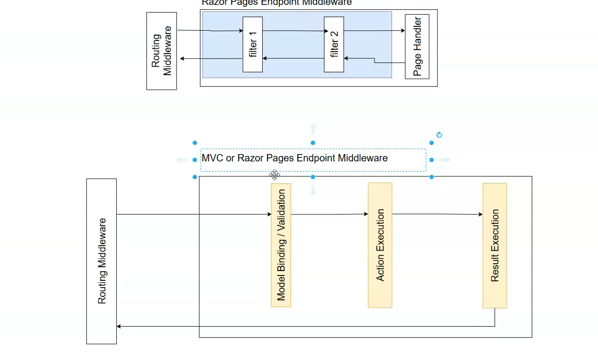
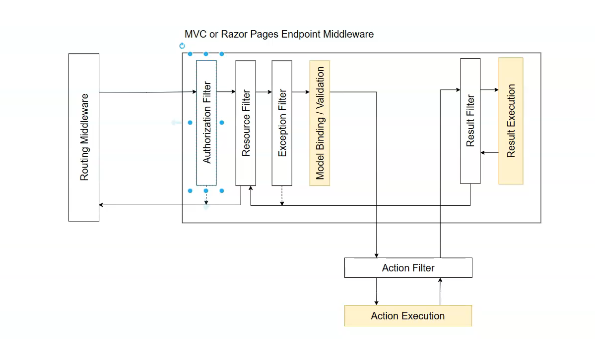
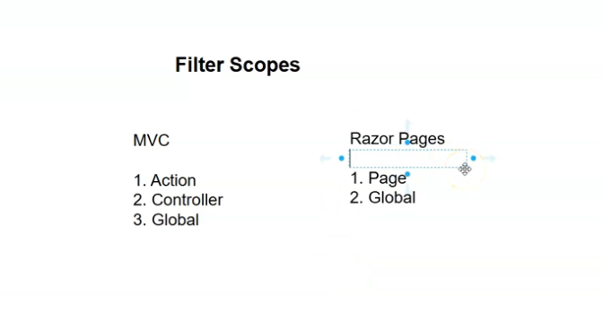
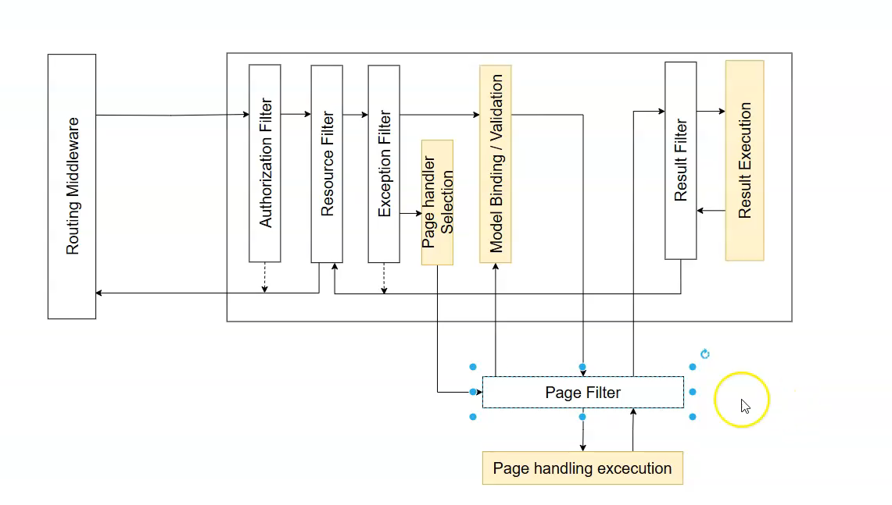

# Filter Pipeline - MVC and Razor Pages

* **Advanced and Structured Pipeline:** The filter pipeline in MVC and Razor Pages is more complex and structured than in Minimal APIs. It's built around three distinct stages of a request's execution within the endpoint.
* **The Three Execution Stages:** Understanding these stages is key to understanding the different types of filters:

1. **Model Binding \& Validation:** The framework populates action method parameters from the request and validates them.
2. **Action/Page Handler Execution:** Your main logic in the controller's action method or the PageModel's handler runs. This typically returns an `IActionResult`.
3. **Result Execution:** The framework takes the returned `IActionResult` (like `View()` or `Ok()`) and executes it to generate the final HTTP response (e.g., rendering an HTML view).

- 
- 
* **Five Types of MVC Filters:** Unlike the single filter type in Minimal APIs, the MVC framework has five distinct types of filters, each designed to run at a specific point in the pipeline.

1. **Authorization Filter:** Runs first. Determines if a user is authorized for a request. If not, it short-circuits the pipeline immediately.
2. **Resource Filter:** A general-purpose filter that runs at the very beginning (after authorization) and the very end (after everything else is complete). It can be used to implement caching or other logic that wraps the entire action.
3. **Action Filter:** Runs immediately before and after the **action method** executes. Because it runs *after* model binding, it has access to the action's arguments and `ModelState`, making it perfect for custom validation logic.
4. **Exception Filter:** Used to apply global error-handling policies. It catches unhandled exceptions that occur anywhere in the later stages of the pipeline.
5. **Result Filter:** Runs immediately before and after the **result execution**. It can be used to modify the `IActionResult` before it's executed or to modify the final response.
* **Key Difference: MVC vs. Razor Pages:** The filter pipelines are nearly identical, with one major difference:
    * MVC uses **Action Filters** to wrap action methods.
    * Razor Pages uses **Page Filters** to wrap page handler methods.


### Illustrations with Code Examples and a Diagram

While the transcript doesn't provide code, it describes the execution flow in detail. The following diagram visualizes this complex pipeline.

#### **Diagram: The MVC Filter Pipeline Execution Flow**

This diagram shows how the five filter types wrap around the three core execution stages. The request flows from left to right ("before" logic) and the response flows back from right to left ("after" logic).

```
+---------------------------------------------------------------------------------------------------------------------------------+
|                                                                                                                                 |
|   Request --> [ Authorization ] --> [ Resource Filter (Before) --> [ Exception Filter --> [ Action Filter (Before) ] ] ]          |
|                                                                                           |                     |               |
|                                                                                           v                     v               |
|                                                                                   [ Model Binding ] --> [ Action Method ]         |
|                                                                                                         |                     |
|                                                                                                         v                     |
|                                                                                   [ Result Execution ] <-- [ Action Filter (After) ] |
|                                                                                           ^                     ^               |
|                                                                                           |                     |               |
|   Response <-- [ Resource Filter (After) <-- [ Result Filter (After) ] <-- [ Result Filter (Before) ] ]                           |
|                                                                                                                                 |
+---------------------------------------------------------------------------------------------------------------------------------+
```


***

### Interview Summary Table: MVC \& Razor Pages Filters

| Concept | Description | Key Points for Interviews |
| :-- | :-- | :-- |
| **Filter Pipeline (MVC/Razor Pages)** | A structured pipeline of filters that allows you to run code at various stages of the request processing lifecycle, specifically within the endpoint execution. | "The MVC filter pipeline is more granular than in Minimal APIs. It provides hooks into specific stages like model binding, action execution, and result execution, offering very fine-grained control." |
| **The Five Filter Types** | **Authorization, Resource, Action, Exception, and Result.** Each type is designed to intercept the pipeline at a specific stage. | Be ready to name the five types and give a one-sentence summary of what each is for (e.g., "Authorization for security, Action for validation, Exception for error handling, Result for modifying the final response"). |
| **Action Filter vs. Page Filter** | The primary difference between the two frameworks. **Action Filters** wrap controller action methods. **Page Filters** wrap Razor Page handlers. | "This is a key distinction. While the overall pipeline is similar, you'd implement an `IActionFilter` for an MVC controller but an `IPageFilter` for a Razor Page." |
| **When to Use a Filter vs. Middleware** | The same principle applies as with Minimal APIs: **Middleware** is for global, low-level HTTP concerns. **Filters** are for endpoint-specific, high-level concerns that need access to the MVC/Razor Pages context. | "Use a filter when your logic depends on MVC-specific concepts like `ModelState`, action arguments, or the `IActionResult`. For example, a custom validation rule is a perfect use case for an Action Filter." |
| **Result Execution** | The process where the framework converts an `IActionResult` (like `View()`) into an actual HTTP response. Result filters can intercept this process. | "Result filters are powerful because they let you manipulate the `IActionResult` *before* it's turned into a response, or even modify the final response itself, for example, by adding a custom header." |


# Implementing Filters

* **Filters Can Be Implemented in Different Ways:** Unlike Minimal APIs which have one primary way to create a filter class (`IEndpointFilter`), MVC and Razor Pages offer multiple approaches:

1. **Implementing an Interface:** The most fundamental way is to create a class that implements a specific filter interface (e.g., `IResourceFilter`, `IActionFilter`).
2. **Inheriting from a Base Attribute Class:** For some filter types (like Action Filters), the framework provides a convenient base class (`ActionFilterAttribute`) that you can inherit from.
* **The Resource Filter (`IResourceFilter`):** This is a general-purpose filter that wraps the *entire* action/handler execution process. It has two methods:
    * `OnResourceExecuting(context)`: Runs *before* any other part of the filter pipeline (like model binding or action execution).
    * `OnResourceExecuted(context)`: Runs at the very *end*, after the action has run and the result has been executed.
* **Two Ways to Apply a Custom Filter:**

1. **Using `[TypeFilter]`:** This is a generic attribute that can apply *any* filter class that has been registered with the DI container. The syntax is `[TypeFilter(typeof(MyFilterClass))]`.
2. **Making the Filter an Attribute Itself:** A cleaner, more direct way is to make your custom filter class inherit from `System.Attribute`. This allows you to apply it directly, like `[MyFilterClass]`.
* **Filter Application Scope in Razor Pages:** There's a key limitation in Razor Pages: you **cannot** apply filters directly to individual page handler methods (like `OnGet` or `OnPost`). You must apply them to the PageModel class itself, which means the filter will run for *all* handlers on that page.


### Illustrations with Code Examples and a Diagram

#### **Diagram: Two Ways to Apply a Custom Filter**

This diagram shows the two primary methods for applying a filter you've created.

```
+-------------------------------------------------+
|               Your Custom Filter                |
|       `public class MyFilter : Attribute,       |
|                       IResourceFilter { ... }`   |
+-------------------------------------------------+
                         |
      +------------------+------------------+
      | (Method 1: Generic)                 | (Method 2: Direct)
      v                                     v
+-----------------------------+   +-----------------------------+
|   Apply with `TypeFilter`   |   |   Apply Directly as an      |
|-----------------------------|   |   Attribute                 |
| [TypeFilter(typeof(MyFilter))]|   | [MyFilter]                  |
| public IActionResult Index()|   | public IActionResult Index()|
| { ... }                     |   | { ... }                     |
+-----------------------------+   +-----------------------------+
```


#### **Code Examples**

**1. Creating a Resource Filter Class**

This filter will write to the console before and after the action/handler executes. It inherits from `Attribute` so it can be used directly.

```csharp
// In Filters/WriteToConsoleResourceFilter.cs
public class WriteToConsoleResourceFilter : Attribute, IResourceFilter
{
    // This runs BEFORE the action
    public void OnResourceExecuting(ResourceExecutingContext context)
    {
        Console.WriteLine($"Executing: {context.ActionDescriptor.DisplayName}");
    }

    // This runs AFTER the action and result have completed
    public void OnResourceExecuted(ResourceExecutedContext context)
    {
        Console.WriteLine($"Executed: {context.ActionDescriptor.DisplayName}");
    }
}
```

**2. Applying the Filter to an MVC Controller Action**

```csharp
// In Controllers/DepartmentsController.cs
public class DepartmentsController : Controller
{
    // Method 1: Using the generic TypeFilter
    [TypeFilter(typeof(WriteToConsoleResourceFilter))]
    public IActionResult Index()
    {
        return View();
    }

    // Method 2: Applying the filter directly because it inherits from Attribute
    [WriteToConsoleResourceFilter]
    public IActionResult Details(int id)
    {
        return View();
    }
}
```

**3. Applying the Filter to a Razor PageModel**

The filter must be applied to the class, not the handler method.

```csharp
// In Pages/Employees/Index.cshtml.cs

// Apply to the whole PageModel class
[WriteToConsoleResourceFilter]
public class IndexModel : PageModel
{
    // This filter will run for OnGet...
    public void OnGet()
    {
    }

    // ...and it will also run for OnPost, if one existed.
    // [WriteToConsoleResourceFilter] <-- THIS IS NOT ALLOWED HERE
    public IActionResult OnPost()
    {
        return Page();
    }
}
```


***

### Interview Summary Table: Creating and Applying MVC/Razor Pages Filters

| Concept | Description | Key Points for Interviews |
| :-- | :-- | :-- |
| **Filter Interfaces (e.g., `IResourceFilter`)** | The fundamental contract for a filter type. Implementing the interface is the most basic way to create a filter. | "Each of the five filter types has a corresponding interface, like `IResourceFilter` or `IActionFilter`. You implement the methods on this interface to inject your logic at the right point in the pipeline." |
| **`[TypeFilter]` Attribute** | A generic attribute used to apply a filter. It uses the DI container to create an instance of the specified filter type. | "The `[TypeFilter]` attribute is a flexible way to apply any filter. It's particularly useful if your filter has its own dependencies that need to be injected via DI." |
| **Inheriting from `Attribute`** | A common practice where a custom filter class also inherits from `System.Attribute`, allowing it to be applied directly (`[MyFilter]`) instead of via `[TypeFilter]`. | "For a cleaner syntax, you can make your filter class inherit from `Attribute`. This allows you to apply it directly, which makes the code more readable and is a very common pattern." |
| **Razor Pages Filter Scope** | Filters can only be applied at the PageModel class level, not on individual handler methods. | "This is a key limitation to remember for Razor Pages. A filter applied to a PageModel will execute for every handler on that page. You can't target just the `OnGet` or just the `OnPost` with an attribute." |
| **Built-in Base Attributes** | For some filter types, the framework provides a convenient base class (e.g., `ActionFilterAttribute`) that you can inherit from instead of implementing the raw interface. | "For common scenarios like action filters, it's often easier to inherit from the built-in `ActionFilterAttribute` and override its `OnActionExecuting` or `OnActionExecuted` methods. This can be simpler than implementing the `IActionFilter` interface from scratch." |


# Filter Scopes
- 

* **Filter Scope Defines Where a Filter Runs:** "Scope" refers to the level at which a filter is applied, which determines whether it runs for a single action, an entire controller/page, or globally across the entire application.
* **MVC has Three Scopes:**

1. **Action Level:** The narrowest scope. The filter attribute is placed directly on an action method and runs only for that specific action.
2. **Controller Level:** The attribute is placed on the controller class. The filter runs for *all* action methods within that controller.
3. **Global Level:** The widest scope. The filter is registered in `Program.cs` and runs for *every* MVC action and Razor Page in the application.
* **Razor Pages has Two Scopes:**

1. **Page Level:** The filter attribute is placed on the PageModel class. The filter runs for *all* page handlers (`OnGet`, `OnPost`, etc.) within that page. **Crucially, you cannot apply filters to individual handler methods.**
2. **Global Level:** Same as MVC; registered in `Program.cs`.
* **Global Filters Apply Everywhere:** When you register a global filter in `Program.cs` (either via `AddControllersWithViews` or `AddRazorPages().AddMvcOptions`), it applies to **both MVC controllers and Razor Pages**. This is because Razor Pages is built on the MVC framework, and filters are a shared concept.


### Illustrations with Code Examples and a Diagram

#### **Diagram: Filter Scope Hierarchy**

This diagram illustrates the different levels at which a filter can be applied and what each level affects.

```
+-----------------------------------------------------------------+
| Global Scope (Program.cs)                                       |
|  - Affects everything below                                     |
|                                                                 |
| +-------------------------+   +---------------------------------+
| | Controller Scope        |   | Page Scope (Razor Pages)        |
| | (Attribute on class)    |   | (Attribute on PageModel class)  |
| | - Affects all actions |   | - Affects all handlers in page  |
| |   in this controller  |   |                                 |
| |                         |   | +-----------------------------+ |
| | +---------------------+ |   | | Handler A (e.g., OnGet)     | |
| | | Action Scope        | |   | +-----------------------------+ |
| | | (Attribute on method) |   |                                 |
| | | - Affects only this | |   | +-----------------------------+ |
| | |   action            | |   | | Handler B (e.g., OnPost)    | |
| | | +-------------------+ |   | +-----------------------------+ |
| | | | Action Method A   | |   |                                 |
| | | +-------------------+ |   +---------------------------------+
| | +---------------------+ |
| |                         |
| | +---------------------+ |
| | | Action Method B   | |
| | +---------------------+ |
| +-------------------------+
|                                                                 |
+-----------------------------------------------------------------+
```


#### **Code Examples**

**1. Action and Controller Scope (in `DepartmentsController.cs`)**

```csharp
// Controller-level: This filter runs for BOTH Index() and Details().
[MyControllerLevelFilter]
public class DepartmentsController : Controller
{
    public IActionResult Index()
    {
        return View();
    }

    // Action-level: This filter runs ONLY for the Details() action.
    [MyActionLevelFilter]
    public IActionResult Details(int id)
    {
        return View();
    }
}
```

**2. Page Scope (in `Pages/Employees/Index.cshtml.cs`)**
The filter must be applied to the class, not the methods.

```csharp
// Page-level: This filter runs for both OnGet() and OnPost().
[MyPageLevelFilter]
public class IndexModel : PageModel
{
    public void OnGet()
    {
    }

    // You CANNOT apply a filter attribute here.
    public IActionResult OnPost()
    {
        return Page();
    }
}
```

**3. Global Scope (in `Program.cs`)**
This registers the filter to run for every action and page.

```csharp
var builder = WebApplication.CreateBuilder(args);

// Add the filter to the global filter collection.
builder.Services.AddControllersWithViews(options =>
{
    options.Filters.Add(new MyGlobalFilter());
    // Or using TypeFilter if it has dependencies:
    // options.Filters.Add(new TypeFilterAttribute(typeof(MyGlobalFilter)));
});

// Note: Configuring it here would have the same global effect:
// builder.Services.AddRazorPages().AddMvcOptions(options => { ... });

var app = builder.Build();
```

- Adding Filters for Razor Pages Globally
```c#
builder.Services.AddRazorPages().AddMvcOptions(options =>
{
    options.Filters.Add<WriteToConsoleResourceFilter>();
});

```


***

### Interview Summary Table: Filter Scopes

| Scope | How to Apply | Affects | Key Points for Interviews |
| :-- | :-- | :-- | :-- |
| **Action** (MVC Only) | Attribute on an action method. | Only the specific action method it's applied to. | The most specific scope. Use it when a filter's logic is only relevant to a single endpoint. |
| **Controller** (MVC Only) | Attribute on a controller class. | All action methods within that controller. | A convenient way to apply a common filter (e.g., `[Authorize]`) to a group of related actions. |
| **Page** (Razor Pages Only) | Attribute on a PageModel class. | All handler methods (`OnGet`, `OnPost`, etc.) within that PageModel. | This is the most specific scope available for Razor Pages; you cannot target individual handlers. |
| **Global** | Registering the filter in `Program.cs` inside `AddControllersWithViews` or `AddRazorPages`. | **Every action and page** in the entire application. | The broadest scope. Used for cross-cutting concerns that must apply everywhere, like logging or global error handling. |
| **Important Nuance** | Registering a global filter via MVC's or Razor Pages' service configuration applies it to **both** frameworks. | "Because Razor Pages is built on MVC, configuring global filters in either service registration method will apply them to the entire application. They share the same underlying filter pipeline." |  |


# Order of Execution of Filters
* **Default Execution Order is "Outside-In":** When filters are applied at different scopes (global, controller, action), they execute in order from the broadest scope to the narrowest. The default sequence is:

1. **Global** filters run first.
2. **Controller-level** filters run next.
3. **Action-level** filters run last.
* **The "Onion" Model Applies:** The execution follows a nested model. The "before" logic (`OnResourceExecuting`) runs in the default order (Global -> Controller -> Action), while the "after" logic (`OnResourceExecuted`) runs in the **reverse order** (Action -> Controller -> Global) as the call stack unwinds.
* **You Can Override the Default Order:** The framework provides a mechanism to explicitly control the execution order of filters, regardless of their scope.
* **The `IOrderedFilter` Interface:** To control the order, your filter class must implement the `IOrderedFilter` interface. This interface adds a single integer property to your filter: `Order`.
* **The `Order` Property Rules:**
    * The `Order` property is an integer. The default value for all filters is `0`.
    * Filters are executed in ascending order based on this value. **A lower number means a higher priority (it runs earlier).**
    * If filters have the same `Order` value, the default scope-based order (Global -> Controller -> Action) is used to break the tie.


### Illustrations with Code Examples and a Diagram

#### **Diagram: Default vs. Overridden Execution Order**

This diagram visualizes how the `Order` property can change the sequence of execution.

```
+-------------------------------------------------------------+
| Scenario A: Default Order (All filters have Order = 0)      |
|-------------------------------------------------------------|
| Execution Path ("Before" Logic):                            |
| 1. Global Filter -> 2. Controller Filter -> 3. Action Filter |
+-------------------------------------------------------------+

+-------------------------------------------------------------+
| Scenario B: Overridden Order                                |
|   - Global Filter (Order=0)                                 |
|   - Controller Filter (Order=0)                             |
|   - Action Filter (Order=-1)                                |
|-------------------------------------------------------------|
| Execution Path ("Before" Logic):                            |
| 1. Action Filter -> 2. Global Filter -> 3. Controller Filter |
|   (Action runs first because -1 is the lowest Order value)  |
+-------------------------------------------------------------+
```


#### **Code Examples**

**1. Creating an Orderable Filter**

The filter class is modified to implement `IOrderedFilter` and accept an `Order` value.

```csharp
// The filter now implements IOrderedFilter
public class WriteToConsoleResourceFilter : Attribute, IResourceFilter, IOrderedFilter
{
    // Property to distinguish filter instances
    public string Description { get; set; }

    // Property from IOrderedFilter
    public int Order { get; set; }

    public WriteToConsoleResourceFilter()
    {
        // Set a default description
        Description = "Global";
    }

    public void OnResourceExecuting(ResourceExecutingContext context)
    {
        Console.WriteLine($"Executing - {Description}");
    }

    public void OnResourceExecuted(ResourceExecutedContext context)
    {
        Console.WriteLine($"Executed - {Description}");
    }
}
```

**2. Applying Filters with a Custom Order**

Here, the action-level filter is given a lower `Order` value to make it run first.

```csharp
// In Program.cs (Global Scope)
builder.Services.AddControllersWithViews(options =>
{
    // The global filter will have the default Description="Global" and Order=0
    options.Filters.Add(new WriteToConsoleResourceFilter());
});

// In DepartmentsController.cs
// Controller-level filter has default Order=0
[WriteToConsoleResourceFilter(Description = "Controller Level")]
public class DepartmentsController : Controller
{
    // Action-level filter is given Order=-1 to grant it highest priority
    [WriteToConsoleResourceFilter(Description = "Action Level", Order = -1)]
    public IActionResult Index()
    {
        return View();
    }
}
```

**3. Expected Console Output**

This output shows how the `Order = -1` forced the action-level filter to execute before the others.

```
Executing - Action Level         // Runs first because Order = -1
Executing - Global               // Runs next (Order = 0)
Executing - Controller Level     // Runs last (Order = 0, but inner scope)
Executed - Controller Level      // Return path starts with inner-most
Executed - Global                //
Executed - Action Level          // Return path ends with the highest-priority filter
```


***

### Interview Summary Table: Filter Execution Order

| Concept | Description | Key Points for Interviews |
| :-- | :-- | :-- |
| **Default Execution Order** | By default, filters run from the broadest scope to the narrowest: **Global -> Controller -> Action**. The "after" logic runs in the reverse order. | "Without any explicit ordering, MVC filters follow a predictable scope-based order. The global filter wraps the controller filter, which wraps the action filter." |
| **Overriding Order** | You can manually control the execution sequence of filters by assigning them an explicit order. | "You're not locked into the default scope-based order. You can override it to ensure a specific filter, regardless of its scope, runs first or last." |
| **`IOrderedFilter`** | The interface a filter must implement to support explicit ordering. It contains a single integer property, `Order`. | "To make a filter orderable, you implement the `IOrderedFilter` interface. This is the key that enables the framework's ordering mechanism for that filter." |
| **The `Order` Property** | An integer that determines a filter's execution priority. **Lower numbers run earlier.** The default value is `0`. | "The `Order` property controls priority. A filter with `Order = -10` will run before a filter with `Order = 0`. If two filters have the same order, their scope is used as a tie-breaker." |
| **Practical Use Case** | Forcing a critical, high-priority filter (like a special authentication or auditing filter) to run before any other logic, no matter where it's applied. | "A practical example is creating a crucial auditing filter and giving it `Order = -1000`. This ensures it runs as the absolute first piece of logic in the pipeline, guaranteeing that its audit always happens." |

# Authorization Filter


* **The First Line of Defense:** The Authorization Filter is the very first type of filter to run in the MVC/Razor Pages filter pipeline. Its sole purpose is to check if a user is permitted to access a resource.
* **Short-Circuiting is Key:** If the filter determines the user is not authorized, it immediately **short-circuits** the entire request pipeline. None of the subsequent filters (Resource, Action, etc.) or the action method itself will be executed. This is a critical security and performance feature.
* **Authentication vs. Authorization:** The filter can be used to check both concepts:
    * **Authentication (Who are you?):** Is the user logged in? If not, the standard response is `401 Unauthorized`.
    * **Authorization (What are you allowed to do?):** Is the logged-in user allowed to perform this specific action (e.g., do they have the required role or "claim")? If not, the standard response is `403 Forbidden`.
* **Strong Recommendation Against Custom Implementation:** The speaker explicitly advises **against** creating custom authorization filters for most scenarios. ASP.NET Core has a powerful and mature built-in Identity and policy-based authorization system that is more robust, secure, and the recommended approach. A custom filter should only be considered for very unique, special cases.


### Illustrations with Code Examples and a Diagram

#### **Diagram: The Authorization Filter's Role**

This diagram shows how the Authorization Filter acts as a gatekeeper at the very beginning of the pipeline.

```
+-------------------------------------------------+
|        Incoming Request from User               |
+-------------------------------------------------+
                         |
                         v
+-------------------------------------------------+
|          1. Authorization Filter                |
|-------------------------------------------------|
| - Is user authenticated?                        |
| - Does user have the required role/claim?       |
+-------------------------------------------------+
          |                             |
(If NO, user is not authorized)       (If YES, user is authorized)
          |                             |
          v                             v
+-----------------------+     +-----------------------------------+
| 2a. SHORT-CIRCUIT     |     | 2b. PROCEED to the rest of the    |
| - Return 401 or 403   |     |     filter pipeline (Resource     |
| - Stop processing     |     |     Filter, Action Filter, etc.)  |
+-----------------------+     +-----------------------------------+
```


#### **Code Example: Creating a Custom Authorization Filter**

This example demonstrates how to implement the `IAuthorizationFilter` interface to check for both authentication and a specific custom claim.

```csharp
// In Filters/SpecialAuthorizationFilter.cs
public class SpecialAuthorizationFilter : Attribute, IAuthorizationFilter
{
    public void OnAuthorization(AuthorizationFilterContext context)
    {
        // 1. Check for AUTHENTICATION
        // Is the user not logged in?
        if (context.HttpContext.User.Identity == null || !context.HttpContext.User.Identity.IsAuthenticated)
        {
            // If not authenticated, short-circuit with a 401 Unauthorized result.
            context.Result = new UnauthorizedResult();
            return;
        }

        // 2. Check for AUTHORIZATION
        // Does the logged-in user have a specific claim?
        if (!context.HttpContext.User.HasClaim(c => c.Type == "CustomClaim" && c.Value == "CustomValue"))
        {
            // If they don't have the required claim, short-circuit with a 403 Forbidden result.
            context.Result = new ForbidResult();
            return;
        }

        // If all checks pass, do nothing and let the request proceed.
    }
}
```

This filter could then be applied to a controller or action: `[SpecialAuthorizationFilter]`.

***

### Interview Summary Table: Authorization Filters

| Concept | Description | Key Points for Interviews |
| :-- | :-- | :-- |
| **Authorization Filter** | The first filter in the MVC/Razor Pages pipeline. Its job is to verify a user's permissions before any other processing occurs. | "The Authorization Filter is a security gatekeeper. It runs first and can short-circuit the entire request if the user isn't authenticated or doesn't have the necessary permissions for that endpoint." |
| **`IAuthorizationFilter`** | The interface a class must implement to act as an authorization filter. It contains a single method: `OnAuthorization`. | "To create a custom authorization filter, you implement the `IAuthorizationFilter` interface and place your logic inside the `OnAuthorization` method." |
| **Short-Circuiting with `context.Result`** | Inside the `OnAuthorization` method, you stop the pipeline by setting the `context.Result` property to an `IActionResult` (like `new UnauthorizedResult()` or `new ForbidResult()`). | "The mechanism for short-circuiting is to assign a result to the filter's context. Once `context.Result` is set, the framework stops processing and immediately sends that result back to the client." |
| **Authentication vs. Authorization** | **Authentication** confirms a user's identity (are they logged in?). **Authorization** determines if that identified user has permission to access a resource. | "It's a critical distinction. Authentication is about *who you are*, and the result for failure is a `401 Unauthorized`. Authorization is about *what you're allowed to do*, and the result for failure is a `403 Forbidden`." |
| **Recommendation** | **Avoid creating custom filters for authorization.** Use the built-in ASP.NET Core Identity and policy-based authorization features instead. | "While it's possible to write a custom `IAuthorizationFilter`, it's not the recommended practice. The built-in policy-based authorization system is more powerful, flexible, and integrated with the rest of the framework. You should almost always use that instead." |


# Resource Filter

* **An Early Gatekeeper:** The Resource Filter (`IResourceFilter`) is one of the first filters to run in the MVC/Razor Pages pipeline, executing right after the Authorization Filter. This early position makes it ideal for performing preliminary checks on a request.
* **Primary Use Case: Early Short-Circuiting:** Because it runs before more resource-intensive stages like model binding and action execution, the Resource Filter is perfect for validating request metadata and short-circuiting invalid requests immediately. This saves server resources by not processing a request that is destined to fail.
* **Short-Circuiting Mechanism:** To stop the request from proceeding, you set the `context.Result` property inside the `OnResourceExecuting` method to an `IActionResult` (e.g., `new BadRequestResult()`). Once this property is set, the framework immediately halts the pipeline and sends the specified result back to the client.
* **Built-in and Custom Implementations:**
    * The framework provides built-in resource filters, such as the `[Consumes]` attribute, which checks if the request's `Content-Type` header is supported by the action.
    * You can create your own custom resource filters to implement logic like API key validation, feature toggles, or, as shown in the video, checking if an endpoint has "expired."


### Illustrations with Code Examples and a Diagram

#### **Diagram: The Resource Filter Short-Circuiting Flow**

This diagram illustrates how the Resource Filter can intercept a request and prevent it from reaching the controller's action method if a condition is not met.

```
+-------------------------------------------------+
|               Incoming HTTP Request             |
+-------------------------------------------------+
                         |
                         v
+-------------------------------------------------+
|            1. Authorization Filter              |
|              (Assuming it passes)               |
+-------------------------------------------------+
                         |
                         v
+-------------------------------------------------+
|           2. Resource Filter (`OnResourceExecuting`) |
|-------------------------------------------------|
| - Does the request meet the required criteria?  |
|   (e.g., Is the endpoint expired?)              |
+-------------------------------------------------+
          |                             |
(If NO, criteria not met)             (If YES, criteria met)
          |                             |
          v                             v
+-----------------------+     +-----------------------------------+
| 3a. SHORT-CIRCUIT     |     | 3b. PROCEED to the rest of the    |
| - Return 400 Bad Request|     |     pipeline (Model Binding,     |
| - Stop processing     |     |     Action Execution, etc.)       |
+-----------------------+     +-----------------------------------+
```


#### **Code Example: The `EndpointExpiresFilter`**

This example, from the transcript, creates a custom resource filter that makes an endpoint unavailable after a specific date and time.

**1. The Custom Filter Class**
The class inherits from `Attribute` to be easily applied and implements `IResourceFilter` to contain the logic.

```csharp
// In Filters/EndpointExpiresFilter.cs
public class EndpointExpiresFilter : Attribute, IResourceFilter
{
    // A public property to set the expiry date when applying the attribute
    public string ExpiryDate { get; set; }

    // This method runs BEFORE model binding and action execution
    public void OnResourceExecuting(ResourceExecutingContext context)
    {
        // Attempt to parse the date string provided in the attribute
        if (DateTime.TryParse(ExpiryDate, out DateTime expiryDate))
        {
            // If the current time is past the expiry date...
            if (DateTime.Now > expiryDate)
            {
                // ...short-circuit the request by setting the result.
                context.Result = new BadRequestResult();
            }
        }
    }

    // The "after" method is not needed for this logic, so it's left empty.
    public void OnResourceExecuted(ResourceExecutedContext context)
    {
    }
}
```

**2. Applying the Filter to a Controller Action**

```csharp
// In Controllers/DepartmentsController.cs
public class DepartmentsController : Controller
{
    // Apply the custom filter and set its ExpiryDate property.
    // This action will return a 400 Bad Request if accessed after this date.
    [EndpointExpiresFilter(ExpiryDate = "2024-12-31")]
    public IActionResult Details(int id)
    {
        // This code will not be reached after the expiry date.
        return View();
    }
}
```


***

### Interview Summary Table: Resource Filters

| Concept | Description | Key Points for Interviews |
| :-- | :-- | :-- |
| **Resource Filter (`IResourceFilter`)** | A filter that runs at the beginning (after authorization) and very end of the filter pipeline, effectively wrapping all other stages. | "The Resource Filter is an early gatekeeper in the pipeline. It's ideal for logic that needs to run before any model binding or action execution occurs, such as caching or validating request metadata." |
| **`OnResourceExecuting`** | The method on the `IResourceFilter` interface that runs **before** the main body of the request is processed. | "This is where you implement your 'before' logic. It's the perfect place to short-circuit the request if a pre-condition isn't met." |
| **`OnResourceExecuted`** | The method on the `IResourceFilter` interface that runs **after** the action has executed and the result has been processed. | "This method runs at the very end. You can use it to add a final modification to the response before it's sent to the client, for instance, adding a custom header." |
| **Short-Circuiting** | The act of stopping the request pipeline by setting the `context.Result` property to an `IActionResult`. | "Short-circuiting is a key feature of resource filters. By setting `context.Result`, you can immediately return a response (like a `400 Bad Request`) and prevent the framework from wasting cycles on an invalid request." |
| **Built-in Example: `[Consumes]`** | A built-in attribute that acts as a resource filter to validate the `Content-Type` header of a request. | "A great real-world example of a resource filter is the `[Consumes]` attribute. It checks the request's `Content-Type` header and short-circuits with a `415 Unsupported Media Type` response if it doesn't match, all before the action method is even called." |


# Exception Filter

* **What is an Exception Filter?** An Exception Filter (`IExceptionFilter`) is a specific type of filter designed to catch and handle unhandled exceptions that occur during the processing of a request within the MVC/Razor Pages pipeline.
* **Why Use a Filter Instead of Exception Middleware?** This is a key distinction. While global exception handling middleware is common, an Exception Filter is useful for specific scenarios:

1. **Context-Aware Handling:** Filters have access to the MVC/Razor Pages context (e.g., the action or page that threw the exception), whereas middleware only has access to the low-level `HttpContext`.
2. **Targeted Error Responses:** You can apply an exception filter to a specific action or controller. This is crucial for **hybrid applications** that serve both HTML views and JSON Web APIs. You can create a filter that returns a structured JSON error for your API endpoints, while letting the global middleware handle errors for your web pages by returning an HTML error page.
3. **Prevents Mismatched Content Types:** Without a targeted filter, an API endpoint that throws an exception might be caught by the global middleware, which could incorrectly return an HTML error page to a client expecting a JSON response.
* **What It Can and Cannot Catch:** The filter's position in the pipeline is critical.
    * **It CAN catch exceptions** from: Model Binding, Action Filters, and the Action/Page Handler execution itself.
    * **It CANNOT catch exceptions** from: Authorization Filters, Resource Filters, or Result Filters, as they are executed outside of the Exception Filter's scope.
* **How to Handle the Exception:** Inside the filter's `OnException` method, you inspect the `context.Exception`, set `context.Result` to an appropriate `IActionResult` (like a JSON `ObjectResult` containing `ProblemDetails`), and most importantly, set `context.ExceptionHandled = true`. This tells the framework that the error has been dealt with and prevents it from being processed further.


### Illustrations with Code Examples and a Diagram

#### **Diagram: The Exception Filter's Position and Scope**

This diagram shows where the Exception Filter sits in the pipeline and which stages it can handle exceptions from.

```
+---------------------------------------------------------------------------------+
|                                                                                 |
|  Request --> [ Auth Filter ] --> [ Resource Filter ] --> [ Exception Filter ]   |
|     (Cannot Catch Exceptions from these)                     |                  |
|                                                              v                  |
|                                              +-------------------------------+  |
|                                              | Stages Watched by Exception Filter |
|                                              |-------------------------------|  |
|                                              | - Model Binding & Validation  |  |
|                                              | - Action Filters              |  |
|                                              | - Action/Page Handler         |  |
|                                              +-------------------------------+  |
|                                                              |                  |
|                                                              v                  |
|  Response <-- [ Resource Filter ] <-- [ Result Filter ] <-----------------------|
|     (Cannot Catch Exceptions from these)                                        |
|                                                                                 |
+---------------------------------------------------------------------------------+
```


#### **Code Example: Creating and Applying a Custom Exception Filter for an API**

This example creates a filter that catches any exception and returns a structured JSON error, which is ideal for a Web API endpoint.

**1. The Custom Filter Class**
It's often easiest to inherit from the `ExceptionFilterAttribute` base class.

```csharp
// In Filters/HandleExceptionFilter.cs
public class HandleExceptionFilter : ExceptionFilterAttribute
{
    // This method is called ONLY when an unhandled exception occurs.
    public override void OnException(ExceptionContext context)
    {
        // Create a structured problem details object for a standardized API error response.
        var problemDetails = new ProblemDetails
        {
            Status = StatusCodes.Status500InternalServerError,
            Title = "An unexpected error occurred.",
            Detail = context.Exception.ToString() // In production, you might want less detail.
        };

        // Set the result to an ObjectResult containing the problem details.
        context.Result = new ObjectResult(problemDetails)
        {
            StatusCode = StatusCodes.Status500InternalServerError
        };

        // Mark the exception as handled. This is CRUCIAL.
        // It prevents the exception from being handled by other, more global handlers.
        context.ExceptionHandled = true;
    }
}
```

**2. Applying the Filter to a Web API Action Method**

```csharp
// In Controllers/DepartmentsController.cs
public class DepartmentsController : Controller
{
    [HttpGet]
    // Apply the filter only to this API endpoint
    [HandleExceptionFilter]
    public IActionResult GetDepartmentsApi()
    {
        // This will be caught by the filter and returned as a JSON error.
        throw new ApplicationException("This is a test exception for the API.");

        // ... code to return departments
    }

    // A regular MVC action for a view. It will NOT use the HandleExceptionFilter.
    public IActionResult Index()
    {
        // If an exception happens here, it would be handled by the global middleware.
        return View();
    }
}
```


***

### Interview Summary Table: Exception Filters

| Concept | Description | Key Points for Interviews |
| :-- | :-- | :-- |
| **Exception Filter (`IExceptionFilter`)** | A filter specifically designed to catch unhandled exceptions from certain stages of the MVC pipeline. | "The Exception Filter is a powerful tool for creating targeted, context-aware error handling logic, especially for distinguishing between errors in HTML pages and JSON APIs." |
| **Filter vs. Middleware** | **Middleware** is for global error handling (e.g., a generic "Something went wrong" HTML page). **Filters** are for targeted handling where you need MVC context or a specific response format (e.g., returning a `ProblemDetails` JSON object from an API). | "The key reason to use an exception filter over middleware is for **content negotiation in hybrid apps**. The filter allows you to return a JSON error from an API endpoint, while the global middleware can return an HTML error page for the rest of the site." |
| **`ExceptionFilterAttribute`** | A convenient base class provided by the framework. You inherit from it and override the `OnException` method. | "The common practice is to inherit from `ExceptionFilterAttribute`. It simplifies the implementation, as you only need to override the `OnException` method to add your logic." |
| **`context.ExceptionHandled`** | A boolean property you **must** set to `true` after handling an exception in a filter. | "This is a critical step. Setting `context.ExceptionHandled = true` tells the framework that the error has been dealt with and prevents it from bubbling up to other error handlers, like the built-in exception handling middleware." |
| **`ProblemDetails` (RFC 7807)** | A standard format for returning machine-readable error details from an HTTP API. This is the recommended object to return from an API exception filter. | "When an API action fails, best practice is to return a `ProblemDetails` object. An exception filter is the perfect place to construct this object, setting the `Title`, `Status`, and `Detail` from the caught exception." |


# Action Filter

* **What is an Action Filter?** An Action Filter (`IActionFilter`) is a filter that runs immediately before and after a controller's action method is executed. This is its defining characteristic.
* **Key Position in the Pipeline:** The Action Filter executes *after* model binding and validation have completed, but *before* the `IActionResult` is executed. This unique position gives it access to:
    * The arguments passed to the action method (`context.ActionArguments`).
    * The `ModelState` dictionary, to check if the incoming model is valid.
    * The `IActionResult` returned by the action, allowing the filter to inspect or even change the result before it's processed.
* **Primary Use Case: Custom Validation:** The most common use for an Action Filter is to extract complex or repetitive validation logic out of action methods. This keeps the action methods clean and focused on their core business logic (the "happy path").
* **Getting Dependencies in Attribute Filters:** When a filter is implemented as an attribute (e.g., by inheriting from `ActionFilterAttribute`), it cannot use standard constructor injection. Instead, it must manually retrieve its dependencies from the DI container using `context.HttpContext.RequestServices.GetRequiredService<T>()`.
* **Returning a View from a Filter:** A filter does not have access to controller helper methods like `View()`. To short-circuit a request and return a view, you must manually construct a `new ViewResult()`, set its `ViewData` (by copying it from the `context.Controller`), and then set its model.


### Illustrations with Code Examples and a Diagram

#### **Diagram: The Action Filter's Position**

This diagram shows where the Action Filter runs, highlighting what context it has access to.

```
+-------------------------------------------------------------+
|               Request Processing Pipeline                   |
|-------------------------------------------------------------|
| 1. Model Binding & Validation                               |
|    (The framework populates action arguments)               |
|                                                             |
|                          |                                  |
|                          v                                  |
| +---------------------------------------------------------+ |
| | 2. Action Filter (`OnActionExecuting`)                    | |
| |    - Can access bound arguments and ModelState.         | |
| |    - Can short-circuit the request here.                | |
| +---------------------------------------------------------+ |
|                          |                                  |
|                          v                                  |
| 3. Action Method Execution                                  |
|    (Your controller's logic runs and returns an IActionResult) |
|                          |                                  |
|                          v                                  |
| +---------------------------------------------------------+ |
| | 4. Action Filter (`OnActionExecuted`)                     | |
| |    - Can access the returned IActionResult.               | |
| |    - Can modify the result before it's executed.        | |
| +---------------------------------------------------------+ |
|                          |                                  |
|                          v                                  |
| 5. Result Execution                                         |
|    (The framework renders the view, JSON, etc.)             |
+-------------------------------------------------------------+
```


#### **Code Examples**

**1. The `EnsureDepartmentExistsFilter`**
This filter checks if a department exists before the `Details` or `Delete` action runs.

```csharp
public class EnsureDepartmentExistsFilter : ActionFilterAttribute
{
    public override void OnActionExecuting(ActionExecutingContext context)
    {
        // 1. Manually get dependency from DI container
        var repo = context.HttpContext.RequestServices.GetRequiredService<IDepartmentRepository>();

        // 2. Get argument passed to the action method
        var departmentId = (int)context.ActionArguments["id"];

        if (!repo.DepartmentExists(departmentId))
        {
            // 3. Add a model error
            context.ModelState.AddModelError("", "Department not found.");

            // 4. Manually create a ViewResult to short-circuit the request
            var viewResult = new ViewResult { ViewName = "Error" };
            // (More complex view data setup would be needed here as shown in the video)
            context.Result = viewResult;
        }

        base.OnActionExecuting(context);
    }
}
```

**2. The `EnsureValidModelStateFilter`**
This generic filter can be applied to any action that needs to check `ModelState`.

```csharp
public class EnsureValidModelStateFilter : ActionFilterAttribute
{
    public override void OnActionExecuting(ActionExecutingContext context)
    {
        if (!context.ModelState.IsValid)
        {
            // Short-circuit the request if the model state is invalid
            // Logic to create and return an error view would go here.
            // For an API, this might be: context.Result = new BadRequestObjectResult(context.ModelState);
        }
        base.OnActionExecuting(context);
    }
}
```

**3. Before and After: The Controller Action**
This shows how much cleaner the action method becomes.

**Before (Validation Inline):**

```csharp
public IActionResult Edit(int id, Department department)
{
    if (!ModelState.IsValid)
    {
        return View("Error", GetErrorsFromModelState());
    }
    // ... update logic
    return RedirectToAction(nameof(Index));
}
```

**After (Using Filters):**

```csharp
// The validation logic is now handled by the filters.
[EnsureValidModelStateFilter]
public IActionResult Edit(int id, Department department)
{
    // The action method now only contains the "happy path" logic.
    _departmentRepo.UpdateDepartment(department);
    return RedirectToAction(nameof(Index));
}
```


***

### Interview Summary Table: Action Filters

| Concept | Description | Key Points for Interviews |
| :-- | :-- | :-- |
| **Action Filter (`IActionFilter`)** | A filter that wraps the execution of a controller's action method, running code immediately before and after the action. | "The Action Filter is perfectly positioned to handle logic related to the action's execution context. Because it runs *after* model binding, it's the ideal place for custom validation that inspects action arguments and `ModelState`." |
| **`OnActionExecuting`** | The method that runs **before** the action method. Used for pre-execution logic like validation. | "You'd place your validation checks inside `OnActionExecuting`. If validation fails, you can short-circuit the entire request by setting `context.Result`, preventing the action method from ever running." |
| **`OnActionExecuted`** | The method that runs **after** the action method but **before** the result is executed. Used for post-execution logic. | "You can use `OnActionExecuted` to inspect or even modify the `IActionResult` that the action method returned. For example, you could add a custom header to every response from a certain action." |
| **`ActionFilterAttribute`** | A convenient base class you can inherit from to create an action filter as an attribute. | "While you can implement the `IActionFilter` interface directly, it's common practice to inherit from `ActionFilterAttribute` so you can apply your filter declaratively right onto the action method." |
| **Dependencies and `[TypeFilter]`** | Since attribute-based filters can't use constructor injection, you can either retrieve services manually from the context or apply the filter using `[TypeFilter(typeof(MyFilter))]`, which lets the DI container create it. | "This is a key architectural point. If your action filter has dependencies, the cleanest approach is to apply it using `[TypeFilter]`, which allows the DI container to inject those dependencies correctly." |
| **Readability Trade-off** | Extracting logic to filters makes action methods cleaner but can hide important business rules, making the code harder to understand for new developers. | "There's a trade-off between clean action methods and code discoverability. While filters are great for DRY principles, overusing them can obscure what an endpoint actually does, so it's a balance." |

# Result Filter
* **What is a Result Filter?** A Result Filter (`IResultFilter`) is a filter that runs immediately before and after the **execution of an `IActionResult`**. It is one of the last filters to run in the pipeline.
* **Key Position and Purpose:** Its unique position allows it to "wrap" the result execution stage. This means it can inspect or modify the `IActionResult` (like a `ViewResult` or `JsonResult`) returned by an action *before* the framework processes it into an HTTP response. It can also modify the final response *after* it has been generated.
* **The Two Execution Methods:**
    * `OnResultExecuting(context)`: Runs **before** the result is executed. This is the most common place to add logic, as it allows you to change the result itself.
    * `OnResultExecuted(context)`: Runs **after** the result has been executed. This is useful for last-minute modifications to the final response, but the body has already been written at this point.
* **Primary Use Case: Modifying the Response:** Result filters are not typically used for validation. Their main purpose is to influence or change the final output. Common tasks include:
    * Adding or modifying HTTP headers.
    * Changing the response format (e.g., wrapping all JSON responses in a standard envelope).
    * Handling content negotiation, as seen in the built-in `[Produces]` attribute which sets the `Content-Type` header.


### Illustrations with Code Examples and a Diagram

#### **Diagram: The Result Filter's Position**

This diagram shows how the Result Filter wraps only the final Result Execution stage, running after the action method has already completed.

```
+-------------------------------------------------------------+
|               Request Processing Pipeline                   |
|-------------------------------------------------------------|
| 1. Action Method Execution                                  |
|    (Your controller's logic runs and returns an IActionResult) |
|                                                             |
|                          |                                  |
|                          v                                  |
| +---------------------------------------------------------+ |
| | 2. Result Filter (`OnResultExecuting`)                    | |
| |    - Runs BEFORE the result is processed.                 | |
| |    - Can inspect or modify the IActionResult.           | |
| |    - Can add headers to the response.                   | |
| +---------------------------------------------------------+ |
|                          |                                  |
|                          v                                  |
| 3. Result Execution                                         |
|    (The framework renders the view, serializes JSON, etc.) |
|                          |                                  |
|                          v                                  |
| +---------------------------------------------------------+ |
| | 4. Result Filter (`OnResultExecuted`)                     | |
| |    - Runs AFTER the result is processed.                  | |
| |    - Can run logic after the response is generated.     | |
| +---------------------------------------------------------+ |
|                          |                                  |
|                          v                                  |
| 5. HTTP Response is sent to the client                      |
+-------------------------------------------------------------+
```


#### **Code Example: The `AddHeaderFilter`**

This example, from the transcript, creates a custom result filter that adds a specified header to the HTTP response.

**1. The Custom Filter Class**
The class inherits from `Attribute` to be easily applied and implements `IResultFilter` to contain the logic.

```csharp
// In Filters/AddHeaderFilter.cs
public class AddHeaderFilter : Attribute, IResultFilter
{
    // Public properties to set the header name and value
    public string Name { get; set; }
    public string Value { get; set; }

    // This method runs BEFORE the result is executed
    public void OnResultExecuting(ResultExecutingContext context)
    {
        if (!string.IsNullOrEmpty(Name) && !string.IsNullOrEmpty(Value))
        {
            // Add the specified header to the response
            context.HttpContext.Response.Headers.Add(Name, Value);
        }
    }

    // The "after" method is not needed for this logic, so it's left empty.
    public void OnResultExecuted(ResultExecutedContext context)
    {
    }
}
```

**2. Applying the Filter to a Controller**
The filter is applied as an attribute to the `HomeController`. This means every action in this controller will have the custom header added to its response.

```csharp
// In Controllers/HomeController.cs

// Apply the custom filter and set its Name and Value properties
[AddHeaderFilter(Name = "My-Custom-Header", Value = "My-Header-Value")]
public class HomeController : Controller
{
    public IActionResult Index()
    {
        // The response from this action will include the custom header.
        return View();
    }

    public IActionResult Privacy()
    {
        // The response from this action will also include the custom header.
        return View();
    }
}
```


***

### Interview Summary Table: Result Filters

| Concept | Description | Key Points for Interviews |
| :-- | :-- | :-- |
| **Result Filter (`IResultFilter`)** | A filter that specifically wraps the execution of an `IActionResult`. It runs just before the result is processed and just after. | "The Result Filter gives you control over the final output stage. It's the place to go if you need to programmatically modify the `IActionResult` returned by an action or manipulate the final HTTP response." |
| **`OnResultExecuting`** | The method that runs **before** the `IActionResult` is executed. | "This is where most of the logic for a result filter goes. It allows you to inspect the `context.Result` and make changes *before* the view engine or JSON serializer runs. A key use case is adding response headers." |
| **`OnResultExecuted`** | The method that runs **after** the `IActionResult` has been executed. | "This method runs last. It's less common to use, but you could place logging or final cleanup logic here. You can't change the response body at this point because it's already been written." |
| **Use Cases** | Modifying HTTP response headers, formatting response data (e.g., wrapping all API responses in a standard envelope), implementing content negotiation. | "Result filters are not for input validation. They are purely for manipulating the *output* of an action. Think response formatting, not request validation." |
| **Built-in Example: `[Produces]`** | A built-in attribute that acts as a result filter to set the `Content-Type` header on a response, informing the client what kind of data to expect. | "A great practical example of a result filter is the `[Produces("application/json")]` attribute. It inspects the request's `Accept` header and sets the response's `Content-Type` header, all within a result filter." |

# Page Filter
* **Page Filters are the Razor Pages Equivalent of Action Filters:** The Page Filter (`IPageFilter`) is designed specifically for Razor Pages and serves a similar purpose to the Action Filter in MVC, primarily for extracting validation and cross-cutting concerns from page handler logic.
- 
* **A More Complex, Three-Stage Execution Model:** Unlike the two-stage Action Filter, a Page Filter has **three** distinct points of execution, giving it more granular control over the Razor Page lifecycle:

1. `OnPageHandlerSelected`: Runs **after** a specific page handler method (`OnGet`, `OnPost`, etc.) has been selected but **before** model binding occurs. This is rarely used but could be for logic that depends on which handler was chosen.
2. `OnPageHandlerExecuting`: Runs **after** model binding is complete but **before** the page handler method itself executes. This is the **most common and useful stage**, perfect for validation as it has access to the `ModelState` and bound model data.
3. `OnPageHandlerExecuted`: Runs **after** the page handler has finished executing but before the result is processed.
* **Implementation:** You create a page filter by creating a class that implements the `IPageFilter` interface. To make it easily applicable, it should also inherit from `System.Attribute`.
* **Targeting Specific Handlers is Necessary:** Because a filter attribute is applied to the entire PageModel class, it will run for *every* handler (`OnGet`, `OnPost`, etc.) by default. You often need to add logic inside the filter to selectively run it, for example, by checking the handler name (`context.HandlerMethod.MethodInfo.Name`) to prevent validation logic from running on an `OnGet` request.


### Illustrations with Code Examples and a Diagram

#### **Diagram: The Three-Stage Page Filter Pipeline**

This diagram shows the unique, three-part execution flow of a Page Filter within the Razor Pages request lifecycle.

```
+---------------------------------------------------------------------------------+
|                                                                                 |
|  Request --> [ 1. Page Handler Selection ] --> [ 2. OnPageHandlerSelected ] --> |
|               (Framework chooses OnGet/OnPost)   (Filter runs - 1st time)       |
|                                                                                 |
|               [ 3. Model Binding ] --> [ 4. OnPageHandlerExecuting ] -->        |
|                                        (Filter runs - 2nd time, ideal for validation) |
|                                                                                 |
|               [ 5. Page Handler Execution ] --> [ 6. OnPageHandlerExecuted ] -->|
|                  (Your OnGet/OnPost logic)      (Filter runs - 3rd time)        |
|                                                                                 |
|               [ 7. Result Execution ] --> Response                              |
|                                                                                 |
+---------------------------------------------------------------------------------+
```


#### **Code Examples**

**1. A Generic `EnsureValidModelStatePageFilter`**
This filter checks if `ModelState` is valid and redirects to an error page if it's not.

```csharp
// In Filters/EnsureValidModelStatePageFilter.cs
public class EnsureValidModelStatePageFilter : Attribute, IPageFilter
{
    // This is the most common method to implement.
    public void OnPageHandlerExecuting(PageHandlerExecutingContext context)
    {
        if (!context.ModelState.IsValid)
        {
            // Create a dictionary of errors to pass to the error page.
            var errors = context.ModelState
                .Where(ms => ms.Value.Errors.Count > 0)
                .ToDictionary(kvp => kvp.Key, kvp => kvp.Value.Errors.Select(e => e.ErrorMessage).ToArray());

            // Short-circuit the pipeline by creating a new result.
            context.Result = new RedirectToPageResult("/Error", new { errors });
        }
    }

    // These are often left empty if not needed.
    public void OnPageHandlerSelected(PageHandlerSelectedContext context) { }
    public void OnPageHandlerExecuted(PageHandlerExecutedContext context) { }
}
```

**2. An `EnsureEmployeeExistsPageFilter` with Handler Targeting**
This advanced filter validates that an employee exists but includes logic to *only* run on POST requests, not GET requests.

```csharp
// In Filters/EnsureEmployeeExistsPageFilter.cs
public class EnsureEmployeeExistsPageFilter : Attribute, IPageFilter
{
    public void OnPageHandlerExecuting(PageHandlerExecutingContext context)
    {
        // 1. Check the handler name to run logic selectively.
        if (context.HandlerMethod?.MethodInfo.Name == "OnGet")
        {
            // If it's the OnGet handler, do nothing and exit the filter.
            return;
        }

        // 2. Perform the existence check for other handlers (e.g., OnPost)
        var repo = context.HttpContext.RequestServices.GetRequiredService<IEmployeeRepository>();
        var pageModel = (EditModel)context.HandlerInstance; // Cast to the specific PageModel
        var employeeId = pageModel.Employee.Id;

        if (!repo.EmployeeExists(employeeId))
        {
            context.Result = new RedirectToPageResult("/Error", new { error = "Employee not found." });
        }
    }

    public void OnPageHandlerSelected(PageHandlerSelectedContext context) { }
    public void OnPageHandlerExecuted(PageHandlerExecutedContext context) { }
}
```
- The way I coded it is as follows:
```c#
public void OnPageHandlerExecuting(PageHandlerExecutingContext context)
{
    if (context.HandlerMethod?.MethodInfo.Name == "OnGet")
    {
        // If it's the OnGet handler, do nothing and exit the filter.
        return;
    }
    object? employeeId;
    if (context.HandlerArguments.ContainsKey("id")) {
        employeeId = context.HandlerArguments["id"];
    } else {
        employeeId = ((EditModel)context.HandlerInstance).EmployeeViewModel.Employee.Id;
    }

    var employeeRepository = context.HttpContext.RequestServices.GetRequiredService<IEmployeesRepository>();
    
    if (!employeeRepository.EmployeeExists((int)employeeId))
    {
        context.ModelState.AddModelError("id", "Employee not found.");
        var errors = ModelStateHelper.GetErrors(context.ModelState);
        context.Result = new RedirectToPageResult("/Error", new {  errors });
    }
}

```

**3. Applying the Filters to a PageModel**

```csharp
// In Pages/Employees/Edit.cshtml.cs

// Filters are applied to the PageModel class.
[EnsureValidModelStatePageFilter]
[EnsureEmployeeExistsPageFilter]
public class EditModel : PageModel
{
    // ... PageModel properties and methods
}
```


***

### Interview Summary Table: Page Filters

| Concept | Description | Key Points for Interviews |
| :-- | :-- | :-- |
| **Page Filter (`IPageFilter`)** | The Razor Pages equivalent of an Action Filter, designed to wrap the execution of page handler methods. | "The Page Filter is the primary mechanism for implementing cross-cutting concerns like validation in Razor Pages. It's the direct counterpart to the Action Filter in MVC." |
| **Three Execution Stages** | A Page Filter has three execution methods: `OnPageHandlerSelected`, `OnPageHandlerExecuting`, and `OnPageHandlerExecuted`, which run at different points in the request lifecycle. | "A key difference from Action Filters is that Page Filters are more granular, offering three interception points. `OnPageHandlerExecuting`, which runs after model binding, is the most commonly used for validation." |
| **Use Case: Validation** | The primary use for Page Filters is to extract validation logic (like checking `ModelState` or entity existence) from page handler methods. | "Just like Action Filters, Page Filters are ideal for cleaning up your `OnPost` handlers. You can move repetitive `if (!ModelState.IsValid)` checks into a reusable filter." |
| **Targeting Specific Handlers** | Since filters are applied at the class level, you must add logic inside the filter to conditionally execute based on the handler name (e.g., `context.HandlerMethod.MethodInfo.Name`). | "This is a critical, practical detail for Razor Pages. To prevent a validation filter from running on `OnGet`, you have to explicitly check the handler's name inside the filter and return early if it matches." |
| **Short-Circuiting** | You stop the pipeline by setting `context.Result` to a new `IActionResult`, typically a `RedirectToPageResult` in Razor Pages. | "In a Page Filter, you short-circuit a request by setting `context.Result` to a new `RedirectToPageResult`, often directing the user to a dedicated error page with the validation messages." |

