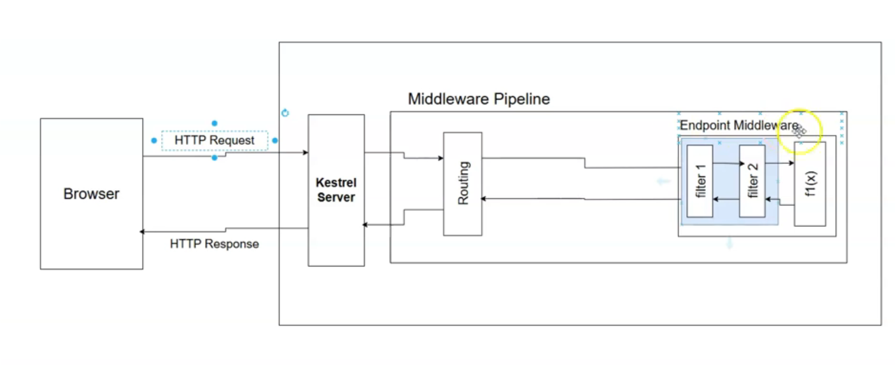

# Filter Pipelines

* **What is a Filter Pipeline?** A filter pipeline is a sequence of logic that runs immediately before and/or after a specific Minimal API endpoint handler is executed. It can be thought of as a "mini-middleware pipeline" that is scoped to a single endpoint.
* **The "Why": Solving Cross-Cutting Concerns:** The primary reason for using filters is to handle **cross-cutting concerns**. These are tasks that apply to many endpoints but are not part of their core business logic, such as:
    * **Validation:** Checking if input data is valid.
    * **Logging:** Recording information about the request or response.
    * **Auditing:** Creating a record of who did what and when.
    * **By moving this logic into filters, you declutter your endpoint handlers and avoid duplicating code (DRY principle).**


* **Filters vs. Middleware (Key Differences):** This is a critical concept to understand.

1. **Scope:** Middleware is **global** and processes almost every request that comes into your application. Filters are **endpoint-specific**; they only run for the endpoint(s) they are attached to.
2. **Data Abstraction:** Middleware works with the **low-level `HttpContext`**, giving it access to the raw HTTP request and response. Filters work with **high-level, strongly-typed endpoint data**, such as the endpoint's specific parameters and its return value.
* **When to Use a Filter:** Use a filter when your logic needs access to the specific arguments or the return value of an endpoint. If your logic only needs the general `HttpContext`, a middleware is more appropriate.

- 

### Illustrations with Code Examples and a Diagram

#### **Diagram: Filter Pipeline vs. Middleware Pipeline**

This diagram shows that the filter pipeline lives *inside* the endpoint middleware and wraps the specific endpoint handler.

```
+----------------------------------------------------------------------------------+
| INCOMING HTTP REQUEST                                                            |
+----------------------------------------------------------------------------------+
                                 |
                                 v
+----------------------------------------------------------------------------------+
| Middleware Pipeline (Global - Runs for most requests)                            |
|                                                                                  |
| +-----------------+    +-----------------+    +--------------------------------+ |
| |  Auth           | -> |  Routing        | -> |  Endpoint Middleware           | |
| |  Middleware     |    |  Middleware     |    |                                | |
| +-----------------+    +-----------------+    | +----------------------------+ | |
|                                               | | Filter Pipeline            | | |
|                                               | | (Endpoint-Specific)        | | |
|                                               | | +--------+    +--------+ | | |
|                                               | | | Filter | -> | Filter | | | |
|                                               | | |   1    |    |   2    | | | |
|                                               | | +--------+    +--------+ | | |
|                                               | |      |                   | | |
|                                               | |      v                   | | |
|                                               | |  +---------------------+ | | |
|                                               | |  | Endpoint Handler    | | | |
|                                               | |  | (Your main logic)   | | | |
|                                               | |  +---------------------+ | | |
|                                               | +----------------------------+ | |
|                                               +--------------------------------+ |
+----------------------------------------------------------------------------------+
                                 |
                                 v
+----------------------------------------------------------------------------------+
| OUTGOING HTTP RESPONSE                                                           |
+----------------------------------------------------------------------------------+
```


#### **Code Example: The Problem Filters Solve**

This example shows an endpoint handler cluttered with validation logic, which is a perfect candidate to be extracted into a filter.

**Before (Cluttered Endpoint Handler):**
The validation logic is mixed in with the core business logic.

```csharp
app.MapPut("/employees/{id}", (int id, Employee employee, IEmployeeRepository repo) =>
{
    // This validation logic is a "cross-cutting concern"
    if (id != employee.Id)
    {
        return Results.BadRequest("ID in URL must match ID in body.");
    }

    // This is the core business logic
    repo.UpdateEmployee(employee);
    return Results.Ok();
});
```

**After (Clean Endpoint Handler with a Filter):**
The validation is handled by a filter (not shown), leaving the endpoint clean and focused on its primary responsibility.

```csharp
app.MapPut("/employees/{id}", (int id, Employee employee, IEmployeeRepository repo) =>
{
    // The validation logic is now gone, moved to a reusable filter.
    // The filter would have already run and returned a BadRequest if validation failed.

    // Core business logic is all that's left.
    repo.UpdateEmployee(employee);
    return Results.Ok();
})
.AddEndpointFilter<IdValidationFilter>(); // The filter is applied here
```


***

### Interview Summary Table: Minimal API Filters

| Concept | Description | Key Points for Interviews |
| :-- | :-- | :-- |
| **Endpoint Filter** | A piece of logic that wraps a specific Minimal API endpoint handler, running before and/or after it. | "Filters are a mechanism in Minimal APIs for handling cross-cutting concerns like validation and logging, allowing you to keep your endpoint logic clean and focused." |
| **Cross-Cutting Concerns** | Aspects of a program that affect other concerns. They are common, reusable pieces of logic that are not part of the core business function (e.g., logging, validation, security). | "Filters are the ideal place to implement cross-cutting concerns because they can be defined once and applied to multiple endpoints, adhering to the DRY principle." |
| **Filter vs. Middleware** | **Middleware** is global and works with the low-level `HttpContext`. **Filters** are endpoint-specific and work with the high-level, strongly-typed endpoint arguments and results. | This is a critical distinction. "You'd use middleware for broad, request-level logic like authentication. You'd use a filter for logic that needs to inspect or modify the specific parameters being passed into your endpoint, like a validation filter." |
| **The Filter Pipeline** | A chain of one or more filters that are executed in sequence for a single endpoint. | "Just like middleware, you can chain multiple filters together to create a pipeline. This allows you to compose different behaviors, like having a logging filter followed by a validation filter." |
| **Why Use Filters?** | To **declutter** endpoint handlers by moving non-essential logic out, and to **deduplicate** code by creating reusable components for common tasks. | "The primary benefits are improved code quality. Your endpoint handlers become simpler, more readable, and more maintainable because the boilerplate logic is extracted into reusable filters." |


# Creating and Attaching a Filter

* **Filters are Implemented as Classes:** The standard, reusable way to create a filter is by creating a C\# class that implements the `IEndpointFilter` interface.
* **The `InvokeAsync` Method is the Core Logic:** Implementing `IEndpointFilter` requires you to create an `InvokeAsync` method. This method is where your filter's logic resides. It receives two parameters:

1. `EndpointFilterInvocationContext context`: This object gives you access to the endpoint's arguments.
2. `EndpointFilterDelegate next`: This is a delegate you call (`await next(context)`) to pass control to the next filter in the pipeline, or to the final endpoint handler if it's the last filter.
* **Accessing Endpoint Arguments:** Inside the filter, you use `context.GetArgument<T>(index)` to retrieve the arguments that are being passed to your endpoint handler. You must know the type (`<T>`) and the zero-based position (`index`) of the argument you want.
* **Attaching a Filter:** You attach a filter to a specific endpoint by chaining the `.AddEndpointFilter<TFilter>()` method to the endpoint definition (e.g., after `app.MapPut(...)`).
* **Two Ways to Define a Filter:**

1. **Class-based (Recommended):** Create a dedicated class implementing `IEndpointFilter`. This is clean, reusable, and promotes good separation of concerns.
2. **Inline Lambda (Less Common):** You can pass a lambda expression directly to `.AddEndpointFilter()`. This is quick for very simple, one-off filters but can clutter your `Program.cs` file, defeating the purpose of decluttering the endpoint itself.


### Illustrations with Code Examples and a Diagram

#### **Diagram: The Filter Creation and Attachment Process**

This diagram shows the relationship between the endpoint, the filter class, and the attachment method.

```
+-------------------------------------------------+
| 1. Your Endpoint Handler (Before)               |
|-------------------------------------------------|
| app.MapPut("/employees/{id}", (id, emp, repo) => |
| {                                               |
|   if (id != emp.Id) return Results.BadRequest();|  <-- Logic to be extracted
|   repo.Update(emp);                             |
| });                                             |
+-------------------------------------------------+
                         |
          +--------------+--------------+
          |                             |
          v                             v
+-----------------------------+   +-----------------------------+
| 2. Create a Filter Class    |   | 3. Attach the Filter        |
|-----------------------------|   |-----------------------------|
| public class ValidationFilter : |   | app.MapPut("/employees/{id}", |
|     IEndpointFilter           |   |   (id, emp, repo) =>        |
| {                             |   |   {                         |
|   public async InvokeAsync(...) |   |     repo.Update(emp);       |
|   {                             |   |   })                        |
|     // Get arguments from context |   | .AddEndpointFilter<         |
|     // Perform validation logic |   |   ValidationFilter>();      |
|     return await next(context);|   |                             |
|   }                             |   |                             |
| }                               |   |                             |
+-----------------------------+   +-----------------------------+
```


#### **Code Examples**

**1. Creating the Filter Class**
This class implements the validation logic that was previously inside the endpoint handler.

```csharp
// In Filters/EmployeeUpdateFilter.cs
public class EmployeeUpdateFilter : IEndpointFilter
{
    public async ValueTask<object?> InvokeAsync(
        EndpointFilterInvocationContext context,
        EndpointFilterDelegate next)
    {
        // Get the arguments passed to the endpoint by their type and index
        var id = context.GetArgument<int>(0);
        var employee = context.GetArgument<Employee>(1);

        if (id != employee.Id)
        {
            // Short-circuit the request and return a BadRequest result
            return Results.BadRequest("Employee ID in URL must match ID in body.");
        }

        // If validation passes, call the next filter or the endpoint handler
        return await next(context);
    }
}
```

**2. Attaching the Filter to the Endpoint**
The endpoint handler is now much cleaner, focusing only on its core responsibility.

```csharp
// In Program.cs or your endpoint mapping file

// The endpoint is now clean and focused on its primary task.
app.MapPut("/employees/{id}", async (int id, Employee employee, IEmployeeRepository repo) =>
{
    await repo.UpdateEmployeeAsync(employee);
    return Results.Ok();
})
// The filter is attached here. It will run before the lambda above.
.AddEndpointFilter<EmployeeUpdateFilter>();
```


***

### Interview Summary Table: Creating and Attaching Filters

| Concept | Description | Key Points for Interviews |
| :-- | :-- | :-- |
| **`IEndpointFilter`** | The interface that a custom filter class must implement. It defines the contract for a filter. | "To create a reusable endpoint filter, you create a class that implements the `IEndpointFilter` interface. This is the foundation of the filter pattern in Minimal APIs." |
| **`InvokeAsync` Method** | The single method required by the `IEndpointFilter` interface. This is where the filter's logic is executed. | "The `InvokeAsync` method is the heart of the filter. It receives the invocation context and the 'next' delegate, allowing it to perform actions before and after the endpoint handler." |
| **`EndpointFilterInvocationContext`** | The `context` parameter passed to `InvokeAsync`. It provides access to the endpoint's metadata and, most importantly, its arguments. | "The key method on the context is `GetArgument<T>(index)`. This is what gives filters their power over middleware—they can access the strongly-typed arguments of the specific endpoint they are attached to." |
| **`EndpointFilterDelegate`** | The `next` parameter passed to `InvokeAsync`. It's a function that you call to pass control to the next filter in the pipeline or to the endpoint handler itself. | "Calling `await next(context)` is how you continue the request pipeline. If you don't call it, you effectively short-circuit the request, which is what you do when validation fails." |
| **`.AddEndpointFilter<T>()`** | The extension method used to attach a filter to an endpoint definition. | "You apply a filter declaratively by chaining `.AddEndpointFilter<MyFilter>()` to your `MapGet`, `MapPost`, etc. call. You can chain multiple filters to create a pipeline." |

# Filter Execution, Model Binding and Model Validation

* **Filters Run *After* Model Binding:** Endpoint filters always execute after the model binding process is complete. This is evident because a filter can access the endpoint's arguments using `context.GetArgument<T>()`, which would only be possible if the arguments have already been populated from the HTTP request.
* **Model Validation is Opt-In:** By default, Minimal APIs do not automatically run model validation (e.g., checking `[Required]` attributes). You must explicitly enable it for an endpoint by chaining the `.WithParameterValidation()` method.
* **Execution Order is Determined by Chaining Order:** The order in which filters and the validation method are executed depends entirely on the order they are chained to the endpoint definition. The first method chained is the first one to execute.
* **The Filter Pipeline Concept:** You can think of `.WithParameterValidation()` as just another filter in the pipeline. If it runs first and validation fails, it will short-circuit the request, and any subsequent filters (like your custom ones) will **not** be executed.


### Illustrations with Code Examples and a Diagram

#### **Diagram: The Impact of Chaining Order**

This diagram shows how changing the order of the method calls fundamentally alters the execution flow.

```
+-------------------------------------------------------------+
| Scenario A: Validation Chained LAST                         |
|-------------------------------------------------------------|
| app.MapPut(...)                                             |
|   .AddEndpointFilter<MyCustomFilter>()  // 1. This runs first |
|   .WithParameterValidation();         // 2. This runs second |
|                                                             |
| Request Flow:                                               |
| Request -> MyCustomFilter -> Validation -> Endpoint Handler |
+-------------------------------------------------------------+

+-------------------------------------------------------------+
| Scenario B: Validation Chained FIRST                        |
|-------------------------------------------------------------|
| app.MapPut(...)                                             |
|   .WithParameterValidation()        // 1. This runs first   |
|   .AddEndpointFilter<MyCustomFilter>(); // 2. This runs second |
|                                                             |
| Request Flow with Invalid Data:                             |
| Request -> Validation -> SHORT-CIRCUIT (400 Bad Request)    |
|         (MyCustomFilter is NEVER executed)                  |
+-------------------------------------------------------------+
```


#### **Code Examples**

**Scenario 1: Custom Filter Runs Before Validation**
In this setup, your custom filter will always execute. If the data is invalid, the request will be short-circuited by the validation logic *after* your filter runs.

```csharp
app.MapPut("/employees/{id}", (int id, Employee employee) => { /* ... */ })
    // 1. Your custom filter is attached first. It will run.
    .AddEndpointFilter<EmployeeUpdateFilter>()
    // 2. Validation is attached second. It runs after the filter.
    .WithParameterValidation();
```

**Scenario 2: Validation Runs Before Custom Filter (Recommended for Validation)**
This is the more common and efficient setup. If the incoming data is invalid, the request is immediately rejected, and your custom filter's logic is never needlessly executed.

```csharp
app.MapPut("/employees/{id}", (int id, Employee employee) => { /* ... */ })
    // 1. Validation is attached first. It will run first.
    .WithParameterValidation()
    // 2. Your filter is attached second. It will ONLY run if validation passes.
    .AddEndpointFilter<EmployeeUpdateFilter>();
```


***

### Interview Summary Table: Filter Execution Sequence

| Concept | Description | Key Points for Interviews |
| :-- | :-- | :-- |
| **Execution Order** | Filters and other chained methods (`.WithParameterValidation()`) execute in the order they are added to the endpoint. | "The filter pipeline in Minimal APIs is sequential. The order of execution is determined by the order in which you chain methods like `.AddEndpointFilter()` and `.WithParameterValidation()`." |
| **Filters and Model Binding** | Filters **always** run *after* model binding has occurred. | "A filter has access to the endpoint's strongly-typed arguments via `context.GetArgument`, which proves that model binding has already completed before the filter begins execution." |
| **Filters and Model Validation** | A filter's execution relative to model validation depends on the chaining order. | "This is a key detail. If you chain `.WithParameterValidation()` before your custom filter, validation runs first. If validation fails, your filter is never hit. This is the typical and most efficient pattern." |
| **`.WithParameterValidation()`** | An extension method that enables automatic validation of an endpoint's arguments based on their Data Annotations. It can be thought of as a built-in filter. | "Model validation isn't on by default in Minimal APIs. You have to explicitly enable it with `.WithParameterValidation()`, which essentially adds a validation step into that endpoint's filter pipeline." |
| **Short-Circuiting** | The act of a filter or validation step stopping the request from proceeding down the pipeline and immediately returning a response (e.g., a `400 Bad Request`). | "If an early filter in the pipeline—like the one from `.WithParameterValidation()`—finds an issue, it can short-circuit the request. This prevents later filters and the endpoint handler itself from executing on invalid data." |


# Adding Multiple Filters in the Pipeline

### Highlighted Important Points

* **You Can Chain Multiple Filters:** You can create a filter pipeline for a single endpoint by chaining multiple `.AddEndpointFilter()` calls one after another. This allows you to compose different behaviors.
* **Execution Follows the "Onion" Model:** The filter pipeline executes in a specific, nested order, just like the middleware pipeline.
    * The "before" part of the logic (code before `await next()`) runs in the order the filters are added (Filter A -> Filter B -> Filter C).
    * The endpoint handler runs last.
    * The "after" part of the logic (code after `await next()`) runs in the **reverse order** (Filter C -> Filter B -> Filter A).
* **The `next` Delegate is the Key:** Each filter receives a `next` delegate. Calling `await next(context)` passes control to the next filter in the chain (or to the endpoint handler if it's the last filter). The code after this call will only execute once the `next` filter/handler has completed and returned.
* **Inline vs. Class-based Filters:** While the transcript demonstrates creating a pipeline with inline lambda filters for simplicity, it explicitly recommends creating separate, reusable filter classes for real-world applications to keep the endpoint registration code clean and maintainable.


### Illustrations with Code Examples and a Diagram

#### **Diagram: The Filter "Onion" Execution Model**

This diagram visualizes how the request flows through the filters to the handler and how the response flows back out in reverse.

```
+-----------------------------------------------------------------+
|                                                                 |
|   Request --> [ Filter A (Before) --> [ Filter B (Before) ] ]   |
|                                         |                       |
|                                         v                       |
|                                  [ Endpoint Handler ]           |
|                                         ^                       |
|                                         |                       |
|   Response <-- [ Filter A (After) <-- [ Filter B (After) ] ]    |
|                                                                 |
+-----------------------------------------------------------------+
```


#### **Code Example**

This example, taken from the transcript, demonstrates how to create a pipeline with three inline filters and shows the expected output.

**The Endpoint with a Filter Pipeline:**

```csharp
app.MapGet("/employees", (IEmployeeRepository repo) =>
{
    Console.WriteLine("--- Execution of the endpoint ---");
    return repo.GetEmployees();
})
.AddEndpointFilter(async (context, next) =>
{
    Console.WriteLine("Before filter A");
    var result = await next(context);
    Console.WriteLine("After filter A");
    return result;
})
.AddEndpointFilter(async (context, next) =>
{
    Console.WriteLine("Before filter B");
    var result = await next(context);
    Console.WriteLine("After filter B");
    return result;
})
.AddEndpointFilter(async (context, next) =>
{
    Console.WriteLine("Before filter C");
    var result = await next(context);
    Console.WriteLine("After filter C");
    return result;
});
```

**Expected Console Output:**
When a request is made to `/employees`, the console will print the following, clearly showing the execution order.

```
Before filter A
Before filter B
Before filter C
--- Execution of the endpoint ---
After filter C
After filter B
After filter A
```


***

### Interview Summary Table: Minimal API Filter Pipeline

| Concept | Description | Key Points for Interviews |
| :-- | :-- | :-- |
| **Filter Pipeline** | A sequence of filters attached to a single endpoint, created by chaining multiple `.AddEndpointFilter()` calls. | "You can create a filter pipeline to apply multiple, ordered cross-cutting concerns to an endpoint. This allows for composable and reusable logic." |
| **Execution Order (Onion Model)** | Filters execute in a nested sequence. "Before" logic runs in the order of registration, while "after" logic runs in reverse order. | "The pipeline follows the classic 'onion' model, identical to middleware. The request goes in through the layers (A, B, C), hits the handler, and the response comes back out in reverse (C, B, A)." |
| **The `next` Delegate** | A function passed into each filter that, when called, invokes the next filter in the pipeline or the endpoint handler itself. | "The `await next()` call is the pivot point in a filter. The code before it executes on the way 'in', and the code after it executes on the way 'out' after the rest of the pipeline has finished." |
| **Inline vs. Class-based Filters** | Filters can be defined as inline lambda functions or as separate classes implementing `IEndpointFilter`. | "For real-world applications, using separate classes is the recommended practice. It keeps your endpoint definitions clean and makes the filters reusable. Inline filters are best for simple, one-off demonstrations or tests." |


# Creating Filter Pipelines

* **The Assignment Goal:** The main task is to practice creating and applying endpoint filters by extracting validation logic out of existing Minimal API endpoint handlers and into dedicated filter classes.
* **What to Refactor:** The assignment specifically calls out moving validation checks, such as checking if an entity exists before updating or deleting it (e.g., `if (employeeToUpdate == null)`), from the body of the endpoint handler into a reusable filter.
* **The "Why": Decluttering and Practice:** The immediate goal is to "declutter" the endpoint handlers, making them cleaner and more focused on their core business logic. The primary purpose of the exercise is to gain hands-on practice with the filter pattern.
* **A Critical Warning - The Readability Trade-off:** The speaker gives a crucial warning that while this refactoring makes the endpoint code look cleaner, it can harm **readability and maintainability**. By hiding validation logic inside filter classes, it becomes less obvious what business rules are being applied to an endpoint, which can be confusing for new developers or even for the original author months later. This trade-off is a key consideration.


### Illustrations with Code Examples and a Diagram

#### **Diagram: The Refactoring Process for the Assignment**

This diagram illustrates the "before" and "after" state of an endpoint handler as described in the assignment.

```
+-------------------------------------------------------------+
| BEFORE: Endpoint Handler with Inline Validation             |
|-------------------------------------------------------------|
| app.MapPut("/employees/{id}", (id, emp, repo) =>             |
| {                                                           |
|   // This validation logic clutters the endpoint            |
|   var employeeToUpdate = repo.GetById(id);                  |
|   if (employeeToUpdate == null)                             |
|   {                                                         |
|     return Results.NotFound();                              |
|   }                                                         |
|   // Core business logic                                    |
|   repo.Update(emp);                                         |
|   return Results.Ok();                                      |
| });                                                         |
+-------------------------------------------------------------+
                               |
                               v
+-------------------------------------------------------------+
| AFTER: Cleaned Endpoint and a Dedicated Validation Filter   |
|-------------------------------------------------------------|
| // The endpoint is now clean and focused                     |
| app.MapPut("/employees/{id}", (id, emp, repo) =>             |
| {                                                           |
|   repo.Update(emp);                                         |
|   return Results.Ok();                                      |
| }).AddEndpointFilter<EmployeeValidationFilter>();           |
|                                                             |
| // The validation logic is moved into its own class          |
| public class EmployeeValidationFilter : IEndpointFilter     |
| {                                                           |
|   public async InvokeAsync(...) { ... }                     |
| }                                                           |
+-------------------------------------------------------------+
```


#### **Code Example: Extracting a Null Check into a Filter**

This is a concrete example of the refactoring task from the assignment.

**Before (Logic inside the endpoint):**

```csharp
app.MapPut("/employees/{id}", async (int id, Employee employee, IEmployeeRepository repo) =>
{
    var employeeToUpdate = await repo.GetEmployeeByIdAsync(id);
    if (employeeToUpdate == null)
    {
        return Results.NotFound($"Employee with ID {id} not found.");
    }

    await repo.UpdateEmployeeAsync(employee);
    return Results.NoContent();
});
```

**After (Logic extracted to a filter):**

**1. The New Filter Class:**

```csharp
// In Filters/EmployeeExistsFilter.cs
public class EmployeeExistsFilter : IEndpointFilter
{
    public async ValueTask<object?> InvokeAsync(
        EndpointFilterInvocationContext context,
        EndpointFilterDelegate next)
    {
        // Assumes repository is also injected into the filter
        var repo = context.HttpContext.RequestServices.GetRequiredService<IEmployeeRepository>();
        var id = context.GetArgument<int>(0); // Get ID from the endpoint arguments

        var employee = await repo.GetEmployeeByIdAsync(id);
        if (employee == null)
        {
            return Results.NotFound($"Employee with ID {id} not found.");
        }

        return await next(context);
    }
}
```

**2. The Cleaned-Up Endpoint:**

```csharp
app.MapPut("/employees/{id}", async (int id, Employee employee, IEmployeeRepository repo) =>
{
    // The null check is gone, handled by the filter.
    await repo.UpdateEmployeeAsync(employee);
    return Results.NoContent();
})
.AddEndpointFilter<EmployeeExistsFilter>();
```


***

### Interview Summary Table: Refactoring with Filters

| Concept | Description | Key Points for Interviews |
| :-- | :-- | :-- |
| **Separation of Concerns (SoC)** | A design principle for separating a computer program into distinct sections such that each section addresses a separate concern. | "Using filters to handle validation is a great example of Separation of Concerns. It separates the concern of input validation from the core business logic of the endpoint handler." |
| **Readability vs. Abstraction** | The trade-off between making code look "clean" through abstraction and ensuring the code's behavior is explicit and easy to understand. | This is a sophisticated discussion point. "While filters are powerful for abstracting cross-cutting concerns, there's a risk of harming readability. Hiding too much logic can make it difficult to understand an endpoint's full behavior at a glance. It's a balance you have to strike." |
| **Single Responsibility Principle (SRP)** | A principle stating that every class, module, or function should have responsibility over a single part of the functionality provided by the software. | "By moving validation into a filter, the endpoint handler can better adhere to the Single Responsibility Principle. Its sole responsibility becomes executing the business transaction, while the filter's responsibility is to validate the input for that transaction." |
| **Refactoring** | The process of restructuring existing computer code—changing the factoring—without changing its external behavior. | "The assignment is a refactoring exercise. We're not changing what the API does, but we are improving its internal structure by using filters to create more modular and potentially reusable validation components." |


# Assignment Implementation

* **Identify Common Logic:** The first step is to analyze the endpoints and identify repeated validation patterns. In this case, multiple endpoints (`GET /id`, `PUT /id`, `DELETE /id`) all needed to check if an employee with a given ID exists before proceeding.
* **Create an Efficient Repository Method:** Instead of fetching the full employee object just to check for `null` in every filter, a more efficient repository method, `EmployeeExists(int id)`, was created using LINQ's `.Any()`. This avoids unnecessarily transferring data from the data store. This new method must also be added to the corresponding interface (`IEmployeeRepository`).
* **Build a Reusable, Generic Filter:** A single, reusable filter (`EnsureEmployeeExistsFilter`) was created to perform this existence check.
    * It uses **constructor injection** to get a dependency on `IEmployeeRepository`.
    * It relies on the **convention** that the employee `id` is the first argument (`index 0`) in all endpoints it's applied to. This makes the filter generic but also couples it to that convention.
* **Declutter the Endpoint Handlers:** After creating and applying the filter, the validation logic (the `if (employee == null)` checks) was removed from the endpoint handlers. This makes the handlers significantly cleaner and more focused on their single responsibility (e.g., the delete handler's only job is to call the delete method).
* **The Trade-off Revisited:** The solution demonstrates the trade-off discussed in the assignment prompt. The endpoint handlers are now very clean, but the validation logic is abstracted away into the filter. One must look at both the endpoint and the filter to understand the full request lifecycle.


### Illustrations with Code Examples and a Diagram

#### **Diagram: The Reusable Filter Pattern**

This diagram shows how a single, shared filter acts as a "gatekeeper" for multiple endpoints, enforcing a common validation rule before any of their specific logic is executed.

```
+-------------------------------------------------+
|               Incoming Requests                 |
| /employees/1 (GET), /employees/1 (PUT), etc.    |
+-------------------------------------------------+
                         |
                         v
+-------------------------------------------------+
|         Shared "Gatekeeper" Filter              |
|       `EnsureEmployeeExistsFilter`              |
|-------------------------------------------------|
| 1. Injects `IEmployeeRepository`.               |
| 2. Gets `id` from endpoint arguments.           |
| 3. Calls `repo.EmployeeExists(id)`.             |
| 4. If false, returns 404 NotFound.              |
| 5. If true, calls `next()`.                     |
+-------------------------------------------------+
                         | (Request proceeds only if employee exists)
     +-------------------+-------------------+
     |                   |                   |
     v                   v                   v
+----------+      +----------+      +----------+
| GET      |      | PUT      |      | DELETE   |
| Handler  |      | Handler  |      | Handler  |
+----------+      +----------+      +----------+
```


#### **Code Examples**

**1. The Efficient Repository Method**
This method in `EmployeeRepository` uses `.Any()` for an efficient existence check.

```csharp
public bool EmployeeExists(int id)
{
    return _employees.Any(e => e.Id == id);
}

// And its corresponding entry in IEmployeeRepository
public interface IEmployeeRepository
{
    bool EmployeeExists(int id);
    // ... other methods
}
```

**2. The Reusable Filter Implementation (`EnsureEmployeeExistsFilter.cs`)**

```csharp
public class EnsureEmployeeExistsFilter : IEndpointFilter
{
    private readonly IEmployeeRepository _employeeRepository;

    // 1. Dependency is injected via the constructor
    public EnsureEmployeeExistsFilter(IEmployeeRepository employeeRepository)
    {
        _employeeRepository = employeeRepository;
    }

    public async ValueTask<object?> InvokeAsync(
        EndpointFilterInvocationContext context,
        EndpointFilterDelegate next)
    {
        // 2. Assumes 'id' is the first argument
        var id = context.GetArgument<int>(0);
        if (!_employeeRepository.EmployeeExists(id))
        {
            // 3. Short-circuits the request if the employee doesn't exist
            return Results.NotFound($"Employee with ID {id} doesn't exist.");
        }

        // 4. Proceeds to the endpoint handler if validation passes
        return await next(context);
    }
}
```

**3. Before and After: The `DELETE` Endpoint**

**Before (Validation inline):**

```csharp
app.MapDelete("/employees/{id}", async (int id, IEmployeeRepository repo) =>
{
    var employee = await repo.GetEmployeeByIdAsync(id);
    if (employee == null)
    {
        return Results.NotFound($"Employee with ID {id} not found.");
    }
    await repo.DeleteEmployeeAsync(id);
    return Results.Ok();
});
```

**After (Cleaned up with the filter):**

```csharp
app.MapDelete("/employees/{id}", async (int id, IEmployeeRepository repo) =>
{
    await repo.DeleteEmployeeAsync(id);
    return Results.Ok();
})
.AddEndpointFilter<EnsureEmployeeExistsFilter>();
```


***

### Interview Summary Table: Advanced Filter Implementation

| Concept | Description | Key Points for Interviews |
| :-- | :-- | :-- |
| **Refactoring to Reusable Filters** | The practice of identifying common logic across multiple endpoints and extracting it into a single filter class to promote code reuse and adherence to the DRY principle. | "A common refactoring pattern is to take shared validation logic, like checking if an entity exists, and move it into a generic filter. This filter can then be applied to the GET, PUT, and DELETE endpoints for that entity." |
| **Efficient Existence Checks** | Using database/collection methods optimized for checking existence (like LINQ's `.Any()`) rather than fetching full objects just to perform a null check. | "For existence validation in a filter, it's more performant to use a repository method that calls `.Any()` instead of `.FirstOrDefault()`. This avoids pulling unnecessary data and reduces the load on the database." |
| **Dependency Injection in Filters** | Filter classes can and should use constructor injection to receive their own dependencies, such as repositories or logging services. | "Filters are first-class citizens in the DI ecosystem. You can inject services like repositories directly into a filter's constructor, just as you would with a controller or PageModel." |
| **Generic vs. Specific Filters** | A design choice: create one generic filter that relies on conventions (e.g., argument position) or create multiple specific filters that are more explicit but less reusable. | "There's a trade-off. A generic filter like `EnsureEntityExistsFilter` is highly reusable but can be brittle if argument orders change. Specific filters like `ValidateEmployeeUpdate` are more robust and readable but lead to more code. The choice depends on the project's complexity and conventions." |


