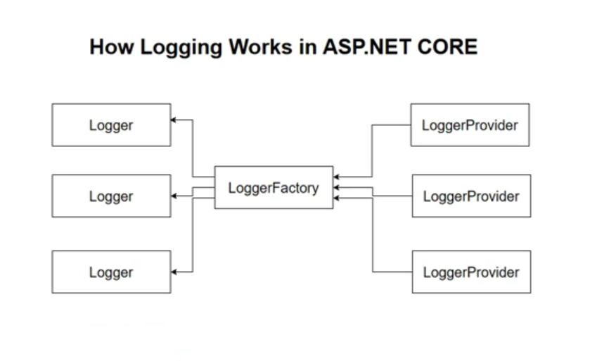
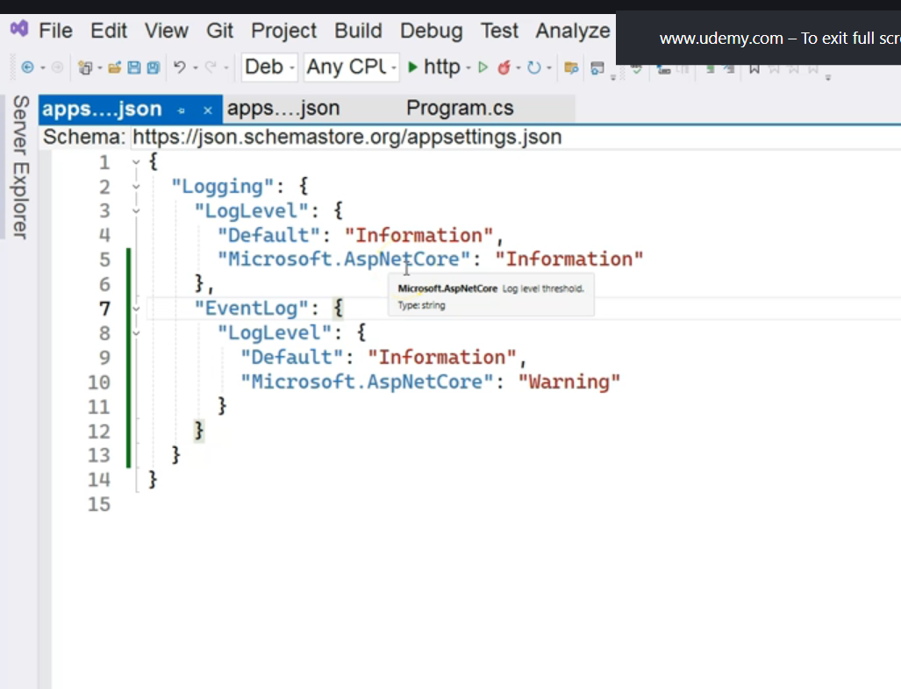
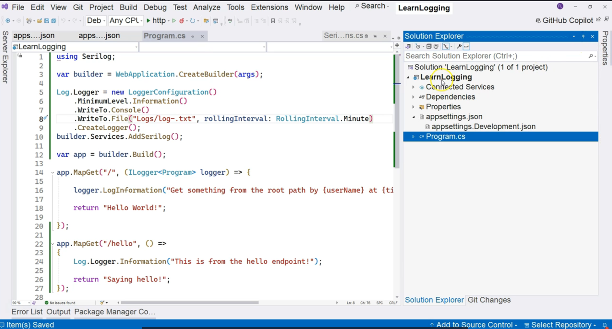
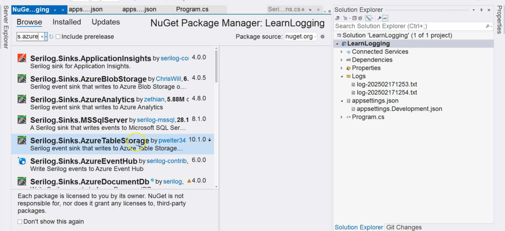
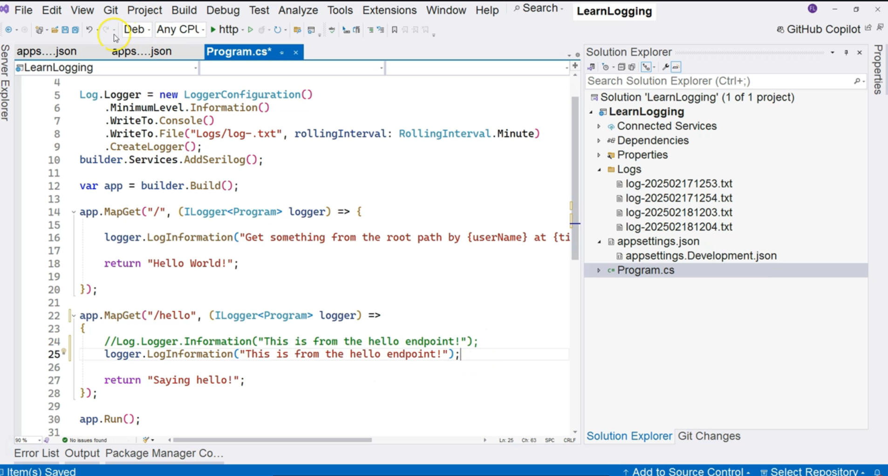

# Logging in ASP.NET Core

#### 1. The Core Architecture: A Provider-Based System

The logging framework is designed to be extensible. It consists of three key components that work together.

1. **Logger Factory (`ILoggerFactory`):** This is the central component responsible for creating logger instances. It acts as a container for all the registered logger providers.
2. **Logger Provider (`ILoggerProvider`):** These are the "plugins" that determine *where* log messages are sent. Each provider is responsible for writing logs to a specific destination. By default, ASP.NET Core registers several providers, including:
    * Console Provider (writes to the standard console window)
    * Debug Provider (writes to the debugger's output window)
    * EventSource Provider
    * EventLog Provider (writes to the Windows Event Log)
3. **Logger (`ILogger`):** This is the interface that application code uses to actually write log messages. When you call a method like `_logger.LogInformation()`, the message is passed to every enabled provider within the factory, which then writes it to its respective destination.

- 

**Diagram: Logging Architecture Flow**

```
+---------------------------+  requests  +----------------+
|     Your Application      | ---------> |    ILogger     |  (e.g., in a Controller)
| (e.g., EmployeesController) |            +----------------+
+---------------------------+                 ^
            ^ injects                         | is created by
            |                                 v
+---------------------------+       uses     +----------------+
|  Dependency Injection     | -------------> | ILoggerFactory |
|  Container                |                +----------------+
+---------------------------+                        | manages multiple
                                                     |
                                   +-----------------v-----------------+
                                   |                 |                 |
                       +-----------------+ +-----------------+ +-----------------+
                       | ConsoleProvider | |  FileProvider   | |  DBProvider   | ...
                       +-----------------+ +-----------------+ +-----------------+
                               |                 |                 |
                               v writes to       v writes to       v writes to
                       +-----------------+ +-----------------+ +-----------------+
                       |     Console     | |   Log File      | |    Database   |
                       +-----------------+ +-----------------+ +-----------------+
```


#### 2. Using the Logger via Dependency Injection

The entire logging system is integrated into ASP.NET Core's dependency injection (DI) container. To use a logger in a class, you simply request an `ILogger<T>` in its constructor.

* The generic type parameter `T` (e.g., `ILogger<EmployeesController>`) is used to create a **log category**. By convention, this is the fully qualified name of the class where the logger is being used. Categories are crucial for filtering logs (e.g., "Show me all logs from the `MyApp.Controllers.EmployeesController` but only at the 'Warning' level or higher").

**Code Example: Injecting and Using `ILogger` in a Controller**

```csharp
using Microsoft.AspNetCore.Mvc;
using Microsoft.Extensions.Logging;

namespace MyApp.Controllers
{
    [ApiController]
    [Route("[controller]")]
    public class EmployeesController : ControllerBase
    {
        private readonly ILogger<EmployeesController> _logger;

        // 1. ILogger<T> is requested in the constructor. The DI container provides it.
        public EmployeesController(ILogger<EmployeesController> logger)
        {
            _logger = logger;
        }

        [HttpGet]
        public IActionResult GetEmployees()
        {
            try
            {
                // 2. Use the logger to write messages at different log levels.
                _logger.LogInformation("Attempting to retrieve all employees.");

                // ... logic to get employees ...

                _logger.LogInformation("Successfully retrieved all employees.");
                return Ok(/* employee data */);
            }
            catch (Exception ex)
            {
                // Log an error with exception details.
                _logger.LogError(ex, "An error occurred while getting employees.");
                return StatusCode(500, "An internal server error occurred.");
            }
        }
    }
}
```


***

### Key Points for Interviews

This table highlights the core concepts from the transcript that are valuable in a technical interview setting.


| Concept | Key Point \& "Why It's Important" | Potential Interview Questions |
| :-- | :-- | :-- |
| **Provider-Based Architecture** | The logging framework is built on factories and providers. This makes the system highly **extensible** and allows you to log to multiple destinations (console, file, cloud service) simultaneously by simply adding new providers. | "How does the logging system in ASP.NET Core work?" <br/> "How would you configure your application to log to both the console and a file?" |
| **`ILogger<T>` Interface** | This is the primary interface used for writing logs. The generic type `T` sets the **log category**, which is crucial for filtering and organizing log output. It provides context about where the log message originated. | "What is the purpose of the generic type `T` in `ILogger<T>`?" |
| **Dependency Injection (DI)** | Logging is a "first-class citizen" in ASP.NET Core and is fully integrated with DI. You request an `ILogger<T>` via constructor injection, which promotes loose coupling and makes your classes easier to test. | "How do you get an instance of a logger inside a service or controller?" |
| **Log Levels** | (Implicit in the transcript) Logging methods like `LogInformation`, `LogWarning`, and `LogError` correspond to different severity levels. This allows you to configure the application to only record messages above a certain threshold (e.g., ignore `Information` logs in production). | "What are log levels and why are they important?" |
| **Default Configuration** | An ASP.NET Core application has logging configured out-of-the-box to write to the console, debug window, and other default providers. No initial setup is required to start logging. | "If you create a new ASP.NET Core Web API and inject an `ILogger`, where will the log messages go by default?" |

# Different parts of a Log

### Summary

This transcript breaks down the fundamental structure of a log entry generated by the built-in logging system in ASP.NET Core. By examining the default console output of a new empty web application, the instructor identifies three core components that make up every log message: the **Level** (indicating severity), the **Category** (indicating the source), and the **Message** (the actual content). The lesson details the six standard log levels and explains the conventional use of categories for better diagnostics and filtering.

***

### Main Points \& Technical Breakdown

#### 1. The Anatomy of a Log Message

When an ASP.NET Core application runs, it produces logs in the console. Each log entry follows a consistent structure, which is crucial for understanding and filtering log data.

**Diagram: Deconstructing a Log Message**

Let's break down a typical log message seen in the console:

`info: Microsoft.Hosting.Lifetime`
`      Now listening on: http://localhost:5000`

This can be deconstructed into its three main parts:

```
+----------+---------------------------------+------------------------------------------+
|  Part    |             Example             |               Description                |
+----------+---------------------------------+------------------------------------------+
|  Level   | `info`                          | The severity of the event.               |
| Category | `Microsoft.Hosting.Lifetime`    | The source of the log message.           |
|  Message | `Now listening on...`           | The textual content of the log.          |
+----------+---------------------------------+------------------------------------------+
```

*(The `` is an Event ID, which can provide additional context but is not covered in detail in this transcript.)*

#### 2. Log Levels (Severity)

The log level indicates the importance or severity of the event being logged. This is the primary mechanism for filtering logs—for example, in a production environment, you might only want to see logs of `Warning` severity or higher.

There are six standard log levels, ordered from most to least severe:

1. **Critical:** A failure that requires immediate attention (e.g., application crash, data corruption).
2. **Error:** A failure in the current operation or flow, which may not crash the entire application but needs to be addressed.
3. **Warning:** An unexpected or non-critical event that might indicate a potential problem in the future.
4. **Information:** General messages that track the normal flow of the application (e.g., "Service started," "Request processed").
5. **Debug:** Detailed information useful for debugging issues during development. Not typically enabled in production.
6. **Trace:** The most detailed level of logging, capturing fine-grained information about application behavior. Used for in-depth diagnostics.

#### 3. Log Category (Source)

The category is a string that provides context about the origin of the log message. It helps answer the question, "Where did this log come from?"

* **Convention:** The recommended practice is to use the **fully qualified class name** (i.e., `Namespace.ClassName`) as the category.
* **Benefit:** When you see a log from the category `MyApp.Services.PaymentService`, you immediately know which part of your application generated it. This is invaluable for quickly pinpointing the source of errors or warnings.

***

### Key Points for Interviews

This table highlights the core concepts from the transcript that are valuable in a technical interview setting.


| Concept | Key Point \& "Why It's Important" | Potential Interview Questions |
| :-- | :-- | :-- |
| **Log Message Structure** | A standard log message consists of three primary parts: **Level**, **Category**, and **Message**. This structured format is essential for making logs readable, searchable, and filterable. | "What are the main components of a log message in ASP.NET Core?" |
| **Log Levels** | There are six hierarchical levels of severity: Critical, Error, Warning, Information, Debug, and Trace. This hierarchy allows developers to **control log verbosity** and filter out noise, especially in production environments. | "Can you list the standard log levels in order of severity?" <br/> "Why is it important to use different log levels instead of just logging everything as 'Information'?" |
| **Log Category** | The category identifies the source of the log. The convention is to use the **fully qualified class name**. This provides crucial context for **diagnosing issues** by immediately telling you which component of the application produced the log. | "What is a log category, and what is the recommended naming convention for it?" |
| **Filtering** | (Implicit) The combination of Level and Category forms the basis for all logging configuration and filtering rules. You can set rules like, "For the category `Microsoft.EntityFrameworkCore`, only show logs of `Warning` level or higher." | "How would you configure your application to reduce the number of logs coming from Entity Framework Core in a production environment?" |

# Writing Logs with Default Log Providers

### Summary

This transcript explores the default logging providers in an ASP.NET Core application and demonstrates how to configure their behavior using `appsettings.json`. It identifies the four default providers (Console, Debug, Event Log, Event Source) and shows that while Console and Debug providers are active by default, others like the Event Log provider must be explicitly enabled. The core of the lesson is a practical demonstration of how to control log verbosity by setting different log levels for specific categories, illustrating the power of configuration for effective diagnostics and monitoring.

***

### Main Points \& Technical Breakdown

#### 1. The Default Logging Providers

Out-of-the-box, an ASP.NET Core application is configured with four logging providers. Each provider directs log output to a different destination.

**Diagram: Default Providers and Their Destinations**


| Provider | Destination | Enabled by Default? |
| :-- | :-- | :-- |
| **Console Provider** | The console window where the application is running. | Yes |
| **Debug Provider** | The "Output" window in Visual Studio during a debug session. | Yes |
| **Event Log Provider** | The Windows Event Viewer (Application log). | No |
| **Event Source Provider** | Used for diagnostics and performance tracing. | Yes |

#### 2. Configuring Logging in `appsettings.json`

The behavior of the logging framework is controlled by the `"Logging"` section in the `appsettings.json` file. This section allows you to set the minimum log level for different categories.

**Basic Configuration Structure:**

```json
{
  "Logging": {
    "LogLevel": {
      "Default": "Information", // Fallback level if no other category matches
      "Microsoft.AspNetCore": "Warning" // Specific level for this category
    }
  }
}
```

* `LogLevel`: This object contains the filtering rules.
* `Default`: Sets the minimum log level for all categories that are not explicitly defined.
* `"Microsoft.AspNetCore"`: This is a **category**. The rule states that for any log originating from a class within the `Microsoft.AspNetCore` namespace, the minimum severity level to be logged is `Warning`.


#### 3. Enabling and Configuring the Event Log Provider

The Event Log provider is registered but not active by default. To enable it, you must add a configuration section for it in `appsettings.json`.

**Diagram: Configuration Flow**

```
+--------------------------+     Rules      +----------------+     Controls      +--------------------+
| appsettings.json         | -------------> | ILoggerFactory | ---------------> | All Log Providers  |
| (Defines log levels      |                |                |                  | (Console, Debug,   |
|  and provider settings)  |                |                |                  |  EventLog, etc.)   |
+--------------------------+                +----------------+                  +--------------------+
```

**Code Example: Enabling the Event Log Provider**

To enable logging to the Windows Event Viewer, you must add an `EventLog` section inside the `Logging` configuration.

* **Important:** Because `appsettings.Development.json` overrides `appsettings.json`, this change must be made in the environment-specific file to take effect during development.

```json
// In appsettings.Development.json
{
  "Logging": {
    "LogLevel": {
      "Default": "Information",
      "Microsoft.AspNetCore": "Warning"
    },
    // This section explicitly enables and configures the Event Log provider
    "EventLog": {
      "LogLevel": {
        "Default": "Information",
        "Microsoft.AspNetCore": "Warning"
      }
    }
  }
}
```

After making this change and running the application, new log entries will appear in the Windows Event Viewer under `Windows Logs` -> `Application`.

- 

#### 4. Filtering by Category to Control Verbosity

The primary purpose of logging configuration is to control the volume of logs. By changing the log level for a specific category, you can get more or less detail from that part of the application.

**Demonstration:**
The transcript shows how changing the log level for the `"Microsoft.AspNetCore"` category affects the console output.

* **When set to `"Warning"` (the default):** Only a few essential startup messages are shown.

```json
"Microsoft.AspNetCore": "Warning"
```

* **When changed to `"Information"`:** The console shows many more logs, including details about request handling.

```json
"Microsoft.AspNetCore": "Information"
```

* **When changed to `"Debug"`:** The console becomes extremely verbose, showing low-level details useful for deep diagnostics.

```json
"Microsoft.AspNetCore": "Debug"
```


This demonstrates how to use categorical filtering to "zoom in" on a specific part of the system when troubleshooting, without being overwhelmed by logs from other components.

***

### Key Points for Interviews

This table highlights the core concepts from the transcript that are valuable in a technical interview setting.


| Concept | Key Point \& "Why It's Important" | Potential Interview Questions |
| :-- | :-- | :-- |
| **Logging Configuration** | Logging behavior is primarily configured in `appsettings.json` under the `"Logging"` section. This provides a flexible, environment-aware way to manage log settings. | "Where and how do you configure logging in an ASP.NET Core application?" |
| **Category-Based Filtering** | You can set different log levels for different **categories** (typically namespaces/class names). This is the key mechanism for controlling log verbosity and focusing on specific application components. | "How can you reduce the number of logs from Entity Framework in production while keeping detailed logs for your own application services?" |
| **Default Providers** | ASP.NET Core includes several built-in providers (Console, Debug, Event Log, etc.). Knowing which are enabled by default and how to enable others is important for practical use. | "Which logging providers are enabled by default in a new ASP.NET Core project? How would you enable the Windows Event Log provider?" |
| **Configuration Overriding** | Logging settings follow the standard configuration override rules. Settings in `appsettings.{Environment}.json` will override those in `appsettings.json`. This is crucial for having different log levels in development vs. production. | "You changed a log level in `appsettings.json` but it's not taking effect. What is a likely reason?" |
| **Log Levels (`LogLevel`)** | The `LogLevel` setting acts as a **minimum severity filter**. A setting of `"Information"` will log `Information`, `Warning`, `Error`, and `Critical` messages, but not `Debug` or `Trace`. | "If you set the default `LogLevel` to 'Warning', will 'Information' level logs be displayed? Why or why not?" |


# Writing your own log
- ### Summary

This transcript explains how to write custom log messages within an ASP.NET Core application for purposes like auditing and troubleshooting. It demonstrates the process of injecting the generic `ILogger<T>` interface into application code, using it to write logs, and leveraging **structured logging** with message templates to include dynamic data. The video also touches upon the framework's extensibility by showing how developers can clear the default logging providers and add their own.

***

### Main Points \& Technical Breakdown

#### 1. Why Write Custom Logs?

Developers write their own logs for two primary reasons:

* **Auditing:** To create a record of user actions, tracking *who* did *what*, and *when*.
* **Troubleshooting:** To capture specific application state or variable values at critical points, providing more context than the default framework logs when diagnosing issues.


#### 2. Writing a Log Message

The process involves injecting `ILogger<T>` and using its methods.

**Step 1: Inject `ILogger<T>`**
Inject the logger into your class (e.g., a controller, a service, or a minimal API handler). The generic type `T` sets the log's **category**, typically to the name of the class it's injected into.

```csharp
// In a minimal API handler in Program.cs
app.MapGet("/", (ILogger<Program> logger) =>
{
    // ... use the logger instance here ...
    return "Hello World!";
});

// In a controller, you would inject it via the constructor:
// public class MyController(ILogger<MyController> logger) { ... }
```

**Step 2: Use Logging Methods**
Call methods on the logger instance to write messages. It's best practice to use the specific methods for each log level (`LogInformation`, `LogError`, etc.).

```csharp
logger.LogInformation("This is an informational message.");
logger.LogWarning("Something might be wrong here.");
```


#### 3. Structured Logging with Message Templates

Instead of concatenating strings to include dynamic data, the recommended approach is **structured logging**. This involves using named placeholders in the message string and providing the values as separate arguments.

**Why is structured logging better?**
It separates the static message template from the dynamic data. This allows logging providers to treat the parameters as distinct, searchable data fields rather than just part of a flat string. This is incredibly powerful for querying logs in systems like Seq, Splunk, or Azure Application Insights.

**Diagram: Structured Logging vs. String Concatenation**


| Method | Example | Result |
| :-- | :-- | :-- |
| **String Concatenation (Bad)** | `logger.LogInformation("User " + user + " logged in.");` | A flat string: `"User Frank logged in."` |
| **Structured Logging (Good)** | `logger.LogInformation("User {UserName} logged in.", user);` | A message template with associated data: `Template: "User {UserName} logged in."`, `UserName: "Frank"` |

**Code Example:**
The message template uses placeholders like `{Username}` and `{Time}`. The values are passed as subsequent arguments and are matched by position.

```csharp
string username = "Frank";
DateTime time = DateTime.Now;

logger.LogInformation(
    "Getting something from the root path by {Username} at {Time}", // Message Template
    username,                                                       // First parameter maps to {Username}
    time                                                            // Second parameter maps to {Time}
);
```

When this runs, the console will show a formatted string, but the underlying log data sent to providers is structured.

**Console Output:**
`info: LearnLogging.Program`
`      Getting something from the root path by Frank at 8/21/2025 4:30:00 PM`

#### 4. Customizing Logging Providers

The logging pipeline is fully customizable. You can clear the default providers and add only the ones you need, or even add your own custom provider. This is done in `Program.cs` using `builder.Logging`.

**Code Example: Clearing Providers and Adding a Custom One**

```csharp
var builder = WebApplication.CreateBuilder(args);

// Access the logging builder
builder.Logging
    .ClearProviders() // Removes Console, Debug, EventLog, etc.
    .AddConsole()     // Add back the Console provider
    .AddProvider(new MyCustomFileLoggerProvider()); // Add your own custom provider

// ... rest of Program.cs
```

***

### Key Points for Interviews

This table highlights the core concepts from the transcript that are valuable in a technical interview setting.


| Concept | Key Point \& "Why It's Important" | Potential Interview Questions |
| :-- | :-- | :-- |
| **`ILogger<T>` Injection** | Logging functionality is accessed by injecting `ILogger<T>`. The generic type `T` sets the log **category**, which is crucial for filtering and identifying the log's source. | "How do you write a log message from a controller in ASP.NET Core?" |
| **Structured Logging** | Use message templates with named placeholders (e.g., `{UserId}`) instead of string interpolation or concatenation. This allows logging backends to store and query the log data in a structured, more powerful way. | "What is structured logging, and why is it preferred over string concatenation?" <br/> "Show me how you would log a user's ID and the time of their request." |
| **Logging Methods** | Use the specific log level methods (`LogInformation`, `LogWarning`, `LogError`, etc.) to clearly indicate the severity of the event being logged. | "What's the difference between `LogInformation` and `LogError`?" |
| **Extensibility** | The logging framework is provider-based and highly extensible. You can clear default providers and add your own (e.g., for logging to a file, a database, or a third-party service like Serilog or NLog) using `builder.Logging`. | "How would you replace the default console logger with a file logger?" |
| **Centralized Dispatch** | You write your log message once using the `ILogger` interface. The framework is responsible for dispatching that message to all configured providers (e.g., Console, Debug, Event Log) simultaneously. | "When you call `_logger.LogInformation()`, where does the message go?" |

# Setting up Serilog

### Summary

This transcript provides a basic introduction to **Serilog**, the most popular third-party logging library for ASP.NET Core. It explains how to integrate Serilog into a project, replacing the built-in logging system. The lesson covers installing the necessary NuGet package, performing the initial configuration in `Program.cs` using a fluent API, and setting up common "sinks" (destinations) like the **Console** and a rolling **File**. The video also demonstrates how to write logs using Serilog's static `Log` class and briefly touches upon its vast ecosystem of other available sinks for databases and cloud services.

***

### Main Points \& Technical Breakdown

#### 1. Initial Setup and Configuration

Using Serilog involves adding its NuGet package and configuring it during application startup. Serilog takes over the logging pipeline from the built-in framework.

* **Installation:** The first step is to install the `Serilog.AspNetCore` NuGet package.
* **Configuration in `Program.cs`:** Serilog is configured using a fluent API that starts with `new LoggerConfiguration()`. The configured logger is then assigned to the static `Log.Logger` property and hooked into the ASP.NET Core host.

**Diagram: Serilog Configuration Flow**

```
new LoggerConfiguration()  --> .MinimumLevel.Is(...)   --> .WriteTo.Console(...)  --> .WriteTo.File(...)   --> .CreateLogger()
(Start Configuration)      (Set Default Log Level)    (Add Console Sink)         (Add File Sink)          (Build the Logger)
```

**Code Example: Basic Serilog Setup in `Program.cs`**

```csharp
using Serilog;
using Serilog.Events;

// 1. Configure Serilog
Log.Logger = new LoggerConfiguration()
    .MinimumLevel.Is(LogEventLevel.Information) // Set the default minimum level
    .WriteTo.Console() // Add the Console sink
    // ... add other sinks here ...
    .CreateLogger(); // Create the static logger instance

var builder = WebApplication.CreateBuilder(args);

// 2. Tell ASP.NET Core to use Serilog for all its logging
builder.Host.UseSerilog(); // This replaces the built-in logger

// The transcript uses AddSerilog(), which also works. UseSerilog() is a common modern alternative.
// builder.Services.AddSerilog();

var app = builder.Build();

// ... rest of Program.cs
```

- 
- 

Once configured, all logging, including internal logs from ASP.NET Core, will be processed by Serilog, which is why the console output format changes immediately.

#### 2. Sinks: The Destinations for Logs

In Serilog, a **sink** is a destination where log events are written. The power of Serilog lies in its vast library of available sinks.

* **Console Sink (`.WriteTo.Console()`):** Writes logs to the console window. You can configure its output format and minimum log level.

```csharp
.WriteTo.Console(restrictedToMinimumLevel: LogEventLevel.Information)
```

* **File Sink (`.WriteTo.File()`):** Writes logs to a file. This sink is highly configurable. A key feature is **file rolling**.
    * **Rolling Interval:** This setting tells Serilog to create a new log file at a specific time interval (e.g., every day, hour, or minute). This prevents log files from growing indefinitely and makes them easier to manage.

**Code Example: Configuring a Rolling File Sink**

```csharp
.WriteTo.File(
    path: "logs/log-.txt", // Base path for the log file
    rollingInterval: RollingInterval.Day, // Creates a new file each day, e.g., log-20250821.txt
    restrictedToMinimumLevel: LogEventLevel.Information
)
```


#### 3. Writing Logs with Serilog

You can write logs using Serilog's simple static `Log` class, which is available anywhere in the application without needing dependency injection.

```csharp
using Serilog;

app.MapGet("/hello", () =>
{
    // Use the static Log class to write a message
    Log.Information("This is from the hello endpoint.");
    return "Saying Hello";
});
```

* **Note:** Standard `ILogger<T>` injection will also continue to work. Behind the scenes, those `ILogger` instances will be powered by the Serilog pipeline you configured.


#### 4. Extensibility: The Serilog Ecosystem

Serilog's main strength is its ecosystem. There are sinks for almost any destination imaginable. You can find them by searching for `Serilog.Sinks.*` on NuGet.

* **Examples:**
    * `Serilog.Sinks.MSSqlServer` (for logging to SQL Server)
    * `Serilog.Sinks.AzureBlobStorage` (for logging to Azure)
    * `Serilog.Sinks.Seq` (for a dedicated log server UI)

***

### Key Points for Interviews

This table highlights the core concepts from the transcript that are valuable in a technical interview setting.


| Concept | Key Point \& "Why It's Important" | Potential Interview Questions |
| :-- | :-- | :-- |
| **Serilog** | A powerful, structured logging framework for .NET that replaces the built-in logging system. Its main advantages are performance, structured data handling, and a massive ecosystem of sinks. | "What is Serilog, and why would you use it instead of the default ASP.NET Core logger?" |
| **Sinks** | Sinks are the destinations for log events (e.g., Console, File, Database, Seq). This provider model makes Serilog extremely flexible and extensible. | "What is a 'sink' in Serilog? Can you name a few common sinks?" |
| **Configuration** | Serilog is typically configured in `Program.cs` using `new LoggerConfiguration()` with a fluent API. The host is then configured to use Serilog via `builder.Host.UseSerilog()`. | "How do you set up and configure Serilog in an ASP.NET Core application?" |
| **File Rolling** | A key feature of the File sink that automatically creates new log files based on a time interval (`RollingInterval`) or file size. This is essential for managing log files in a production environment. | "What is 'file rolling' in the context of logging, and why is it useful?" |
| **Static `Log` Class** | Serilog provides a static `Log` class (`Log.Information(...)`, `Log.Error(...)`) that allows for easy logging from anywhere in the application without requiring dependency injection. | "What are the different ways you can write a log message when using Serilog?" |

# Integrating Serilog into the Application

### Summary

This transcript emphasizes the best practice for integrating Serilog into an ASP.NET Core application. While Serilog offers a convenient static `Log` class, the video strongly advocates for using the standard **`ILogger<T>` dependency injection** pattern instead. This approach ensures that the application code remains decoupled from the specific logging implementation, making it more maintainable, testable, and flexible. By continuing to use the familiar `ILogger<T>` interface, developers can swap logging providers (e.g., from the built-in logger to Serilog) with zero changes to their application's business logic, controllers, or services.

***

### Main Points \& Technical Breakdown

#### 1. Two Ways to Use Serilog: Static vs. Injected

Serilog can be used in two primary ways within an application:

* **The Static `Log` Class:** A globally accessible static class (`Log.Information(...)`). This is simple but tightly couples your code to Serilog.
* **The `ILogger<T>` Interface (Recommended):** The standard ASP.NET Core approach, where `ILogger<T>` is provided via dependency injection.

When you configure Serilog using `builder.Host.UseSerilog()`, it replaces the default logging system. This means that even when you inject the standard `ILogger<T>`, the underlying implementation is actually Serilog.

**Diagram: The Power of Abstraction with `ILogger<T>`**

```
+---------------------------+       requests & uses       +----------------------+
|    Your Application       | --------------------------> |   ILogger<T>         |
| (Controller, Service, etc.)|                             |   (The Abstraction)  |
+---------------------------+                             +----------------------+
                                                                      ^
                                                                      |  is implemented by
                                                                      |
+----------------------------------------------------------------------------------------------------+
|                                      Dependency Injection Container                                |
|                                                                                                    |
|  At startup, `UseSerilog()` configures the DI container to provide a Serilog-powered logger        |
|  whenever an `ILogger<T>` is requested. Your application code doesn't know the difference.         |
+----------------------------------------------------------------------------------------------------+
```


#### 2. The Benefit: Consistency and Decoupling

The main reason to prefer `ILogger<T>` injection is to **decouple your application from a specific logging library**.

* **Consistency:** Your code for writing logs remains identical, regardless of the underlying provider. You always inject `ILogger<T>` and call methods like `_logger.LogInformation(...)`.
* **Maintainability:** If you decide to switch from Serilog to NLog, or back to the built-in logger, you only need to change the setup in `Program.cs`. You do not have to find and replace every instance of `Log.Information(...)` throughout your entire codebase.
* **Testability:** Code that depends on interfaces (`ILogger<T>`) is much easier to unit test than code that relies on a static class (`Log`). You can easily provide a mock or fake `ILogger` implementation in your tests.


#### 3. Demonstration: `ILogger<T>` with a Serilog Backend

The transcript demonstrates that when Serilog is configured, injecting `ILogger<T>` works seamlessly and provides all the expected features, including structured logging.
- 

**Code Example:**
This code uses the standard dependency injection pattern. Because Serilog is configured as the logging provider, the output will be formatted by Serilog.

```csharp
// In Program.cs

// The standard ILogger<T> is injected into the minimal API handler.
app.MapGet("/", (ILogger<Program> logger) =>
{
    string username = "Frank";
    DateTime time = DateTime.Now;

    // We use the familiar LogInformation method with structured logging placeholders.
    // Serilog's engine will process this message behind the scenes.
    logger.LogInformation(
        "Getting something from the root path by {Username} at {Time}",
        username,
        time
    );

    return "Hello World!";
});
```

**Console Output (with Serilog's format):**
`2025-08-21 16:40:00 [INF] Getting something from the root path by Frank at 8/21/2025 4:40:00 PM`

The output format clearly shows that Serilog is handling the log, even though the application code only ever interacted with the standard `ILogger<T>` interface.

***

### Key Points for Interviews

This table highlights the core concepts from the transcript that are valuable in a technical interview setting.


| Concept | Key Point \& "Why It's Important" | Potential Interview Questions |
| :-- | :-- | :-- |
| **Decoupling from Implementation** | Always prefer injecting the `ILogger<T>` interface over using a concrete static class like `Serilog.Log`. This adheres to the **Dependency Inversion Principle**, making your application more flexible and maintainable. | "Why should you use `ILogger<T>` for logging even when you're using a third-party library like Serilog?" |
| **Testability** | Components that depend on interfaces are easy to test because you can **mock** the dependency. It's difficult to mock a static class, making code that uses `Serilog.Log` harder to unit test in isolation. | "How does the choice between static logging and injected `ILogger` affect the testability of your code?" |
| **Seamless Integration** | When configured with `UseSerilog()`, Serilog replaces the default `ILoggerFactory`. This means all requests for `ILogger<T>` from the DI container are automatically fulfilled by Serilog without any extra effort. | "How does ASP.NET Core provide a Serilog instance when you ask for the standard `ILogger` interface?" |
| **Consistent API** | All the standard `ILogger` features, including structured logging with `{Placeholders}`, work exactly as expected. You don't lose any functionality by using the interface; you only gain flexibility. | "If you use `ILogger<T>` with Serilog, can you still do structured logging?" |

