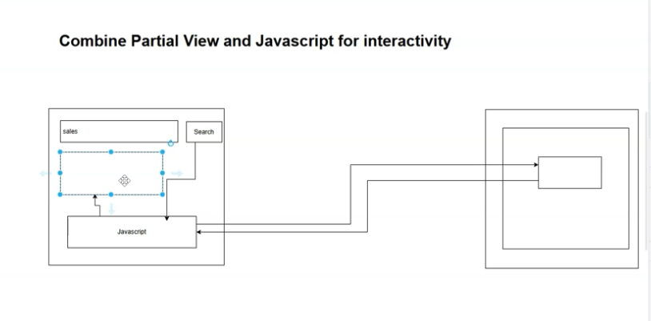

# Componentization with Partial Views (Theory, Benefits, and Use Cases)

## Overview

This section introduces componentization in ASP.NET Core Razor using Partial Views. The focus here is on why we componentize before jumping into implementation and interactivity (with JavaScript) in later steps.

Two standout benefits:

- Separation of concerns: Smaller, self-contained parts that are easier to reason about and change without impacting others.
- Reusability: Extract shared UI/logic into components to eliminate duplication and update once in a single place.


## Why Componentize?

- Separation of concerns
    - Break complex pages (layout + main content + forms + toolbars) into focused components.
    - Each component handles one responsibility (Single Responsibility Principle).
    - Changes to one component are less likely to ripple through unrelated parts.
- Reusability
    - Identify repeated UI/logic across pages (e.g., forms that appear in Create and Edit).
    - Extract into a shared component (partial view) and reuse across multiple views.
    - Reduces duplication and keeps behavior/styles consistent.


## Examples from the App

- Separation of concerns in layout:
    - Problem: _Layout.cshtml contains a long, verbose Bootstrap navbar plus body/sections, making it harder to scan.
    - Approach: Extract the navbar into a partial (e.g., _Navbar.cshtml) so the layout visually reads as:
        - Navbar component
        - Title/extra sections (optional)
        - RenderBody() for page content
- Reusability in views:
    - Create.cshtml and Details.cshtml both render nearly identical form fields (Name, Description) and buttons.
    - Approach: Extract the form into a shared partial (e.g., _DepartmentForm.cshtml) and render it in both pages.
    - Benefit: Update the form once; both views receive changes.


## Partial Views: What They Are

- A partial view is a reusable .cshtml fragment (no full HTML <head>/<body>) that can be embedded in other views or layouts.
- Typically named with a leading underscore (e.g., _Navbar.cshtml, _DepartmentForm.cshtml) and placed under Views/Shared or a specific folder (e.g., Views/Departments/Partials).


## How You’ll Use Them (Teaser for Next Steps)

- Extract the navbar from the shared layout:
    - Create Views/Shared/_Navbar.cshtml and move navbar markup there.
    - In _Layout.cshtml, render it with:
        - @await Html.PartialAsync("_Navbar")
        - or @await Html.PartialAsync("Shared/_Navbar") depending on location
- Extract the shared department form:
    - Create Views/Departments/_DepartmentForm.cshtml containing the fields (Name, Description) and buttons.
    - In Create.cshtml and Details.cshtml, render:
        - @await Html.PartialAsync("_DepartmentForm", Model)
    - If slight differences are needed (e.g., Save vs. Update labels, show/hide Delete), pass flags via a small view model or ViewData to conditionally render parts inside the partial.


## Design Tips

- Scope components thoughtfully:
    - Shared UI used app-wide → Views/Shared/
    - Feature-specific components → Views/FeatureName/Partials/ (or same feature folder with underscore naming)
- Keep components cohesive:
    - One clear responsibility per partial.
    - Avoid mixing unrelated concerns inside one component.
- Parameterization:
    - Use a small view model or ViewData to switch labels, toggle buttons, or adjust behavior cleanly.
- Consistency:
    - Shared components enforce a consistent UX (styles, spacing, validation messages).


## Result

- Cleaner layout and views that are easy to scan.
- Less duplication: shared logic/UI lives in one place.
- Faster, safer changes: update a component once; all consuming views benefit.
- Solid foundation for the next step: adding interactivity to partials with JavaScript.


# Partial Views: Creating a Navbar Component (Separation of Concerns)

## Overview

This step applies the componentization theory by extracting the verbose Bootstrap navbar from the shared layout into a reusable partial view. The goal is to improve readability and maintainability of the layout (separation of concerns), not necessarily reuse the navbar elsewhere.

## Key Points

- Partial view = a Razor view rendered inside another view (not served directly to a request).
- Create partials near their caller for clarity. Here, the caller is the shared layout, so place the partial under Views/Shared.
- Use Html.PartialAsync (not Partial) to render partials asynchronously and avoid deadlocks.
- Sections (@RenderSection) are only allowed in layouts. Do not place @RenderSection inside partials.
- Partial view discovery (by name):
    - Looks in the caller’s folder first (here: Views/Shared).
    - Then in Views/Shared (same in this case).
- You may reference partials by full path or by name (recommended: by name when colocated).


## Files and Code

1) Create the navbar partial

- Path: Views/Shared/_Navbar.cshtml
- Content: move only the navbar markup from the layout here. Ensure no @RenderSection calls remain.

```html
@* Views/Shared/_Navbar.cshtml *@
<nav class="navbar navbar-expand-lg navbar-light bg-light mb-3">
  <div class="container-fluid">
    <a class="navbar-brand" href="/">Departments</a>

    <button class="navbar-toggler" type="button" data-bs-toggle="collapse"
            data-bs-target="#mainNavbar" aria-controls="mainNavbar"
            aria-expanded="false" aria-label="Toggle navigation">
      <span class="navbar-toggler-icon"></span>
    </button>

    <div class="collapse navbar-collapse" id="mainNavbar">
      <ul class="navbar-nav me-auto mb-2 mb-lg-0">
        <li class="nav-item"><a class="nav-link" href="/">Home</a></li>
        <li class="nav-item"><a class="nav-link" href="/departments">Departments</a></li>
      </ul>
    </div>
  </div>
</nav>
```

2) Render the partial in the layout

- Path: Views/Shared/_Layout.cshtml
- Replace the inline navbar with the partial render call.

```html
@* Views/Shared/_Layout.cshtml *@
<!doctype html>
<html lang="en">
<head>
  <meta charset="utf-8" />
  <meta name="viewport" content="width=device-width, initial-scale=1" />
  <link rel="stylesheet"
        href="https://cdn.jsdelivr.net/npm/bootstrap@5.3.0/dist/css/bootstrap.min.css" />
  <title>@(ViewBag.Title ?? "App")</title>
</head>
<body>

  @await Html.PartialAsync("_Navbar")

  <div class="container my-4">
    @RenderSection("TitleSection", required: false)
    <br />
    @RenderBody()
  </div>

  <script src="https://cdn.jsdelivr.net/npm/bootstrap@5.3.0/dist/js/bootstrap.bundle.min.js"></script>
</body>
</html>
```

3) Important constraint: No sections in partials

- If your previous navbar included something like:

```razor
@RenderSection("SomeSection")
```

move it back to the layout. Rendering sections from partials throws:
“RenderSection invocation is invalid because it can only be called from a layout page.”


## Alternate Referencing Options

- By full path:

```razor
@await Html.PartialAsync("/Views/Shared/_Navbar.cshtml")
```

- By name with extension:

```razor
@await Html.PartialAsync("_Navbar.cshtml")
```

- Recommended here: by name when the partial is colocated with the caller.


## Result

- _Layout.cshtml is concise and clearly shows the page structure.
- Navbar is isolated in Views/Shared/_Navbar.cshtml (separation of concerns).
- No behavioral change; all pages continue to render with the same navbar.
- Ready foundation for future reuse or enhancements (e.g., dynamic active states, role-based links).


# Passing Data to Partial Views (ASP.NET Core Razor)

## Overview

This step shows how to deduplicate Create and Details views by extracting their shared form into a strongly-typed partial view, and how to pass data from the parent view to the partial (e.g., to switch between Create vs Edit behaviors). It also highlights using Html.PartialAsync with await, conditional rendering, and reuse within the same feature folder.

## Key Points

- Extract the common Department form into a partial view for reuse in Create and Details.
- Make the partial strongly-typed (@model Department) to get IntelliSense and compile-time checks.
- Pass the page “mode” (Create vs Edit) via ViewBag (or ViewData) from the parent view to the partial.
- In the partial, use ViewBag to:
    - Toggle the hidden Id field (only needed on Edit).
    - Set the form action URL (/department/edit vs /department/create).
- Use @await Html.PartialAsync(...) to render the partial. Forgetting await causes runtime issues.
- Partial views can be nested inside other partials; sections (@RenderSection) cannot be used inside partials.


## File Structure (example)

- Views/
    - Shared/
        - _Layout.cshtml
    - Departments/
        - Create.cshtml
        - Details.cshtml
        - _DepartmentDetail.cshtml  ← partial (shared by Create and Details)


## Partial View: Views/Departments/_DepartmentDetail.cshtml

```c#
@model YourNamespace.Models.Department

@{
    // Expect ViewBag.Action to be "Edit" or "Create"
    var action = (string)(ViewBag.Action ?? "Create");
    var formAction = action.Equals("Edit", StringComparison.OrdinalIgnoreCase)
        ? "/department/edit"
        : "/department/create";
}

<form method="post" action="@formAction">
  @* Only include hidden Id when editing *@
  @if (action.Equals("Edit", StringComparison.OrdinalIgnoreCase))
  {
    <input type="hidden" name="Id" value="@Model.Id" />
  }

  <div class="row mb-3">
    <div class="col-2 col-form-label">
      <label for="Name" class="form-label">Name</label>
    </div>
    <div class="col-6">
      <input id="Name" name="Name" type="text" value="@Model?.Name" class="form-control" />
    </div>
  </div>

  <div class="row mb-3">
    <div class="col-2 col-form-label">
      <label for="Description" class="form-label">Description</label>
    </div>
    <div class="col-6">
      <input id="Description" name="Description" type="text" value="@Model?.Description" class="form-control" />
    </div>
  </div>

  <div class="row mb-3">
    <div class="col-2"></div>
    <div class="col-6">
      <button type="submit" class="btn btn-primary">Save</button>
      <a href="/departments" class="btn btn-secondary ms-2">Cancel</a>
    </div>
  </div>
</form>
```

Notes:

- The partial is strongly-typed to Department.
- It reads ViewBag.Action to decide whether to include the hidden Id and which action URL to post to.
- You could replace ViewBag with a small view model or use Tag Helpers (asp-for, asp-action) if preferred.


## Parent Views

### Views/Departments/Create.cshtml

```c#
@model YourNamespace.Models.Department
@{
    ViewBag.Title = "Create New Department";
    ViewBag.Action = "Create";
}

@section TitleSection {
  <h3>Create New Department</h3>
}

@await Html.PartialAsync("_DepartmentDetail", Model)
```


### Views/Departments/Details.cshtml

```html
@model YourNamespace.Models.Department
@{
    ViewBag.Title = "Department Details";
    ViewBag.Action = "Edit";
}

@section TitleSection {
  <h3>Department Details</h3>
}

@await Html.PartialAsync("_DepartmentDetail", Model)

<form method="post" action="/department/delete" class="mt-2">
  <input type="hidden" name="Id" value="@Model.Id" />
  <button type="submit" class="btn btn-danger">Delete</button>
</form>
```

Notes:

- Both views pass the same Model to the partial.
- Each sets ViewBag.Action appropriately.
- Details keeps its own Delete form separate from the partial.


## Controller Snippets (for context)

```csharp
[HttpGet]
public IActionResult Create()
{
    return View(new Department()); // Provide non-null model
}

[HttpPost]
public IActionResult Create(Department model)
{
    if (!ModelState.IsValid) return View(model);
    _repository.Add(model);
    return RedirectToAction("Index");
}

[HttpGet]
public IActionResult Details(int id)
{
    var model = _repository.Get(id);
    if (model == null) return View("Error");
    return View(model);
}

[HttpPost]
public IActionResult Edit(Department model)
{
    if (!ModelState.IsValid) return View("Details", model);
    _repository.Update(model);
    return RedirectToAction("Index");
}

[HttpPost]
public IActionResult Delete(int id)
{
    _repository.Delete(id);
    return RedirectToAction("Index");
}
```


## Common Pitfalls and Fixes

- Missing await for PartialAsync:
    - Symptom: runtime error or Task rendered.
    - Fix: Use @await Html.PartialAsync(...).
- Sections inside partial:
    - Symptom: “RenderSection invocation is invalid…” error.
    - Fix: Only call @RenderSection in layouts.
- Model binding errors (“Name is required”):
    - Ensure input name attributes match model properties exactly (Name, Description, Id).
- Wrong action URL in partial:
    - Confirm ViewBag.Action is set to “Create” or “Edit” in the parent view.


## Optional Enhancements

- Replace ViewBag with a small partial-specific view model (e.g., DepartmentFormViewModel { Department, Mode }).
- Use Tag Helpers:
    - <form asp-action="Edit"> or <form asp-action="Create">
    - <input asp-for="Name" class="form-control" />
- Add validation UI:
    - <span asp-validation-for="Name" class="text-danger"></span>
    - Validation summary in the partial or parent view.


## Result

- Create and Details share a single, strongly-typed form partial.
- Behavior differences (Create vs Edit) are controlled via data passed from the parent view.
- Less duplication, cleaner views, and easier maintenance.

# Assignment: Componentize the Departments List Page with Partial Views

## Goal

Practice identifying UI responsibilities and refactoring the Departments Index page into self-contained partial views (components) using separation of concerns and reusability.

## What To Do

1) Identify distinct functionalities on the Departments list page

- Page title and header actions (e.g., “Departments” title, “Add” button)
- Search/filter controls (if applicable, or prepare a placeholder for future filtering)
- Data table (headers + rows)
- Row-level actions (Edit, optional Delete per row)
- Pagination/status/footer (optional: count, paging controls)

2) Create one partial per responsibility

- Suggested components:
    - _DepartmentsHeader.cshtml
        - Renders page title and “Add” button
    - _DepartmentsSearch.cshtml (optional/placeholder)
        - Renders a filter/search form (can be non-functional stub for now)
    - _DepartmentsTable.cshtml
        - Renders the table shell with headers, delegates row rendering
    - _DepartmentRow.cshtml
        - Renders a single department row (Name, Description, actions)
    - _DepartmentsFooter.cshtml (optional)
        - Renders total count, paging controls, or any footer info

3) Wire them up in Index.cshtml

- Index.cshtml becomes a thin composition layer that:
    - Sets page metadata (ViewBag.Title or TitleSection)
    - Renders each partial in the correct order
    - Passes the Model (IEnumerable<Department>) where needed
    - For row partials, pass each item as the model


## Example File Structure

- Views/
    - Departments/
        - Index.cshtml
        - Partials/
            - _DepartmentsHeader.cshtml
            - _DepartmentsSearch.cshtml
            - _DepartmentsTable.cshtml
            - _DepartmentRow.cshtml
            - _DepartmentsFooter.cshtml


## Example Implementations

- Views/Departments/Index.cshtml

```html
@model IEnumerable<YourNamespace.Models.Department>
@{
    ViewBag.Title = "Departments";
}

@section TitleSection {
  <h3>Departments</h3>
}

@await Html.PartialAsync("Partials/_DepartmentsHeader")

@await Html.PartialAsync("Partials/_DepartmentsSearch")

@await Html.PartialAsync("Partials/_DepartmentsTable", Model)

@await Html.PartialAsync("Partials/_DepartmentsFooter", Model)
```

- Views/Departments/Partials/_DepartmentsHeader.cshtml

```html
<div class="d-flex justify-content-between align-items-center mb-3">
  <div></div>
  <a href="/department/create" class="btn btn-primary">Add</a>
</div>
```

- Views/Departments/Partials/_DepartmentsSearch.cshtml (optional)

```html
<form method="get" class="row g-2 mb-3">
  <div class="col-auto">
    <input name="q" class="form-control" placeholder="Search departments..." />
  </div>
  <div class="col-auto">
    <button type="submit" class="btn btn-outline-secondary">Search</button>
  </div>
</form>
```

- Views/Departments/Partials/_DepartmentsTable.cshtml

```html
@model IEnumerable<YourNamespace.Models.Department>

<table class="table table-striped">
  <thead>
    <tr>
      <th>Name</th>
      <th>Description</th>
      <th style="width: 180px;"></th>
    </tr>
  </thead>
  <tbody>
    @foreach (var department in Model)
    {
      @await Html.PartialAsync("Partials/_DepartmentRow", department)
    }
  </tbody>
</table>
```

- Views/Departments/Partials/_DepartmentRow.cshtml

```html
@model YourNamespace.Models.Department

<tr>
  <td>@Model.Name</td>
  <td>@Model.Description</td>
  <td class="text-end">
    <a href="/department/details/@Model.Id" class="btn btn-sm btn-primary me-2">Edit</a>

    @* Optional: inline Delete form for extra challenge *@
    @* 
    <form method="post" action="/department/delete" class="d-inline">
      <input type="hidden" name="Id" value="@Model.Id" />
      <button type="submit" class="btn btn-sm btn-danger">Delete</button>
    </form>
    *@
  </td>
</tr>
```

- Views/Departments/Partials/_DepartmentsFooter.cshtml (optional)

```html
@model IEnumerable<YourNamespace.Models.Department>
<div class="d-flex justify-content-between align-items-center mt-3 text-muted small">
  <div>Total: @Model.Count()</div>
  @* Placeholder for pagination *@
  <div></div>
</div>
```


## Guidelines and Tips

- Keep responsibilities narrow in each partial.
- Use @await Html.PartialAsync to avoid deadlocks.
- Pass only the data each partial needs:
    - List to the table
    - Single item to the row
- Prefer consistent naming and folder structure (e.g., Partials subfolder).
- If you later need slight behavior differences, pass flags via ViewData or a small view model.
- Optional challenge: Implement per-row Delete with a POST form in _DepartmentRow.cshtml.


## Acceptance Criteria

- Index.cshtml primarily composes partials and has minimal HTML.
- The page renders the same UI and behavior as before (Add, Edit links work).
- The code is cleaner, easier to scan, and components are self-contained.

# Interactivity in ASP.NET Core MVC: Partial Views + JavaScript (AJAX)

## Why interactivity matters

- Full-page server rendering forces a complete reload on every interaction, causing flicker and delays, which harms UX.[^1]
- A better approach is to partially update only the affected section of the page using a controller action that returns a Partial View and JavaScript to inject the returned HTML into the DOM.[^2][^1]


## How it works (flow)

1. User triggers an action (e.g., clicks Search).
2. JavaScript intercepts the event and sends an AJAX request to a dedicated endpoint that returns a Partial View (HTML snippet), not the full layout.[^3][^1]
3. The server action processes the filter, renders the Partial View, and returns only the HTML for the target area.[^2][^1]
4. JavaScript receives the HTML and replaces the target container’s content, avoiding a full-page refresh.[^4][^3]
5. 

> In ASP.NET Core, controllers can return PartialView/Partial to render just a fragment, and this is commonly used with AJAX for partial page updates.[^5][^1][^2]

***

## Minimal Implementation (Controller + View + JS)

### Controller

```c#
// BarsController.cs
using Microsoft.AspNetCore.Mvc;

public class BarsController : Controller
{
    // Full page
    [HttpGet]
    public IActionResult Index() => View();

    // Partial-only endpoint (AJAX)
    [HttpGet]
    public IActionResult IndexPartial(string filter)
    {
        var data = LoadBars(filter); // query by 'filter'
        return PartialView("_BarsList", data); // returns only the list fragment
    }

    private IEnumerable<Bar> LoadBars(string filter)
    {
        // Example filtering logic
        var all = new List<Bar> {
            new Bar { Name = "Sales Dashboard" },
            new Bar { Name = "Marketing Trends" },
            new Bar { Name = "Sales Pipeline" },
        };
        return string.IsNullOrWhiteSpace(filter)
            ? all
            : all.Where(b => b.Name.Contains(filter, StringComparison.OrdinalIgnoreCase));
    }

    public class Bar { public string Name { get; set; } }
}
```

- Returning PartialView allows rendering only a partial template for AJAX scenarios.[^1][^2]


### Full View (with search UI and target container)

```html
@* Views/Bars/Index.cshtml *@
<div class="search">
  <input id="filter" type="text" placeholder="Type to filter..." />
  <button id="searchBtn">Search</button>
</div>

<div id="results"><!-- partial will render here --></div>

<script>
  async function loadResults(filter) {
    const url = `/Bars/IndexPartial?filter=${encodeURIComponent(filter || "")}`;
    const res = await fetch(url, { headers: { "X-Requested-With": "XMLHttpRequest" } });
    if (!res.ok) { document.getElementById("results").textContent = "Error loading results."; return; }
    const html = await res.text();
    document.getElementById("results").innerHTML = html; // inject partial HTML
  }

  document.getElementById("searchBtn").addEventListener("click", () => {
    loadResults(document.getElementById("filter").value);
  });

  // Optional: live search on typing
  document.getElementById("filter").addEventListener("input", (e) => {
    loadResults(e.target.value);
  });

  // Initial load
  loadResults("");
</script>
```

- Using fetch to request the partial is a common pattern; inject the returned HTML into a container for a smooth partial refresh.[^4][^3]


### Partial View (HTML fragment only)

```html
@* Views/Bars/_BarsList.cshtml *@
@model IEnumerable<BarsController.Bar>

@if (!Model.Any())
{
  <div>No results found.</div>
}
else
{
  <ul>
    @foreach (var item in Model)
    {
      <li>@item.Name</li>
    }
  </ul>
}
```

- Partial Views are reusable page fragments and are ideal for asynchronously updating sections of a page.[^2][^1]

***

## Alternative: jQuery .load() for simplicity

```js
@* In Index.cshtml *@
<select id="city"></select>
<div id="infoBox"></div>

<script src="https://ajax.googleapis.com/ajax/libs/jquery/3.6.0/jquery.min.js"></script>
<script>
  $("#city").change(function () {
    $("#infoBox").load("@Url.Action("InfoBox01")" + "?value=" + this.value);
  }).trigger("change");
</script>
```

- This approach loads a Partial View directly into a div using jQuery’s .load(), suitable for quick setups.[^4]

***

## Key Takeaways

- Use a dedicated controller action that returns PartialView/Partial to supply just the HTML for the dynamic region.[^1][^2]
- Trigger that action from JavaScript (fetch or jQuery AJAX), then replace a target container’s innerHTML with the response to avoid full-page reloads.[^3][^4]
- Keep the partial free of layout and only include the fragment to be injected.[^1]

***


# Implementing Interactivity: A Practical Example with Partial Views \& JavaScript

This guide walks through the practical implementation of creating an interactive search feature in an ASP.NET Core MVC application. We will build a reusable search bar as a Partial View and use JavaScript's `fetch` API to dynamically update a list of departments without a full-page reload.

## The Implementation Steps

### 1. Create a Reusable Search Bar Partial View

To keep our UI modular and reusable, the search bar is created as a partial view in the `Views/Shared` folder. This allows it to be used on any page in the application (e.g., for searching departments, employees, etc.).

**Key Points:**

* It's placed in `/Views/Shared/` for application-wide access.
* The search button has `type="button"` to prevent it from submitting a form in the traditional way.
* The input field and button are given unique `id` attributes (`search-filter`, `search-button`) so JavaScript can easily select them.

```csharp
@* /Views/Shared/_SearchBar.cshtml *@
<div class="row">
    <div class="col-6">
        <div class="input-group mb-3">
            @* The input field where the user types the search query *@
            <input id="search-filter" type="text" class="form-control" placeholder="Search here..." />
            
            @* The button that will trigger the JavaScript function *@
            <button id="search-button" class="btn btn-primary" type="button">Search</button>
        </div>
    </div>
</div>
```


### 2. Update the Main View to Host the UI and JavaScript

The main view (`Index.cshtml`) is responsible for rendering the search bar and providing the container for the results. The page-specific JavaScript that connects the search bar to the departments list also lives here.

**Key Points:**

* The `<partial>` tag helper renders the `_SearchBar.cshtml` view.
* A `<tbody>` element with the `id="department-list"` acts as the target container where the search results will be injected.
* The page's `Index()` action in the controller becomes very simple; it no longer needs to fetch data initially. It just returns the static view.

```csharp
@* /Views/Departments/Index.cshtml *@

@* Render the reusable search bar *@
<partial name="_SearchBar" />

<table class="table">
    <thead>
        <tr>
            <th>Name</th>
            <th></th>
        </tr>
    </thead>
    @* This is the target container for our dynamic results *@
    <tbody id="department-list">
        @* Initially empty. JS will populate this. *@
    </tbody>
</table>

@section Scripts {
    <script>
        // See Step 4 for the JavaScript implementation
    </script>
}
```


### 3. Create the Controller Action for the AJAX Request

A new action method is added to the `DepartmentsController` to handle the asynchronous requests from our JavaScript. This action is the "endpoint" that our `fetch` call will target.

**Key Points:**

* It is decorated with `[HttpGet]` and a route template (`"departmentlist/{filter?}"`) to define its URL. The `?` makes the filter parameter optional.
* It accepts a `filter` string from the URL.
* It returns a `PartialViewResult` using `PartialView()`, ensuring only the HTML fragment from `_DepartmentList.cshtml` is sent back, not the full page layout.
* The repository is updated to filter the data based on the provided string.

```csharp
// DepartmentsController.cs
public class DepartmentsController : Controller
{
    // ... repository setup ...

    // The original Index view is now static
    public IActionResult Index()
    {
        return View();
    }

    // NEW: The endpoint for our AJAX call
    [HttpGet("departmentlist/{filter?}")]
    public IActionResult SearchDepartments(string? filter)
    {
        // Call the repository to get filtered data
        var departments = _departmentRepository.GetDepartments(filter);
        
        // Return only the partial view with the filtered data
        return PartialView("_DepartmentList", departments);
    }
}

// DepartmentRepository.cs (modified method)
public List<Department> GetDepartments(string? filter)
{
    if (string.IsNullOrWhiteSpace(filter))
    {
        return _departments; // Return all if filter is empty
    }

    // Return filtered list (case-insensitive)
    return _departments
        .Where(d => d.Name != null && d.Name.ToLower().Contains(filter.ToLower()))
        .ToList();
}
```


### 4. Write the Client-Side JavaScript to Connect Everything

This is the glue that holds the interactive feature together. Using modern JavaScript (`async/await` and `fetch`), we wire up the button's click event to call our controller endpoint and update the UI.

**Key Points:**

* The function must be marked `async` to use the `await` keyword.
* `fetch` is used to call the controller action, building the URL dynamically with the filter value.
* `await response.text()` extracts the HTML content from the response.
* `innerHTML` is used to replace the content of our target `<tbody>` with the HTML returned from the server.

```javascript
// In the <script> section of /Views/Departments/Index.cshtml

// Find the button and add a click event listener
document.getElementById('search-button').addEventListener('click', async () => {
    // 1. Get the filter value from the input box
    const filter = document.getElementById('search-filter').value;

    // 2. Use fetch to call our controller endpoint asynchronously
    const url = `/departmentlist/${filter}`;
    const response = await fetch(url);
    const departmentHtml = await response.text();

    // 3. Inject the returned HTML into our table body
    document.getElementById('department-list').innerHTML = departmentHtml;
});
```


***

### Key Concepts Summary for Interviews

| Component | Role \& Responsibility | Key Code / Implementation Detail |
| :-- | :-- | :-- |
| **`_SearchBar.cshtml`** | A reusable, shared Partial View that provides the search UI. It is self-contained and has no logic. | `<input id="search-filter">`, `<button id="search-button" type="button">` |
| **`Index.cshtml`** | The main page. It renders the search bar partial, defines the target container for results, and contains the specific JavaScript logic. | `<partial name="_SearchBar" />`, `<tbody id="department-list">`, `<script>...</script>` |
| **Controller Action** | A dedicated endpoint to handle the AJAX request. It processes the filter and returns a `PartialViewResult`. | `[HttpGet(".../{filter?}")]`, `return PartialView("_DepartmentList", model);` |
| **JavaScript (`fetch`)** | The client-side orchestrator. It intercepts the user's click, calls the controller endpoint, and updates the DOM with the response. | `async () => { ... await fetch(...); ... .innerHTML = html; }` |
| **Repository Method** | The data access layer. It is modified to accept a filter parameter and perform the actual data filtering using LINQ (`.Where()`). | `GetDepartments(string? filter)` |


# Partial Views vs. View Components: A Conceptual Overview

In ASP.NET Core, both Partial Views and View Components are used to break down large UIs into smaller, manageable, and reusable pieces. However, they solve this problem in fundamentally different ways. This guide explains the limitations of Partial Views and introduces View Components as a more powerful and encapsulated alternative.

## The Limitation of Partial Views

A Partial View is not a complete component; it's a **"dumb" piece of UI**. It only encapsulates the Razor markup (`.cshtml`) but has no logic of its own. It is entirely dependent on the parent controller's action method to provide it with the data it needs to render.

This creates a tight coupling between the parent controller and the partial view, which violates a complete separation of concerns. The logic for the "component" is mixed in with all the other logic of the parent controller.

### Example: The Dependent Partial View

Consider a partial view that displays department details. The logic to fetch the department data does not live with the partial view. It lives in the main controller action.

**1. The Controller Fetches Data**
The `DepartmentsController` has an action that fetches the data and passes it to the main view.

```csharp
// DepartmentsController.cs
public class DepartmentsController : Controller
{
    // This action is responsible for fetching the data
    public IActionResult Details(int id)
    {
        var department = _repository.GetDepartmentById(id);
        // The data is passed to the main Details.cshtml view
        return View(department); 
    }
}
```

**2. The Main View Passes Data to the Partial**
The main view (`Details.cshtml`) receives the model and then passes it down to the partial view.

```csharp
@* /Views/Departments/Details.cshtml *@
@model Department

<h1>Department Details</h1>

@* The main view is responsible for passing the model to the partial *@
<partial name="_DepartmentDetail" model="Model" />
```

The partial view (`_DepartmentDetail.cshtml`) is completely passive. It cannot function without its parent providing the necessary `Department` model.

## The Solution: View Components

A **View Component** is a **fully encapsulated, self-contained component**. It bundles both the rendering logic (a `.cshtml` view) and the business logic required to fetch its own data. It does not depend on the parent controller to feed it a model.

This makes View Components truly independent and reusable "widgets" that can be dropped onto any page.

### How a View Component Works (Conceptual)

A View Component consists of two parts:

1. A C\# class that inherits from `ViewComponent`, containing an `InvokeAsync` method to handle the logic.
2. A Razor view (`.cshtml`) that handles the rendering.

When you call a View Component from a view, you are not required to pass it a model. The component itself handles fetching the data it needs.

```csharp
@* Calling a View Component from any page *@

@* This component will fetch its own data internally. No model is passed from the parent. *@
@await Component.InvokeAsync("ShoppingCart")
```

This approach leads to much cleaner and more decoupled code, as the logic for the shopping cart widget is entirely contained within the `ShoppingCartViewComponent` and not scattered in various controller actions.

***

### Key Concepts Summary for Interviews

This table compares the core differences between Partial Views and View Components, which is a common interview topic.


| Feature | Partial View | View Component |
| :-- | :-- | :-- |
| **Purpose** | Renders a piece of UI. | Renders a piece of UI. |
| **Logic Location** | In the **parent controller's** action method. | Inside the **component class** itself (`InvokeAsync` method). |
| **Data Source** | Data is **passed down** from the parent view/controller. | Fetches its **own data** (e.g., from a service or repository). |
| **Encapsulation** | **UI Only**. It is not self-contained and depends on its parent. | **UI + Logic**. It is fully self-contained and independent. |
| **Invocation** | `<partial name="_MyPartial" model="Model" />` | `@await Component.InvokeAsync("MyComponent", new { ... })` |
| **Best Use Case** | Simple, reusable markup that doesn't need its own logic (e.g., a form's fields, display templates). Ideal for AJAX updates. | Complex, self-contained widgets like a shopping cart, login panel, tag cloud, or a dynamic navigation menu. |


# Implementing Your First ViewComponent in ASP.NET Core

View Components solve the limitations of Partial Views by bundling business logic and rendering logic into a single, reusable, and self-contained unit. This guide covers the essential parts of a View Component and walks through a practical implementation.
- 

A View Component consists of two core parts:

1. **A C\# Class:** Inherits from `ViewComponent` and contains the logic to fetch data in an `InvokeAsync` method.
2. **A Razor View:** A `.cshtml` file that defines the component's UI and is rendered by the class.

## The Implementation Steps

### 1. Create the View Component Class

The C\# class is the "brain" of the component. It's responsible for all the logic. ASP.NET Core can discover a class as a View Component in three ways (any one will work):

* The class name ends with the suffix `ViewComponent`.
* The class is decorated with the `[ViewComponent]` attribute.
* The class inherits from the `ViewComponent` base class.

The logic is placed inside a required method named `Invoke` or `InvokeAsync`.

**Key Points:**

* It's common to place View Component classes in a `/ViewComponents` folder at the project's root for organization.
* The `InvokeAsync` method is like a mini-controller action. It fetches data and returns a `View` with a model.
* The component is completely self-reliant; it uses dependency injection to get services like a repository and does not depend on a parent controller.

```csharp
// /ViewComponents/DepartmentListViewComponent.cs
using Microsoft.AspNetCore.Mvc;

// This class is discovered because it inherits from ViewComponent
public class DepartmentListViewComponent : ViewComponent
{
    private readonly DepartmentRepository _repository;

    // Use dependency injection to get needed services
    public DepartmentListViewComponent(DepartmentRepository repository)
    {
        _repository = repository;
    }

    // The required entry-point method for the component's logic
    public IViewComponentResult Invoke()
    {
        // 1. Execute business logic to get data
        var departments = _repository.GetDepartments(null);

        // 2. Return a View result with the data as the model
        return View(departments);
    }
}
```


### 2. Create the View for the Component

By convention, a View Component's view is located in a specific folder structure. The framework automatically finds the view based on the component's name.

**Convention:** `/Views/Shared/Components/{ComponentName}/Default.cshtml`

* `{ComponentName}` is the name of your class without the `ViewComponent` suffix (e.g., `DepartmentList`).
* `Default.cshtml` is the standard name for the component's view file.

This view is just like a partial view: it's strongly typed to a model and contains only the necessary HTML markup for the component.

```csharp
@* /Views/Shared/Components/DepartmentList/Default.cshtml *@

@* This view is strongly typed to the model passed from the Invoke method *@
@model IEnumerable<Department>

@foreach (var department in Model)
{
    <tr>
        <td>@department.Name</td>
        <td>
            @* Links for actions *@
        </td>
    </tr>
}
```


### 3. Invoke the View Component

To render the component on a page (like `Index.cshtml`), you call it using the `Component.InvokeAsync` helper. You pass the name of the component as an argument.

```csharp
@* /Views/Departments/Index.cshtml *@

<h1>Departments</h1>

<table class="table">
    <thead>
        <tr>
            <th>Name</th>
            <th></th>
        </tr>
    </thead>
    <tbody>
        @* 
          Invoke the "DepartmentList" component.
          The framework will find the class, run its Invoke method,
          and render its Default.cshtml view here.
        *@
        @await Component.InvokeAsync("DepartmentList")
    </tbody>
</table>
```


### 4. (Optional) Better Organization: Co-locating Files

For even better organization, you can move the C\# class file directly into its corresponding view folder. This keeps the logic and the UI for a single component physically together, making them easier to find and manage.

**New Structure:**

* `/Views/Shared/Components/DepartmentList/Default.cshtml` (The View)
* `/Views/Shared/Components/DepartmentList/DepartmentListViewComponent.cs` (The Class)

ASP.NET Core's discovery mechanism will still find the component class in this location.

***

### Key Concepts Summary for Interviews

| Component / Concept | Role \& Responsibility | Key Code / Convention |
| :-- | :-- | :-- |
| **View Component Class** | The C\# class containing the component's business logic. It's responsible for fetching its own data. | Must inherit from `ViewComponent`, have the `[ViewComponent]` attribute, or have a name ending in `ViewComponent`. |
| **`InvokeAsync` Method** | The entry point for the component's logic. It's analogous to a controller's action method. Returns an `IViewComponentResult`. | `public async Task<IViewComponentResult> InvokeAsync()` |
| **View Location** | The Razor file (`.cshtml`) that defines the component's UI. By convention, it is found in a specific folder path. | `/Views/Shared/Components/{ComponentName}/Default.cshtml` |
| **Invocation** | The syntax used in a Razor page to render the component. It's an asynchronous call. | `@await Component.InvokeAsync("ComponentName", arguments)` |
| **Self-Contained Logic** | The core benefit. The component handles its own data access via dependency injection, making it independent of any controller. | The class constructor accepts services: `public MyViewComponent(IMyService service)` |


# Passing Parameters to View Components for Dynamic UIs

While self-contained View Components are powerful, their true potential is unlocked when they can be configured with parameters. Passing parameters allows a parent view to influence a component's behavior, making the component more flexible and reusable across different contexts.

This guide demonstrates how to pass parameters to a View Component, both directly from a Razor view and dynamically through an AJAX call.

## 1. Passing Parameters Directly from a View

The most straightforward way to configure a component is by passing arguments directly during invocation. This is done by adding parameters to the component's `Invoke` or `InvokeAsync` method and then supplying values for those parameters from the Razor view.

### Step 1: Modify the View Component to Accept a Parameter

Update the `Invoke` method's signature to accept the parameters you need. In this example, we add a `filter` string to allow the component to display a filtered list of departments.

```csharp
// /ViewComponents/DepartmentListViewComponent.cs
public class DepartmentListViewComponent : ViewComponent
{
    private readonly DepartmentRepository _repository;

    public DepartmentListViewComponent(DepartmentRepository repository)
    {
        _repository = repository;
    }

    // Add the 'filter' parameter to the Invoke method
    public IViewComponentResult Invoke(string? filter)
    {
        // Use the filter to get the correct data
        var departments = _repository.GetDepartments(filter);
        return View(departments); // Pass the filtered data to the component's view
    }
}
```


### Step 2: Supply the Argument When Invoking the Component

In the Razor view (`Index.cshtml`), pass the arguments as an anonymous object. The property names of the object must match the parameter names in the `Invoke` method.

```csharp
@* /Views/Departments/Index.cshtml *@

@* Invoke the component and pass a value for the "filter" parameter *@
@await Component.InvokeAsync("DepartmentList", new { filter = "Sales" })
```

When this code runs, only the "Sales" department will be rendered because the hardcoded value is passed directly to the component's logic.

## 2. Using View Components for AJAX Interactivity

A more advanced use case is combining View Components with AJAX for partial page updates (e.g., a live search). This pattern is superior to using Partial Views because it keeps the business logic fully encapsulated within the component.

The controller's role is reduced to simply being a lightweight passthrough that invokes the component.

### Step 1: Create a Controller Action that Returns a `ViewComponentResult`

Instead of a controller action that fetches data and returns a `PartialView`, we create an action that returns a `ViewComponentResult`. This action's only job is to receive the request from the client-side script and pass the parameters on to the correct View Component.

```csharp
// /Controllers/DepartmentsController.cs

// This endpoint is for the AJAX call from our JavaScript
[HttpGet("departmentlist/{filter?}")]
public IActionResult SearchDepartments(string? filter)
{
    // NO business logic here.
    // The controller just delegates the work to the View Component.
    // It returns a ViewComponentResult with the component's name and arguments.
    return ViewComponent("DepartmentList", new { filter });
}
```

Notice how clean this is. The data filtering logic remains neatly inside `DepartmentListViewComponent`, not here in the controller.

### Step 2: Use JavaScript to Call the Controller and Update the UI

The client-side JavaScript is nearly identical to the one used for Partial Views. It makes a `fetch` request to the controller action and injects the returned HTML into the page. The key difference is that the HTML is now being generated by our fully encapsulated View Component.

```csharp
@* /Views/Departments/Index.cshtml *@
<partial name="_SearchBar" />

<table class="table">
    <thead>...</thead>
    <tbody id="department-list">
        @* This container will be populated by the JavaScript call *@
    </tbody>
</table>

@section Scripts {
    <script>
        document.getElementById('search-button').addEventListener('click', async () => {
            const filter = document.getElementById('search-filter').value;
            // The URL targets our new, clean controller action
            const url = `/departmentlist/${filter || ''}`;
            
            const response = await fetch(url);
            const html = await response.text();

            // The returned HTML is from the View Component, not a Partial View
            document.getElementById('department-list').innerHTML = html;
        });
    </script>
}
```


***

### Key Concepts Summary for Interviews

| Concept | Description | Key Code / Example |
| :-- | :-- | :-- |
| **Parameterized `Invoke`** | The View Component's `Invoke` or `InvokeAsync` method is modified to accept parameters, making the component configurable. | `public IViewComponentResult Invoke(string? filter)` |
| **Passing Arguments (Directly)** | When calling a component from a Razor view, parameters are passed as properties of an anonymous C\# object. | `@await Component.InvokeAsync("MyComp", new { id = 123 })` |
| **AJAX with View Components** | For dynamic updates, a controller action acts as a lightweight passthrough, returning a `ViewComponentResult` instead of a `PartialViewResult`. | `return ViewComponent("MyComp", new { filter });` |
| **Encapsulation Benefit** | The business logic remains fully encapsulated within the View Component, even in AJAX scenarios. The controller action is clean and logic-free. | **Controller:** `return ViewComponent(...)`<br>**Component:** `_repo.GetData(...)` |
| **`ViewComponentResult`** | An `ActionResult` specifically for returning a View Component from a controller. The `ViewComponent()` helper method is the easiest way to create one. | `public IActionResult MyAction() { return ViewComponent("MyComponent"); }` |


