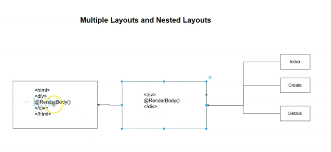
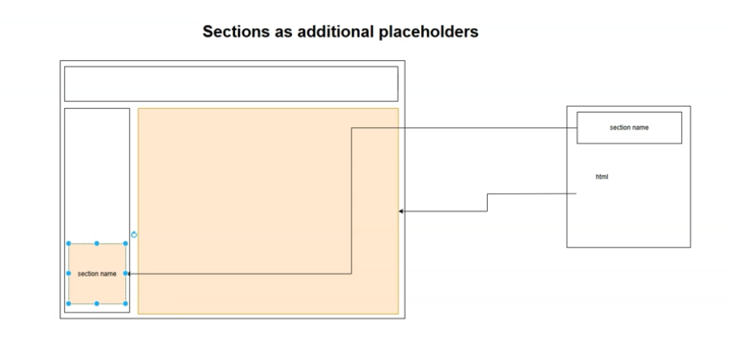

# Layout View Refactor (ASP.NET Core Razor) with Bootstrap

## Overview

This step removes duplicated HTML (head, body, Bootstrap link, container, etc.) from individual Razor views by introducing a shared Layout file. Each page now supplies only its unique content; the Layout provides consistent structure, CSS/JS references, and a top navigation bar.

## Key Points

- Problem: Duplicated HTML and CSS links across Create/Details/Index/Error views (violates DRY).
- Solution: Move common markup to a shared Layout Razor view and render per-page content via RenderBody().
- Linking: Each Razor view sets its Layout property to use the shared layout.
- Discovery: Layout lookup searches:

1) Same folder as the view, then
2) Views/Shared
- Navbar: Added a Bootstrap navbar to the Layout; included Bootstrap JS to enable dropdowns.
- Cleanup: Removed hardcoded active class on nav items and unnecessary dropdown/search sections.


## Create a Layout View

1) Create the file Views/Shared/_Layout.cshtml (you can start by duplicating existing markup and removing per-page content).
2) Keep only the common elements:

- HTML skeleton (html/head/body)
- Bootstrap CSS link
- Navbar (shared across pages)
- Container wrappers
- Bootstrap JS at the end of body
- RenderBody() placeholder where individual view content should be injected

Example _Layout.cshtml:

```html
@* Views/Shared/_Layout.cshtml *@
<!doctype html>
<html lang="en">
<head>
  <meta charset="utf-8" />
  <meta name="viewport" content="width=device-width, initial-scale=1" />

  <!-- Bootstrap CSS -->
  <link rel="stylesheet"
        href="https://cdn.jsdelivr.net/npm/bootstrap@5.3.0/dist/css/bootstrap.min.css" />

  <title>Departments App</title>
</head>
<body>

  <!-- Navbar -->
  <nav class="navbar navbar-expand-lg navbar-light bg-light mb-3">
    <div class="container-fluid">
      <a class="navbar-brand" href="/">Departments</a>

      <button class="navbar-toggler" type="button" data-bs-toggle="collapse"
              data-bs-target="#mainNavbar" aria-controls="mainNavbar"
              aria-expanded="false" aria-label="Toggle navigation">
        <span class="navbar-toggler-icon"></span>
      </button>

      <div class="collapse navbar-collapse" id="mainNavbar">
        <ul class="navbar-nav me-auto mb-2 mb-lg-0">
          <li class="nav-item">
            <a class="nav-link" href="/">Home</a>
          </li>
          <li class="nav-item">
            <a class="nav-link" href="/departments">Departments</a>
          </li>
        </ul>
      </div>
    </div>
  </nav>

  <!-- Page Content -->
  <div class="container my-4">
    @RenderBody()
  </div>

  <!-- Bootstrap JS (for navbar dropdowns, etc.) -->
  <script src="https://cdn.jsdelivr.net/npm/bootstrap@5.3.0/dist/js/bootstrap.bundle.min.js"></script>
</body>
</html>
```

Notes:

- Use @RenderBody() where each page’s unique content should appear.
- Avoid “active” classes hardcoded on nav links unless you implement logic to set them dynamically.


## Update Individual Views

Remove duplicated HTML/head/body/container/bootstrap from each page; keep only the unique content and set the Layout property.

Example: Views/Departments/Create.cshtml

```html
@model YourNamespace.Models.Department
@{
    Layout = "_Layout";
}

<h3>Add Department</h3>

<form method="post" action="/department/create">
  <div class="row mb-3">
    <div class="col-2 col-form-label">
      <label for="Name" class="form-label">Name</label>
    </div>
    <div class="col-6">
      <input id="Name" name="Name" type="text" value="@Model?.Name" class="form-control" />
    </div>
  </div>

  <div class="row mb-3">
    <div class="col-2 col-form-label">
      <label for="Description" class="form-label">Description</label>
    </div>
    <div class="col-6">
      <input id="Description" name="Description" type="text" value="@Model?.Description" class="form-control" />
    </div>
  </div>

  <div class="row mb-3">
    <div class="col-2"></div>
    <div class="col-6">
      <button type="submit" class="btn btn-primary">Save</button>
    </div>
  </div>
</form>
```

Example: Views/Departments/Details.cshtml

```html
@model YourNamespace.Models.Department
@{
    Layout = "_Layout";
}

<h3>Department Details</h3>

<form method="post" action="/department/edit">
  <input type="hidden" name="Id" value="@Model.Id" />

  <div class="row mb-3">
    <div class="col-2 col-form-label">
      <label for="Name" class="form-label">Name</label>
    </div>
    <div class="col-6">
      <input id="Name" name="Name" type="text" value="@Model.Name" class="form-control" />
    </div>
  </div>

  <div class="row mb-3">
    <div class="col-2 col-form-label">
      <label for="Description" class="form-label">Description</label>
    </div>
    <div class="col-6">
      <input id="Description" name="Description" type="text" value="@Model.Description" class="form-control" />
    </div>
  </div>

  <div class="row mb-3">
    <div class="col-2"></div>
    <div class="col-6">
      <button type="submit" class="btn btn-primary">Save</button>
    </div>
  </div>
</form>

<form method="post" action="/department/delete" class="mt-2">
  <input type="hidden" name="Id" value="@Model.Id" />
  <button type="submit" class="btn btn-danger">Delete</button>
</form>
```

Example: Views/Departments/Index.cshtml

```html
@model IEnumerable<YourNamespace.Models.Department>
@{
    Layout = "_Layout";
}

<h3>Departments</h3>

<div class="mb-3">
  <a href="/department/create" class="btn btn-primary">Add</a>
</div>

<table class="table table-striped">
  <thead>
    <tr>
      <th>Name</th>
      <th>Description</th>
      <th></th>
    </tr>
  </thead>
  <tbody>
    @foreach (var department in Model)
    {
      <tr>
        <td>@department.Name</td>
        <td>@department.Description</td>
        <td>
          <a href="/department/details/@department.Id" class="btn btn-primary">Edit</a>
        </td>
      </tr>
    }
  </tbody>
</table>
```

Example: Views/Home/Index.cshtml

```html
@{
    Layout = "_Layout";
}

<h3>Home</h3>
<p>Welcome to the Departments app.</p>
```

Example: Views/Shared/Error.cshtml

```html
@{
    Layout = "_Layout";
}

<h3>Error</h3>
<p>Something went wrong.</p>
```


## How Layout Discovery Works

- If Layout = "_Layout"; is specified without a path:
    - ASP.NET Core first looks in the same folder as the view.
    - If not found, it looks in Views/Shared.
- Placing _Layout.cshtml in Views/Shared allows reuse across the entire app.


## Common Pitfalls and Fixes

- Navbar dropdown doesn’t work:
    - Cause: Bootstrap JS not included.
    - Fix: Add the Bootstrap bundle script at the end of the body in _Layout.cshtml.
- Active nav item looks wrong:
    - Cause: Hardcoded class="active".
    - Fix: Remove hardcoded active; implement dynamic active state later if needed.
- Per-view duplication persists:
    - Ensure each view removes its own html/head/body/container/links and only sets Layout = "_Layout"; with unique content.


## Result

- All CRUD Razor views now share a consistent layout and styling via Views/Shared/_Layout.cshtml.
- Duplicated HTML/CSS/JS is centralized.
- A Bootstrap navbar appears across all pages, with working dropdowns.
- Each view contains only its unique content, injected where @RenderBody() is placed.

# Multiple and Nested Layouts in ASP.NET Core Razor

## Overview

This section shows how to use multiple layout files and set up nested layouts in ASP.NET Core Razor to avoid duplication and apply scoped visual structures. It explains layout discovery, creating a department-specific layout, and using an inner layout that itself uses the shared layout.

## Key Points

- Layout discovery order:
    - The view’s folder first (e.g., Views/Departments).
    - Then Views/Shared.
- Multiple layouts:
    - Place a layout in a specific area folder (e.g., Views/Departments/_Layout.cshtml) to scope styling for those views.
    - Views that set Layout = "_Layout" will resolve to the nearest layout by discovery order.
- Nested layouts:
    - An “inner” layout can itself use an “outer” (shared) layout by setting Layout with a full path.
    - Always use a full path to avoid circular references when nesting.
- RenderBody placement:
    - Each layout uses @RenderBody() to define where its child content will be injected.
- Common pitfall:
    - Circular reference occurs if an inner layout references itself due to discovery order; fix by using a full path to the outer layout.


## Department-Specific Layout (Multiple Layouts)

Place a specialized layout in the Departments folder to override the shared one for all department views.

Example: Views/Departments/_Layout.cshtml

```html
@* Department-only layout (no navbar, custom heading) *@
<!doctype html>
<html lang="en">
<head>
  <meta charset="utf-8" />
  <meta name="viewport" content="width=device-width, initial-scale=1" />
  <link rel="stylesheet"
        href="https://cdn.jsdelivr.net/npm/bootstrap@5.3.0/dist/css/bootstrap.min.css" />
  <title>Department Management</title>
</head>
<body>
  <div class="container my-4">
    <h1 class="h3 mb-4">Department Management</h1>
    @RenderBody()
  </div>
  <script src="https://cdn.jsdelivr.net/npm/bootstrap@5.3.0/dist/js/bootstrap.bundle.min.js"></script>
</body>
</html>
```

Any view under Views/Departments using:

```html
@{
    Layout = "_Layout"; // resolves to Views/Departments/_Layout.cshtml first
}
```

will now use this department-specific layout.

Views outside Departments (e.g., Views/Home/Index.cshtml) will fall back to Views/Shared/_Layout.cshtml.

## Nested Layouts (Inner + Outer)

Create an inner layout in Departments that itself uses the shared layout for global chrome (navbar, etc.) and adds department-specific elements.

Example outer layout: Views/Shared/_Layout.cshtml

```html
@* Shared layout with navbar *@
<!doctype html>
<html lang="en">
<head>
  <meta charset="utf-8" />
  <meta name="viewport" content="width=device-width, initial-scale=1" />
  <link rel="stylesheet"
        href="https://cdn.jsdelivr.net/npm/bootstrap@5.3.0/dist/css/bootstrap.min.css" />
  <title>App</title>
</head>
<body>
  <nav class="navbar navbar-expand-lg navbar-light bg-light mb-3">
    <div class="container-fluid">
      <a class="navbar-brand" href="/">Departments</a>
      <div class="collapse navbar-collapse">
        <ul class="navbar-nav me-auto">
          <li class="nav-item"><a class="nav-link" href="/">Home</a></li>
          <li class="nav-item"><a class="nav-link" href="/departments">Departments</a></li>
        </ul>
      </div>
    </div>
  </nav>

  <div class="container my-4">
    @RenderBody()
  </div>

  <script src="https://cdn.jsdelivr.net/npm/bootstrap@5.3.0/dist/js/bootstrap.bundle.min.js"></script>
</body>
</html>
```

Example inner layout: Views/Departments/_InnerLayout.cshtml

```html
@{
    // Use a full path to avoid circular references with discovery order
    Layout = "/Views/Shared/_Layout.cshtml";
}

<div class="border rounded p-3">
  <h1 class="h4 mb-3">Department Management Console</h1>
  <hr class="mb-4" />
  @RenderBody()
</div>
```

Any department view can now target the inner layout:

```html
@{
    Layout = "_InnerLayout"; // resolves in Views/Departments first
}
```

This produces:

- Shared navbar/header from the outer layout.
- Department-specific heading/frame from the inner layout.
- The view’s unique content injected where @RenderBody() appears in the inner layout.


## Applying to Department Views

Example: Views/Departments/Create.cshtml

```html
@model YourNamespace.Models.Department
@{
    Layout = "_InnerLayout";
}

<h3 class="mb-3">Add Department</h3>

<form method="post" action="/department/create">
  <div class="row mb-3">
    <div class="col-2 col-form-label">
      <label for="Name" class="form-label">Name</label>
    </div>
    <div class="col-6">
      <input id="Name" name="Name" type="text" value="@Model?.Name" class="form-control" />
    </div>
  </div>

  <div class="row mb-3">
    <div class="col-2 col-form-label">
      <label for="Description" class="form-label">Description</label>
    </div>
    <div class="col-6">
      <input id="Description" name="Description" type="text" value="@Model?.Description" class="form-control" />
    </div>
  </div>

  <div class="row mb-3">
    <div class="col-2"></div>
    <div class="col-6">
      <button type="submit" class="btn btn-primary">Save</button>
    </div>
  </div>
</form>
```

Example: Views/Home/Index.cshtml (still uses shared layout)

```html
@{
    Layout = "_Layout"; // resolves in Views/Home -> not found -> Views/Shared/_Layout.cshtml
}

<h3>Home</h3>
<p>Welcome to the Departments app.</p>
```


## Avoid Circular References

If an inner layout sets:

```html
@{
    Layout = "_Layout";
}
```

and there’s also a _Layout in the same folder, discovery resolves to itself, causing a circular reference at runtime. Always use a full path when the layout you want is outside the current folder:

```c#
@{
    Layout = "/Views/Shared/_Layout.cshtml";
}
```


## How Rendering Composes

- Outer layout renders its HTML and places the inner layout’s content at its @RenderBody().
- Inner layout renders its own HTML and places the view’s content at its @RenderBody().
- Final HTML is the outer layout wrapping the inner layout wrapping the view, in that order.


## Result
- 
- Different sections of the app can have specialized layouts while sharing global chrome.
- Nested layouts let you compose consistent structure without duplication.
- Discovery and full paths give precise control and prevent layout loops.

# ViewStart in ASP.NET Core Razor (Centralizing Layout Configuration)

## Overview

ViewStart (_ViewStart.cshtml) is a special Razor file that runs before any individual view renders. It’s ideal for setting cross-cutting view configuration (like Layout) once, eliminating duplicated code across views. You can also scope ViewStart per folder and understand the execution order when multiple ViewStart files exist.

## Key Points

- _ViewStart.cshtml runs before each view and is applied by convention.
- Put a root-level _ViewStart.cshtml under Views to set a default Layout for the entire app.
- Remove per-view Layout = "_Layout"; blocks — they’re no longer needed.
- You can add additional _ViewStart.cshtml inside subfolders (e.g., Views/Departments) for scoped behavior.
- Execution order:
    - Root Views/_ViewStart.cshtml runs first.
    - Then folder-level _ViewStart.cshtml (e.g., Views/Home/_ViewStart.cshtml).
- Layout resolution still follows layout discovery rules unless you use full paths.


## Folder Structure

- Views/_ViewStart.cshtml — global defaults (recommended place to set Layout)
- Views/Shared/_Layout.cshtml — shared layout (global chrome: navbar, CSS/JS)
- Views/{Area}/_ViewStart.cshtml — optional, per-folder overrides or additions
- Views/{Controller}/{View}.cshtml — individual views contain only unique content


## Root ViewStart (Global) Example

File: Views/_ViewStart.cshtml

```html
@{
    // Set a global layout for all views
    Layout = "/Views/Shared/_Layout.cshtml";
}
```

Notes:

- Using a full path avoids ambiguity and ensures the shared layout is used globally.
- After adding this, remove Layout = "_Layout"; from individual views.


## Shared Layout Example

File: Views/Shared/_Layout.cshtml

```html
<!doctype html>
<html lang="en">
<head>
  <meta charset="utf-8" />
  <meta name="viewport" content="width=device-width, initial-scale=1" />
  <link rel="stylesheet"
        href="https://cdn.jsdelivr.net/npm/bootstrap@5.3.0/dist/css/bootstrap.min.css" />
  <title>Departments App</title>
</head>
<body>
  <nav class="navbar navbar-expand-lg navbar-light bg-light mb-3">
    <div class="container-fluid">
      <a class="navbar-brand" href="/">Departments</a>
      <div class="collapse navbar-collapse">
        <ul class="navbar-nav me-auto">
          <li class="nav-item"><a class="nav-link" href="/">Home</a></li>
          <li class="nav-item"><a class="nav-link" href="/departments">Departments</a></li>
        </ul>
      </div>
    </div>
  </nav>

  <div class="container my-4">
    @RenderBody()
  </div>

  <script src="https://cdn.jsdelivr.net/npm/bootstrap@5.3.0/dist/js/bootstrap.bundle.min.js"></script>
</body>
</html>
```


## Per-Folder ViewStart (Optional)

If you need folder-specific behavior (e.g., a different layout or extra pre-render logic), add another _ViewStart in that folder.

File: Views/Departments/_ViewStart.cshtml

```html
@{
    // Use the inner (department-specific) layout for all department views
    Layout = "/Views/Departments/_InnerLayout.cshtml";
}
```

File: Views/Departments/_InnerLayout.cshtml

```html
@{
    // Compose with the global shared layout
    Layout = "/Views/Shared/_Layout.cshtml";
}

<div class="border rounded p-3">
  <h1 class="h4 mb-3">Department Management Console</h1>
  <hr class="mb-4" />
  @RenderBody()
</div>
```

Result:

- Views under Views/Departments use the inner layout, which itself composes the shared layout (nested layouts).
- Other views use the global layout set by the root _ViewStart.cshtml.


## Updating Individual Views (Remove Duplication)

Before (each view repeated Layout assignment):

```html
@{
    Layout = "_Layout";
}
<h3>Departments</h3>
```

After (no Layout block; ViewStart handles it):

```html
<h3>Departments</h3>
```


## Demonstrating Execution Order (Optional Debug)

- Root runs first, then folder:
    - Views/_ViewStart.cshtml executes
    - Views/Home/_ViewStart.cshtml executes
    - Finally, Views/Home/Index.cshtml renders

Debug trick (temporary):

```razor
<!-- In Views/_ViewStart.cshtml -->
<p>Root ViewStart: @DateTime.Now.ToString("yyyyMMddHHmmssffff")</p>

<!-- In Views/Home/_ViewStart.cshtml -->
<p>Home ViewStart: @DateTime.Now.ToString("yyyyMMddHHmmssffff")</p>
```

You’ll see the root timestamp first, then the folder timestamp.

## Common Pitfalls and Fixes

- Still seeing duplicated Layout assignment:
    - Ensure you’ve removed Layout = "..."; from all views after introducing _ViewStart.cshtml.
- Unexpected layout used in a subfolder:
    - Check for a folder-level _ViewStart.cshtml overriding the Layout.
    - Use full paths (e.g., /Views/Shared/_Layout.cshtml) to avoid discovery surprises.
- Circular layout references:
    - In nested layouts, always set Layout to the explicit outer path to avoid the layout resolving to itself.


## Result

- No more duplicated Layout blocks in individual views.
- Centralized layout configuration via Views/_ViewStart.cshtml.
- Optional folder-level overrides and nested layouts supported cleanly.
- Consistent, maintainable Razor view composition across the app.

# Why is setting a layout in _ViewStart.cshtml more efficient than individual views

Setting a layout in _ViewStart.cshtml is more efficient because it centralizes a cross-cutting configuration once, instead of repeating it in every view.

Key reasons:

- Single source of truth (DRY): You avoid duplicating Layout = "..."; in every .cshtml file, which reduces boilerplate and the chance of inconsistencies or missed updates across views.
- Easier maintenance: Changing the layout for the whole app (or a folder) is a one-line change in _ViewStart.cshtml instead of editing many views.
- Predictable execution order: _ViewStart.cshtml runs before each view, guaranteeing the layout is applied consistently unless explicitly overridden, which makes behavior uniform and debuggable.
- Scoped overrides without duplication: You can place an additional _ViewStart.cshtml in a subfolder (e.g., Views/Departments) to switch layouts for that section, keeping configuration local to that area without touching individual views.
- Works well with nested/multiple layouts: You can set a global shared layout at the root _ViewStart and a section-specific inner layout in a folder-level _ViewStart, composing them cleanly while avoiding circular references by using full paths where needed.

Practical example:

- Global default (Views/_ViewStart.cshtml):

```html
@{
    Layout = "/Views/Shared/_Layout.cshtml";
}
```

- Folder-specific override (Views/Departments/_ViewStart.cshtml):

```html
@{
    Layout = "/Views/Departments/_InnerLayout.cshtml";
}
```

With this setup, individual views only contain their unique content, improving readability and reducing errors.

# Centralizing Razor Directives with _ViewImports.cshtml

## Overview

_ViewImports.cshtml is a special Razor file used to centralize shared Razor directives (like using statements, tag helpers, and namespaces) so individual views don’t need to repeat them. This reduces duplication, prevents missing-usings compile errors, and keeps views cleaner.

## Key Points

- Purpose: Consolidate common Razor directives (e.g., @using, @addTagHelper, @namespace) used across many views.
- Location: Place _ViewImports.cshtml under Views (root). You can also add folder-level _ViewImports for scoped overrides/extensions.
- Discovery: Directives in a folder’s _ViewImports.cshtml apply to all views in that folder and its subfolders.
- Benefit: No need to add @using ... in every .cshtml file; code compiles and IntelliSense works consistently.


## Typical Contents of _ViewImports.cshtml

- Namespaces for your models/view models
- Tag helper registrations (if using MVC Tag Helpers)
- Optional default @namespace for generated classes

Example (Views/_ViewImports.cshtml):

```html
@using YourNamespace.Models
@addTagHelper *, Microsoft.AspNetCore.Mvc.TagHelpers
```

Optional:

```html
@namespace YourNamespace.Views
```


## Steps to Implement

1. Create Views/_ViewImports.cshtml (root-level).
2. Move common directives from individual views into _ViewImports.cshtml:
    - Example: remove @using YourNamespace.Models from Create.cshtml, Details.cshtml, Index.cshtml, etc.
3. Build the project to confirm:
    - IntelliSense remains active for types like Department.
    - No compile errors due to missing usings.

## Before vs After

Before (per-view duplication):

```html
@using YourNamespace.Models
@model Department

<h3>Add Department</h3>
...
```

After (centralized):

```html
@model Department

<h3>Add Department</h3>
...
```

With this in Views/_ViewImports.cshtml:

```html
@using YourNamespace.Models
```


## Folder-Level Overrides (Optional)

You can add another _ViewImports.cshtml inside a subfolder (e.g., Views/Departments) to:

- Add extra @using specific to that area
- Register additional tag helpers
- These are additive to the root _ViewImports.cshtml

Example (Views/Departments/_ViewImports.cshtml):

```html
@using YourNamespace.Areas.Departments.ViewModels
```


## Validation

- Remove per-view @using directives.
- Build: should succeed without errors.
- Open views: color-coding and IntelliSense still work for names like Department.


## Result

- Cleaner, DRY Razor views.
- Centralized directive management in Views/_ViewImports.cshtml.
- Easier maintenance and fewer compile-time surprises.


# Personalizing Layouts from Views with ViewData/ViewBag (ASP.NET Core Razor)

## Overview

You can pass per-page data from individual Razor views to the shared Layout using ViewData or ViewBag. A common use case is setting the HTML <title> dynamically so each page shows a personalized title while sharing the same layout.

## Key Points

- Layouts typically contain a single, shared <title>. Hardcoding it makes all pages show the same title.
- Use ViewData["Title"] or ViewBag.Title in individual views to pass a per-view title to the layout.
- In the Layout, read that value in the <head><title> element.
- ViewBag is a dynamic wrapper over ViewData; use either one. Strongly-typed models aren’t ideal for layout-level, cross-cutting metadata like page titles—this is a good use case for ViewData/ViewBag.


## Layout Example (Views/Shared/_Layout.cshtml)

```html
<!doctype html>
<html lang="en">
<head>
  <meta charset="utf-8" />
  <meta name="viewport" content="width=device-width, initial-scale=1" />
  <link rel="stylesheet"
        href="https://cdn.jsdelivr.net/npm/bootstrap@5.3.0/dist/css/bootstrap.min.css" />

  <title>@(ViewBag.Title ?? "App")</title>
</head>
<body>
  <nav class="navbar navbar-expand-lg navbar-light bg-light mb-3">
    <div class="container-fluid">
      <a class="navbar-brand" href="/">Departments</a>
      <div class="collapse navbar-collapse">
        <ul class="navbar-nav me-auto">
          <li class="nav-item"><a class="nav-link" href="/">Home</a></li>
          <li class="nav-item"><a class="nav-link" href="/departments">Departments</a></li>
        </ul>
      </div>
    </div>
  </nav>

  <div class="container my-4">
    @RenderBody()
  </div>

  <script src="https://cdn.jsdelivr.net/npm/bootstrap@5.3.0/dist/js/bootstrap.bundle.min.js"></script>
</body>
</html>
```

Notes:

- Fallback to a default title ("App") when no per-view value is provided.


## Individual Views: Set the Title

- Home (Views/Home/Index.cshtml)

```html
@{
    ViewBag.Title = "Home";
}

<h3>Home</h3>
<p>Welcome to the Departments app.</p>
```

- Departments Index (Views/Departments/Index.cshtml)

```html
@{
    ViewBag.Title = "Departments";
}

<h3>Departments</h3>

<div class="mb-3">
  <a href="/department/create" class="btn btn-primary">Add</a>
</div>

<table class="table table-striped">
  <thead>
    <tr>
      <th>Name</th>
      <th>Description</th>
      <th></th>
    </tr>
  </thead>
  <tbody>
    @foreach (var department in Model)
    {
      <tr>
        <td>@department.Name</td>
        <td>@department.Description</td>
        <td>
          <a href="/department/details/@department.Id" class="btn btn-primary">Edit</a>
        </td>
      </tr>
    }
  </tbody>
</table>
```

- Departments Details/Edit (Views/Departments/Details.cshtml)

```html
@model YourNamespace.Models.Department
@{
    ViewBag.Title = "Department Details";
}

<h3>Department Details</h3>
<form method="post" action="/department/edit">
  <input type="hidden" name="Id" value="@Model.Id" />
  <!-- fields... -->
  <button type="submit" class="btn btn-primary">Save</button>
</form>

<form method="post" action="/department/delete" class="mt-2">
  <input type="hidden" name="Id" value="@Model.Id" />
  <button type="submit" class="btn btn-danger">Delete</button>
</form>
```

- Departments Create (Views/Departments/Create.cshtml)

```html
@model YourNamespace.Models.Department
@{
    ViewBag.Title = "Create New Department";
}

<h3>Add Department</h3>
<form method="post" action="/department/create">
  <!-- fields... -->
  <button type="submit" class="btn btn-primary">Save</button>
</form>
```


## Using ViewData Instead of ViewBag (Equivalent)

- In views:

```html
@{
    ViewData["Title"] = "Home";
}
```

- In layout:

```html
<title>@(ViewData["Title"] ?? "App")</title>
```


## Result

- The shared layout remains generic and reusable.
- Each view personalizes the page title via ViewBag/ViewData.
- No duplication in layout; clean, per-view metadata configuration.


## Tips

- Keep ViewBag/ViewData usage minimal and focused on presentation metadata (e.g., Title, meta tags).
- Prefer strongly-typed models for domain data binding within views.

# Razor Layout Sections: Additional Placeholders Beyond RenderBody

## Overview

Sections let individual Razor views inject HTML into specific “named placeholders” in a shared layout, in addition to the default RenderBody content area. This enables consistent, reusable layouts (e.g., title bars, toolbars) while allowing each view to contribute context-specific HTML to those areas.

- RenderBody: the default, single placeholder for a view’s main content.
- Sections (RenderSection): additional, named placeholders that views can optionally fill.
- 


## Key Points

- Use @RenderSection("SectionName", required: true|false) in the layout to define extra placeholders.
- In a view, define content for a section with:
    - @section SectionName { ... HTML ... }
- By default, sections are required unless specified as optional with required: false.
- Section content can be declared anywhere within the view file; it will render in the layout’s section location.
- You can define multiple sections in a layout to structure page chrome (e.g., title area, footer notes, toolbars).


## Layout Example: Adding a Title Section (and Optional Custom Section)

File: Views/Shared/_Layout.cshtml

```html
<!doctype html>
<html lang="en">
<head>
  <meta charset="utf-8" />
  <meta name="viewport" content="width=device-width, initial-scale=1" />
  <link rel="stylesheet"
        href="https://cdn.jsdelivr.net/npm/bootstrap@5.3.0/dist/css/bootstrap.min.css" />
  <title>@(ViewBag.Title ?? "App")</title>
</head>
<body>
  <nav class="navbar navbar-expand-lg navbar-light bg-light mb-3">
    <div class="container-fluid">
      <a class="navbar-brand" href="/">Departments</a>
      <div class="collapse navbar-collapse">
        <ul class="navbar-nav me-auto">
          <li class="nav-item"><a class="nav-link" href="/">Home</a></li>
          <li class="nav-item"><a class="nav-link" href="/departments">Departments</a></li>
        </ul>
      </div>
    </div>
  </nav>

  <div class="container my-4">
    <!-- Title section (optional) -->
    @RenderSection("TitleSection", required: false)
    <br />

    <!-- Main content -->
    @RenderBody()

    <!-- Another optional section (example) -->
    @RenderSection("ExtraSection", required: false)
  </div>

  <script src="https://cdn.jsdelivr.net/npm/bootstrap@5.3.0/dist/js/bootstrap.bundle.min.js"></script>
</body>
</html>
```

Notes:

- TitleSection is optional to avoid breaking views that don’t define it.
- ExtraSection demonstrates multiple sections.


## Views: Supplying Section Content

- Departments Index (Views/Departments/Index.cshtml)

```html
@{
    ViewBag.Title = "Departments";
}

@section TitleSection {
  <h3>Departments</h3>
}

<div class="mb-3">
  <a href="/department/create" class="btn btn-primary">Add</a>
</div>

<table class="table table-striped">
  <thead>
    <tr>
      <th>Name</th>
      <th>Description</th>
      <th></th>
    </tr>
  </thead>
  <tbody>
    @foreach (var department in Model)
    {
      <tr>
        <td>@department.Name</td>
        <td>@department.Description</td>
        <td>
          <a href="/department/details/@department.Id" class="btn btn-primary">Edit</a>
        </td>
      </tr>
    }
  </tbody>
</table>

@section ExtraSection {
  <div class="text-muted small mt-3">Listing all departments.</div>
}
```

- Create (Views/Departments/Create.cshtml)

```html
@model YourNamespace.Models.Department
@{
    ViewBag.Title = "Create New Department";
}

@section TitleSection {
  <h3>Create New Department</h3>
}

<form method="post" action="/department/create">
  <div class="row mb-3">
    <div class="col-2 col-form-label">
      <label for="Name" class="form-label">Name</label>
    </div>
    <div class="col-6">
      <input id="Name" name="Name" type="text" value="@Model?.Name" class="form-control" />
    </div>
  </div>

  <div class="row mb-3">
    <div class="col-2 col-form-label">
      <label for="Description" class="form-label">Description</label>
    </div>
    <div class="col-6">
      <input id="Description" name="Description" type="text" value="@Model?.Description" class="form-control" />
    </div>
  </div>

  <div class="row mb-3">
    <div class="col-2"></div>
    <div class="col-6">
      <button type="submit" class="btn btn-primary">Save</button>
    </div>
  </div>
</form>
```

- Details/Edit (Views/Departments/Details.cshtml)

```html
@model YourNamespace.Models.Department
@{
    ViewBag.Title = "Department Details";
}

@section TitleSection {
  <h3>Department Details</h3>
}

<form method="post" action="/department/edit">
  <input type="hidden" name="Id" value="@Model.Id" />
  <!-- fields... -->
  <button type="submit" class="btn btn-primary">Save</button>
</form>

<form method="post" action="/department/delete" class="mt-2">
  <input type="hidden" name="Id" value="@Model.Id" />
  <button type="submit" class="btn btn-danger">Delete</button>
</form>
```

- Home (Views/Home/Index.cshtml) without a section (still works because TitleSection is optional)

```html
@{
    ViewBag.Title = "Home";
}

<h3>Home</h3>
<p>Welcome to the Departments app.</p>
```


## Behavior and Rules

- If a layout defines a required section and a view using that layout does not provide it, rendering fails with an error naming the missing section.
- Setting required: false makes a section optional; the layout renders even if the view doesn’t define that section.
- Section blocks can appear anywhere in the view file; they’ll render where the layout places @RenderSection("Name", ...).
- You can define as many sections as needed to compose complex layouts (e.g., top title area, right sidebar tools, page-footer notes).


## Common Pitfalls

- Missing required section: Either mark it optional (required: false) or add a matching @section block in all affected views.
- Name mismatch: Ensure @RenderSection("TitleSection", ...) matches @section TitleSection { ... } exactly (case-sensitive).
- Confusing section with ViewData: Use ViewData/ViewBag for simple scalar metadata (like <title>), and sections for injecting HTML blocks at specific locations.


## Result

- Consistent page structure with flexible, per-view content injection.
- Cleaner layouts with multiple named placeholders.
- Better maintainability by centralizing layout regions while empowering views to contribute targeted HTML.


