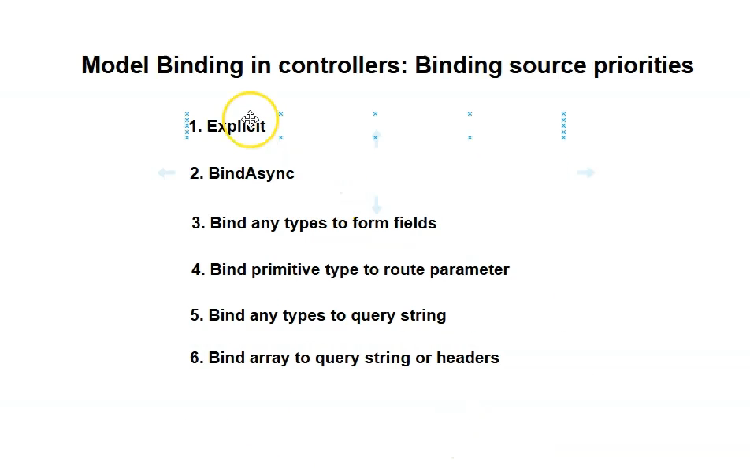

## Model Binding to Form Fields in MVC Controllers (ASP.NET Core)

### Overview

- **Model binding** in MVC controllers works much like in Minimal APIs, with an important addition: controllers can automatically bind data from HTML form fields.
- This is critical for building web apps with user-facing forms, not just APIs.

---

### How It Works

- In MVC controllers, action method parameters can be bound from:
  - **Route parameters** (e.g., `/departments/details/888` binds `id = 888`)
  - **Query strings**
  - **Form fields** (from `<form>` submissions using POST)
- By **default, Minimal APIs cannot bind from form fields**; this is a controller-only convenience.

---

### Example: Binding ID from Form Field

Suppose you have this action in your controller:

```c#

public IActionResult Details(int id)
{
// use id
}

```

You can submit an HTML form like this:
```html

<form method="post" action="/departments/details">
  <input name="id" value="900" />
  <input type="submit" />
</form>
```

This will result in a POST request with body:
```
id=900
```
If using Postman or curl, set Content-Type to `application/x-www-form-urlencoded` and a body like:
```
id=900
```
or as form-data for file uploads, etc.
- The `id` parameter will be properly populated with `900` in the action method.

---
- 
- 
- 
- 
- For uploading files, use encoding as multipart/form-data
### Types of Form Content

| Content-Type                       | Used For                      | Example                |
|------------------------------------|-------------------------------|------------------------|
| application/x-www-form-urlencoded  | Simple text fields (login, registration) | `id=900&name=Frank`   |
| multipart/form-data                | File uploads/mixed fields     | Used automatically by browsers for forms with file inputs |

Both types are supported by default.

---

### Key Differences From Minimal APIs

| Capability                    | Minimal API      | MVC Controller         |
|-------------------------------|------------------|------------------------|
| Supports form field binding   | ❌               | ✅ (default)           |
| Used for HTML web forms       | ❌               | ✅                     |
| Used for APIs (JSON)          | ✅               | ✅                     |

---

### Special Notes

- Extra form fields in the request are ignored unless they match a parameter/property name.
- Model binding also works from route, query string, headers—MVC just adds convenient support for forms.

---

### Summary

- MVC controller actions can receive data directly from HTML forms.
- No special attribute or extra configuration is needed—model binding from form fields "just works."
- This enables interactive web applications with user forms, upload, registration, etc.

---

## Complex Types Model Binding in MVC Controllers (ASP.NET Core)

### Overview

- Unlike Minimal APIs, where complex types are bound **only from the HTTP body** by default, **MVC controllers can bind complex types from multiple sources.**
- By default, if you **do not specify any binding attributes** on a complex type parameter, ASP.NET Core MVC will try to bind data for it from:
  - **Form fields (`application/x-www-form-urlencoded` or `multipart/form-data`)**
  - **Query strings**
- This makes MVC controllers more flexible in handling complex types from common web scenarios like forms or query-based inputs.

---

### Example Scenario: Department Complex Type

Suppose you have a model class under a `Models` folder:

```c#
public class Department
{
public int Id { get; set; }
[Required]
public string Name { get; set; }

public string Description { get; set; }
}
```
- And a controller action like this:
```c#
public IActionResult Create(Department department)
{
return Json(department); // Serialize and send back as JSON for testing
}
```

- If **no binding source attributes** (`[FromBody]`, `[FromForm]`, `[FromQuery]`) are specified:
  - MVC tries to bind **form fields and query strings** to the properties of `Department`.
- You can send the data via either:
  - **Form Data** (in Postman, choose form-data in the body tab and add keys like `Id`, `Name`, `Description`)
  - **Query String** (e.g., `/departments/create?Id=10&Name=SoftwareDev&Description=DepartmentInfo`)
- The parameter model will be automatically populated from whichever source has matching keys.

---

### Binding Complex Types to HTTP Headers

- **Binding a complex type directly from HTTP headers is not supported.**
- For example, `[FromHeader] Department department` will **not work**, and all properties will be default values.
- Headers are generally used for simple scalar values, not complex objects.

---

### Binding Complex Types from HTTP Body

- In **MVC controllers**, binding a complex type from the HTTP request body **requires explicit use of the `[FromBody]` attribute.**
- Unlike Minimal APIs where body binding for complex types is the default behavior, MVC demands `[FromBody]` to avoid ambiguity.
- Example:

```c#
public IActionResult Create([FromBody] Department department)
{
return Json(department);
}
```

- You can send the department data as raw JSON in the body (set Content-Type to `application/json`), and the action will deserialize it correctly.

---

### Summary Table: Complex Type Binding Sources in MVC Controllers

| Binding Source         | Supported for Complex Types? | Attribute Usage in Controller       |
|------------------------|------------------------------|------------------------------------|
| **Form Fields**         | Yes                          | Default if no attribute specified  |
| **Query String**        | Yes                          | Default if no attribute specified  |
| **HTTP Body (JSON)**    | Yes                          | Must use `[FromBody]`               |
| **HTTP Headers**        | No                           | Does **not** bind complex types    |

---

### Key Takeaways

- MVC controllers support complex type binding from **form data and query strings by default**, making form-based web apps easier to build.
- To bind from the **request body**, MVC requires the `[FromBody]` attribute on the parameter.
- Complex type binding **does not work from headers**.
- In contrast, Minimal APIs only support complex type binding from bodies (without attribute), and form/query binding for simple types.
- Use the appropriate attribute depending on your data source and scenario.

---

## Binding Source Priorities in MVC Controllers (ASP.NET Core)

### Overview

- Model binding priorities in **MVC Controllers** are similar to Minimal APIs but with some key differences, especially regarding **form fields**.
- The binding source priority dictates which HTTP request data is used when multiple possible sources provide a matching value.
- 
- 
---

### Binding Source Priority Sequence in Controllers

| Priority | Binding Source                                   | Notes                                                           |
|----------|-------------------------------------------------|-----------------------------------------------------------------|
| 1        | **Explicit Binding Attributes** (`[FromQuery]`, `[FromBody]`, `[FromForm]`, `[FromHeader]`, etc.) | Always take absolute precedence if present                     |
| 2        | **Custom model binding** (`BindAsync` methods on types)       | Custom logic overriding default binding                         |
| 3        | **Form fields**                                   | Includes `application/x-www-form-urlencoded` and `multipart/form-data` body content; notably higher priority than route/query bindings |
| 4        | **Route parameters**                              | Bound from URL path segments                                    |
| 5        | **Query string parameters**                       | Bound from URL query string                                     |
| 6        | **Array binding**                                 | Arrays bound from repeated keys in form fields, query strings, or headers (headers require `[FromHeader]`) |
| *Note:*  | Binding complex types from body requires explicit `[FromBody]` attribute | Body binding is not automatic for complex types in controllers  |

---

### Demonstrations and Key Points

- **Form fields have higher priority** than route parameters and query strings.
  - Example: If the same parameter `id` is supplied in form fields (`POST` with form data), route parameters, and query strings, the **form field value is used**.
- **Route parameter binding** comes next if form fields are not provided.
- **Query string binding** is next if neither form fields nor route parameters provide the value.
- **Arrays can be bound** from:
  - Repeated query string keys (e.g., `?id=1&id=2`)
  - Form fields with multiple values for the same key
  - **Headers**, only if `[FromHeader]` attribute is specified.
- Without `[FromHeader]`, header binding does not work, even for simple types or arrays.
- Binding complex types **to the body requires `[FromBody]` attribute** — it's not inferred automatically.

---

### Practical Example

```c#
// Parameter with explicit source attribute (highest precedence)
public IActionResult Example([FromQuery] int id, [FromForm] string name, [FromHeader] string[] filters) { ... }

// Without [From...] attributes
public IActionResult Details(int id) { ... }
// Binds id from form fields > route parameters > query string

// Binding array from headers requires [FromHeader]
public IActionResult Filtered([FromHeader] int[] ids) { ... }

```


---

### Summary Table of Binding Priority

| Priority | Binding Source                | Notes                                         |
|----------|------------------------------|-----------------------------------------------|
| 1        | Attributes like `[FromBody]`, `[FromForm]`, `[FromQuery]`, `[FromHeader]` | Explicitly set source, always winning         |
| 2        | Custom binders (`BindAsync`) | Custom complex binding logic                    |
| 3        | Form Fields                  | Highest *implicit* priority in body form data  |
| 4        | Route Parameters            | URL path segments binding                        |
| 5        | Query String                | URL query parameter binding                      |
| 6        | Arrays (form, query, headers)| Array binding requires attributes for headers  |

---

### Key Takeaways

- When binding parameters in MVC controllers, **always remember that form fields have a higher implicit priority than routing or query strings**.
- You **must use explicit attributes** to bind complex types from body (`[FromBody]`) or headers (`[FromHeader]`).
- This differs slightly from Minimal APIs where body binding for complex types is inferred.
- Understanding these priorities helps troubleshoot why certain values are bound instead of others.
- Use this priority order as a troubleshooting checklist when model binding behaves unexpectedly.

---


