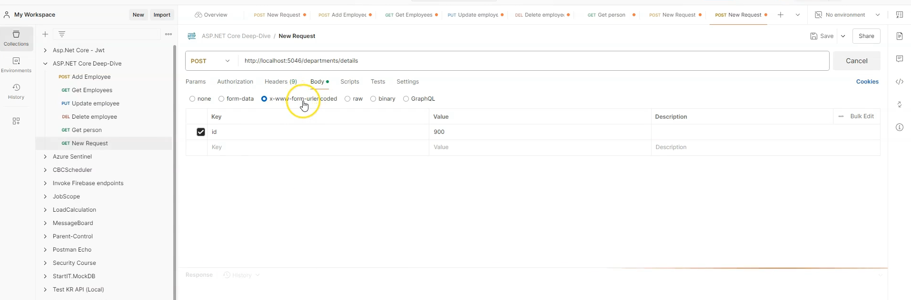
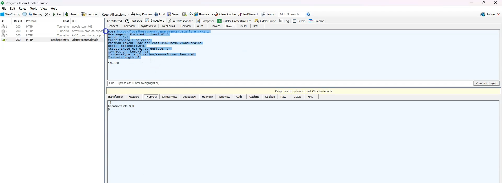
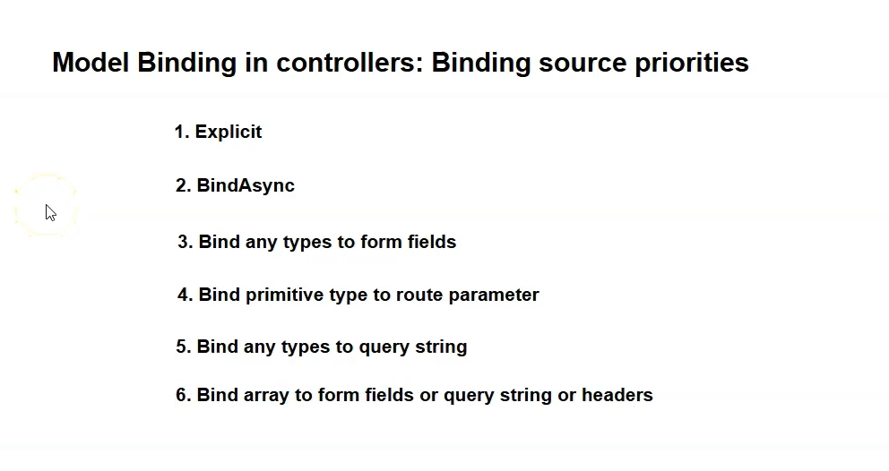
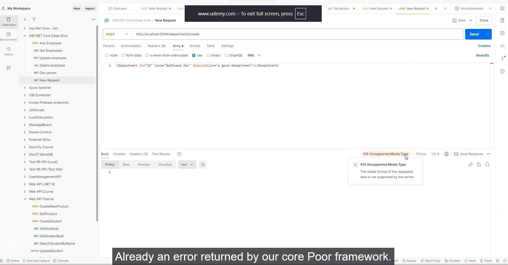
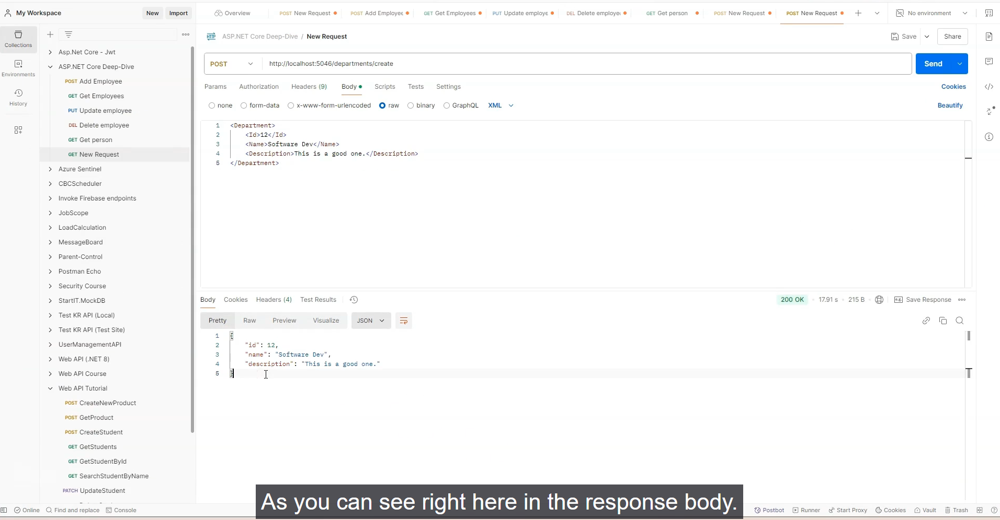

## Model Binding to Form Fields in MVC Controllers (ASP.NET Core)

### Overview

- **Model binding** in MVC controllers works much like in Minimal APIs, with an important addition: controllers can automatically bind data from HTML form fields.
- This is critical for building web apps with user-facing forms, not just APIs.

---

### How It Works

- In MVC controllers, action method parameters can be bound from:
  - **Route parameters** (e.g., `/departments/details/888` binds `id = 888`)
  - **Query strings**
  - **Form fields** (from `<form>` submissions using POST)
- By **default, Minimal APIs cannot bind from form fields**; this is a controller-only convenience.

---

### Example: Binding ID from Form Field

Suppose you have this action in your controller:

```c#

public IActionResult Details(int id)
{
// use id
}

```

You can submit an HTML form like this:
```html

<form method="post" action="/departments/details">
  <input name="id" value="900" />
  <input type="submit" />
</form>
```

This will result in a POST request with body:
```
id=900
```
If using Postman or curl, set Content-Type to `application/x-www-form-urlencoded` and a body like:
```
id=900
```
or as form-data for file uploads, etc.
- The `id` parameter will be properly populated with `900` in the action method.

---
- 
- 
- 
- 
- For uploading files, use encoding as multipart/form-data
### Types of Form Content

| Content-Type                       | Used For                      | Example                |
|------------------------------------|-------------------------------|------------------------|
| application/x-www-form-urlencoded  | Simple text fields (login, registration) | `id=900&name=Frank`   |
| multipart/form-data                | File uploads/mixed fields     | Used automatically by browsers for forms with file inputs |

Both types are supported by default.

---

### Key Differences From Minimal APIs

| Capability                    | Minimal API      | MVC Controller         |
|-------------------------------|------------------|------------------------|
| Supports form field binding   | ❌               | ✅ (default)           |
| Used for HTML web forms       | ❌               | ✅                     |
| Used for APIs (JSON)          | ✅               | ✅                     |

---

### Special Notes

- Extra form fields in the request are ignored unless they match a parameter/property name.
- Model binding also works from route, query string, headers—MVC just adds convenient support for forms.

---

### Summary

- MVC controller actions can receive data directly from HTML forms.
- No special attribute or extra configuration is needed—model binding from form fields "just works."
- This enables interactive web applications with user forms, upload, registration, etc.

---

## Complex Types Model Binding in MVC Controllers (ASP.NET Core)

### Overview

- Unlike Minimal APIs, where complex types are bound **only from the HTTP body** by default, **MVC controllers can bind complex types from multiple sources.**
- By default, if you **do not specify any binding attributes** on a complex type parameter, ASP.NET Core MVC will try to bind data for it from:
  - **Form fields (`application/x-www-form-urlencoded` or `multipart/form-data`)**
  - **Query strings**
- This makes MVC controllers more flexible in handling complex types from common web scenarios like forms or query-based inputs.

---

### Example Scenario: Department Complex Type

Suppose you have a model class under a `Models` folder:

```c#
public class Department
{
public int Id { get; set; }
[Required]
public string Name { get; set; }

public string Description { get; set; }
}
```
- And a controller action like this:
```c#
public IActionResult Create(Department department)
{
return Json(department); // Serialize and send back as JSON for testing
}
```

- If **no binding source attributes** (`[FromBody]`, `[FromForm]`, `[FromQuery]`) are specified:
  - MVC tries to bind **form fields and query strings** to the properties of `Department`.
- You can send the data via either:
  - **Form Data** (in Postman, choose form-data in the body tab and add keys like `Id`, `Name`, `Description`)
  - **Query String** (e.g., `/departments/create?Id=10&Name=SoftwareDev&Description=DepartmentInfo`)
- The parameter model will be automatically populated from whichever source has matching keys.

---

### Binding Complex Types to HTTP Headers

- **Binding a complex type directly from HTTP headers is not supported.**
- For example, `[FromHeader] Department department` will **not work**, and all properties will be default values.
- Headers are generally used for simple scalar values, not complex objects.

---

### Binding Complex Types from HTTP Body

- In **MVC controllers**, binding a complex type from the HTTP request body **requires explicit use of the `[FromBody]` attribute.**
- Unlike Minimal APIs where body binding for complex types is the default behavior, MVC demands `[FromBody]` to avoid ambiguity.
- Example:

```c#
public IActionResult Create([FromBody] Department department)
{
return Json(department);
}
```

- You can send the department data as raw JSON in the body (set Content-Type to `application/json`), and the action will deserialize it correctly.

---

### Summary Table: Complex Type Binding Sources in MVC Controllers

| Binding Source         | Supported for Complex Types? | Attribute Usage in Controller       |
|------------------------|------------------------------|------------------------------------|
| **Form Fields**         | Yes                          | Default if no attribute specified  |
| **Query String**        | Yes                          | Default if no attribute specified  |
| **HTTP Body (JSON)**    | Yes                          | Must use `[FromBody]`               |
| **HTTP Headers**        | No                           | Does **not** bind complex types    |

---

### Key Takeaways

- MVC controllers support complex type binding from **form data and query strings by default**, making form-based web apps easier to build.
- To bind from the **request body**, MVC requires the `[FromBody]` attribute on the parameter.
- Complex type binding **does not work from headers**.
- In contrast, Minimal APIs only support complex type binding from bodies (without attribute), and form/query binding for simple types.
- Use the appropriate attribute depending on your data source and scenario.

---

## Binding Source Priorities in MVC Controllers (ASP.NET Core)

### Overview

- Model binding priorities in **MVC Controllers** are similar to Minimal APIs but with some key differences, especially regarding **form fields**.
- The binding source priority dictates which HTTP request data is used when multiple possible sources provide a matching value.
- 
- 
---

### Binding Source Priority Sequence in Controllers

| Priority | Binding Source                                   | Notes                                                           |
|----------|-------------------------------------------------|-----------------------------------------------------------------|
| 1        | **Explicit Binding Attributes** (`[FromQuery]`, `[FromBody]`, `[FromForm]`, `[FromHeader]`, etc.) | Always take absolute precedence if present                     |
| 2        | **Custom model binding** (`BindAsync` methods on types)       | Custom logic overriding default binding                         |
| 3        | **Form fields**                                   | Includes `application/x-www-form-urlencoded` and `multipart/form-data` body content; notably higher priority than route/query bindings |
| 4        | **Route parameters**                              | Bound from URL path segments                                    |
| 5        | **Query string parameters**                       | Bound from URL query string                                     |
| 6        | **Array binding**                                 | Arrays bound from repeated keys in form fields, query strings, or headers (headers require `[FromHeader]`) |
| *Note:*  | Binding complex types from body requires explicit `[FromBody]` attribute | Body binding is not automatic for complex types in controllers  |

---

### Demonstrations and Key Points

- **Form fields have higher priority** than route parameters and query strings.
  - Example: If the same parameter `id` is supplied in form fields (`POST` with form data), route parameters, and query strings, the **form field value is used**.
- **Route parameter binding** comes next if form fields are not provided.
- **Query string binding** is next if neither form fields nor route parameters provide the value.
- **Arrays can be bound** from:
  - Repeated query string keys (e.g., `?id=1&id=2`)
  - Form fields with multiple values for the same key
  - **Headers**, only if `[FromHeader]` attribute is specified.
- Without `[FromHeader]`, header binding does not work, even for simple types or arrays.
- Binding complex types **to the body requires `[FromBody]` attribute** — it's not inferred automatically.

---

### Practical Example

```c#
// Parameter with explicit source attribute (highest precedence)
public IActionResult Example([FromQuery] int id, [FromForm] string name, [FromHeader] string[] filters) { ... }

// Without [From...] attributes
public IActionResult Details(int id) { ... }
// Binds id from form fields > route parameters > query string

// Binding array from headers requires [FromHeader]
public IActionResult Filtered([FromHeader] int[] ids) { ... }

```


---

### Summary Table of Binding Priority

| Priority | Binding Source                | Notes                                         |
|----------|------------------------------|-----------------------------------------------|
| 1        | Attributes like `[FromBody]`, `[FromForm]`, `[FromQuery]`, `[FromHeader]` | Explicitly set source, always winning         |
| 2        | Custom binders (`BindAsync`) | Custom complex binding logic                    |
| 3        | Form Fields                  | Highest *implicit* priority in body form data  |
| 4        | Route Parameters            | URL path segments binding                        |
| 5        | Query String                | URL query parameter binding                      |
| 6        | Arrays (form, query, headers)| Array binding requires attributes for headers  |

---

### Key Takeaways

- When binding parameters in MVC controllers, **always remember that form fields have a higher implicit priority than routing or query strings**.
- You **must use explicit attributes** to bind complex types from body (`[FromBody]`) or headers (`[FromHeader]`).
- This differs slightly from Minimal APIs where body binding for complex types is inferred.
- Understanding these priorities helps troubleshoot why certain values are bound instead of others.
- Use this priority order as a troubleshooting checklist when model binding behaves unexpectedly.

---

## Model Binding with Missing Binding Source in MVC Controllers (ASP.NET Core)

### Overview

- When an action method parameter (especially a complex type like `Department`) has no corresponding data in the incoming HTTP request, **ASP.NET Core MVC model binding still instantiates the parameter object.**
- All properties or fields of the complex type are initialized with their default values:
  - Reference types (e.g., strings) get `null`
  - Value types (e.g., `int`) get their default value (`0` for int, `false` for bool, etc.)
- This behavior applies even if **no data is present in query string, form data, headers, or body**.
- 
- 
---

### Behavior Differences: MVC Controllers vs Minimal APIs

| Aspect                  | MVC Controllers                               | Minimal APIs                                  |
|-------------------------|-----------------------------------------------|----------------------------------------------|
| Missing complex data     | Parameter instantiated with default property values, no error generated, no HTTP 400 returned | Model binding fails and automatically returns **HTTP 400 Bad Request** response |
| Missing primitive data   | Primitive parameters (e.g., int) receive default value (e.g., 0) with no error | Missing required primitive parameters cause HTTP 400 Bad Request automatically |

---

### Example Scenario: Complex Type Parameter Without Request Data

```c#
public IActionResult Create(Department department)
{
if (department == null)
{
department = new Department();
}
return Json(department);
}

```

- If the HTTP request contains no matching data for `department`, the parameter is **not null** but contains:
  - `department.Id == 0`
  - `department.Name == null`
  - `department.Description == null`
- No error or validation failure occurs at model binding stage.

---

### Example Scenario: Primitive Parameter With Missing Route/Query Data

```c#
[Route("department/{id?}")]
public IActionResult Details([Required] int id)
{
// Use id here
}

```


- If the `id` route segment or query string parameter is missing:
  - MVC assigns `id = 0` (default int value).
  - No automatic HTTP 400 error or validation failure occurs at the model binding stage.
  - To get automatic validation error responses for missing required data, additional validation attributes and model validation have to be explicitly performed.

---

### Summary: Takeaways

- **MVC controller model binding never sets a complex type parameter to null**. Instead, it always creates an instance and initializes its properties with default values when corresponding request data is missing.
- Primitive types receive their defaults automatically when missing from the request.
- This differs from Minimal APIs, where missing complex or primitive data leads to automatic **HTTP 400 Bad Request** responses at model binding.
- To enforce validation and error responses for missing required data in MVC, you need to use **model validation (e.g., `[Required]` attributes) and explicitly check validation state**.
- The behavior ensures endpoint methods can rely on non-null complex types but requires explicit validation handling to signal missing or invalid data.

---

### What to Expect Next

- Upcoming discussions on **model validation in MVC controllers** will show how to enforce validation rules and return errors when required data is missing or invalid.
- Until then, understanding this default model binding behavior helps troubleshoot unexpected default values and prevents null reference exceptions in controller methods.

---

## Input Formatters and Model Binding in ASP.NET Core MVC Controllers

### Overview

- **Input Formatters** are components in ASP.NET Core that read data from the **HTTP request body** and parse it into .NET objects for model binding.
- They enable controllers to accept data in various formats, such as JSON, XML, or custom formats.
- By default, **JSON input formatter** is configured and handles common JSON payloads seamlessly.

---

### What Are Input Formatters?

- Input formatters deserialize the HTTP request body into action method parameters.
- Typically, they are used when binding from `[FromBody]` parameters.
- They support various content types (`application/json`, `application/xml`, etc.).

---

### Default Behavior

- ASP.NET Core ships with **built-in JSON input formatters** that automatically handle JSON payloads.
- When you send JSON data (e.g., via Postman) with the `Content-Type: application/json`, the JSON formatter parses and binds the data.
- No extra setup is needed for JSON.

---

### Adding Support for XML

- By default, **XML is not supported** out-of-the-box, so sending XML results in a **415 Unsupported Media Type** error.
- 
- To enable XML binding, you need to **register the XML input formatter** in your `Program.cs`:

```c#
builder.Services.AddControllers()
.AddXmlSerializerFormatters();
```

- This tells ASP.NET Core that your app can accept and parse XML-formatted requests using the XML formatter.
- 

---

### XML Formatting Details

- XML data for model binding must be **properly structured with elements (inner text)** rather than XML attributes.
- Example XML body for a `Department` model:

```xml
<Department>
  <Id>12</Id>
  <Name>Software Dev</Name>
  <Description>Good department</Description>
</Department>
 
``` 
- Attributes like `<Department Id="12" Name="Software Dev">` will **not bind correctly** for model binding purposes.

### Testing and Using Input Formatters

- When both JSON and XML formatters are enabled, ASP.NET Core selects the appropriate formatter based on the `Content-Type` header of the incoming request.
- Change headers in tools like Postman accordingly to switch between JSON (`application/json`) and XML (`application/xml`).
- If the request’s content type is unsupported, a `415 Unsupported Media Type` error is returned.

---

### Creating Custom Input Formatters

- You can create custom input formatters by deriving from the `InputFormatter` class.
- Override methods such as `ReadRequestBodyAsync` to parse and create your own data formats.
- Register your custom formatter in `Program.cs` with `.AddControllers()` or `.AddMvc()` options similarly to built-in formatters.

---

### Summary Table

| Feature                   | Description                           | Configuration Example                       |
|---------------------------|-------------------------------------|---------------------------------------------|
| JSON Input Formatter       | Default enabled, handles JSON        | Default — built-in                          |
| XML Input Formatter        | Not enabled by default, handles XML  | `.AddXmlSerializerFormatters()`            |
| Custom Input Formatters    | For custom/other formats             | Derive from `InputFormatter`, register in DI |
| Formatter Selection       | Based on HTTP `Content-Type` header  | Client must set `Content-Type` appropriately |

---

### Key Takeaways

- Input formatters enable your ASP.NET Core app to parse complex body content.
- JSON is supported out-of-the-box.
- Enable XML support explicitly to accept XML requests.
- Proper XML formatting with element text is necessary for correct model binding.
- Custom formatters allow support for additional protocols or formats beyond JSON/XML.
- Clients must specify the correct `Content-Type` header to trigger the right formatter.

---

## Model Validation and Model State in ASP.NET Core MVC Controllers

### Overview

- In MVC controllers, model validation errors and binding failures are **not immediately returned** as HTTP errors (unlike Minimal APIs).
- Instead, all validation and binding results are collected in a special property called **ModelState**.
- ModelState provides developers **fine-grained control** over error handling, making it suitable for web applications (UI) and APIs.

---

### What is ModelState?

- **ModelState** is a property (dictionary of keys and validation results) available in controller classes (when inheriting from `Controller` or `ControllerBase`).
- It stores:
  - Errors from data annotation validation (e.g., `[Required]`, `[StringLength]`)
  - Errors from model binding (e.g., unable to convert `"abc"` to `int`)
  - Developer-added custom errors via `ModelState.AddModelError`
- When you submit a request with missing or invalid data, errors **do not throw immediately**, but are stored inside ModelState.

---

### Accessing and Logging ModelState

- You can **inspect errors in ModelState** within your action:
```c#
 [HttpPost]
 public object CreateDepartment([FromBody] string departmentName)
 {
     foreach(var value in ModelState.Values)
     {
         foreach(var error in value.Errors)
         {
             // Log the error or handle it as needed
             Console.WriteLine(error.ErrorMessage);
         }
     }
     // In a real application, you would typically save the department to a database
     return new { Message = $"Department '{departmentName}' created successfully." };
 }
```

- Errors are grouped by property name (the dictionary key).

---

### Manually Adding Errors

- You can add your own custom errors:
```c#
ModelState.AddModelError("Description", "Description is required.");
```


---

### Behavior Differences: Minimal APIs vs Controllers

| Behavior                              | Minimal API         | MVC Controller          |
|----------------------------------------|---------------------|-------------------------|
| Invalid/missing data - auto error?     | Returns 400 error immediately | Error collected in ModelState; no auto error unless using `[ApiController]` |
| Error storage location                 | N/A (immediate response) | ModelState             |
| Intended usage                         | Stateless APIs      | Web UI and/or APIs      |

---

### Why Use ModelState?

- **MVC controllers are used for web UIs as well as APIs**.
- Delayed error handling allows developers to:
- Render views with helpful error messages.
- Decide (in code) how to proceed when the model state is invalid (redirect, show error, etc.).
- For API scenarios where you want auto-400 responses (like Minimal APIs), use the `[ApiController]` attribute.

---

### `[ApiController]` Attribute

- Decorating a controller with `[ApiController]` enables automatic 400 responses for invalid models, matching Minimal API behavior.
- **Requires attribute routing** on actions.

```c#
  [ApiController]
  [Route("department")]
  public class DepartmentController : ControllerBase
{
  [HttpPost("create")]
   public IActionResult Create([FromBody] Department department) { ... }
}

```

- Now, submitting invalid data results in an immediate 400 response with error details.

---

### Example: ModelState in Action

```c#
public class DepartmentController : Controller
{
    [HttpPost("department/create")]
    public IActionResult Create([FromBody] Department department)
    {
        if (!ModelState.IsValid)
      {
         // Return custom error, log errors, or show a validation view
         return View(department); // Or return BadRequest(ModelState)
      }
         // Proceed with valid model...
         return RedirectToAction("Index");
    }
}
```


---

### Key Takeaways

- **ModelState** holds validation and binding errors in MVC controllers.
- By default, errors are not sent to clients immediately—developers decide what to do with invalid data.
- Use `[ApiController]` for API controllers that require Minimal API-like instant validation responses.
- ModelState gives flexibility for web UIs and custom error handling.

---


