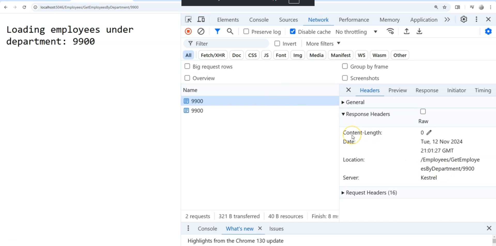

## Producing Results in MVC Controllers (ASP.NET Core)

### Overview

- MVC controllers are primarily designed to **render user interfaces (UIs)**, so the most common result type is the **ViewResult**, which renders HTML pages (Razor Views).
- Unlike Minimal APIs where you often return status codes like `BadRequest` or `NotFound` for errors, in MVC you typically handle errors by **displaying messages within the view itself**, maintaining user experience on the page.
- **ViewResult** represents the full HTML page returned to the browser — this is a large topic and will be covered in subsequent sections.
- 

---

### Other Common Result Types in MVC Controllers

Besides `ViewResult`, MVC provides several different types of results that controller action methods can return depending on the scenario:

| Result Type     | Description                                                                                      | Typical Usage                           |
|-----------------|------------------------------------------------------------------------------------------------|---------------------------------------|
| **ContentResult** | Returns raw content as plain text, HTML, or JSON string with a specified content type.          | Directly return string or custom content (e.g., some JSON or HTML snippets) |
| **JsonResult**   | Returns JSON-formatted data, usually serialized from objects or collections.                     | When you want to explicitly return JSON in controllers without using APIs. |
| **FileResult**   | Returns a file or stream to the client, which the browser may download or display (e.g., PDF).    | Serving downloads or streaming files like images, PDFs, reports.          |
| **RedirectResult** | Redirects the client to another URL, which may be another action, route, or external website.    | Redirect user to another page or external site (e.g., Google).              |

---

### Notes on Usage

- **ViewResult** is core to traditional MVC apps with Razor views where you render HTML UI.
- For APIs inside MVC controllers, you can still return JSON using `JsonResult`, but Minimal APIs generally handle that better.
- `ContentResult` is a flexible result to send arbitrary content with proper content-type headers.
- `FileResult` supports various file transmission options (`FileContentResult`, `FileStreamResult`, etc.).
- Redirects commonly happen after form submissions or for authentication flows.

---

### Summary Table

| Result Type     | Returns                      | Content Types Supported          | Common Scenario                   |
|-----------------|------------------------------|---------------------------------|---------------------------------|
| `ViewResult`    | Rendered HTML view           | `text/html`                     | Rendering entire webpage views   |
| `ContentResult` | Raw text or HTML or JSON string | `text/plain`, `text/html`, `application/json` | Custom string responses          |
| `JsonResult`    | JSON payload                 | `application/json`              | API-style JSON responses         |
| `FileResult`    | File download or inline viewing | Varies (PDF, image, etc.)       | File downloads or streaming      |
| `RedirectResult`| Redirect to another URL      | N/A                            | Redirects to other pages or sites|

---

### Final Thoughts

- When building MVC apps focused on **user interfaces**, **ViewResult** is usually your go-to result for regular page rendering.
- The other results (`ContentResult`, `JsonResult`, `FileResult`, `RedirectResult`) give you flexibility for APIs, file serving, and navigation.
- Minimal APIs tend to focus more on returning JSON and HTTP status codes, while MVC controllers handle **rich UI with HTML views** seamlessly.
- Upcoming sections will cover **ViewResults** and Razor pages in detail.

---

## Producing Content Results in MVC Controllers (ASP.NET Core)

### Overview

- In MVC Controllers, **returning plain text or HTML content** is done using the `ContentResult` class.
- Controller actions typically return the interface `IActionResult` for flexibility and consistency.
- You cannot return a raw string directly if your method signature returns `IActionResult`; you need to wrap it in a result class like `ContentResult`.

---

### Using `ContentResult` Directly

```c#
public IActionResult Departments()
{
return new ContentResult
{
Content = "Welcome to the website",
ContentType = "text/plain", // or "text/html" for HTML content
StatusCode = 200
};
}

```

- `Content` property is the text or HTML you want to send.
- `ContentType` specifies the MIME type, e.g., `text/plain` or `text/html`.
- `StatusCode` defaults to 200 if not specified.

---

### Returning HTML Content

To return HTML, set `ContentType` to `"text/html"` and pass HTML strings:

```c#
return new ContentResult
{
Content = "<h1>Welcome to the Departments page</h1>",
ContentType = "text/html"
};

```

When the browser receives this response, it renders the HTML rather than showing raw tags.

---

### Using the Controller Base `Content()` Helper Method

- Instead of instantiating `ContentResult`, you can use the controller's built-in **`Content()` helper method.**
- This method returns `ContentResult` for you and has overloads for providing content, content type, and encoding.

Examples:

```c#
// Plain text
return Content("Hello, plain text!");

// HTML content (with content type)
return Content("<h1>Welcome to the departments page</h1>", "text/html");
```

The helper makes your action code concise and readable.

---

### Summary

| Approach                 | Usage                                 | Example                                     |
|--------------------------|-------------------------------------|---------------------------------------------|
| Instantiate `ContentResult` | Full control over all properties      | `return new ContentResult { Content = "...", ContentType = "text/html" };` |
| Use `Content()` helper     | Shortcut, simpler syntax               | `return Content("Hello", "text/html");`      |
| Return raw string          | Not valid if return type is `IActionResult` | `return "Hello";` (valid only if return type is `string`) |

---

### Key Takeaways

- Use `ContentResult` or the `Content()` helper to return plain text or HTML from an MVC controller action.
- Always specify `ContentType` when returning HTML to ensure correct rendering.
- Returning raw strings works only if your action method’s return type is `string`, not when it is `IActionResult`.

---

If you'd like, I can provide code examples for other result types like JSON, File, or Redirect results in MVC controllers!

## Producing JSON Results in MVC Controllers (ASP.NET Core)

### Overview

- Returning JSON from an MVC controller action is common, especially for APIs.
- Even if you return a plain object (e.g., a `Department` instance), ASP.NET Core **automatically serializes it to JSON** by default.
- However, sometimes you want to **explicitly specify that the result is JSON**, regardless of client `Accept` headers or other output formatters.

---

### Why Use `JsonResult`?

- By default, ASP.NET Core content negotiation returns JSON if the client accepts it (e.g., `Accept: application/json`).
- But if the client sends an `Accept` header specifying something else (like `application/xml`), the response might be formatted differently (e.g., XML).
- To **force JSON output**, use `JsonResult` which overrides content negotiation and returns JSON regardless of client preferences.

---

### Using `JsonResult` Directly

```c#
public IActionResult Details(int id)
{
var department = new Department
{
Id = id,
Name = "Sales Department"
};

return new JsonResult(department);
}

```

- `JsonResult` inherits from `ActionResult` and implements `IActionResult`, so it works with return type `IActionResult`.
- The constructor takes the object to serialize as JSON.
- Using `JsonResult` ensures JSON response even if client accepts XML.

---

### Using the Controller's `Json()` Helper Method

- Instead of instantiating `JsonResult` manually, you can use the controller base class's **`Json()` helper method**:

```c#
public IActionResult Details(int id)
{
var department = new Department
{
Id = id,
Name = "Sales Department"
};
return Json(department);
}

```


- This produces the same JSON response.
- There are overloads allowing you to configure JSON serialization options if needed.

---

### Example Scenario: Client Request with `Accept` Header

- If the client sends:

```
Accept: application/xml
```
But your action returns:

```c#
return Json(department);
```

The client **still receives JSON**, not XML.

- Without using `JsonResult` or `Json()`, returning just an object could cause content negotiation to return XML if the client requests it.
- 

---

### Summary Table

| Method                          | Description                                | Use Case                                |
|-------------------------------|--------------------------------------------|-----------------------------------------|
| Return plain object (e.g., Department) | Uses content negotiation, respects `Accept` headers | When you want automatic format selection |
| `return new JsonResult(obj);`  | Forcibly returns JSON regardless of client headers | When you want to force JSON output      |
| `return Json(obj);`             | Helper method for `JsonResult`             | Cleaner syntax for forcing JSON         |

---

### Key Takeaways

- Use **`JsonResult` or `Json()`** when you want to **explicitly force JSON output**.
- Returning an object without these forces ASP.NET Core to negotiate content type based on client `Accept` headers; this might give XML or other formats.
- Helps ensure consistent JSON responses regardless of client preferences.

---

## Producing File Results in MVC Controllers (ASP.NET Core)

### Overview

When building web applications with MVC controllers, serving files—whether for download or inline display—is a common requirement. ASP.NET Core MVC provides several `FileResult` types to support different scenarios:

- **VirtualFileResult**: For files located within the web application's root (typically the `wwwroot` folder).
- **PhysicalFileResult**: For files located anywhere on the physical file system (outside `wwwroot`).
- **FileContentResult**: For file data available as a byte array, for example, retrieved from a database or remote API.
- 

---

### 1. VirtualFileResult

- Use when serving files stored under the application's `wwwroot` folder.
- Example:

```c#
[Route("download_vrf")]
public IActionResult DownloadVirtualFile()
{
// File "Readme.txt" located in wwwroot folder.
return new VirtualFileResult("/Readme.txt", "text/plain");
}
```

- The path is **relative to the `wwwroot` root folder**.
- You don’t need to configure static files middleware for this code to work, since it’s served through the controller action.

---

### 2. PhysicalFileResult

- Use when serving a file from a specific absolute path on the server outside `wwwroot`.
- Example:

```c#
[Route("download_pdf")]
public IActionResult DownloadPhysicalFile()
{
string filePath = @"C:\temp\sample.pdf";
return new PhysicalFileResult(filePath, "application/pdf");
}

```


- Provide the **absolute path** to the file.
- MIME type should correspond to the file type (e.g., `application/pdf`).

---

### 3. FileContentResult

- Use when you have the **file content as a byte array** (for example, from a database), and you want to send it as a file.
- Example:

```c#
[Route("download_cf")]
public IActionResult DownloadFileContent()
{
string filePath = @"C:\temp\sample.pdf";
byte[] fileBytes = System.IO.File.ReadAllBytes(filePath);
return new FileContentResult(fileBytes, "application/pdf");
}

```


- You manually read the bytes and provide them along with an appropriate MIME type.

---

### Using Controller Helper Methods

MVC controllers provide convenient helper methods that generate these results without direct instantiation:

- **Virtual files:**

```c#
return File("/Readme.txt", "text/plain");
```
- **Physical files:**
```c#
return PhysicalFile(@"C:\temp\sample.pdf", "application/pdf");
```
- **File content:**
```c#
return File(fileBytes, "application/pdf");
```

These helpers have multiple overloads supporting file streams, download file names, and content disposition.

---

### Important Notes

- By specifying the **correct MIME type**, browsers know whether to **display the file inline** (e.g., PDFs, images) or prompt the user to **download** it.
- If you want the browser to force a download instead of display, use the generic MIME type: 
- application/octet-stream


- Example:

```c#
return PhysicalFile(@"C:\temp\sample.pdf", "application/octet-stream");
```

This forces the browser to download the file rather than open it.

- Browser caching might affect repeated downloads; use cache-busting techniques (like Ctrl+F5) to test file downloads properly.

---

### Summary Table

| Result Type           | Use Case                            | Creation Example                                  | MIME Type Example       |
|----------------------|------------------------------------|--------------------------------------------------|------------------------|
| VirtualFileResult     | File stored in `wwwroot`           | `new VirtualFileResult("/file.txt", "text/plain")` | `text/plain`            |
| PhysicalFileResult    | File anywhere on disk               | `new PhysicalFileResult("C:\\file.pdf", "application/pdf")` | `application/pdf`      |
| FileContentResult     | File content as byte array          | `new FileContentResult(byteArray, "application/pdf")` | `application/pdf`      |
| Helper Methods (`File()`, `PhysicalFile()`) | Simplified versions of above         | `return File(...)` or `return PhysicalFile(...)` | Same as above          |

---

### Final Notes

- Use these methods inside your controller action methods to serve files dynamically.
- Always ensure correct file paths, permissions, and MIME types for proper client behavior.
- The flexibility accommodates files on disk, embedded resources, or even content stored in databases.

---

## Producing Redirect Results in MVC Controllers (ASP.NET Core)

### Overview

Redirecting users is a common operation in web applications with a UI. ASP.NET Core MVC provides several types of redirect results to guide users from one page or action to another:

- **RedirectToActionResult**: Redirects to a different action method (optionally in a different controller) within the app.
- **LocalRedirectResult**: Redirects to a local URL path within the application.
- **RedirectResult**: Redirects to an external URL outside the application (e.g., to Google).
- 

---

### 1. RedirectToActionResult

- Convenient for redirecting to an action method by specifying:
  - Target **action name**
  - Target **controller name**
  - Optional **route values** (e.g., parameters)
- Example:

```c#
// In DepartmentsController
[Route("departments/details/{id}")]
public IActionResult Details(int id)
{
// Fake some business condition
bool needRedirect = true;
if (needRedirect)
{
return RedirectToAction(
actionName: "GetEmployeesByDepartment",
controllerName: "Employees",
routeValues: new { id = id }
);
}
return View();
}

```

- Redirect issues an HTTP **302 Found** status with a `Location` header pointing to the new URL.
- Browser automatically follows this URL and issues a new GET request.
- 

---

### 2. LocalRedirectResult

- Redirect directly to a specified **local URL** within your application.
- Use this when you know the URL path and don't want to specify controller/action explicitly.
- Example:

```c#
return LocalRedirect($"/employees/GetEmployeesByDepartment/{id}");

```

- This produces the same result as `RedirectToAction` but uses a URL string.
- Safer than `RedirectResult` for external URLs, as it prevents redirection to outside paths.

---

### 3. RedirectResult (External Redirect)

- Redirects the client to an **external URL** (outside your application).
- Commonly used to redirect to third-party sites.
- Example:

```c#
return Redirect("https://www.google.com");

```


- Issues an HTTP 302 to the specified URL.
- Usually used for login providers, external resources, or retiring endpoints.

---

### 4. Helper Methods vs Direct Instantiation

- Controller base class provides helper methods for these redirections:

| Method                    | Description                                   |
|---------------------------|-----------------------------------------------|
| `RedirectToAction()`       | Simplifies creating `RedirectToActionResult` |
| `LocalRedirect()`          | Simplifies creating `LocalRedirectResult`    |
| `Redirect()`               | Simplifies creating `RedirectResult`          |

Example using helpers:

```c#
return RedirectToAction("GetEmployeesByDepartment", "Employees", new { id = id });

return LocalRedirect($"/employees/GetEmployeesByDepartment/{id}");

return Redirect("https://www.google.com");
```

---

### 5. Permanent Redirects (HTTP 301)

- Each redirect result also supports **permanent redirects**.
- Permanent redirects inform clients and search engines that the resource has moved permanently.
- Use these when retiring or moving API endpoints permanently.

Examples:

```c#
return RedirectToActionPermanent("NewAction", "NewController", new { id = id });

return LocalRedirectPermanent($"/new/path/{id}");

return RedirectPermanent("https://www.example.com");
```


---

### 6. HTTP Status Codes

| Redirect Type           | Status Code | Description                              |
|------------------------|-------------|------------------------------------------|
| Temporary Redirect      | 302 Found   | Default for `Redirect*` without "Permanent" |
| Permanent Redirect      | 301 Moved Permanently | For `Redirect*Permanent` methods          |

---

### Summary

| Redirect Method             | Use Case                                       | Parameters Needed                             |
|----------------------------|------------------------------------------------|-----------------------------------------------|
| `RedirectToAction`          | Redirect to a controller action by name       | Action name, controller name, route values   |
| `LocalRedirect`             | Redirect to a local URL string                  | URL string                                    |
| `Redirect`                  | Redirect to any URL (external or internal)     | URL string                                    |
| Permanent versions (`Permanent` suffix) | Indicate permanent resource relocation | Same as above                                 |

---

### Key Takeaways

- Use **`RedirectToAction`** when redirecting to another action method inside your app—preferred for maintainability and refactoring support.
- Use **`LocalRedirect`** when you have the exact local URL but want protection against external URL redirection.
- Use **`Redirect`** for external URLs.
- Use **permanent redirect variants** when the resource is permanently moved (important in API versioning and SEO).
- Redirect results issue HTTP 302 (or 301 for permanent), instructing browsers to request the new URL.

---

## Assignment 6: CRUD for Departments (MVC Controllers with HTML ContentResult)

### Overview

**Objective:**  
Build a basic CRUD user interface for managing departments using ASP.NET Core MVC Controllers.  
Since Razor Views have not been introduced yet, **return HTML manually using ContentResult** in each action.

---

### User Interface & Routing Requirements

**There are three main pages:**

1. **Department List**
   - **URL:** `/departments`
   - Shows a list of all departments.
   - Each department in the list has a link ("Details") and possibly a "Delete" button.
   - At the top/bottom, there’s an "Add Department" button which links to the Add page.

2. **Add Department**
   - **URL:** `/departments/create`
   - Displays an HTML form to enter department info (e.g., name & description).
   - "Add" button submits the form to create the new department.
   - "Cancel" button returns to the department list.

3. **Department Details**
   - **URL:** `/departments/details/{id}`
   - Shows details of the selected department.
   - Includes "Delete" and "Cancel" buttons (delete removes it, cancel returns to list).

---

### Implementation Guidelines

#### 1. Controller Design

```c#
public class DepartmentsController : Controller
{
private readonly DepartmentsRepository _repo;
public DepartmentsController(DepartmentsRepository repo)
{
    _repo = repo;
}

// 1. Departments List
[HttpGet("/departments")]
public IActionResult Index()
{
    var departments = _repo.GetAll();
    var html = "<h1>Departments</h1><ul>";
    foreach (var dept in departments)
    {
        html += $"<li>{dept.Name} - <a href='/departments/details/{dept.Id}'>Details</a></li>";
    }
    html += "</ul>";
    html += "<a href='/departments/create'>Add Department</a>";
    return Content(html, "text/html");
}

// 2. Add Department (GET)
[HttpGet("/departments/create")]
public IActionResult Create()
{
    var html = @"
        <h1>Add Department</h1>
        <form method='post' action='/departments/create'>
            Name: <input name='Name' /><br/>
            Description: <input name='Description' /><br/>
            <button type='submit'>Add</button>
            <a href='/departments'>Cancel</a>
        </form>";
    return Content(html, "text/html");
}

// 2. Add Department (POST)
[HttpPost("/departments/create")]
public IActionResult CreatePost([FromForm] Department department)
{
    if (string.IsNullOrWhiteSpace(department.Name))
    {
        return Content("<p>Name is required.</p><a href='/departments/create'>Back</a>", "text/html");
    }
    _repo.Add(department);
    return Redirect("/departments");
}

// 3. Department Details
[HttpGet("/departments/details/{id}")]
public IActionResult Details(int id)
{
    var dept = _repo.GetById(id);
    if (dept == null)
        return Content("<h1>Not found</h1><a href='/departments'>Back to list</a>", "text/html");

    var html = $@"
        <h1>{dept.Name} Details</h1>
        <p>Description: {dept.Description}</p>
        <form method='post' action='/departments/delete/{id}' style='display:inline;'>
            <button type='submit'>Delete</button>
        </form>
        <a href='/departments'>Cancel</a>";
    return Content(html, "text/html");
}

// 4. Delete Department (POST)
[HttpPost("/departments/delete/{id}")]
public IActionResult Delete(int id)
{
    _repo.Delete(id);
    return Redirect("/departments");
}

}

```


_Note: Adjust repository and model code as appropriate; handle IDs as needed._

---

### Error Handling

- For simplicity, display error messages **directly in the HTML** if validation fails (e.g., missing name field).
- No ModelState or validation summary required.

---

### Tips

- **ContentResult**: Use `Content(htmlString, "text/html")` to return raw HTML as the response.
- When you need to redirect after an action (`POST`/`DELETE`), use `Redirect("/departments")` to return to the main list.
- Keep HTML simple—no need for CSS or advanced HTML for the assignment.
- All routing can be done with explicit `[HttpGet(...)]` and `[HttpPost(...)]` attributes; no need for conventional routing in this assignment.

---

### Summary Table

| URL                        | HTTP Verb | Purpose                       |
|----------------------------|-----------|-------------------------------|
| `/departments`             | GET       | List all departments          |
| `/departments/create`      | GET       | Show add department form      |
| `/departments/create`      | POST      | Add new department            |
| `/departments/details/{id}`| GET       | Show department details       |
| `/departments/delete/{id}` | POST      | Delete department             |

---


