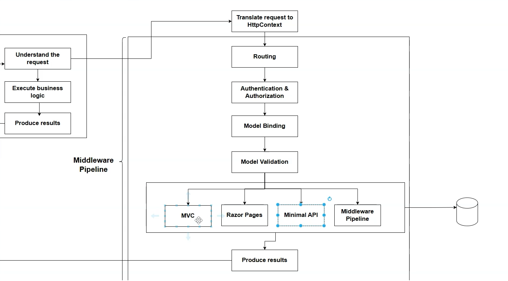
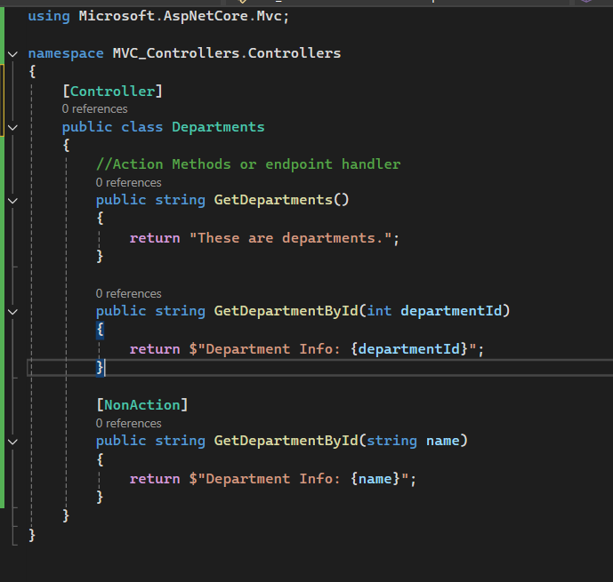
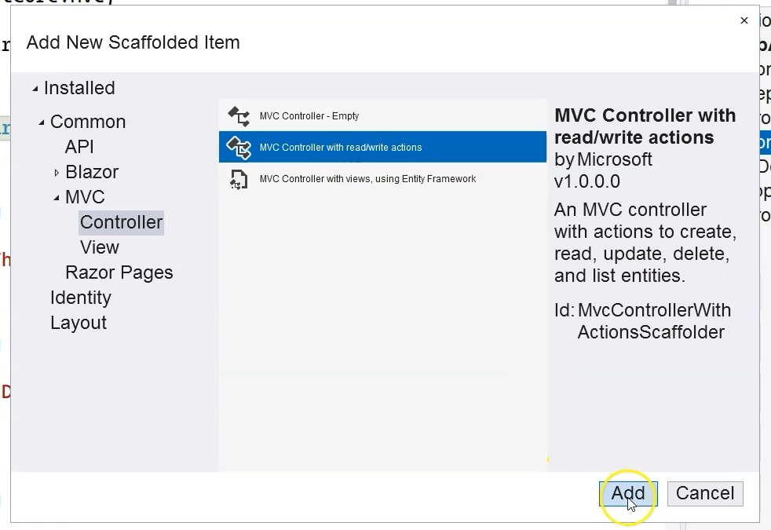

## Introduction to MVC Controllers in ASP.NET Core

### Overview

- This section introduces **MVC Controllers**, a core endpoint handling technology in ASP.NET Core, alongside Minimal APIs and Razor Pages.
- Controllers offer a structured, class-based approach for grouping and managing related endpoints.
- 

---

### What Are Controllers?

- A **controller** is a C# class (typically named with the suffix `Controller`) that contains **action methods** (public methods) which handle HTTP requests.
- Controllers group related endpoints, providing organization and reuse.
- Each public method is an **action method**, i.e., an endpoint handler—unless marked with `[NonAction]`.

---

### How to Define and Use Controllers

1. **Create a folder** (commonly named `Controllers`).
2. **Add a C# class** (e.g. `DepartmentsController`).

```c#
public class DepartmentsController
{
public string GetDepartments() => "These are the departments.";

   public string GetDepartmentById(int id) => $"Department info for {id}";

   [NonAction]
   public string HelperMethod() => "Not an endpoint handler";
}
```

3. **Public methods** are mapped as endpoints; methods with `[NonAction]` are ignored.

---

### Terminology

| MVC Term          | Minimal API Equivalent    |
|-------------------|--------------------------|
| Controller        | Extension/static class    |
| Action Method     | Endpoint/Handler function|
| Controllers folder| Endpoints folder          |
| Return Object     | Returns Response          |

---

### Why Use MVC Controllers?

1. **History and Legacy:**
- MVC has been a standard since early ASP.NET and remains popular for both old and new projects.
2. **Rich Features:**
- MVC supports not only APIs but also returning HTML for dynamic user interfaces ("views"), facilitating robust front-end development.
- Unlike Minimal APIs (which return mostly JSON), MVC can use **Views** to generate structured HTML.
3. **Organization:**
- Controllers offer a **class-based, organized** approach for grouping and managing endpoints, which many teams prefer for larger/complex apps.
4. **Personal Preference and Flexibility:**
- Some prefer MVC’s conventions and structure, others prefer Minimal API’s intent-driven, flat, explicit style.
- ASP.NET Core allows using both in the same project if desired.

---

### When to Choose MVC Controllers?

- **Use MVC if:**
- You require structured, class-based organization of endpoints.
- You want to return HTML (as well as JSON) using Views.
- You are maintaining or extending existing MVC projects.
- You prefer a convention-based approach.

- **Use Minimal APIs if:**
- The API surface is limited/small.
- You want explicit, lightweight, intent-driven endpoint definitions.
- You’re building pure HTTP APIs (JSON only), not web pages.

---

### Summary

- **Controllers** are core to ASP.NET Core’s MVC approach: they group related endpoints and enable both API and HTML response development.
- **Action methods** (public methods) are mapped as endpoint handlers.
- MVC is preferred for structure, legacy compatibility, and advanced UI support.

---

## Routing in MVC Controllers (Attribute Routing) – ASP.NET Core

### Overview

- **Routing** in controllers maps incoming HTTP requests to specific action methods within controller classes.
- Most concepts from Minimal APIs also apply to controllers—MVC just offers a more structured (class-based) approach.
- The main difference: *Controller routing is typically managed using attributes on classes and methods* (“attribute routing”).

---

### How Routing Works in Controllers

1. **Controller Discovery**

   - ASP.NET Core recognizes a controller class if:
     - Its name ends with the suffix **`Controller`** (*convention*), e.g. `DepartmentsController`.
     - Or it has the `[Controller]` attribute (rare—convention is the norm).
     - 
   - **Public methods** in the controller are considered “action methods” (endpoints), unless marked `[NonAction]`.

2. **Enabling Controller Routing**

   - Register controller services:
     ```c#
        builder.Services.AddControllers();
     ```
   - Map controller endpoints:
     ```c#
     // Old style: in endpoints configuration
     app.UseRouting();
     app.UseEndpoints(endpoints => { endpoints.MapControllers(); });
     // Modern (preferred): top-level registration
     app.MapControllers();
     ```

3. **Defining Routes With Attributes**

   - **Method-level attributes**:
     - `[HttpGet("/departments")]`
     - `[HttpGet("/departments/{id}")]`
   - **Route patterns** can be specified either with `[Route]` **or inline in HTTP method attributes** (`[HttpGet("path")]`).
   - If no HTTP method attribute is used, `[Route]` allows any HTTP method for the action.

4. **Class-level Routing Prefixes**

   - Use `[Route("prefix")]` on the controller class to specify a common prefix, e.g.:
     ```c#
     [Route("api/departments")]
     public class DepartmentsController : ControllerBase
     {
         [HttpGet("")]
         public string GetDepartments() => "Departments list";

         [HttpGet("{id}")]
         public string GetDepartment(int id) => $"Department {id}";
     }
     ```
   - Now, requests go to `/api/departments` and `/api/departments/{id}`.

---

### Attribute Routing Patterns

| Attribute Example                 | Effect/Route                        |
|-----------------------------------|-------------------------------------|
| `[HttpGet("departments")]`        | GET `/departments`                  |
| `[HttpGet("departments/{id}")]`   | GET `/departments/123`              |
| `[Route("api/departments")]` (class) + `[HttpGet]` (method) | GET `/api/departments`          |
| `[Route("api/departments")]` (class) + `[HttpGet("{id}")]` | GET `/api/departments/44`       |

---

### Differences from Minimal APIs

- **Discovery:** Controllers based on class naming convention or `[Controller]` attribute; Minimal APIs use direct delegate registration.
- **Route Definition:** Controllers use attributes; Minimal APIs use method calls (`app.MapGet("/route", ...)`)
- **Base Route Prefixes:** Controller class `[Route]` adds a prefix to all contained actions.

---

### Quick Example
```c#
[Route("api/departments")]
public class DepartmentsController : ControllerBase
{
[HttpGet("")]
public string GetDepartments() => "These are the departments.";

[HttpGet("{id}")]
public string GetDepartmentById(int id) => $"Department info for {id}";
}
```

- GET `/api/departments` → `GetDepartments`
- GET `/api/departments/42` → `GetDepartmentById`

---

### Summary Table

| Where?     | Route Specified?         | Example                             |
|------------|--------------------------|-------------------------------------|
| Method     | HTTP and Template        | `[HttpGet("departments")]`          |
| Method     | Route only               | `[Route("departments")]` (any verb) |
| Class      | Base prefix              | `[Route("api/departments")]`        |

---

### Key Takeaways

- Attribute routing in controllers gives you **organization** and **fine-grained control**.
- Use class-level `[Route]` for base paths, method-level `[HttpGet]`, `[HttpPost]` (etc) for HTTP verb and sub-routes.
- Most routing knowledge from Minimal APIs applies, but controllers bundle together related endpoints as actions in a class.

---

## Conventional Routing in MVC Controllers (ASP.NET Core)

### Overview

- **Conventional routing** is an approach to map HTTP requests to controller actions **based on route templates and naming conventions**, rather than explicit attributes.
- It uses a "master" route pattern, typically defined once in `Program.cs` or `Startup.cs`.
- Controller and action method names and their placement follow certain patterns to match requests accordingly.

---

### Enabling Conventional Routing

**In `Program.cs`:**

```c#
app.UseRouting();

app.UseEndpoints(endpoints =>
{
endpoints.MapControllerRoute(
name: "default",
pattern: "{controller=Home}/{action=Index}/{id?}");
});

```

- `{controller}`: Controller class name minus the "Controller" suffix (e.g., `DepartmentsController` maps to `departments`).
- `{action}`: Method name in the controller.
- `{id?}`: Optional route parameter, commonly used for details, edit, delete.

**Modern Top-level Approach:**

```c#
app.MapControllerRoute(
name: "default",
pattern: "{controller=Home}/{action=Index}/{id?}");
```


---

### Controller/Action Naming Conventions

- Controller classes should end with `Controller`: e.g., `DepartmentsController`.
- Conventional action methods are: `Index`, `Details`, `Create`, `Edit`, `Delete`.
- You do **not** need `[Route]` or `[Http...]` attributes unless overriding the convention.

**Example:**

```c#
public class DepartmentsController : Controller
{
public IActionResult Index() // GET /departments
public IActionResult Details(int? id) // GET /departments/details/5
public IActionResult Create() // GET (form) or POST (save) /departments/create
public IActionResult Edit(int? id) // GET (form) or POST (save) /departments/edit/2
public IActionResult Delete(int? id) // GET (confirm) or POST (delete) /departments/delete/3
}

```


---

### How Routing Works

- **Route: `/departments`**
    - Maps to `DepartmentsController.Index()`
- **Route: `/departments/details/7`**
    - Maps to `DepartmentsController.Details(7)`
- **Route: `/departments/edit/2`**
    - Maps to `DepartmentsController.Edit(2)`

If you only write `/`, it maps to `HomeController.Index()` by default.

---

### Mixing Attribute and Conventional Routing

- You can use attribute routing selectively (e.g., override an action’s route), but attribute routes **take precedence** over conventional routes for that action.

**Example:**

```c#
[Route("departments/department/{id?}")]
public IActionResult Edit(int? id) { ... }
// This action now only responds to /departments/department/2 and NOT /departments/edit/2

```

---

### HTTP Methods

- By default, if no `[Http...]` attribute is given, the action responds to **any HTTP verb**.
- For proper REST APIs use `[HttpGet]`, `[HttpPost]`, `[HttpPut]`, `[HttpDelete]` etc. to specify methods and reduce ambiguity.

---

### Scaffolded Controllers

- Visual Studio and dotnet tooling can generate controllers with standard CRUD action methods that follow the conventions (Index, Details, Create, Edit, Delete).
- **You do not have to “hand-code” every route and method from scratch.**
- 

---

### Summary Table

| Route Example                | Action Invoked                          |
|------------------------------|-----------------------------------------|
| `/`                          | `HomeController.Index()`                |
| `/departments`               | `DepartmentsController.Index()`         |
| `/departments/details/42`    | `DepartmentsController.Details(42)`     |
| `/departments/create`        | `DepartmentsController.Create()`        |
| `/departments/edit/3`        | `DepartmentsController.Edit(3)`         |
| `/departments/delete/3`      | `DepartmentsController.Delete(3)`       |

---

### Key Takeaways

- **Conventional routing** minimizes explicit route attributes—one master template handles all endpoints by pattern and naming.
- Follow naming conventions for controllers and actions for smooth routing.
- You can still **override with attribute routing** for special cases.
- Properly decorate POST, PUT, DELETE, etc. handlers with corresponding `[Http...]` attributes if used for APIs.

---

**Bottom line:**  
Conventional routing provides an efficient, maintainable way to structure MVC applications, especially for CRUD patterns. Use convention for general cases, and attribute routing for exceptions or finer-grained control.


