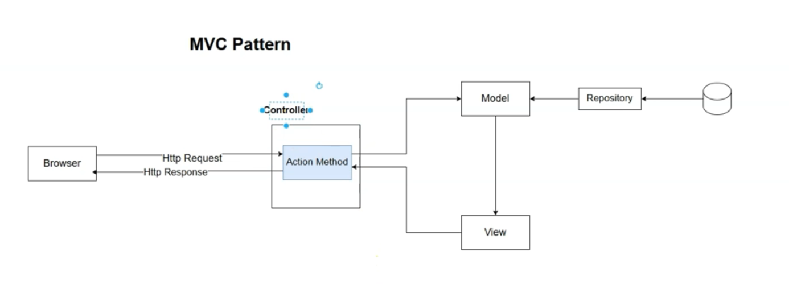

## What is the MVC Pattern? (ASP.NET Core Perspective)

### Motivation: The Problem with Hard-Coded HTML

In previous CRUD assignments, you saw that manually assembling HTML inside controller action methods using string concatenation and interpolation mixes **data access, application logic, and UI generation** all together. This leads to:

- **Unmaintainable code** (HTML and C# tangled together)
- **Poor separation of concerns**
- **Controllers becoming bloated** with data, HTML, and UI logic

---

### MVC Pattern: A Solution

The **Model-View-Controller (MVC)** pattern addresses these problems by dividing the application into three main components, each with a focused responsibility:

| Component    | Responsibility                                         |
|--------------|--------------------------------------------------------|
| **Model**    | Represents and manages **application data** and domain logic (e.g., Department object, repository code, database loading) |
| **View**     | Handles the **presentation/UI layer**; defines how the output (typically HTML) is rendered and displayed to the user |
| **Controller** | **Processes user input and coordinates interaction** between the Model and View; receives HTTP requests, loads data, selects view, and returns the response |

---

### How MVC Works in ASP.NET Core

1. **The Controller**
   - Acts as the "traffic director"
   - Receives HTTP requests, extracts input/parameters (with help from ASP.NET Core)
   - Fetches/updates data via the Model or repository layer
   - Passes Model data to a View for rendering
   - Returns the HTML (or other content) as the HTTP response

2. **The Model**
   - Defines the data structure (**Department**, etc.), often with methods for retrieving/updating from a database (or in-memory repo)
   - Encapsulates app/business logic and domain rules

3. **The View**
   - Accepts the Model passed by the Controller
   - Generates the user interface (HTML) by combining Model data with UI templates (e.g., **Razor Views**)
   - Contains UI logic (forms, buttons) and is responsible solely for displaying output

**Diagrammatically:**
- 

Browser → Controller → Model ← (Repository/DB)
| |
↓ ↘
View ← Model data
|
↓
Rendered HTML to Browser


---

### Why Use MVC?

- **Separation of Concerns:** Each piece of the application has a clear, distinct role.
- **Single Responsibility Principle:** Model, View, and Controller each handle their own logic.
- **Maintainability:** You can update UI design (Views), business logic (Models), or request handling (Controllers) independently.
- **Teamwork:** Front-end developers can focus on Views, backend on Models, and application flow on Controllers.
- **Testability:** You can unit test models, controllers, and views independently.

---

### The Case for Razor Views

- Instead of hardcoding HTML inside controllers, ASP.NET Core MVC lets you define **Razor Views** (`.cshtml` files).
- **Razor Views** are specialized templates for UI, receiving model data from the controller and generating HTML cleanly and maintainably.

---

### Summary
ś
- The **MVC pattern** solves the mess of mixing UI, logic, and data in controllers.
- Each layer—Model, View, Controller—has a focused goal.
- In ASP.NET Core, this leads to **cleaner, more maintainable, and testable code**.
- **Razor Views** bring a proper, maintainable UI layer to tie it all together.

---

## Introduction to Razor Views in ASP.NET Core MVC

### Motivation

- Previously, HTML was **hardcoded inside controller actions** (using string concatenation), which mixes UI, data, and control logic.
- The **MVC pattern** solves this by separating responsibilities:
  - **Controller**: Handles the request, coordinates between Model and View.
  - **Model**: Holds the data.
  - **View**: Responsible for all **UI rendering (HTML generation)** and UI logic.

---

### What Is a Razor View?

- A **Razor View** is a special `.cshtml` file in ASP.NET Core that lets you define UI (HTML) templates with embedded C# code.
- Views are **not** stored in controllers or C# method bodies, but exist as separate files for clean separation.
- Razor Views allow HTML + dynamic content using C# syntax:  
  e.g. `<div>@Model.Name</div>`

---

### View File Structure & Discovery

To let ASP.NET Core **find Razor Views automatically**, use these conventions:

1. **Views folder at project root:**  
   - Create a folder named `Views`.

2. **Controller-specific subfolders:**  
   - Under `Views`, create a folder named after your controller **without** the `Controller` suffix.  
     e.g., for `HomeController`, use a folder named `Home`.

3. **View files:**  
   - Place `.cshtml` files inside the controller subfolder, named after your action methods.
   - Example:  
     ```
     /Views/Home/Index.cshtml
     /Views/Home/MyView.cshtml
     ```

---

### Creating and Rendering a Razor View

#### Step 1: Set Up Services

In `Program.cs`, you _must_ register support for views:
```c#
builder.Services.AddControllersWithViews(); // Not just AddControllers()
```

#### Step 2: Create the View

- Under `Views/Home/Index.cshtml`:

```html
<html> 
    <head> 
        <title>Homepage</title> 
    </head> 
    <body> 
        <h1>Welcome Home!</h1> 
    </body> 
</html>

```
- Inside HomeController, write the following code:
```c#
public class HomeController : Controller
{
    public IActionResult Index()
    {
        // By convention, returns Views/Home/Index.cshtml
        return View();
    }

    public IActionResult MyView()
    {
        // Explicitly returns Views/Home/MyView.cshtml
        return View("MyView");
    }
}

```
- If you do not specify the view name, MVC uses the action method name (e.g., Index).
- If you specify a different view name, it loads that file instead.

### How View Discovery Works

- If the view name isn’t set explicitly, the view engine searches for:
```
/Views/{ControllerNameWithoutSuffix}/{ActionName}.cshtml
/Views/Shared/{ActionName}.cshtml
```
- If missing, an error is thrown stating the locations searched.

---


### Key Points

- **No more hardcoded HTML in controllers.**
- Views are reusable, maintainable, and can contain C# logic for dynamic content via Razor syntax.
- **Controller** → Passes data to the **View** → View renders HTML and returns it to the client.
- Use `return View();` for conventional view names, or `return View("MyView");` for custom views.
- Always use `AddControllersWithViews()` to enable Razor view rendering.

---

### Example Directory Structure

```

/Controllers/HomeController.cs
/Views/
/Home/
Index.cshtml
MyView.cshtml
/Shared/    (for shared layouts/partials)

```

---

## Summary Table

| Controller Action         | View File                | How to Return              |
|--------------------------|--------------------------|----------------------------|
| Index()                  | Views/Home/Index.cshtml  | `return View();`           |
| MyView()                 | Views/Home/MyView.cshtml | `return View("MyView");`   |

---

**Razor Views** enable clean, maintainable, and testable separation of the UI (HTML) from your controllers and business logic in ASP.NET Core MVC!

## Passing a Model to a Razor View in ASP.NET Core MVC

### Why Pass a Model to a View?

- In the MVC pattern, **Controllers** coordinate the application: they retrieve data from the Model and pass it to the View.
- Rather than hard-coding HTML (with C# string interpolation), Razor Views let you **build dynamic pages by combining a strongly-typed model with HTML**.
- The Controller's job is to **supply the data ("model") to the View**, and the View's job is to **render HTML using that data**.

---

### How to Pass a Model from Controller to View

Suppose you have a `DepartmentsController` with a `Details` action that retrieves a `Department` object:

```c#
public IActionResult Details(int id)
{
var department = DepartmentsRepository.GetDepartmentById(id);
return View(department); // Pass the model to the view
}
```

- The `View()` helper method's first argument is the model object you want to pass.
- By convention, the view file will be `Views/Departments/Details.cshtml`.

---

### How to Use the Model in a Razor View

#### Step 1: Make the View Strongly Typed

At the **top** of `Details.cshtml`, declare the model type with the `@model` directive:

```
@model Department
```

- This makes the Razor view aware of the exact type you expect, enabling strong typing and IntelliSense.

#### Step 2: Render Model Data with Razor Syntax

- Use the `@` symbol to embed C# expressions within your HTML.
- The `Model` property refers to the object you passed from the controller.

Example (`Details.cshtml`):

@model Department

```html
<html> 
    <head> 
        <title>Department Details</title> 
    </head> 
    <body> 
        <h1>@Model.Name</h1> 
        <p><strong>ID:</strong> @Model.Id</p> <p><strong>Description:</strong> @Model.Description</p> 
    </body> 
</html> 
```
- @Model.Name, @Model.Id, @Model.Description insert values from the passed model.

### How Razor Syntax Works

- **Razor Views** are executed **server-side**: they combine HTML and C# code based on the provided model, generating a complete HTML page before sending it to the browser.
- The browser receives **pure HTML** with all C# evaluated and replaced with data.

#### Example: Output HTML (View Source)

```html

<html>
  <head>
    <title>Department Details</title>
  </head>
  <body>
    <h1>Sales Department</h1>
    <p><strong>ID:</strong> 1</p>
    <p><strong>Description:</strong> Handles all sales operations</p>
  </body>
</html>
```
- No C# remains in the delivered page.

---

### Benefits of Passing the Model

- **Separation of Concerns:** The controller only handles logic & data-fetching; the view only handles rendering.
- **Maintainability:** No string interpolation or manual HTML generation inside controllers.
- **Testability & Reusability:** Views can be reused with different models, and controllers can more easily be tested without UI code.
- **Strong Typing:** Compile-time checking and IntelliSense in `.cshtml` files via `@model Department`.

---

### Quick Guide: Pass Model to View in ASP.NET Core MVC

| Step                       | Example Code/Markup                                                  |
|----------------------------|----------------------------------------------------------------------|
| Controller returns view & data | `return View(department);`                                         |
| View starts with model type    | `@model Department`                                                |
| Use values via Razor         | `<h1>@Model.Name</h1>`                                              |
| Server renders HTML for browser | Output HTML contains no C# code                                   |

---

**In summary:**  
- Pass your model from the Controller using `View(model)`.
- Specify the view's model type with `@model` at the top of the `.cshtml` file.
- Use `@Model.Property` to embed values in your HTML.
- Razor evaluates and sends clean HTML to the browser.

---

## Implicit vs Explicit Razor Expressions in Razor Views (ASP.NET Core)

### Recap: Implicit Razor Expression

- **Implicit Razor expressions** start with `@` followed immediately by a **simple C# expression without spaces**, e.g.:

```c#
@DateTime.Today
```

- Used to embed small C# expressions inline with HTML, rendering their value directly.
- Limitation: If the expression contains spaces or is more complex (e.g., uses `new` keyword or method calls with spaces), the parser treats subsequent text as HTML.

---

### Problem with Spaces in Implicit Expressions

- Expressions like:
```c#
@new DateTime(DateTime.Today.Year, 12, 25)
```
cause a **parsing error** because the implicit expression ends at the space (`new`) and the rest is treated as markup, leading to errors.

- Similarly, if you write:
```c#
@DateTime.Today Year 12 25
```

Everything after `Today` is treated as HTML text, not C#.

---

### Solution: Explicit Razor Expression

- **Explicit Razor expressions** use parentheses to enclose any C# code, allowing spaces and complex expressions:

```c#
@(new DateTime(DateTime.Today.Year, 12, 25))
```

- Format:
```c#
@ ( ... C# expression with spaces ... )
```


- You can include any valid C# inside the parentheses—spaces, method calls, operators, etc.

---

### Example: Calculating Days Until Christmas

```c#
@(
(new DateTime(DateTime.Today.Year, 12, 25) - DateTime.Today).Days
)
```

This renders the number of days between today and Christmas.

---

### Using Razor Expressions in HTML Attributes

- Razor expressions (usually explicit) can be used to dynamically set attribute values, for example CSS styles:

### Using Razor Expressions in HTML Attributes

- Razor expressions (usually explicit) can be used to dynamically set attribute values, for example CSS styles:

```html
<p style="color:@( ((new DateTime(DateTime.Today.Year, 12, 25) - DateTime.Today).Days % 2 == 0) ? "red" : "green" )">
    Days until Christmas: @( (new DateTime(DateTime.Today.Year, 12, 25) - DateTime.Today).Days )
</p>
```

- This example colors the paragraph **red** if the number of days until Christmas is even, **green** if odd.

---

### Summary

| Expression Type      | Syntax Example                                    | Supports Complex C#? | Use Case                                          |
|---------------------|--------------------------------------------------|---------------------|--------------------------------------------------|
| **Implicit Expression** | `@DateTime.Today`                                | No                  | Simple expressions without spaces                 |
| **Explicit Expression** | `@(new DateTime(2024, 12, 25))`                 | Yes                 | Complex expressions, method calls, calculations   |

---

### Important Notes

- Razor expressions are evaluated on the **server** during view rendering.
- The output is pure HTML sent to the browser—no C# code is sent to the client.
- Use explicit expressions whenever you need to include any spaces, operators, or method calls in your inline C# code within views.

---

## C# Code Blocks in Razor Views (ASP.NET Core)

### What Are C# Code Blocks?

- A **C# code block** in a Razor view lets you write multiple lines of C# code to define variables, perform logic, or run statements.
- Syntax:
```c#

@{
// Any valid C\# code here
}

```
- Everything inside the `{ ... }` is treated as C# code and runs on the server during view rendering.

---

### Why Use C# Code Blocks?

- To **extract complex expressions into variables** that can be reused in the HTML.
- To **perform UI logic** such as conditional assignments, calculations, or preparations that belong to presentation logic.
- Keeps Razor views clean by moving multiple lines or complex expressions out of inline expressions.

---

### Example: Defining and Using Variables in a Razor View

```c#

@{
// Define a variable 'color' for styling
var color = ((DateTime.Today.Day % 2) == 0) ? "red" : "green";

    // Calculate days until Christmas, accounting for past date
    TimeSpan daysUntilChristmas;
    var christmas = new DateTime(DateTime.Today.Year, 12, 25);
    
    if (DateTime.Today > christmas)
    {
        // Next year's Christmas if today is past December 25
        var nextChristmas = christmas.AddYears(1);
        daysUntilChristmas = nextChristmas - DateTime.Today;
    }
    else
    {
        daysUntilChristmas = christmas - DateTime.Today;
    }
    }

```

Later in the HTML, you can use these variables with implicit Razor expressions:

```html

<p style="color:@color">
    Days until Christmas: @daysUntilChristmas.Days
</p>
```
- Here, `@color` and `@daysUntilChristmas.Days` output the values defined in the code block.

---

### Placement of Code Blocks

- Code blocks can be placed **anywhere within the Razor view**, including the very top, before or within HTML elements.
- Ensure variables are defined **before** you use them in the HTML.

---

### Best Practices & Warnings

- The view is for **UI rendering and UI logic only**; avoid complex business logic or data access inside code blocks.
- **Do not access repositories, databases, or services inside views.**
- The controller or model should prepare **all data needed** for the view.
- Overusing code blocks or putting heavy logic in views breaks separation of concerns and makes maintenance harder.

---

### Summary

| Feature            | Description                                         | Example                            |
|--------------------|-----------------------------------------------------|-----------------------------------|
| C# Code Block      | Encloses multiple lines of C# code                  | `@{ var color = "red"; }`          |
| Variable usage     | Use implicit expressions to output values           | `<p style="color:@color">Text</p>` |
| UI Logic           | For simple calculations and UI-related decisions    | Conditional color assignment       |
| Avoid in view      | Business logic, data fetching, repository calls     | Keep these in controller/models   |

---

### Final Thoughts

- Use **C# code blocks** to organize and simplify your Razor views.
- Perform UI-specific calculations in views, but delegate backend logic to controllers/models.
- This leads to cleaner, maintainable, and well-structured MVC applications.

---

## Conditional Control Structures in Razor Views (ASP.NET Core)

### Overview

- Razor views allow you to use **C# conditional statements** like `if-else` and `switch` to control which HTML elements are rendered.
- This lets you dynamically change the output depending on conditions evaluated on the server.

---

### Using `if-else` Statements in Razor Views

- Always start C# code with the `@` sign unless you're inside a code block.
- Example with `if-else` controlling displayed message based on days until Christmas:

```c#

@{
    string color = (new DateTime(DateTime.Today.Year, 12, 25) - DateTime.Today).Days % 2 == 0 ? "green" : "red";
    var days = (new DateTime(DateTime.Today.Year, 12, 25) - DateTime.Today).Days;
    var b = "nishant2";
}
<html>
<head>
    <title>Homepage</title>
</head>
<body>
    <h1>Welcome Home!</h1>
    <p style="color:@color">
    @((new DateTime(DateTime.Today.Year,12,25) - DateTime.Today).Days)
    </p>
    @if(days <= 35)
    {
        <h1>Christmas is close!</h1>
    } else
    {
        <h1>Welcome home @b</h1>
    }
   
</body>
</html>

```

- Note: Because `days` is a `TimeSpan`, use `days.Days` property if you store a `TimeSpan` variable.

---

### Mixing HTML and C# Code

- Inside an `if` or other control block, **HTML can be directly placed and will only render when that branch executes**.
- Outside of C# blocks, text is treated as HTML until the flow returns to C# with an `@`.

- To embed C# expressions *inside* HTML tags (e.g., attribute values), you must use the `@` sign again:

```c#

<p style="color:@(days % 2 == 0 ? "red" : "green")">
    Days until Christmas: @days
</p>
```

---

### Using `switch` Statements in Razor Views

- You can also use `switch` statements wrapped in a Razor code block:

```c#

@{
var color = (days % 2 == 0) ? "red" : "green";
}

@switch(color)
{
case "green":
<p style="color:green">Green message</p>
break;
case "red":
<p style="color:red">Red message</p>
break;
default:
<p>Default message</p>
break;
}

```

- The `@` symbol before `switch` indicates you are entering a Razor code block.

---

### Important Notes on Razor Syntax Flow

- When you insert an HTML element inside C# blocks, the **HTML is rendered literally**.
- To output C# variables or expressions inside HTML, prefix with `@`.
- Closing an HTML tag ends the HTML flow; writing outside the tag re-enters C# or plain HTML based on context.

Example:

```c#

@{
var b = "Hello";
}

<p>@b</p>  <!-- Outputs variable value -->
<p>b</p>   <!-- Outputs literal "b" -->

```

---

### Summary

| Feature               | Syntax Example                      | Notes                                  |
|-----------------------|------------------------------------|----------------------------------------|
| `if` Statement        | `@if(condition) { <p>HTML</p> }`   | Controls rendering of HTML blocks      |
| `else` Statement      | `else { <p>Alternate HTML</p> }`   | Alternative rendering branch           |
| `switch` Statement    | `@switch(var) { case val: ... }`   | Multi-branch condition logic           |
| Inline C# in HTML     | `<p>@variable</p>`                 | Use `@` to output C# variables or expressions |
| Outside Razor Blocks  | Plain HTML                        | Rendered directly                       |

---

### Best Practices

- Use conditional structures to **omit or include HTML elements dynamically**.
- Use explicit `@` when **embedding C# expressions inside HTML tags**.
- Keep complex logic **inside C# code blocks (`@{ ... }`)** where possible.
- The flow between C# and HTML is **context sensitive**, so pay attention to where `@` is needed.

## Iterative Control Structures in Razor Views (ASP.NET Core)

### Overview

- Razor views support all C# iterative control structures (`foreach`, `for`, `while`, `do-while`).
- Always prefix control structures with `@` to start writing C# inside the view.
- Inside the control flow code block, you can freely mix HTML and C#.

---

### Example: Display Departments List with a `foreach` Loop

Suppose your controller passes a **List\<Department\>** model to the view via:

```c#

return View(departments);

```

In your `Index.cshtml` Razor view, strongly type the model:

```c#

@model List<Department>

```

Then use a defensive check and a `foreach` loop to render the list in HTML:

```html

<body>
    <h1>Department List</h1>

    @if (Model != null && Model.Count > 0)
    {
        <ol>
            @foreach (var department in Model)
            {
                <li>
                    <a href="/departments/details/@department.Id">
                        @department.Name - @department.Description
                    </a>
                </li>
            }
        </ol>
    }
    else
    {
        <p>No departments found.</p>
    }
</body>
```

- The `@if` statement checks if the model is non-null and non-empty before looping.
- The `@foreach` introduces a code block that outputs one `<li>` per department.
- Inside the HTML tags (like `<a href="...">`), use `@expression` to embed C# values.
- When mixing HTML and C# inside the loop, prefix each C# code snippet with `@` as needed.

---

### Notes on Syntax

- Once inside a C# code block (e.g., after `@foreach (...) {`), you can write HTML freely.
- To embed C# expressions inside HTML attributes or content, use `@` again.
- Avoid `string.Join` or building HTML strings manually in the controller; `foreach` loops in views promote better separation of concerns and readability.

---

### Alternative Iterative Constructs

- You can also use `for`, `while`, or `do-while`, but `foreach` is most common for collections.
- Example `for` loop for indexing:

```c#

@for (int i = 0; i < Model.Count; i++)
{
<p>@Model[i].Name</p>
}

```

---

### Summary

| Control Structure | Syntax Example                          | Typical Use Case                    |
|-------------------|--------------------------------------|-----------------------------------|
| `foreach`         | `@foreach(var item in Model) { ... }` | Iterating over collections         |
| `for`             | `@for(int i=0; i<Model.Count; i++) { ... }` | Indexed iteration                  |
| `if` / `else`     | `@if(condition) { ... } else { ... }`  | Conditional rendering              |
| Defensive checks  | `@if (Model != null && Model.Count > 0)` | Avoid null reference errors        |

---

### Best Practices

- Always check for null or empty collections before iterating.
- Keep the looping logic in the view simple—more complex logic belongs in controller or view models.
- Use Razor syntax (`@`) correctly to switch between HTML and C# seamlessly.
- Let the controller handle data retrieval and leave the view to display that data.

---

## Assignment: Create an Error Display View (ASP.NET Core MVC)

### Objective

Create a reusable **Razor View** to display validation and model errors in a user-friendly HTML format instead of returning raw HTML strings or plain text.

---

### Context and Requirements

- In your **DepartmentsController**, there are several action methods (`Details`, `Edit`, `Create`, and `Delete`) that currently:
  - Return raw HTML content strings to display errors, or
  - Use a helper method `GetErrorsHtml()` that constructs an HTML string of errors.
  
- Goal:
  - Replace these manually constructed error HTML blocks with a proper **strongly-typed Razor view** to show error messages cleanly.
  - Refactor action methods to **return `View()` with a model** representing the errors instead of raw HTML or `Content()`.
  
---

### What to Consider

1. **Model for the Error View**
   - The error view needs to receive a **list of error messages** to display them cleanly.
   - Since errors are stored in `ModelState` in the controller, you can:
     - Extract the errors into a **`List<string>`** or similar collection.
     - Pass this collection as the model to the error view.
     
2. **Controller Changes**
   - Instead of calling `return Content(GetErrorsHtml(), "text/html")` in the error cases, call something like:
     ```c#
     return View("Error", errorList);
     ```
     - Where `"Error"` is the error view filename (e.g., `Error.cshtml`).
     - `errorList` is a list of strings or a view model containing the error messages.

3. **The Error View (`Error.cshtml`)**
   - Should be placed under the appropriate **Views** folder for discovery, typically:
     ```
     /Views/Shared/Error.cshtml
     ```
     or
     ```
     /Views/Departments/Error.cshtml
     ```
   - The Razor view should be **strongly typed** to the collection type (e.g., `List<string>`):
     ```c#
     @model List<string>
     ```
   - Render the errors as an HTML list or styled block:
     ```c#
     <h2>Errors Occurred</h2>
     <ul>
       @foreach(var error in Model)
       {
           <li>@error</li>
       }
     </ul>
     <a href="javascript:history.back()">Go Back</a>
     ```

4. **Refactor `GetErrorsHtml()`**
   - Change this method so that instead of producing an HTML string, it **extracts error messages from `ModelState`** and returns a simple collection of error strings.
   - The controller would then pass this collection to the error view.

---

### Example Implementation Sketch

**In DepartmentsController:**

```c#

private List<string> ExtractErrors()
{
var errors = new List<string>();
foreach(var state in ModelState.Values)
{
foreach(var error in state.Errors)
{
errors.Add(error.ErrorMessage);
}
}
return errors;
}

public IActionResult Edit(Department department)
{
if(!ModelState.IsValid)
{
var errorList = ExtractErrors();
return View("Error", errorList);
}
//... update logic
}

```

**In `Views/Shared/Error.cshtml`:**

```c#

@model List<string>

<h2>Errors</h2>

<ul>
    @foreach(var error in Model)
    {
        <li>@error</li>
    }
</ul>
<a href="javascript:history.back()">Go Back</a>

```

---

### Summary Checklist for the Assignment

- [ ] Create a strongly-typed error view (e.g., `Error.cshtml`) that displays a list of error messages as HTML.
- [ ] Modify controller methods (`Details`, `Edit`, `Create`, `Delete`) to:
  - Extract error messages from `ModelState`.
  - Return `View("Error", errors)` instead of `Content()` or manually constructed HTML error strings.
- [ ] Remove previous usage of `GetErrorsHtml()` that returns HTML markup, replacing it with the new error view mechanism.
- [ ] Keep your error display consistent and user-friendly.

---

### Notes

- Storing the error messages in the model and rendering them in a Razor view improves **separation of concerns**, **maintainability**, and **testability**.
- This approach integrates nicely with ASP.NET Core MVC conventions.
- Consider putting your error view under `/Views/Shared/` so it can be reused by multiple controllers.

---

## Creating and Using a Centralized Error View in ASP.NET Core MVC

### Overview

- This guide explains how to create a reusable **Error View** that takes a **list of error messages (List<string>)** as its model.
- The error view replaces inline HTML error content across your controller action methods.
- It provides a clean, maintainable way to display validation or runtime errors in user-friendly HTML.

---

### 1. Creating the Error View

- Place the view in the `Views/Departments` folder (or later move to `Views/Shared` for reuse).
- Name the file `Error.cshtml`.
- Define the model as a list of strings:
```html

@model List<string>

  <html>
  <head>
      <title>Error</title>
      <style> 
          body { color: red; }
      </style>
  </head>
  <body>
      <h2>Errors</h2>
      @if (Model != null && Model.Count > 0)
      {
          <ol>
          @foreach(var errorMessage in Model)
          {
              <li>@errorMessage</li>
          }
          </ol>
      }
  </body>
  </html>
```

---

### 2. Modifying the Controller

- In your DepartmentsController, replace all places where you return inline error HTML or content with calls to the error view.
- For single error messages (like `"Department not found"`), wrap it in a list:
```c#

if(department == null)
{
var errors = new List<string> { "Department not found" };
return View("Error", errors);
}

```
- For multiple errors (e.g., ModelState validation errors), write a helper method to extract error messages as a list of strings:
```c#

private List<string> GetErrorMessages()
{
var errorMessages = new List<string>();
foreach(var state in ModelState.Values)
{
foreach(var error in state.Errors)
{
errorMessages.Add(error.ErrorMessage);
}
}
return errorMessages;
}

```
- Then return the Error view with these errors:

```c#
if(!ModelState.IsValid)
{
var errors = GetErrorMessages();
return View("Error", errors);
}
```
- Apply this pattern consistently to your:
- `Details` method for "not found" scenarios
- `Edit` POST action on validation failure
- `Create` POST action on validation failure
- `Delete` POST action if deletion fails

---

### 3. Cleaning Up

- Remove now-unneeded inline HTML error generation methods like `GetErrorsHtml()` that return string-formatted HTML.
- Make sure the controller methods always return the `.cshtml` error view with a **list<string>** model.
- This drastically improves separation of concerns, maintainability, and allows easier styling of error pages in one place.

---

### 4. Testing

- Try navigating to a `Department` that doesn't exist; the error view should display `"Department not found"`.
- Submit forms (`Edit`, `Create`) without required data to confirm validation errors show up in the error view.
- Delete a non-existent department to validate consistent use of the error view.

---

### Summary

| Task                                | How to Implement                          |
|------------------------------------|------------------------------------------|
| Display single error message        | Return `View("Error", new List<string>{ message })` |
| Display multiple validation errors  | Extract with helper & pass list to `Error` view |
| Create centralized error view       | Razor `.cshtml` typed as `List<string>` showing messages in `<ol>` |
| Refactor controllers                | Replace all inline error HTML/content with error view |

---

### Benefits

- **Single place to style and format errors**
- **More readable controller actions**
- **Better maintainability and scalability**

---

## Razor Literal in Razor Views (ASP.NET Core)

### Context

- Inside a Razor **C# code block** (`@{ ... }` or control structures like `if`, `else`), the content is treated as C# code.
- If you want to **output/display a value or text** to the rendered HTML, you must explicitly use the **Razor syntax** to indicate that.
- Otherwise, Razor expects valid C# statements, and writing plain text or unmarked expressions causes compilation errors.

---

### Displaying C# Values Within a Code Block

- Even **inside a C# code block**, to render a value, you need to use the `@` sign to indicate an **implicit Razor expression**.

Example inside an `else` block:

```c#

@else
{
@days.Days  <!-- Use @ to output this value to HTML -->
}

```

- Without `@`, Razor treats this as an unfinished C# statement, causing errors like "semicolon expected".

---

### What is Razor Literal?

- **Razor literal** is a way to output **plain text** where Razor expects C# code.
- Use Razor literal when you want to output plain text **inside** C# code blocks without Razor interpreting it as C#.

---

### Two Ways to Write Razor Literals

1. **Partial Razor Literal:**

   Use `<text>` HTML-like tags inside the code block to enclose raw plain text:

```html

<text>34 days before Christmas!</text>

```

- This tells Razor to treat everything inside `<text>...</text>` **as literal text**, not as C#.
- You can mix this with Razor code:

```html

@else
{
@days.Days<text> days before Christmas!</text>
}

```

2. **Full Razor Literal (whole line as text):**

Use an `@:` followed by the text on the same line:

```

@:Happy Holidays!

```

- This instructs Razor that the entire rest of the line is plain text.
- Does not need a closing tag.
- Useful for outputting a simple message on its own line inside a C# code block.

---

### Summary Table

| Scenario                        | Syntax                              | Description                       |
|--------------------------------|-----------------------------------|---------------------------------|
| Output a C# value for display  | `@days.Days`                      | Implicit Razor expression for outputting variables |
| Output plain text inline        | `<text>Some literal text</text>`  | Partial Razor literal inside code blocks       |
| Output whole line as plain text | `@:This is a full razor literal`  | Full Razor literal — entire line treated as text |

---

### Important Points

- Razor literals are **only needed inside C# code blocks or places where Razor expects code**.
- Outside of code blocks, normal HTML/text is rendered as is.
- Always prefix C# expressions with `@` when you want to output values in Razor.
- Razor literals help avoid compiler errors when mixing markup/text within C# blocks.

---


### Example Usage in a Razor View

```c#

@{
var days = (new DateTime(DateTime.Today.Year, 12, 25) - DateTime.Today);
}

@if (days.Days <= 10)
{
<h1 style="color:green">Christmas is around the corner!</h1>
}
else
{
<h1 style="color:red">
@days.Days<text> days before Christmas!</text>
</h1>

    @:Happy Holidays!
    }

```

---

## ViewData and ViewBag in ASP.NET Core MVC

In ASP.NET Core MVC, **ViewData** and **ViewBag** are two mechanisms used for passing data from a controller to a view. Both serve the purpose of transporting information that is not part of the main model, such as messages, additional variables, or UI hints.

---

### ViewData

- **ViewData** is a **dictionary object** of type `ViewDataDictionary`.
- It stores data as key-value pairs where keys are strings.
- Data passed via ViewData needs to be cast and checked for null before usage.
- It is available for the current request only.
- ViewData is accessed like a dictionary.

**Example Usage of ViewData:**

**Controller:**

```c#

public IActionResult Index()
{
ViewData["Message"] = "Hello from ViewData!";
ViewData["Number"] = 2025;
return View();
}

```

**View (Razor):**

```

<h1>@ViewData["Message"]</h1>
<p>The year is @ViewData["Number"]</p>

```

---

### ViewBag

- **ViewBag** is a **dynamic wrapper** around ViewData.
- It allows setting and getting properties dynamically, without casting.
- It uses C#’s `dynamic` feature, which allows more concise syntax.
- Internally, it stores data in the same dictionary as ViewData.
- Like ViewData, it lasts only for the current request.

**Example Usage of ViewBag:**

**Controller:**

```c#

public IActionResult Index()
{
ViewBag.Message = "Hello from ViewBag!";
ViewBag.Number = 2025;
return View();
}

```

**View (Razor):**

```

<h1>@ViewBag.Message</h1>
<p>The year is @ViewBag.Number</p>

```

---

### Key Differences and Notes

| Aspect           | ViewData                            | ViewBag                          |
|------------------|------------------------------------|---------------------------------|
| Type             | `ViewDataDictionary` (dictionary) | Dynamic object                  |
| Syntax           | Dictionary access with string keys | Property-like access (dot notation) |
| Requires casting | Yes                                | No (dynamic typing)             |
| Underlying storage| Both use the same underlying dictionary | Same as ViewData               |
| Null safety      | Manual null checking required      | Dynamic typing; watch for runtime errors |
| Usage preference | Explicit key usage                  | Cleaner syntax, less verbose    |

---

### When to Use Which?

- **ViewBag** is often preferred for its cleaner syntax and ease of use.
- **ViewData** might be preferred when working in languages without support for dynamic types.
- Both are useful for passing small amounts of data that do not belong to the main model.
- For larger or strongly typed data, use a **ViewModel** instead.

---

### Combined Example:

```c#

public IActionResult Details()
{
ViewData["Title"] = "Department Details";
ViewBag.Description = "This page shows details about the department.";
return View();
}

```

**In the view:**

```

<h1>@ViewData["Title"]</h1>
<p>@ViewBag.Description</p>

```

---

### Summary

- **ViewData** and **ViewBag** facilitate quick data passing to views without modifying the model.
- Both are limited to the lifecycle of a single request.
- Use **ViewBag** for convenience and concise code in C#.
- Use **ViewData** if you prefer dictionary semantics or require key-based access.
- For complex data, strongly typed ViewModels are a better choice.
- ViewBag is available in ASP.NET MVC but not available in Razor Pages
- In ASP.NET, ViewBag is a dynamic object that facilitates passing data from controllers to views in the MVC pattern. It is part of the MVC framework and specifically tied to controller-based views.
- However, in Razor Pages—which follow a different pattern than MVC controllers—ViewBag is not available by default. Razor Pages use a PageModel class for backend logic and directly bind data to the Razor (.cshtml) page via properties on the PageModel. Data passing in Razor Pages typically happens using public properties on the PageModel, not ViewBag.

---

## Assignment: Refactor Departments CRUD Application to Use Razor Views with Optional Bootstrap Styling

### Objective

Refactor your existing Departments CRUD functionality that currently uses hardcoded HTML in controller actions to a **proper MVC implementation using Razor Views**. The goal is to cleanly separate concerns, have maintainable HTML, and dynamically display department data through strongly typed views.

Optionally, enhance the UI by adding **Bootstrap CSS styles** to make forms and pages look polished and user-friendly. This styling is not required for functionality but improves the user experience.

---

### Key Tasks

1. **Move Hardcoded HTML from Controllers to Razor Views**

   - For each CRUD action (list, details, create, edit, delete confirmation), create a corresponding `.cshtml` Razor view file under the `Views/Departments` folder.
   - Refactor controllers to return `View(model)` with the appropriate model instead of returning raw HTML strings.
   - Use Razor syntax (`@model`, `@foreach`, etc.) to dynamically render department data and forms.

2. **Pass Models Correctly**

   - Ensure each view is strongly typed (e.g., `@model Department` or `@model List<Department>`) based on the data passed from the controller.
   - Access model data in views through the `Model` object for dynamic content rendering.

3. **Create Forms with Razor**

   - Use HTML `<form>` elements in your views for creating and editing departments.
   - Bind form inputs with proper `name` attributes mapping to model properties for correct model binding on POST.
   
4. **Add Validation Support**

   - Show any validation or error messages from the model state.
   - Use ASP.NET Core’s validation helpers or manually display model errors in views as needed.

5. **Optional: Style with Bootstrap**

   - Reference Bootstrap CSS in your shared layout or individual views via CDN:
     ```
     <link href="https://cdn.jsdelivr.net/npm/bootstrap@5.3.0/dist/css/bootstrap.min.css" rel="stylesheet">
     ```
   - Apply Bootstrap classes (`form-control`, `btn btn-primary`, `table`, etc.) to forms, buttons, lists, and other HTML elements for better aesthetics.
   - Adjust layouts using Bootstrap’s grid system if desired.

---

### Benefits of This Refactor

- **Separation of concerns** between controller logic and UI markup.
- Easier **maintenance** and readability of HTML.
- Leverage **Razor's powerful templating** and C# integration.
- Easily apply **consistent styling and theming** across the app using CSS frameworks like Bootstrap.
- Prepare your application for future features like partial views, layouts, and client-side interactivity.

---

### Example Outline (Not Full Code)

**Department Controller (simplified):**

```c#

public IActionResult Index()
{
var departments = _repository.GetAll();
return View(departments);  // passes List<Department> to view
}

public IActionResult Details(int id)
{
var department = _repository.GetById(id);
if (department == null)
return View("Error", new List<string> { "Department not found" });
return View(department);  // passes Department
}

[HttpGet]
public IActionResult Create()
{
return View();  // Empty form for new department
}

[HttpPost]
public IActionResult Create(Department dept)
{
if (!ModelState.IsValid)
{
return View(dept); // Show form with validation errors
}
_repository.Add(dept);
return RedirectToAction("Index");
}

// Similarly for Edit (GET + POST), Delete (POST)

```

**Index.cshtml (Example List View):**

```html

@model List<Department>

@{
Layout = "_Layout";  // if using shared layout
}

<h1>Departments</h1>

<table class="table table-striped">
    <thead>
        <tr><th>Name</th><th>Description</th><th>Actions</th></tr>
    </thead>
    <tbody>
    @foreach (var dept in Model)
    {
        <tr>
            <td>@dept.Name</td>
            <td>@dept.Description</td>
            <td>
                <a href="@Url.Action("Details", new { id = dept.Id })" class="btn btn-info btn-sm">Details</a>
                <a href="@Url.Action("Edit", new { id = dept.Id })" class="btn btn-warning btn-sm">Edit</a>
            </td>
        </tr>
    }
    </tbody>
</table>
<a href="@Url.Action("Create")" class="btn btn-primary">Add Department</a>

```

**Create.cshtml (Example Form with Bootstrap classes):**

```html

@model Department

<h2>Add Department</h2>

<form asp-action="Create" method="post" class="needs-validation" novalidate>
    <div class="mb-3">
        <label asp-for="Name" class="form-label"></label>
        <input asp-for="Name" class="form-control" />
        <span asp-validation-for="Name" class="text-danger"></span>
    </div>
    <div class="mb-3">
        <label asp-for="Description" class="form-label"></label>
        <input asp-for="Description" class="form-control" />
        <span asp-validation-for="Description" class="text-danger"></span>
    </div>
    <button type="submit" class="btn btn-success">Add</button>
    <a href="@Url.Action("Index")" class="btn btn-secondary">Cancel</a>
</form>
@section Scripts {
@{await Html.RenderPartialAsync("_ValidationScriptsPartial");}
}

```

---

### Tips for Bootstrap Styling

- Use classes like `form-control` for inputs, `btn` and button variants (`btn-primary`, `btn-danger`, etc.) for buttons.
- Wrap inputs and labels in `div` with `mb-3` for margin.
- Use Bootstrap tables with classes such as `table`, `table-striped`, etc.
- Reference Bootstrap CDN in `_Layout.cshtml` or in your views.

---

### Final Notes

- The assignment is primarily about moving from hardcoded controller HTML to proper Razor views with dynamic model data.
- Adding Bootstrap styles is optional but recommended to improve UI appearance.
- This sets a solid foundation for more advanced MVC features and maintainable web apps.

---

# Department Index Page Enhancement (with Bootstrap)

## Overview

This part of the assignment focuses on **improving the Department Index View** using **Bootstrap** for better styling and layout.
We replaced the unordered list with a **Bootstrap-styled HTML table**, added an **Edit** button for each row, and wrapped the content in a **Bootstrap container** for improved spacing.

***

## Key Steps

1. **Include Bootstrap CSS via CDN**
    - Go to [Bootstrap Docs](https://getbootstrap.com)
    - Copy the latest **CSS CDN link** and paste it inside the `<head>` section of your `Index.cshtml`.
    - Remove any unnecessary `<script>` tags if JavaScript is not needed.

```html
<head>
  <link rel="stylesheet"
        href="https://cdn.jsdelivr.net/npm/bootstrap@5.3.0/dist/css/bootstrap.min.css">
</head>
```


***

2. **Replace Unordered List with a Table**
    - Use Bootstrap classes:
        - `table`
        - `table-striped` (alternating row colors)
    - Create **table headers** for `Name`, `Description`, and `Actions`.
    - Populate table rows dynamically using a `foreach` loop over the model’s departments.

```html
<div class="container">
  <h3>Departments</h3>

  <table class="table table-striped">
    <thead>
      <tr>
        <th>Name</th>
        <th>Description</th>
        <th></th>
      </tr>
    </thead>
    <tbody>
      @foreach (var department in Model)
      {
        <tr>
          <td>@department.Name</td>
          <td>@department.Description</td>
          <td>
            <a href="/department/details/@department.Id"
               class="btn btn-primary">
              Edit
            </a>
          </td>
        </tr>
      }
    </tbody>
  </table>
</div>
```


***

3. **Use Bootstrap Containers for Layout**
    - Wrapping the table inside a `.container` div adds consistent **margins** and **alignment**.
    - This improves readability on all screen sizes.

***

4. **Adjust Heading Size**
    - Replace `<h1>` with `<h3>` for a more proportionate title.

***

5. **Button Styling**
    - Used `btn btn-primary` class for a prominent call-to-action button.
    - Could also use `btn-link` for a link-style button if needed.
    - Example primary button for Adding a Department:

```html
<a href="/department/create" class="btn btn-primary">Add</a>
```


***

## Before \& After

| Before (Unordered List) | After (Bootstrap Table) |
| :-- | :-- |
| Simple `<ul>` with list items | Responsive, styled `<table>` with striping |
| No consistent spacing | `.container` adds margins and alignment |
| Plain text edit links | Styled buttons (`btn btn-primary`) |


***

## Result

The **Departments Index Page** now:

- Loads Bootstrap styles via CDN
- Displays data in a clean, striped table
- Uses consistent margins with `container`
- Has clearly styled edit buttons
- Uses better heading hierarchy for readability

***

# Department Details/Edit View Enhancement (with Bootstrap)

## Overview

This installment implements the Department Details/Edit view using Bootstrap. It converts a plain Razor view into a styled, responsive form with Save and Delete actions, fixes model binding issues, and avoids nested forms that break POST behavior.

## Key Points

- Include Bootstrap CSS via CDN in the view’s head.
- Use a Bootstrap container and grid rows/columns for form layout.
- Add a hidden input for Id so it posts back on Save/Delete.
- Ensure input name attributes match model property names for model binding.
- Do not nest forms; place Delete in its own form outside the Save form.
- Style buttons with Bootstrap classes (btn, btn-primary, btn-danger).
- Use H3 headings for consistent hierarchy.


## Details/Edit View (Razor) Example

```html
@model YourNamespace.Models.Department

<head>
  <link rel="stylesheet" href="https://cdn.jsdelivr.net/npm/bootstrap@5.3.0/dist/css/bootstrap.min.css">
</head>

<div class="container my-4">
  <h3>Department Details</h3>

  <!-- Save (Edit) Form -->
  <form method="post" action="/department/edit">
    <!-- Hidden Id so it posts back -->
    <input type="hidden" name="Id" value="@Model.Id" />

    <!-- Name Row -->
    <div class="row mb-3">
      <div class="col-2 col-form-label">
        <label for="Name" class="form-label">Name</label>
      </div>
      <div class="col-6">
        <input
          id="Name"
          name="Name"                <!-- must match model property -->
          type="text"
          value="@Model.Name"
          class="form-control" />
      </div>
    </div>

    <!-- Description Row -->
    <div class="row mb-3">
      <div class="col-2 col-form-label">
        <label for="Description" class="form-label">Description</label>
      </div>
      <div class="col-6">
        <input
          id="Description"
          name="Description"        <!-- must match model property -->
          type="text"
          value="@Model.Description"
          class="form-control" />
      </div>
    </div>

    <!-- Save Button Row -->
    <div class="row mb-3">
      <div class="col-2"></div>
      <div class="col-6">
        <button type="submit" class="btn btn-primary">Save</button>
      </div>
    </div>
  </form>

  <!-- Delete Form: separate form (no nesting) -->
  <form method="post" action="/department/delete" class="mt-2">
    <input type="hidden" name="Id" value="@Model.Id" />
    <button type="submit" class="btn btn-danger">Delete</button>
  </form>
</div>
```


## Common Pitfalls and Fixes

- Problem: Name field validation error (“Name is required”) even when filled.
    - Cause: Input name attribute didn’t match model property (e.g., name="name" vs name="Name").
    - Fix: Ensure name attributes exactly match the C\# property names (case-sensitive).
- Problem: Delete button not triggering POST action.
    - Causes:
        - Missing Id in the form.
        - Nested forms, which invalidate proper form submission.
    - Fixes:
        - Add hidden input: <input type="hidden" name="Id" value="@Model.Id" />
        - Move Delete into its own form outside the Save form.
- Layout tweaks:
    - Use .container for margins and responsive width.
    - Adjust grid columns (e.g., col-2 labels, col-6 inputs).
    - Use h3 instead of h1 for page title consistency.


## Optional Enhancements

- Add .table-hover or validation summaries/messages if using model validation.
- Convert inputs to textarea for long descriptions.
- Use Tag Helpers (asp-for, asp-action) to reduce hardcoded names/urls if using MVC with Tag Helpers.

Example with Tag Helpers (optional):

```html
@model YourNamespace.Models.Department

<div class="container my-4">
  <h3>Department Details</h3>

  <form asp-action="Edit" method="post">
    <input asp-for="Id" type="hidden" />

    <div class="row mb-3">
      <div class="col-2 col-form-label">
        <label asp-for="Name" class="form-label"></label>
      </div>
      <div class="col-6">
        <input asp-for="Name" class="form-control" />
        <span asp-validation-for="Name" class="text-danger"></span>
      </div>
    </div>

    <div class="row mb-3">
      <div class="col-2 col-form-label">
        <label asp-for="Description" class="form-label"></label>
      </div>
      <div class="col-6">
        <input asp-for="Description" class="form-control" />
        <span asp-validation-for="Description" class="text-danger"></span>
      </div>
    </div>

    <div class="row mb-3">
      <div class="col-2"></div>
      <div class="col-6">
        <button type="submit" class="btn btn-primary">Save</button>
      </div>
    </div>
  </form>

  <form asp-action="Delete" method="post" class="mt-2">
    <input asp-for="Id" type="hidden" />
    <button type="submit" class="btn btn-danger">Delete</button>
  </form>
</div>
```


## Result

- Styled, responsive Details/Edit view with Bootstrap.
- Working Save and Delete actions with correct model binding.
- No nested forms; Delete reliably posts with the Id.
- Consistent heading and spacing using Bootstrap grid and container.

# Department Create View Enhancement (with Bootstrap)

## Overview

This part implements the Create view for Departments by reusing the Details/Edit layout, adapting it for creating a new entity, and wiring it to the Create POST action. It also covers initializing the model to avoid null reference errors and confirms end-to-end flow (Add → Save → Redirect).

## Key Points

- Created a new Razor view: Create.cshtml (Empty Razor View).
- Strongly-typed the view to Department to use Model bindings.
- Reused the Details/Edit form structure but:
    - Removed hidden Id (new entities don’t have an Id yet).
    - Pointed the form to the Create action.
    - Kept inputs for Name and Description; initial values will be null/empty.
    - Removed Delete form (not applicable on Create).
- In the controller, ensured the Create GET returns a non-null model (new Department()) to avoid null reference when the view accesses Model properties.
- On submit, the form posts to /department/create, the controller maps form data to Department, validates, adds via repository, and redirects to Index.
- Optional challenge: Add a Delete button to the Index table rows by embedding a small form in a table cell.


## Create View (Razor) Example

```html
@model YourNamespace.Models.Department

<head>
  <link rel="stylesheet"
        href="https://cdn.jsdelivr.net/npm/bootstrap@5.3.0/dist/css/bootstrap.min.css">
</head>

<div class="container my-4">
  <h3>Add Department</h3>

  <form method="post" action="/department/create">
    <!-- No Id needed for create -->

    <!-- Name Row -->
    <div class="row mb-3">
      <div class="col-2 col-form-label">
        <label for="Name" class="form-label">Name</label>
      </div>
      <div class="col-6">
        <input
          id="Name"
          name="Name"
          type="text"
          value="@Model?.Name"
          class="form-control" />
      </div>
    </div>

    <!-- Description Row -->
    <div class="row mb-3">
      <div class="col-2 col-form-label">
        <label for="Description" class="form-label">Description</label>
      </div>
      <div class="col-6">
        <input
          id="Description"
          name="Description"
          type="text"
          value="@Model?.Description"
          class="form-control" />
      </div>
    </div>

    <!-- Save Button Row -->
    <div class="row mb-3">
      <div class="col-2"></div>
      <div class="col-6">
        <button type="submit" class="btn btn-primary">Save</button>
      </div>
    </div>
  </form>
</div>
```


## Controller Snippets

- Create GET: return a non-null model for the view.

```c#
[HttpGet]
public IActionResult Create()
{
    return View(new Department()); // initialize to avoid null reference in view
}
```

- Create POST: add and redirect to Index on success.

```c#
[HttpPost]
public IActionResult Create(Department model)
{
    if (!ModelState.IsValid)
    {
        return View(model); // show validation messages
    }

    _repository.Add(model);
    return RedirectToAction("Index");
}
```


## Common Pitfalls and Fixes

- NullReferenceException in Create view:
    - Cause: View accessed Model properties when Model was null.
    - Fix: Return View(new Department()) from Create GET (or null-safe @Model? in the view).
- Model binding issues:
    - Ensure input name attributes exactly match property names (Name, Description).
- Delete not applicable:
    - Do not include a Delete form on Create. Keep Delete in Details/Edit, or optionally add per-row Delete on the Index.


## Optional Challenge: Delete Button on Index Rows

Add a Delete form to each row in the Index table:

```html
<td>
  <form method="post" action="/department/delete" class="d-inline">
    <input type="hidden" name="Id" value="@department.Id" />
    <button type="submit" class="btn btn-danger btn-sm">Delete</button>
  </form>
</td>
```

Notes:

- Do not nest forms; place this form within the table cell alone.
- Consider adding a confirm prompt client-side if you later enable JS.


## Result

- New Create view using Bootstrap container/grid and form controls.
- Proper GET initializes model to avoid null reference errors.
- POST successfully creates a department and redirects to Index.
- Consistent UX and styling with Details/Edit.


