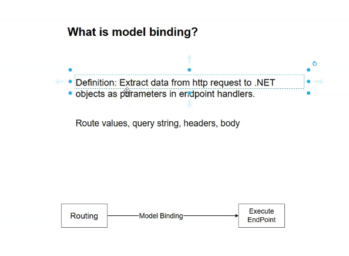
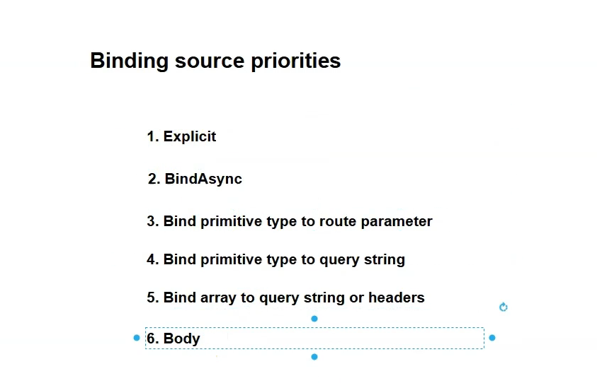

# Minimal API: Model Binding and Validation

## Model Binding in ASP.NET Core

### What Problem Does Model Binding Solve?

- Developers often manually extract data from HTTP requests (route values, query strings, headers, body) to .NET types, which is repetitive and error-prone.
- Model binding automates this process, letting developers focus on business logic instead of parsing HTTP requests.
- The framework handles technical details of extracting data from requests and converting it into .NET objects.

### What Is Model Binding?

- **Definition:** Model binding extracts data from an HTTP request and maps it to the parameters of an endpoint handler method (or controller action).
- The data flows **from the HTTP request into method parameters** automatically.
- This means endpoint handlers can declare parameters such as `int id` or complex types like `Employee employee`, and ASP.NET Core provides these values without manual extraction or conversion.
- 

### Sources of Data Model Binding Uses

Model binding extracts data from four main HTTP request sources:

- **Route values:** Data embedded in the URL path as route parameters.
- **Query string:** Data in the URL after the `?`, e.g., `?page=2`.
- **Headers:** HTTP request headers.
- **Body:** Often JSON or form data payloads.

### How Does ASP.NET Core Model Binding Work?

- ASP.NET Core looks at the parameters of the endpoint handler method.
- For each parameter, it finds matching data from the request sources (route, query, header, body), in that order.
- It converts that raw data into the parameter type (e.g., string to int).
- The framework then calls your handler method with these bound parameters.

### Example

Instead of manually reading values like this:

```c#
app.MapGet("/employees/{id}", (HttpContext context) => {
var id = int.Parse((string)context.Request.RouteValues["id"]);
// Business logic here...
});
```
- You can rely on model binding:
```c#
app.MapGet("/employees/{id}", (int id) => {
// Business logic here, directly using id parameter
});
```

### Terminology Clarification on Data Flow

- Data flows **from the HTTP request to method parameters**.
- However, ASP.NET Core internally **looks at the parameters first**, then finds the source in the HTTP request.
- Official documentation often states model binding "binds the parameter to the HTTP request data"—meaning it matches parameters with data sources.

### When Does Model Binding Happen?

- After routing selects the endpoint handler.
- **Before** the endpoint handler executes.
- Model binding prepares method parameters with proper values extracted from the HTTP request.

### Summary

| Aspect                   | Description                                         |
|--------------------------|-----------------------------------------------------|
| **Definition**           | Extract data from HTTP request to .NET method parameters |
| **Goal**                 | Automate request data parsing so developers focus on business logic |
| **Data Sources**         | Route values, query strings, headers, body         |
| **ASP.NET Core Process** | Looks at parameters → searches HTTP request → converts data → invokes endpoint |
| **When it happens**      | Between routing and endpoint execution              |

### Benefits

- Simplifies code by eliminating manual extraction/parsing.
- Supports both simple types (ints, strings) and complex models (objects).
- Automatically handles binding from multiple data sources.

---

If you want to explore more, see Microsoft's official docs on [Model Binding in ASP.NET Core](https://learn.microsoft.com/en-us/aspnet/core/mvc/models/model-binding).


## Binding to Route Values in ASP.NET Core Minimal APIs

### Implicit vs Explicit Route Binding

- **Implicit binding:** By default, ASP.NET Core matches the parameter name in your endpoint handler to the route parameter in the template.
    ```
    app.MapGet("/employees/{id}", (int id) => {
        // 'id' is automatically bound from the route value
        var employee = repo.GetEmployeeById(id);
        return employee;
    });
    ```
    _The `id` parameter is automatically bound from the `{id}` segment of the route._

- **Explicit binding:** You can use the `[FromRoute]` attribute to specify the data source explicitly.
    ```c#
    app.MapGet("/employees/{id}", ([FromRoute] int id) => {
        // Explicitly stating that 'id' comes from the route value
        var employee = repo.GetEmployeeById(id);
        return employee;
    });
    ```

### Binding with Parameter Name Mismatch

- If your handler uses a variable name different from the route parameter, specify the route key with the `[FromRoute(Name="...")]` attribute:
    ```c#
    app.MapGet("/employees/{id}", ([FromRoute(Name = "id")] int identityNumber) => {
        var employee = repo.GetEmployeeById(identityNumber);
        return employee;
    });
    ```
    _This allows your code to use different variable names while matching the correct route parameter._

### Type Mismatch produces Client Error

- If the parameter and route value types don’t match (e.g., route provides `{id}`, but parameter expects `DateTime`), model binding fails and the response is **HTTP 400 Bad Request**.
    ```c#
    app.MapGet("/employees/{id}", ([FromRoute] DateTime id) => {
        // If {id} is not a date, a 400 error is returned
        return id;
    });
    ```

### Optional Route Parameters

- To make a route parameter optional, use a question mark in the route template:
    ```c#
    app.MapGet("/employees/{id?}", (int? id) => {
        if (id.HasValue)
            return repo.GetEmployeeById(id.Value);
        else
            return null;
    });
    ```
    _Ensure both the route parameter and handler parameter are marked as optional (nullable); otherwise, binding fails._

### Return Values

- When an object (like `Employee`) is returned from an endpoint, ASP.NET Core serializes it as JSON. Browsers will display JSON directly.
- If no value is found (e.g., invalid or missing id), a `null` is returned and the API response will also be `null`.

### Error Handling Summary

| Scenario                                        | Result                         |
|-------------------------------------------------|--------------------------------|
| Route param missing, handler param required      | Exception, binding fails       |
| Route param missing, handler param optional      | Parameter is `null`            |
| Type mismatch (e.g., id=int, value="abc")        | HTTP 400 Bad Request           |
| Name mismatch (no explicit map)                  | Exception, binding fails       |
| Name mismatch (with [FromRoute(Name="")])        | Works, correct binding         |

---

**Key Points:**
- Implicit binding is convenient and relies on parameter names matching.
- Explicit `[FromRoute]` (with or without `Name`) gives you fine control.
- Always ensure parameter types and presence match the route design.
- Optional route parameters require nullable handler parameters.
- Model binding errors return clear HTTP status codes: `404` for not found routes, `400` for bad requests due to type mismatch.


## Binding to Query String in ASP.NET Core Minimal APIs

### Overview

- Similar to route parameter binding, ASP.NET Core supports **binding query string parameters** directly to endpoint handler method parameters.
- Implicit binding works if **parameter names match the query string keys**.
- Explicit binding is possible by using the `[FromQuery]` attribute, especially useful when parameter names differ.

---

### Implicit Query String Binding

- If the endpoint handler parameter name matches the query string key, binding happens automatically.
  
```c#
app.MapGet("/employees", (int id) => {
var employee = repo.GetEmployeeById(id);
return employee;
});
```


- Call like: `/employees?id=3`
- The `id` parameter is bound from the query string.

---

### Explicit Query String Binding

- Use `[FromQuery(Name="...")]` to map a parameter name to a different query string key:

```c#
app.MapGet("/employees", ([FromQuery(Name = "id")] int identityNumber) => {
var employee = repo.GetEmployeeById(identityNumber);
return employee;
});
```

- Call like: `/employees?id=3`
- Binds `id` query string value to parameter `identityNumber`.

---

### Optional Query String Parameters

- Query strings are naturally optional.
- It is recommended to mark the parameter as nullable (e.g., `int?`).

```c#
app.MapGet("/employees", ([FromQuery(Name = "id")] int? identityNumber) => {
if (identityNumber.HasValue)
return repo.GetEmployeeById(identityNumber.Value);
else
return null; // or appropriate response for missing id
});

```

- This avoids HTTP 400 errors when the query string is missing.

---

### Binding Priority: Route Values vs Query String

- If a **route parameter and a query string parameter share the same name**, **the route parameter wins**.
- Example:  
  Request: `/employees/1?id=3`  
  Result: `id` binds to the route value `1`, **ignoring the query string `id=3`**.

---

### Key Takeaways

| Feature                      | Behavior / Example                                      |
|------------------------------|---------------------------------------------------------|
| Implicit binding              | Parameter name = query string key → automatic binding   |
| Explicit binding              | Use `[FromQuery(Name="key")]` for name mismatch         |
| Optional query parameters     | Use nullable types to avoid binding errors              |
| Binding priority              | Route parameters take precedence over query strings     |

---

### Summary

- Binding query strings is as straightforward as route binding in ASP.NET Core Minimal APIs.
- Use `[FromQuery]` for explicit binding or name mismatches.
- Mark query string parameters as optional (nullable) to handle missing values gracefully.
- Route parameters will override query string parameters with the same name.


## Binding to HTTP Headers in ASP.NET Core Minimal APIs

### Overview

#### Header Binding must be done explicitly. There is no implicit binding like in Route Parameters or Query Strings

- Binding endpoint handler parameters from **HTTP headers** requires **explicit binding** using the `[FromHeader]` attribute.
- Unlike route or query binding where implicit binding works by matching parameter names, headers always require explicit declaration.
- The parameter name in the handler must match the HTTP header key, or you can explicitly specify the header name via the attribute's `Name` property.

---

### Explicit Header Binding Example
```c#
app.MapGet("/employees", ([FromHeader] int id) => {
var employee = repo.GetEmployeeById(id);
return employee;
});
```

- To call this, you must include an HTTP header `id` with the employee ID value.
- Browsers usually can't set custom headers, so tools like Postman are used for testing.

---

### Binding with Different Parameter and Header Names

- If your parameter name differs from the header key, specify the header key explicitly:

```c#
app.MapGet("/employees", ([FromHeader(Name = "identity")] int identityNumber) => {
var employee = repo.GetEmployeeById(identityNumber);
return employee;
});
```
- 
- The header key must be `"identity"` to bind correctly, regardless of the parameter name.

---

### Behavior and Error Handling

- If the required header is missing or the value cannot be converted to the parameter type, ASP.NET Core returns **HTTP 400 Bad Request**.
- Parameter names or explicit names must correspond exactly to header keys to avoid binding errors.

---

### Summary Table

| Feature                          | Example                                           | Notes                                            |
|---------------------------------|--------------------------------------------------|--------------------------------------------------|
| Binding header implicitly        | Not supported                                    | Headers require explicit binding                 |
| Explicit binding                 | `[FromHeader] int id`                             | Binds from header named "id"                      |
| Different names                 | `[FromHeader(Name="identity")] int identityNumber`| Use when parameter and header names differ       |
| Missing or mismatched header     | HTTP 400 Bad Request                              | Binding fails if header missing or parsing fails |

---

### Key Takeaways

- Always use `[FromHeader]` to bind values from HTTP headers in Minimal APIs.
- Match header keys with parameter names or use the `Name` property to map differently.
- Use tools like Postman to test header-based endpoints, as browsers don’t allow setting headers from URL.


## Using `[AsParameters]` Attribute to Group Parameters in ASP.NET Core Minimal APIs

### Problem: Too Many Parameters from Different Sources

- Sometimes endpoint handlers have multiple parameters coming from different parts of the HTTP request:
  - Route parameters (`[FromRoute]`)
  - Query strings (`[FromQuery]`)
  - Headers (`[FromHeader]`)
- This can clutter method signatures and make it hard to manage.

---

### Example with Multiple Separate Parameters
```c#
app.MapGet("/employees/{id:int}",
(int id, [FromQuery] string name, [FromHeader] string position) =>
{
var employee = repo.GetEmployeeById(id);
if (employee != null)
{
employee.Name = name;
employee.Position = position;
}
return employee;
});
```
- Here, `id` is from the route, `name` is from the query string, and `position` is from the HTTP header.

---

### Solution: Group Parameters Using a Class or Struct

- Define a class or struct representing all parameters, with attributes specifying their data source:

```c#
public class GetEmployeeParameter
{

[FromRoute]    
public int Id { get; set; } // bound from route implicitly by name
[FromQuery]
public string Name { get; set; } // bound from query implicitly by name
[FromHeader]                     // must be explicitly specified for headers
public string Position { get; set; }
}
```

- Use `[AsParameters]` attribute on this parameter in the endpoint:

```c#
app.MapGet("/employees/{id:int}", ([AsParameters] GetEmployeeParameter param) =>
{
var employee = repo.GetEmployeeById(param.Id);
if (employee != null)
{
employee.Name = param.Name;
employee.Position = param.Position;
}
return employee;
});

```

- This implicitly expands to individual parameters for model binding.

---

### Benefits of `[AsParameters]`

- Simplifies endpoint method signatures by grouping related parameters.
- Encourages clean, maintainable and organized code.
- Works with classes or structs.
- Preserves the ability to specify explicit binding attributes (`[FromRoute]`, `[FromQuery]`, `[FromHeader]`) on properties.

---

### Notes

- Parameter names still drive implicit binding for `[FromRoute]` and `[FromQuery]`.
- Header bindings require explicit attribute `[FromHeader]`.
- This approach keeps handler signatures concise even when multiple parameters come from different HTTP request parts.

---

### Summary

| Concept                  | Description                                  |
|--------------------------|----------------------------------------------|
| Problem                  | Multiple parameters from different sources clutter method signature |
| Solution                 | Group parameters in a class/struct and use `[AsParameters]`            |
| How it works             | Properties map to individual parameters      |
| Explicit binding remains | Use `[FromHeader]`, `[FromQuery]` on properties as needed               |
| Result                   | Cleaner, more maintainable endpoint handlers |

---


## Binding Arrays from HTTP Requests in ASP.NET Core Minimal APIs

### Overview

- You can bind **arrays** from HTTP requests directly to endpoint handler parameters.
- Arrays are best passed through **query strings** or **HTTP headers**.
- Binding multiple values with the same key in query strings or headers automatically maps to arrays.

---

### Binding an Array from Query String Example
```c#
app.MapGet("/employees", ([FromQuery] int[] id) =>
{
var employees = EmployeeStore.Employees
.Where(e => id.Contains(e.Id))
.ToList();
return employees;
});

```

- Request: `/employees?id=1&id=2`
- This returns JSON array of employees with IDs 1 and 2.

---

### Binding an Array with Different Parameter Name

- If your parameter name differs from the query string key, use the `Name` property:

```c#
app.MapGet("/employees", ([FromQuery(Name = "id")] int[] ids) =>
{
var employees = EmployeeStore.Employees
.Where(e => ids.Contains(e.Id))
.ToList();
return employees;
});

```


- Request: `/employees?ids=1&ids=3`
- Binds the `ids` query string values to `int[] ids` parameter.

---

### Binding an Array from HTTP Headers
```c#
app.MapGet("/employees", ([FromHeader] int[] id) =>
{
var employees = EmployeeStore.Employees
.Where(e => id.Contains(e.Id))
.ToList();
return employees;
});

```

- Header example:  
  `id: 1`  
  `id: 3`  
- Returns array of employees matching IDs 1 and 3.

---

### Important Notes

- Query strings and headers support multiple values with the same key, enabling automatic array binding.
- Parameter names and query/header keys should match or use explicit `[FromQuery(Name=...)]` / `[FromHeader(Name=...)]`.
- Returned data is serialized as a JSON array.

---

### Summary Table

| Binding Source    | Usage Example                          | Notes                              |
|-------------------|--------------------------------------|----------------------------------|
| Query String      | `[FromQuery] int[] id`                | Bind repeated query keys like ?id=1&id=2 |
| Query String (Name Mismatch) | `[FromQuery(Name = "id")] int[] ids` | Matches query key `id` with parameter `ids` |
| HTTP Header       | `[FromHeader] int[] id`               | Bind repeated header keys named `id` |

---

### Conclusion

Passing arrays via query strings or headers is straightforward in ASP.NET Core Minimal APIs. This allows clients to request multiple values in a clean and well-supported manner.


## Binding to the HTTP Body in ASP.NET Core Minimal APIs

### Overview

- **Complex types** (objects) in endpoint parameters are *automatically* bound from the HTTP request body.
- This is most commonly used in POST, PUT, or PATCH endpoints, where the client sends JSON data to be deserialized into a .NET object.
- ASP.NET Core minimal APIs expect the body to be JSON by default.

---

### Example: Binding a Complex Type from HTTP Body

```c#
app.MapPost("/employees", (Employee employee) =>
{
if (employee == null || employee.Id <= 0 || string.IsNullOrWhiteSpace(employee.Name))
return Results.BadRequest("Employee is not provided or is not valid.");
// Handle further logic, e.g., add employee to store
return Results.Ok("Employee added successfully.");
});
```
- The endpoint receives a JSON payload representing the `Employee` object.
- Example request body:

```json
{
"id": 5,
"name": "Tom Anderson",
"position": "Software Developer"
}

```

---

### Key Points

- **Automatic binding**: Declaring a complex type parameter makes the framework read and deserialize the HTTP body as JSON.
- **Primitive types** are NOT bound from the body; only complex types (class, record, struct) can be.
- **If the JSON is invalid or missing**, ASP.NET Core responds with **HTTP 400 Bad Request**.
- **The body must be valid JSON**; other formats (like XML) are not supported in minimal APIs.
- **Only one complex body parameter** can be bound per endpoint.

---

### Limitations in Minimal APIs

- Only **JSON** is supported for automatic body binding (unlike MVC, which allows configuring other formats such as XML).
- You **cannot bind multiple complex types from the body**; the body has to map cleanly to a single class or record.
- Body binding is *only* supported for the following verbs: **POST**, **PUT**, **PATCH** (not GET, DELETE, etc).
- If the request body is missing, malformed, or of the wrong type, the response will be a **400 Bad Request**.

---

### What Not To Do

- Don't try to send a JSON array or mixed types if the parameter expects a single object.
- Don't use GET or DELETE with a body; HTTP semantics discourage this and the server may misinterpret or reject the request.

---

### Error Cases

| Scenario                        | Result/Status Code         |
|----------------------------------|---------------------------|
| Valid JSON matches type          | Bound successfully        |
| Missing/invalid body             | 400 Bad Request           |
| Wrong format (e.g., XML)         | 400 Bad Request           |
| Not JSON-compliant               | 400 Bad Request           |

---

### Summary

- ASP.NET Core minimal APIs provide intuitive, automatic model binding for complex types from the HTTP body (JSON only).
- Declaring a complex type parameter in your endpoint is all that’s needed; the framework handles reading and deserialization.
- Invalid, missing, or badly formatted bodies result in `400 Bad Request`.


## Custom Model Binding with `BindAsync` in ASP.NET Core Minimal APIs

### Overview

- Normally, complex types in endpoint parameters are bound from the HTTP body (JSON).
- **Custom binding** allows you to bind a complex type from any source (query, header, etc.) by implementing a static `BindAsync` method in your class.
- `BindAsync` provides complete control over how data is extracted and bound to your model.

---

### Example: Binding Complex Type from Query String (and Header)

#### 1. Create the Model with a Custom `BindAsync`

```c#
public class Person
{
public int Id { get; set; }
public string Name { get; set; }
// Custom binding logic—note the static method and signature
public static ValueTask<Person?> BindAsync(HttpContext context, ParameterInfo parameter)
{
    // Extract 'id' from query string
    string? idString = context.Request.Query["id"];
    int id = 0;
    int.TryParse(idString, out id);

    // Extract 'name' from query string or header as needed
    string? name = context.Request.Query["name"];
    // Alternative: To bind from header
    // string? name = context.Request.Headers["name"];

    return new ValueTask<Person?>(new Person { Id = id, Name = name });
}
}

```

#### 2. Use the Model as a Parameter

```c#
app.MapGet("/people", (Person p) => $"ID: {p?.Id}, Name: {p?.Name}");
```

- Query: `/people?id=1&name=Frank`
- Response: `ID: 1, Name: Frank`

#### 3. To Bind from Header Instead

- Change the `BindAsync` method to retrieve values from `context.Request.Headers["name"]`, and test using a tool like Postman by providing the `name` header and `id` in the query string.

---

### How Does It Work?

- If a parameter type defines a static `BindAsync(HttpContext, ParameterInfo)` method, the runtime will use this for model binding.
- Inside `BindAsync`, you can extract data from **any part of the `HttpContext`**: query, route, headers, cookies, etc.
- For endpoints, using a complex type with custom `BindAsync` will use your custom logic, rather than default body binding.

---

### Benefits

- Full control over how request data is mapped to your model.
- Bind to sources other than the body (or combine sources).
- Avoids extra boilerplate code in endpoint handlers.

---

### Summary Table

| Source     | How to Extract in `BindAsync`                      |
|------------|----------------------------------------------------|
| Query      | `context.Request.Query["key"]`                     |
| Header     | `context.Request.Headers["key"]`                   |
| Route      | `context.Request.RouteValues["key"]`               |
| Body       | (custom deserialization if needed)                 |

---

### Key Points

- Implementing static `BindAsync` enables full custom model binding in Minimal APIs.
- Use for advanced scenarios (e.g., binding to composite models from multiple sources).
- This technique is especially powerful as the logic lives inside the type, not scattered across handlers.

## Binding Source Priorities in ASP.NET Core Minimal APIs

### Overview

- When multiple sources can satisfy a parameter (headers, query, route, body), **binding follows a defined priority order**.
- Understanding this order helps troubleshoot and predict binding behavior when values may exist in multiple places.

---

### The Binding Priority Sequence

Binding occurs in the following order:

1. **Explicit Binding Attributes**
   - If a parameter uses an explicit binding source (e.g., `[FromQuery]`, `[FromRoute]`, `[FromHeader]`, `[FromBody]`), **that source takes precedence above all else**.
   - Example:
     ```c#
     app.MapGet("/people", ([FromBody] Person p) => ...);
     ```
     - Even if the `Person` class has a `BindAsync` method, `[FromBody]` is used.

2. **Custom `BindAsync` on Complex Types**
   - If the type declares a static `BindAsync(HttpContext, ParameterInfo)` method, this method provides custom binding logic and is prioritized above default binding.
   - Example:
     ```c#
     public class Person {
         // Static BindAsync method here...
     }
     // Endpoint
     app.MapGet("/people", (Person p) => ...);
     ```
     - The logic in `BindAsync` **overrides normal binding behavior**.

3. **Primitive Types from Route Parameters**
   - If the handler parameter is a primitive type (e.g., `int`, `string`) and its name matches a route parameter, the value is bound from the route.
   - Example:
     ```
     app.MapGet("/people/{id}", (int id) => ...);
     ```
     - Here, `id` is taken from the `/people/{id}` segment.

4. **Primitive Types from Query Strings**
   - If the parameter is primitive and not satisfied by route, binding tries to satisfy from the query string (e.g., `/people?id=1`).
   - Example:
     ```
     app.MapGet("/people", (int id) => ...);
     ```
     - Binds `id` from the query string if not present in route.

5. **Arrays from Query Strings or Headers**
   - When binding to an array parameter (e.g., `int[] id`), repeated keys in the query string or header fill the array, e.g., `/people?id=1&id=2` or multiple `id` headers.
   - Example:
     ```
     app.MapGet("/people", ([FromQuery] int[] id) => ...);
     ```

6. **Complex Types from Body (Default)**
   - If none of the above applies and the parameter is a complex type, the framework will try to bind it from the request body (usually as JSON).
   - Example:
     ```
     app.MapPost("/people", (Person p) => ...);
     ```
     - The framework expects a JSON body.

---

### Table: Binding Source Priority

| Priority | What Binds?                            | Example/Notes                                                   |
|----------|----------------------------------------|-----------------------------------------------------------------|
| 1        | Explicit Attributes                    | `[FromQuery]`, `[FromRoute]`, `[FromHeader]`, `[FromBody]`      |
| 2        | Custom `BindAsync` on type             | Static `BindAsync` method on parameter type                     |
| 3        | Primitive type from route              | `/people/{id}` maps to `(int id)` parameter                     |
| 4        | Primitive type from query string       | `/people?id=1` maps to `(int id)` parameter                     |
| 5        | Array from query string or header      | `/people?id=1&id=2`, or headers with repeated keys              |
| 6        | Complex type from body (default)       | e.g., `(Person p)` for JSON body                                |

---

### Key Points

- **Explicit source attributes always win**—if set, binding comes from the marked source regardless of other sources or methods.
- **Custom `BindAsync`** on a type has next highest priority; the logic inside it is followed.
- **For primitive types**, route binds are tried before query string.
- **Arrays** fill automatically from multiple query or header values.
- **Complex types** bind from the body by default.

---
- 
If model binding "doesn't work," review this priority list to troubleshoot why a parameter isn't being filled as expected!


## Model Validation in ASP.NET Core Minimal APIs

### Overview

- **Model binding** extracts data from the HTTP request into .NET objects, but **model validation** ensures this data is correct and safe to use.
- Model validation is crucial since data from users (including malicious or accidental bad input) must be checked before use.

---

### How Model Validation Works

1. **Annotate your model** using C# data annotations (from `System.ComponentModel.DataAnnotations`).
    - Common attributes: `[Required]`, `[Range(min, max)]`, `[StringLength]`, `[RegularExpression]`, etc.

2. **Enable validation**:
    - For ASP.NET Core Minimal APIs, add the NuGet package:  
      `MinimalApis.Extensions`
    - Activate validation in your endpoint with `.AddEndpointFilterFactory(ValidationFilterFactory.Create())`
      (or, for simpler APIs, see your package's usage docs).
    - For some libraries, you may instead use `.WithParameterValidation()` at the end of your endpoint mapping.

3. **Validation Process**:
    - After model binding and before your endpoint executes, .NET validates your model according to the attributes.
    - If validation fails, requests return **HTTP 400 Bad Request** with error details.
    - If validation succeeds, your handler executes with a valid model.

---

### Example: Data Annotations + Validation

```c#
using System.ComponentModel.DataAnnotations;

public class Employee
{
[Required]
public string Name { get; set; }
[Range(50000, 200000)]
public int Salary { get; set; }

// Position not required by default
public string? Position { get; set; }
}

// In Program.cs or similar:
app.MapPost("/employees", (Employee employee) =>
{
// Only called if model is valid
repo.AddEmployee(employee);
return Results.Ok("Employee added successfully");
})
.WithParameterValidation(); // This enables parameter validation
```


---

### Common Validation Attributes

| Attribute             | Purpose                                        | Example                                   |
|-----------------------|------------------------------------------------|-------------------------------------------|
| `[Required]`          | Property must have a value                     | `[Required] public string Name { get; set; }` |
| `[Range(a, b)]`       | Value must be within specified range           | `[Range(50000, 200000)] int Salary`       |
| `[StringLength(n)]`   | Limits string length                           | `[StringLength(50)] string FullName`      |
| `[RegularExpression]` | Must match regex pattern                       | `[RegularExpression("^[0-9]+$")] string ZipCode` |
| `[EmailAddress]`      | Must be a valid email address                  | `[EmailAddress] string Email`             |
| `[Compare]`           | Two properties must match                      | `[Compare("Password")] string ConfirmPwd` |

_For a full list, see [`System.ComponentModel.DataAnnotations`](https://learn.microsoft.com/en-us/dotnet/api/system.componentmodel.dataannotations?view=net-9.0)._

---

### Error Handling

- Invalid data returns **400 Bad Request** with error messages.
- Handler logic executes only if all validations pass.
- Developers can add (optional) custom validation by checking attributes or implementing `IValidatableObject` in models.

---

### Recap Diagram
Routing → Model Binding → Model Validation → Endpoint Handler
│ │ │
(binds data) (verifies correctness) (handler logic runs if valid)


---

### Key Points

- Always validate user-supplied data to safeguard your application and maintain data integrity.
- Data annotation attributes are a declarative—and reusable—way to define validation rules.
- Minimal API requires a package or explicit call to support annotation-based validation.
- Most validation errors are caught before your handler is invoked, returning helpful responses to API clients.

## Custom Model Validation with Validation Attributes in ASP.NET Core Minimal APIs

### Overview

- Built-in **data annotations** (e.g., `[Required]`, `[Range]`) validate individual properties.
- For more complex validation logic involving **multiple properties at once**, create a **custom validation attribute**.
- Custom validation attributes derive from `ValidationAttribute` and override the `IsValid` method or `IsValid` with context.

---

### Scenario: Complex Validation Logic

- Example rule:  
  If the employee's **position** is `"Manager"`, then their **salary** must be at least $100,000.
- This requires inspecting *both* `Position` and `Salary` in validation, which cannot be done with simple property-level attributes alone.

---

### Steps to Create Custom Validation Attribute

1. **Create a class deriving from `ValidationAttribute`:**

```c#
public class EmployeeEnsureSalaryAttribute : ValidationAttribute
{
protected override ValidationResult? IsValid(object? value, ValidationContext validationContext)
{
var employee = validationContext.ObjectInstance as Employee;
    if (employee != null)
    {
        if (!string.IsNullOrWhiteSpace(employee.Position) &&
            employee.Position.Equals("Manager", StringComparison.OrdinalIgnoreCase) &&
            employee.Salary < 100_000)
        {
            return new ValidationResult("Manager's salary has to be greater or equal to $100,000.");
        }
    }

    return ValidationResult.Success;
}
}


```

2. **Apply the attribute to the model class property:**

```c#
public class Employee
{
[Required]
public string Name { get; set; }
[EmployeeEnsureSalary]  // Custom validation applied here
public int Salary { get; set; }

public string? Position { get; set; }

}
```


3. **Enable validation in your Minimal API endpoint:**

```c#
app.MapPost("/employees", (Employee employee) =>
{
// Validation automatically occurs before this runs
repo.AddEmployee(employee);
return Results.Ok("Employee added successfully");
})
.WithParameterValidation(); // Required to trigger data annotation validations

```
- If the above code doesnot work use this alternative:
```c#
app.MapPost("/employees", (Employee employee) =>
{
    //var employee = await context.Request.ReadFromJsonAsync<Employee>();
    if (employee == null)
    {
        return Results.BadRequest("Invalid employee data.");
    }
    var validationResults = new List<ValidationResult>();
    var context = new ValidationContext(employee, null, null);
    if (!Validator.TryValidateObject(employee, context, validationResults, true))
    {
        // Collect errors and return as 400 Bad Request
        var errors = validationResults.Select(v => v.ErrorMessage).ToList();
        return Results.BadRequest(errors);
    }

    if (LearnRouting.Repository.EmployeeRepository.AddEmployee(employee))
    {
        return Results.Created($"/employees/{employee.Id}", employee);
    }
    else
    {
        return Results.Conflict("Employee with the same ID already exists.");
    }
});

```


---

### Testing the Validation

- Posting an employee with position `"Manager"` and salary less than 100,000 will return **HTTP 400 Bad Request** with the custom error message.
- Salaries above or equal to 100,000 or other positions pass validation normally.
- Other annotations like `[Required]` still function concurrently.

---

### Benefits of Custom Validation Attributes

- Validate **cross-property rules**.
- Encapsulate complex business logic cleanly.
- Reusable across your application.
- Integrate seamlessly with existing data annotation-based validation infrastructure.

---

### Summary Table

| Aspect                    | Description                                           |
|---------------------------|-------------------------------------------------------|
| Purpose                   | Validate composite rules involving multiple properties |
| Implementation            | Derive from `ValidationAttribute`, override `IsValid` |
| Usage                     | Decorate model properties                               |
| Integration               | Works with Minimal API's parameter validation          |
| Example scenario          | `Position == "Manager"` requires `Salary >= 100000`    |

---

## Assignment: Binding & Validation for Registration Information

### Requirements

- **Registration model** must include three fields:
  - `Email`
  - `Password`
  - `ConfirmPassword`
- **Validation Rules:**
  - All fields are **required**.
  - `Email` must have a **valid email address format**.
  - `Password` must be **at least 6 characters long**.
  - `Password` and `ConfirmPassword` values **must match**.

---

### Tasks

1. **Define the registration model** with appropriate data annotation attributes for validation.

2. **Create two endpoint handlers:**
    - **First endpoint:** Accept registration info **from query strings**.
    - **Second endpoint:** Accept registration info **from HTTP body** (as JSON).

3. **No backend persistence is required.** Focus solely on **model binding and validation**.

4. **After implementing both endpoints**, consider which approach (query string vs. body binding) is more suitable for user registrations and explain why.

---

### Example Model (with Data Annotations)
```c#
using System.ComponentModel.DataAnnotations;

public class Registration
{
[Required]
[EmailAddress]
public string Email { get; set; }
[Required]
[MinLength(6)]
public string Password { get; set; }

[Required]
[Compare("Password", ErrorMessage = "Passwords must match.")]
public string ConfirmPassword { get; set; }

}
```


---

### Summary Table

| Field           | Validation              |
|-----------------|------------------------|
| Email           | Required, Email format  |
| Password        | Required, Min. 6 chars |
| ConfirmPassword | Required, Matches Password |

---

### Deliverables

- Two endpoint handlers:
  - One binding registration info from **query string**
  - One binding from **JSON body**
- Model binding and validation implemented as shown.
- Short explanation of which approach is best for user registration.

---

## Implementation

- Implement the Registration class as follows:
```c#
public class Registration
{
    [Required]
    [EmailAddress(ErrorMessage = "A valid email is required.")]
    public string Email { get; set; }
    [Required]
    [MinLength(6, ErrorMessage = "Password must be at least 6 characters.")]
    public string Password { get; set; }

    [Required(ErrorMessage = "Compare Password is required")]
    [Compare("Password", ErrorMessage = "Passwords must match.")]
    public string ConfirmPassword { get; set; }

}

```

- Use the following code to define endpoints:
```c#
app.MapGet("/register/query", ([FromQuery] string email,
[FromQuery] string password,
[FromQuery(Name = "confirmPassword")] string confirmPassword) =>
{
    var reg = new Registration
    {
        Email = email,
        Password = password,
        ConfirmPassword = confirmPassword,
    };
    var validationResult = ValidateModel(reg);
    if (validationResult != null) return validationResult;

    // Registration success logic (no DB/persistence needed for this assignment)
    return Results.Ok("Registration info valid (from query string)!");
});

// 2. Registration via HTTP body (JSON)
app.MapPost("/register/body", ([FromBody] Registration reg) =>
{
    var validationResult = ValidateModel(reg);
    if (validationResult != null) return validationResult;

    // Registration success logic (no DB/persistence needed for this assignment)
    return Results.Ok("Registration info valid (from HTTP body)!");
});

// Helper for validation (because no WithParameterValidation extension here)
IResult ValidateModel(object model)
{
    var context = new ValidationContext(model);
    var results = new List<ValidationResult>();
    if (!Validator.TryValidateObject(model, context, results, true))
    {
        return Results.BadRequest(results.Select(r => r.ErrorMessage).ToList());
    }
    return null;
}

```


 