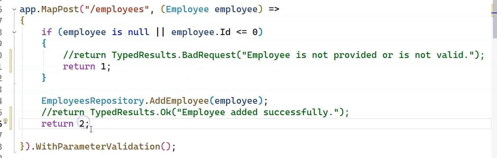
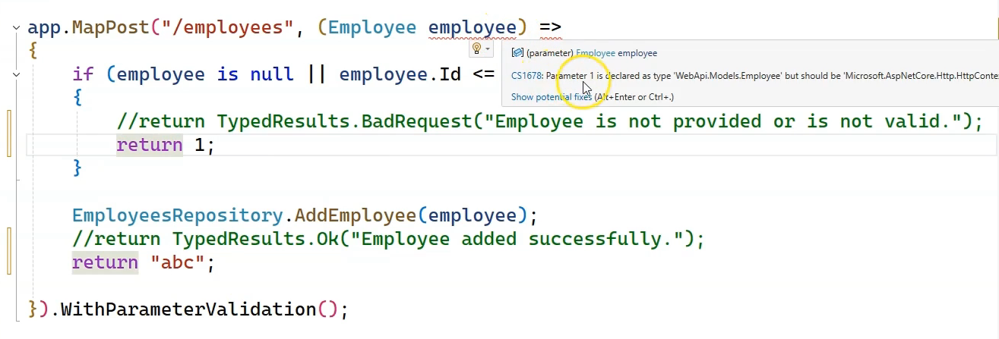
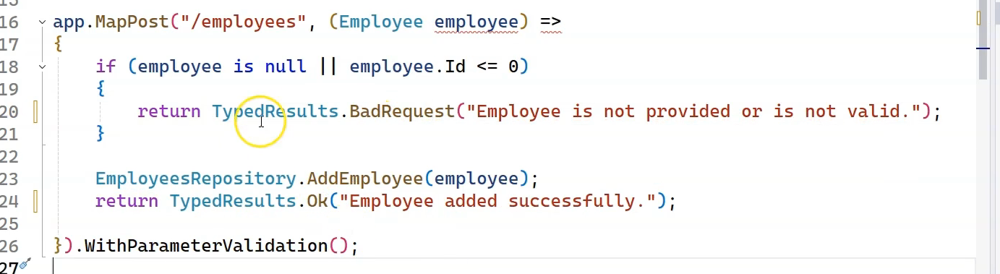
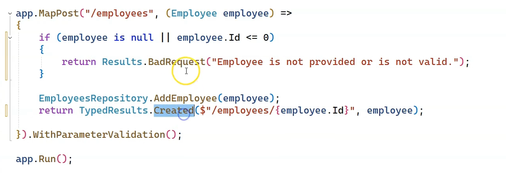

## Producing Results with Minimal APIs in ASP.NET Core

### Overview

- Minimal APIs allow you to return different types of results directly from endpoint handlers.
- Return types impact the HTTP response content, status code, and serialization.

---

### Common Return Types

1. **`string`**
   - Returned as plain text with content type `text/plain`.
   - Example:
     ```
     app.MapGet("/hello", () => "Hello World");
     ```
   - Responds with HTTP 200 and plain text body "Hello World".

2. **Any other type (`T`)**
   - ASP.NET Core serializes the object to JSON.
   - Content type is `application/json`.
   - Example:
     ```
     app.MapGet("/employee", () => new { Name = "Alice", Position = "Developer" });
     ```
   - Responds with HTTP 200 and JSON body.

3. **`IResult`-based**
   - Provides control over status code, headers, and body.
   - `IResult` is an interface with a single method that writes the response to the `HttpContext`.
   - ASP.NET Core provides helper methods in the static `Results` class to easily create `IResult` instances.

---

### Using `IResult` and Helper Methods

- Instead of returning raw objects or strings, you can return `IResult` for explicit control.
  
- **Successful response with status 200:**
```c#
app.MapGet("/employees", () =>
{
var employees = repo.GetAll();
return Results.Ok(employees); // status 200 with JSON body
});

```
- **Bad request with status 400:**
```c#
app.MapPost("/employees", (Employee employee) =>
{
if (!IsValid(employee))
return Results.BadRequest("Invalid employee data");
repo.Add(employee);
  return Results.Created($"/employees/{employee.Id}", employee);

});

```

- There are many helper methods like `Results.Ok()`, `Results.BadRequest()`, `Results.NotFound()`, `Results.NoContent()`, etc.

---

### Typed Results

- Typed results like `TypedResults.Ok<T>()` improve API documentation tooling and type inference.
- They work similarly to `Results` but carry generic type information.

```c#
// Example of using TypedResults in ASP.NET Core Minimal APIs

app.MapGet("/employees/{id:int}", (int id) =>
{
    var employee = EmployeeRepository.GetById(id);

    if (employee == null)
    {
        // Return a typed NotFound result with generic parameter to improve tooling and docs
        return TypedResults.NotFound($"Employee with ID {id} not found");
    }

    // Return a typed Ok result including the employee object
    return TypedResults.Ok(employee);
});

```

- TypedResults.Ok(employee) returns a 200 OK response with the employee object serialized as JSON.
- TypedResults.NotFound(message) returns a 404 Not Found response with an optional message in the body.
- Using TypedResults<T> provides better compile-time type information and improves OpenAPI/Swagger documentation generation compared to untyped Results.

---

### Working Directly with `HttpContext`

- For ultimate customization, you can implement `IResult` yourself or manipulate `HttpContext.Response` directly.
- However, the helper methods are sufficient for most scenarios.

---

### Summary Table

| Return Type          | Behavior                          | Example                         |
|----------------------|---------------------------------|--------------------------------|
| `string`             | Returns plain text, status 200  | `"Hello World"`                 |
| `T` (any object)     | Returns JSON serialized object  | `new { Name = "Alice" }`       |
| `IResult`            | Custom control over status, headers, body | `Results.Ok()` or `Results.BadRequest()` |
| `TypedResults<T>`    | Typed version, better for docs  | `TypedResults.Ok(employees)`   |

---

### Key Takeaways

- Minimal APIs support flexible returns: strings, JSON objects, or full HTTP responses.
- Use `IResult` and the helper `Results` methods to explicitly control HTTP status codes and responses.
- Typed results enhance developer experience and API documentation.
- Direct manipulation of `HttpContext` for response is rarely needed thanks to these helpers.

---

## Mixing and Matching Results and TypedResults in ASP.NET Core Minimal APIs

### Overview

- **Results** and **TypedResults** are both used to generate API responses, but their usage affects return type compatibility.
- **TypedResults** improve type inference, OpenAPI docs, and strictness, but all return statements in a handler must use the same typed result.
- You may need to **mix TypedResults and untitled Results** to correctly match return types, especially when returning different result types in different code branches.
- 
- Change the return type like this and we get an error:
- 
- We need consistent return types
- For TypedResults we get this error:
- 
- This is a limitation of TypedResults
- 

---

### Key Behaviors

- **TypedResults require consistent return types:**  
  If your handler might return either `TypedResults.Created` or `TypedResults.BadRequest`, you'll get a type error—because these are different generic types.
- **Results (untyped):**  
  The `Results` class returns untyped `IResult`, so you can return any kind of result (`Ok`, `BadRequest`, `Created`, etc.) in one endpoint handler without type errors.
- **Mixing strategy:**  
  Use `TypedResults` for the main/expected ("happy path") return, and `Results` for alternate or error returns when type mismatch would occur.

---

### Example

```c#
app.MapPost("/employees", (Employee employee) =>
{
if (employee == null)
{
// Use Results for error response (compatible with any IResult)
return Results.BadRequest("Employee is not provided or is not valid.");
}
// Assign next available ID, add employee
employee.Id = EmployeeRepository.Employees.Any()
    ? EmployeeRepository.Employees.Max(e => e.Id) + 1
    : 1;
EmployeeRepository.Employees.Add(employee);

// Use TypedResults for creation (typed result)
return TypedResults.Created($"/employees/{employee.Id}", employee);
});
```

- If the model is valid, returns a **201 Created** (typed result).
- If the model is invalid, returns a **400 Bad Request** (untyped result via `Results`).

---

### Why Not Just TypedResults Everywhere?

- Each `TypedResults` helper produces a different **generic type** (e.g., `TypedResults.Created<Employee>` vs `TypedResults.BadRequest<string>`).
- Minimal APIs expect ALL branches to return the same type.
- Using at least one branch as untyped `Results` (i.e., `IResult`) lets you mix different results without compile errors.

---

### Practical Tips

- Use **TypedResults** for primary/"happy path" responses when possible for better tooling.
- Use **Results** for error/alternate branches, or if you want to freely mix result types.
- Ensure any new resource creation (POST) returns **201 Created** and sets the appropriate `Location` header.

---

### Summary Table

| Return Helper       | Use When           | Type-strict?  | Example                      |
|---------------------|--------------------|---------------|------------------------------|
| `TypedResults.Ok`   | Normal responses   | Yes           | `TypedResults.Ok(obj)`       |
| `TypedResults.Created` | Resource create  | Yes           | `TypedResults.Created(url, obj)` |
| `Results.BadRequest`   | Error branches   | No            | `Results.BadRequest(msg)`    |
| `Results` (general)    | Mix types freely | No            | `Results.NotFound()`         |

---

**Key takeaway:**  
- Use `TypedResults` for main cases where strict typing is beneficial; mix with `Results` to handle branches that require different types or when avoiding type errors.

## What is the Problem Details Standard (RFC 7807) in ASP.NET Core Minimal APIs?
- We need it to standardize the results rather than expecting the client to customize error handling as per different types of results.
### Overview

- **Problem Details** (RFC 7807) is a standardized JSON format for HTTP API error responses.
- Its goal: Ensure all errors—validation, server, or custom—follow a predictable structure, making it easier for clients to parse and handle different error scenarios systematically.

---

### Why Is It Needed?

- Without a standard, each error might have a different structure, causing confusion and making error handling harder for API consumers.
- ProblemDetails ensures **every error response has the same format**, so code can reliably extract the error type, title, status code, and more.

---

### The JSON Structure

A typical Problem Details response (`application/problem+json`) looks like:

```json
{
"type": "https://example.com/probs/out-of-credit",
"title": "You do not have enough credit.",
"status": 403,
"detail": "Your current balance is 30, but that costs 50.",
"instance": "/account/12345/msgs/abc"
}

```

Common fields:
- `type` (string): A URI reference that identifies the problem type.
- `title` (string): Short, human-readable summary of the problem type.
- `status` (number): HTTP status code generated for this occurrence.
- `detail` (string, optional): Human-readable explanation specific to this occurrence.
- `instance` (string, optional): URI reference for this specific occurrence.

Validation errors may also include a field (like `errors`) mapping property names to error messages.

---

### Using Problem Details in Minimal API

- ASP.NET Core provides built-in support via the `ProblemDetails` class and helpers like `Results.Problem` or `Results.ValidationProblem`.
- **Example for manual error construction:**

```c#
app.MapPost("/employees", (Employee employee) =>
{
if (employee == null || employee.Id < 0)
{
var errors = new Dictionary<string, string[]>
{
{ "id", new[] { "Employee is not provided or is not valid." } }
};
return Results.ValidationProblem(errors);
}
// Normal creation logic here...
return Results.Created($"/employees/{employee.Id}", employee);
});

```

- When using model validation (such as with data annotations and minimal APIs), failed validation automatically returns a `ProblemDetails`-compliant response.

---

### Best Practices

- **Always** use ProblemDetails (RFC 7807) responses for all errors in public APIs.
- Use `Results.Problem()` for general errors, `Results.ValidationProblem()` for validation errors.
- This ensures your responses are predictable, self-documenting, and easy for clients to handle.

---

### Summary Table

| Purpose                      | Usage in Minimal API                   | Typical Fields       |
|------------------------------|----------------------------------------|---------------------|
| General errors               | `Results.Problem()`                    | type, title, status, detail, instance |
| Validation errors            | `Results.ValidationProblem(errorsDict)` | + errors dictionary |
| Automatic for validation     | Data annotations + validation middleware| as above            |

---

**Key Takeaway:**  
Using the Problem Details standard (`application/problem+json`) creates uniform, machine-readable, and client-friendly error responses—making your APIs more robust, maintainable, and user friendly.


## Standardizing API Results in ASP.NET Core Minimal APIs

### Problem: Inconsistent API Error Responses

- Even when using **Problem Details** and `Results.ValidationProblem()`, different error scenarios can produce **inconsistent response bodies**.
- For example:
  - Validation failures produce a JSON with `"type"`, `"title"`, `"status"`, and detailed error messages (conforms to RFC 7807).
  - A missing resource (404 Not Found) often returns an empty body, breaking expected JSON format consistency.
  - Unhandled exceptions can produce custom error shapes, differently structured from validation errors.

---

### Why Consistency Matters

- Consistent response formats allow API consumers to reliably parse and handle errors.
- Inconsistent formats require extra client-side logic and lead to brittle integrations.

---

### How to Enforce Consistent Error Responses

1. **Use Exception Handling Middleware**

- Add `app.UseExceptionHandler()` early in the middleware pipeline.
- In non-development environments, this captures unhandled exceptions and returns a standardized Problem Details JSON response.

2. **Add Status Code Pages Middleware**

- Use `app.UseStatusCodePages()` to ensure error status codes (like 404) also return JSON problem details instead of empty or inconsistent bodies.

---

### Example Setup in `Program.cs`

```c#
var builder = WebApplication.CreateBuilder(args);
var app = builder.Build();

if (!app.Environment.IsDevelopment())
{
// Handles global exceptions and produces RFC 7807 JSON error responses
app.UseExceptionHandler();

// Produces standardized JSON error responses for status codes like 404
app.UseStatusCodePages();

}


app.MapPost("/employees", (Employee employee) =>
{
if (employee == null || employee.Id < 0)
{
return Results.ValidationProblem(new Dictionary<string, string[]>
{
{ "id", new[] { "Employee is not provided or is invalid." } }
});
}

// Normal handling, returns 201 Created with JSON body
return Results.Created($"/employees/{employee.Id}", employee);
});

app.Run();

```


---

### Summary

| Scenario                 | JSON Response                       | Middleware/Helper Used               |
|--------------------------|-----------------------------------|------------------------------------|
| Validation Errors        | Structured Problem Details JSON    | `Results.ValidationProblem()`      |
| Unhandled Exceptions     | Problem Details JSON               | `app.UseExceptionHandler()`         |
| Missing Resource (404)   | Problem Details JSON               | `app.UseStatusCodePages()`          |
| Successful Responses     | Normal JSON or specified status   | `Results.Ok()`, `Results.Created()`|

---

### Key Takeaways

- Use **exception handling middleware and status code pages** together for consistent error response formatting.
- Employ **Problem Details** standard (RFC 7807) to ensure all errors return uniform, machine-readable JSON.
- Validate inputs with data annotations and return standardized validation errors.
- This setup improves client handling, debugging, and API reliability.

---

**Adopting these conventions makes your ASP.NET Core Minimal APIs robust, predictable, and easy to consume.**

## Customizing Results by Implementing the `IResult` Interface in ASP.NET Core Minimal APIs

### Overview

- Minimal APIs provide handy helper methods via the `Results` class for common HTTP responses (like JSON results).
- However, sometimes you want to return **custom responses** such as HTML, plain text, or other content types.
- You can do this by **implementing the `IResult` interface**, which gives full control over how the HTTP response is constructed.

---

### Creating a Custom `HtmlResult` Class

1. **Implement `IResult` interface** in a new class:
    ```c#
    public class HtmlResult : IResult
    {
        private readonly string _html;

        public HtmlResult(string html)
        {
            _html = html;
        }

        public async Task ExecuteAsync(HttpContext httpContext)
        {
            var response = httpContext.Response;

            response.ContentType = "text/html";
            var bytes = System.Text.Encoding.UTF8.GetByteCount(_html);
            response.ContentLength = bytes;

            await response.WriteAsync(_html);
        }
    }
    ```

- The `ExecuteAsync` method writes the raw HTML to the response with the appropriate `Content-Type`.

---

### Using the Custom Result in an Endpoint

```c#
app.MapGet("/", () =>
{
string html = @"
<h2>Welcome to our API</h2>
<p>This API is used to learn ASP.NET Core</p>
";
return new HtmlResult(html);
});

```

- Visiting the root URL `/` returns an HTML page instead of JSON or plain text.
- The browser renders the HTML, and the response has `Content-Type: text/html`.

---

### Why Implement `IResult`?

- Gives you **full control** over the HTTP response (status code, headers, body).
- Supports returning **any content type** (HTML, XML, plain text).
- Extends Minimal APIs beyond JSON-focused responses.
- Keeps your endpoint handlers clean by encapsulating response logic.

---

### Summary Table

| Concept               | Details                                  |
|-----------------------|-----------------------------------------|
| Interface to implement| `IResult`                              |
| Core method           | `Task ExecuteAsync(HttpContext context)` |
| Usage                 | Create custom responses e.g. HTML      |
| Benefits              | Control headers, status, and body       |

---

### Key Takeaways

- To customize response types like HTML in Minimal APIs, implement `IResult`.
- Return your custom `IResult` class from endpoints instead of raw objects.
- This pattern enables clean, extensible API response handling.


## Complete CRUD Implementation for Employees in ASP.NET Core Minimal API

### Overview

This solution demonstrates fully implementing CRUD (Create, Read, Update, Delete) operations with proper routing, validation, and status codes in Minimal APIs.

---

### 1. Get Employee by ID (Read Single)

```c#
app.MapGet("/employees/{id:int}", (int id) =>
{
var employee = EmployeeRepository.GetEmployeeById(id);
if (employee != null)
{
return TypedResults.Ok(employee);
}
else
{
return Results.Problem(
title: "Not Found",
detail: $"Employee with ID {id} doesn't exist.",
statusCode: 404);
}
});


```


---

### 2. Update Employee (PUT)


```c#
app.MapPut("/employees/{id:int}", (int id, Employee employee) =>
{
if (id != employee.Id)
{
return Results.ValidationProblem(
new Dictionary<string, string[]>
{
{ "id", new[] { "Employee ID in URL does not match ID in body." } }
},
statusCode: 400);
}

bool updated = EmployeeRepository.UpdateEmployee(employee);
if (updated)
{
    return TypedResults.NoContent(); // HTTP 204
}
else
{
    return Results.ValidationProblem(
        new Dictionary<string, string[]>
        {
            { "employee", new[] { "Employee does not exist." } }
        },
        statusCode: 404);
}
});

```


---

### 3. Delete Employee (DELETE)

```c#
app.MapDelete("/employees/{id:int}", (int id) =>
{
var employee = EmployeeRepository.GetEmployeeById(id);
if (employee == null)
{
return Results.ValidationProblem(
new Dictionary<string, string[]>
{
{ "employee", new[] { "Employee with the specified ID does not exist." } }
},
statusCode: 404);
}

bool deleted = EmployeeRepository.DeleteEmployeeById(id);
if (deleted)
{
    return TypedResults.Ok(employee);
}
else
{
    return Results.ValidationProblem(
        new Dictionary<string, string[]>
        {
            { "employee", new[] { "Failed to delete employee." } }
        },
        statusCode: 400);
}
});

```


---

### 4. Considerations on Validation and Clean Code

- A large part of your endpoint code deals with **input validation** (e.g., checking IDs, existence).
- Though data annotation validation runs before these handlers, additional business logic validation is necessary.
- This clutter can pollute the business logic.
- Later, **Filter Pipelines** in ASP.NET Core can help move validation code outside handlers for cleaner endpoints.

---

### 5. Testing and Results

- Valid GET, PUT, POST, DELETE requests return appropriate **HTTP status codes** and JSON bodies.
- Invalid inputs return **400 Bad Request** or **404 Not Found** with detailed error messages.
- Newly added/updated/deleted employees reflect correctly in the data store.
- ID mismatch or missing employees return validation problems with descriptive JSON.

---

### Summary Table

| Operation          | HTTP Verb | Route                 | Success Status | Error Statuses        | Response Body                            |
|--------------------|-----------|-----------------------|----------------|----------------------|-----------------------------------------|
| Get by ID          | GET       | `/employees/{id}`      | 200 OK         | 404 Not Found        | Employee JSON or Problem Details JSON    |
| Update             | PUT       | `/employees/{id}`      | 204 No Content | 400 Bad Request, 404 Not Found | Empty body or Problem Details JSON |
| Delete             | DELETE    | `/employees/{id}`      | 200 OK         | 404 Not Found, 400 Bad Request | Employee JSON or Problem Details JSON   |

---

### Key Takeaways

- Properly use **route constraints** (e.g., `{id:int}`) for valid parameter binding.
- Use **TypedResults** and **Results.Problem/ValidationProblem** for correct status codes and structured error responses.
- Implement business logic validation explicitly in handlers.
- Plan to adopt **filter pipelines** later to keep endpoint handlers clean and focused on functionality.

---


