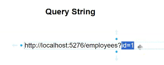
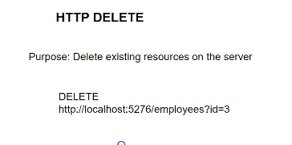
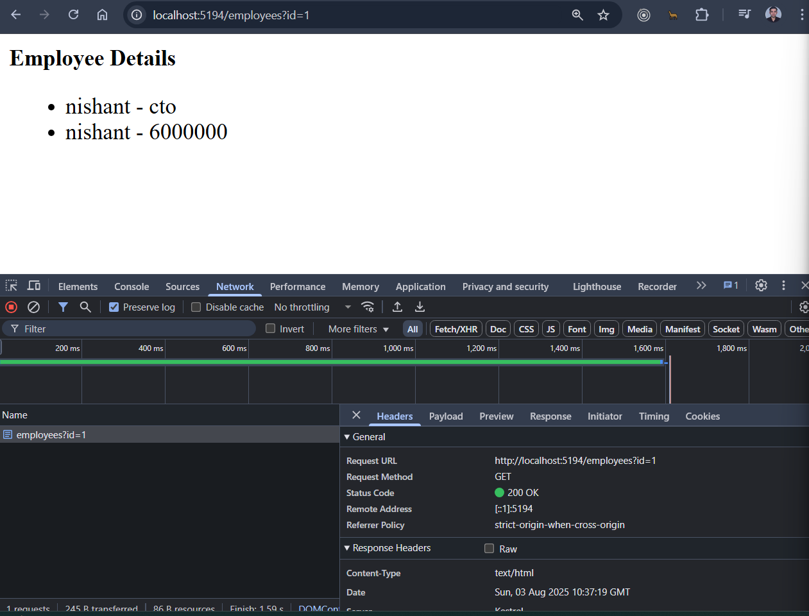
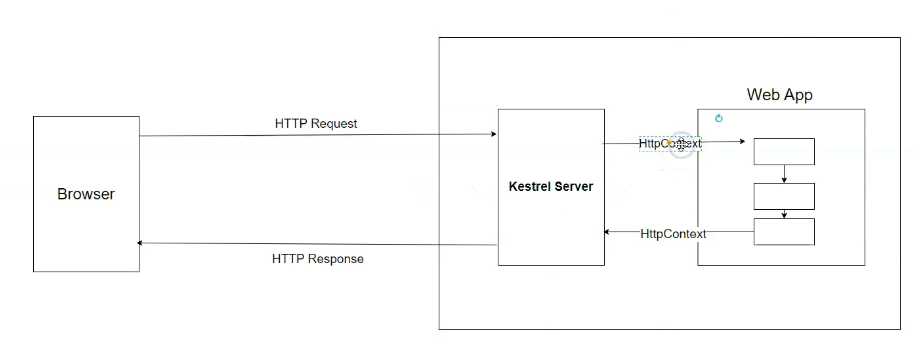
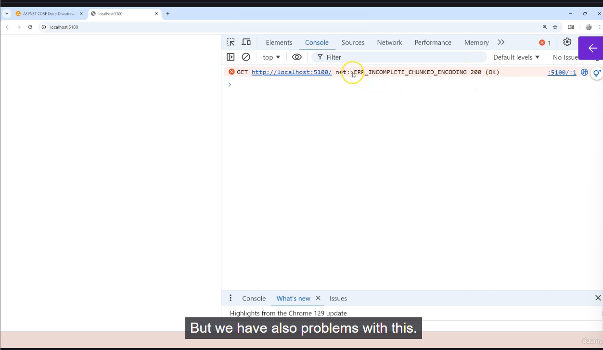
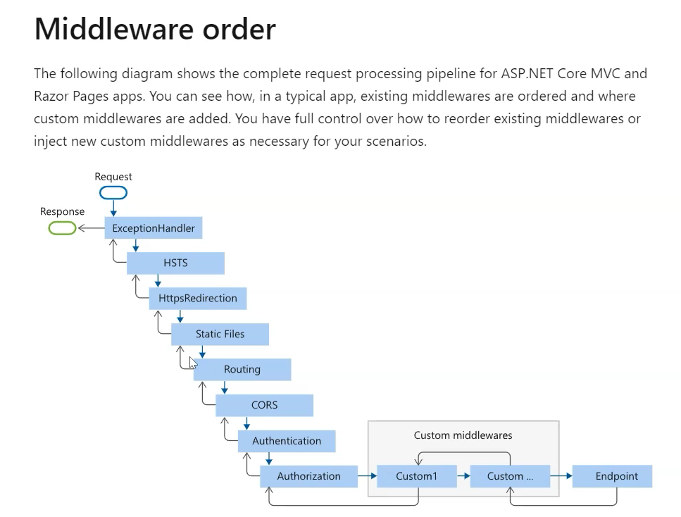

# Deep Dive into ASP.NET Core 9 by Frank Liu

- 

## Anatomy of ASP.NET Core
- ASP.NET Core transforms the incoming HTTP request into .Net object called HttpContext
- A function that executes business logic is called endpoint handler
- A project has many endpoint handler
- A functionality that maps a request to the endpoint handler is called routing
- 
- 
- 

## 📌 High-Level Request Flow

1. **Browser Sends Request**
   - The browser (or client) sends an HTTP request to your app.

2. **Kestrel Server**
   - ASP.NET Core uses the *Kestrel* server to receive incoming requests.
   - *Example*: Visiting `https://myapp.com/api/data` hits Kestrel first.

3. **Transform to HttpContext**
   - The raw request is turned into an `HttpContext` object holding all request data.

## 🛠️ Middleware Pipeline

Once the `HttpContext` exists, it flows through the **middleware pipeline**: a sequence of components where each one handles a specific concern.

**Pipeline Steps:**

1. **Routing**
    - Finds which endpoint/function should handle the request.
    - *Example*: Routing `/api/users/1` to the matching API function.

2. **Authentication & Authorization**
    - Checks who is making the request (authentication) and what they are allowed to do (authorization).
    - *Example*: Limit `/admin` area to logged-in admins.

3. **Model Binding**
    - Converts request data (like JSON body) into C# parameters for the handler.
    - *Example*: Parses `{"name":"Alice"}` into a `User` C# object.

4. **Model Validation**
    - Validates the extracted data (required fields, correct formats).
    - *Example*: Ensures the email property matches a valid pattern.

5. **Endpoint Handler Execution**
    - Runs your actual business logic:
        - **MVC controllers**
        - **Razor Pages**
        - **Minimal API handlers**
        - **Direct middleware** (for simple apps)
    - Often works with a database.

6. **Result Production**
    - Formats the result (HTML, JSON, XML, etc.) and sends it back to the client.

### Our First Project
- Create a new webapp and inspect the Program.cs file
```c#
//Create a Kestrel server
var builder = WebApplication.CreateBuilder(args);

//Configure the Kestrel server options
builder.WebHost.ConfigureKestrel(options =>
{
    // Set the maximum request body size to 10 MB
    options.Limits.MaxRequestBodySize = 10 * 1024 * 1024; // 10 MB
});

// Creates an instance of the web application
var app = builder.Build();

// Configure the HTTP request middleware pipeline
// Notice the minimal API style endpoint handler
app.MapGet("/", () => "Hello World!");

// Runs the web application and starts the Kestrel server
app.Run();


```

## HTTP Protocol and HTTP Context
- The browser provides its requirement for information in form of HTTP Request to the server
- The browser needs to state which information is needed and in what format
- Think of HttpRequest as a string from browser to server
- Http Headers are key value pairs separated by a colon
- There can be zero or more Http Headers
- Http Body is the information transferred to the server side.
- Lot of stuff can be contained in the Http Body
- Think of this format:
- 
- An example can be:
- 
- Notice that since it is a GET request it doesnot have a body
- 

### Http Request in HttpContext
- Kestrel converts the incoming Http Request(which is a string) into HttpContext object
- We can print everything contained in the incoming HttpRequest using the following code:
```c#
app.Run(async (HttpContext context) =>
{
    // Set the response content type to text/plain
    context.Response.ContentType = "text/plain";
    
    // Write a simple response
     await context.Response.WriteAsync($"The method is : {context.Request.Method}\r\n");
    await context.Response.WriteAsync($"The url is : {context.Request.Path}\r\n");

    await context.Response.WriteAsync($"Headers\r\n");
    foreach(var key in context.Request.Headers.Keys)
    {
        await context.Response.WriteAsync($"{key} : {context.Request.Headers[key]}\r\n");
    }
});

```
- This gives an output like this:
- 

### HTTP Method GET
- Used to retrieve information from the server
- Earlier example is of a GET method
- These methods are sometimes called as verb also
- We can use our HttpContext for GET request as follows:
- Note that we have implemented very basic routing
```c#
app.Run(async (HttpContext context) =>
{
    if (context.Request.Method == "GET")
    {

        if (context.Request.Path.StartsWithSegments("/"))
        {

            // Set the response content type to text/plain
            context.Response.ContentType = "text/plain";

            // Write a simple response
            await context.Response.WriteAsync($"The method is : {context.Request.Method}\r\n");
            await context.Response.WriteAsync($"The url is : {context.Request.Path}\r\n");
            await context.Response.WriteAsync($"Headers\r\n");
            foreach (var key in context.Request.Headers.Keys)
            {
                await context.Response.WriteAsync($"{key} : {context.Request.Headers[key]}\r\n");
            }
        }
        else if (context.Request.Path.StartsWithSegments("/employees"))
        {
            await context.Response.WriteAsync("Employee List");
        }
    }
});

```

### HTTP Method POST
- Its purpose is to create new resources on the server
- We need to provide information from the client to the server
- The Http body contains that information
```c#
app.Run(async (HttpContext context) =>
{
    if (context.Request.Method == "GET")
    {
        //Code to handle the GET Method
        
    }

    else if(context.Request.Method == "POST")
    {
        if(context.Request.Path.StartsWithSegments("/employees"))
        {
            //Get the information in the Http Body
            using var reader = new StreamReader(context.Request.Body);
            var body = await reader.ReadToEndAsync();
            var employee = JsonSerializer.Deserialize<Employee>(body);
            EmployeeRepository.Add(employee);
        }
    }
});
```
- We can then use Postman to make POST requests

### HTTP Method PUT
- Its purpose is to update existing resources on the server
- We can write code for this as follows:
```c#
app.Run(async (HttpContext context) =>
{
    if (context.Request.Method == "GET")
    {

       //Code for GET method
    }

    else if(context.Request.Method == "POST")
    {
        //Code for POST method
    }
    else if (context.Request.Method == "PUT")
    {
        if (context.Request.Path.StartsWithSegments("/employees"))
        {
            //Get the information in the Http Body
            using var reader = new StreamReader(context.Request.Body);
            var body = await reader.ReadToEndAsync();
            var employee = JsonSerializer.Deserialize<Employee>(body);
            var result = EmployeeRepository.Update(employee);
           if(result)
            {
                await context.Response.WriteAsync("Employee updated");
            }
           else
            {
                await context.Response.WriteAsync("No employee found to update");
            }
        }
    }
});

```

### Query strings
- It is a part of the URL itself and it is a key-value pair separated by equal sign
- 
- For multiple key-value pairs use an ampersand &
- 
- We can printout the query string in the incoming request as follows:
```c#
app.Run(async (HttpContext context) =>
{
    foreach(var key in context.Request.Query.Keys)
    {
        await context.Response.WriteAsync($"{key} : {context.Request.Query[key]}\r\n");
    }
}
```

### HTTP DELETE method
- Its purpose is to delete resources on the server
- 
- Code can be as follows:
```c#
app.Run(async (HttpContext context) =>
{
    if (context.Request.Method == "GET")
    {

        //Code for GET method
    }

    else if (context.Request.Method == "POST")
    {
        //Code for POST method
    }
    else if (context.Request.Method == "PUT")
    {
        //Code for PUT method
    }
    else if (context.Request.Method == "DELETE")
    {
        if (context.Request.Path.StartsWithSegments("/employees"))
        {
           if(context.Request.Query.ContainsKey("id"))
            {
                var id = context.Request.Query["id"];
                if(int.TryParse(id, out int employeeId))
                {
                    var result = EmployeeRepository.Remove(employeeId);
                    if (result)
                    {
                        await context.Response.WriteAsync("Employee deleted");
                    }
                    else
                    {
                        await context.Response.WriteAsync("No employee found to delete");
                    }
                }

            }
        }
    }
});

```

### Http Request Headers
- Http Request headers provide additional information to the server to respond to the Http Request
- Why not supply all information through querystring?
- Because, query string has length limitations probably 2000 characters
- 
- 
- Http Request Headers are also more secure
- Mostly used for authentication and authorization purpose
- We can use them like this:
```c#
app.Run(async (HttpContext context) =>
{
    //foreach(var key in context.Request.Query.Keys)
    //{
    //    await context.Response.WriteAsync($"{key} : {context.Request.Query[key]}\r\n");
    //}

    //await context.Response.WriteAsync(context.Request.QueryString.ToString());
    if (context.Request.Method == "GET")
    {
        //Code for GET method
    }

    else if (context.Request.Method == "POST")
    {
        //Code for POST method
    }
    else if (context.Request.Method == "PUT")
    {
        //Code for PUT method
    }
    else if (context.Request.Method == "DELETE")
    {
        if (context.Request.Path.StartsWithSegments("/employees"))
        {
           if(context.Request.Query.ContainsKey("id"))
            {
                var id = context.Request.Query["id"];
                if(int.TryParse(id, out int employeeId))
                {
                    // Use Headers for authorization
                    if(context.Request.Headers["Authorization"]=="frank")
                    {
                        var result = EmployeeRepository.Remove(employeeId);
                        if (result)
                        {
                            await context.Response.WriteAsync("Employee deleted");
                        }
                        else
                        {
                            await context.Response.WriteAsync("No employee found to delete");
                        }
                    } else
                    {
                        await context.Response.WriteAsync("You are not authorized");
                    }
                    
                }

            }
        }
    }
});


```

### Refactoring our Routing Code
- 
- We will refactor our code as follows:
```c#
app.Run(async (HttpContext context) =>
{
    //foreach(var key in context.Request.Query.Keys)
    //{
    //    await context.Response.WriteAsync($"{key} : {context.Request.Query[key]}\r\n");
    //}

    //await context.Response.WriteAsync(context.Request.QueryString.ToString());

    if (context.Request.Path.StartsWithSegments("/"))
    {
        if (context.Request.Method == "GET")
        {

            // Set the response content type to text/plain
            context.Response.ContentType = "text/plain";

            // Write a simple response
            await context.Response.WriteAsync($"The method is : {context.Request.Method}\r\n");
            await context.Response.WriteAsync($"The url is : {context.Request.Path}\r\n");
            await context.Response.WriteAsync($"Headers\r\n");
            foreach (var key in context.Request.Headers.Keys)
            {
                await context.Response.WriteAsync($"{key} : {context.Request.Headers[key]}\r\n");
            }

        }

    }
    else if (context.Request.Path.StartsWithSegments("/employees"))
    {
        if (context.Request.Method == "GET")
        {
            EmployeeRepository.Add(new Employee(1, "Alice Johnson", "Manager", 85000));
            EmployeeRepository.Add(new Employee(2, "Bob Smith", "Software Engineer", 70000));
            EmployeeRepository.Add(new Employee(3, "Carol Martinez", "QA Analyst", 65000));
            EmployeeRepository.Add(new Employee(4, "David Lee", "DevOps Engineer", 78000));
            EmployeeRepository.Add(new Employee(5, "Eva Brown", "HR Specialist", 62000));
            var employees = EmployeeRepository.GetAll();
            foreach (var emp in employees)
            {
                await context.Response.WriteAsync($"{emp.Name} : {emp.Position}\r\n");
            }
        }
        else if (context.Request.Method == "POST")
        {
            if (context.Request.Path.StartsWithSegments("/employees"))
            {
                //Get the information in the Http Body
                using var reader = new StreamReader(context.Request.Body);
                var body = await reader.ReadToEndAsync();
                var employee = JsonSerializer.Deserialize<Employee>(body);
                EmployeeRepository.Add(employee);
            }
        }
        else if (context.Request.Method == "PUT")
        {

            //Get the information in the Http Body
            using var reader = new StreamReader(context.Request.Body);
            var body = await reader.ReadToEndAsync();
            var employee = JsonSerializer.Deserialize<Employee>(body);
            var result = EmployeeRepository.Update(employee);
            if (result)
            {
                await context.Response.WriteAsync("Employee updated");
            }
            else
            {
                await context.Response.WriteAsync("No employee found to update");
            }

        }
        else if (context.Request.Method == "DELETE")
        {
            if (context.Request.Query.ContainsKey("id"))
            {
                var id = context.Request.Query["id"];
                if (int.TryParse(id, out int employeeId))
                {
                    if (context.Request.Headers["Authorization"] == "frank")
                    {
                        var result = EmployeeRepository.Remove(employeeId);
                        if (result)
                        {
                            await context.Response.WriteAsync("Employee deleted");
                        }
                        else
                        {
                            await context.Response.WriteAsync("No employee found to delete");
                        }
                    }
                    else
                    {
                        await context.Response.WriteAsync("You are not authorized");
                    }

                }

            }

        }
    }
});
```

### Http Response Syntax
- 
- It also has 3 parts, one for the Status code, another for headers, another for body
- 
- The body part is rendered as follows:
- 
- We can change our code as follows to have content type as HTML also
```c#
 if (context.Request.Path.StartsWithSegments("/"))
 {
     if (context.Request.Method == "GET")
     {

         // Set the response content type to text/plain
         //context.Response.ContentType = "text/plain";
         context.Response.Headers["Content-Type"] = "text/html";

         // Write a simple response
         await context.Response.WriteAsync($"The method is : {context.Request.Method}<br/>");
         await context.Response.WriteAsync($"The url is : {context.Request.Path}<br/>");
         await context.Response.WriteAsync($"<ul>");
         foreach (var key in context.Request.Headers.Keys)
         {
             await context.Response.WriteAsync($"<li><b>{key}</b> : {context.Request.Headers[key]}</li>");
         }
         await context.Response.WriteAsync($"</ul>");

     }

 }
```
- 

### HTTP Response Status Codes
- 
- 
- 
- 
- 
- 
- 304 Not Modified is used for cached responses from the client itself

### Getting employees by Id
- We can do it with the following code:
```c#
if (context.Request.Path.StartsWithSegments("/"))
{

}
else if (context.Request.Path.StartsWithSegments("/employees"))
{
    if (context.Request.Method == "GET")
{
    if (context.Request.Query.ContainsKey("id"))
    {
        var id = context.Request.Query["id"];
        var employee = EmployeeRepository.GetById(int.Parse(id));
        if (employee != null)
        {
            context.Response.Headers.ContentType = "text/html";
            await context.Response.WriteAsync("<b>Employee Details</b> <br/>");
            await context.Response.WriteAsync("<ul>");
            await context.Response.WriteAsync($"<li>{employee.Name} - {employee.Position}</li>");
            await context.Response.WriteAsync($"<li>{employee.Name} - {employee.Salary}</li>");
            await context.Response.WriteAsync("</ul>");
        }
    }
    else
    {

        EmployeeRepository.Add(new Employee(1, "Alice Johnson", "Manager", 85000));
        EmployeeRepository.Add(new Employee(2, "Bob Smith", "Software Engineer", 70000));
        EmployeeRepository.Add(new Employee(3, "Carol Martinez", "QA Analyst", 65000));
        EmployeeRepository.Add(new Employee(4, "David Lee", "DevOps Engineer", 78000));
        EmployeeRepository.Add(new Employee(5, "Eva Brown", "HR Specialist", 62000));
        var employees = EmployeeRepository.GetAll();
        foreach (var emp in employees)
        {
            await context.Response.WriteAsync($"{emp.Name} : {emp.Position}\r\n");
        }
    }
}
    else if (context.Request.Method == "POST")
    {
        if (context.Request.Path.StartsWithSegments("/employees"))
        {
            //Get the information in the Http Body
            using var reader = new StreamReader(context.Request.Body);
            var body = await reader.ReadToEndAsync();
            var employee = JsonSerializer.Deserialize<Employee>(body);
            EmployeeRepository.Add(employee);
            context.Response.StatusCode = 201; // Created

        }
    }
    else if (context.Request.Method == "PUT")
    {

    }
    else if (context.Request.Method == "DELETE")
    {

    }
}

```
- 

## Middleware Pipeline
- 
- What if we dont have middleware pipeline
- The middleware pipeline is foundational to how ASP.NET Core operates. MVC controllers, Razor Pages, API endpoints, and more all depend on this pipeline to function.
- Advanced scenarios—like custom request preprocessing, third-party integrations (Swagger, authentication providers), and security policies—would be impractical or impossible to implement elegantly.

| Without Middleware Pipeline            | Consequence                                           |
|----------------------------------------|-------------------------------------------------------|
| No centralized routing/auth            | You must handle request paths manually                |
| No global exception handling/logging   | Duplication and missed errors                         |
| No reusable security or validation     | Security weaknesses, more boilerplate                 |
| No cross-cutting features (gzip, CORS) | Poor performance, manual duplication                  |
| No modularity or extensibility         | Harder to maintain, extend, or integrate new features |

- Without the middleware pipeline, ASP.NET Core would lose what makes it powerful, modular, and secure. Applications would become harder to build, maintain, and scale, and most of the features developers expect from a mature web framework would disappear. The middleware pipeline is the core of ASP.NET Core!
- 
- Each middleware basically modifies the HttpContext object
- Kestrel server extracts response from the HttpContext object
- Each middleware follows SRP principle for extensibility and maintainability
- It all boils down to function calls
- We have to pass the context object to the next function
- 
- Think of middleware pipeline as a series of function calls
- We can also return directly from each of the function calls
- This is called short circuiting the pipeline

### Using app.Use to create middleware components
- We can use it to create a regular middleware component or a terminal middleware component
- Lets say we have the following code:
```c#
var builder = WebApplication.CreateBuilder(args);
var app = builder.Build();

// Configure the HTTP request middleware pipeline

//Middleware #1
app.Use(async (HttpContext context,RequestDelegate next) =>
{
    // This is the first middleware in the pipeline before the next middleware is called
    await context.Response.WriteAsync("Middleware # 1: Before calling the next middleware\n");
    // Call the next middleware in the pipeline and pass the HttpContext object
    await next(context);
    // Note: that the context object may be modified by the next middleware
    // After calling the next middleware, you can perform additional actions
    await context.Response.WriteAsync("Middleware # 1: After calling the next middleware\n");
});

//Middleware #2
app.Use(async (HttpContext context, RequestDelegate next) =>
{
    await context.Response.WriteAsync("Middleware # 2: Before calling the next middleware\n");
    // Call the next middleware in the pipeline and pass the HttpContext object
    await next(context);
    // Note: that the context object may be modified by the next middleware
    // After calling the next middleware, you can perform additional actions
    await context.Response.WriteAsync("Middleware # 2: After calling the next middleware\n");
});


//Middleware #3
app.Use(async (HttpContext context, RequestDelegate next) =>
{
    await context.Response.WriteAsync("Middleware # 3: Before calling the next middleware\n");
    // Call the next middleware in the pipeline and pass the HttpContext object
    await next(context);
    // Note: that the context object may be modified by the next middleware
    // After calling the next middleware, you can perform additional actions
    await context.Response.WriteAsync("Middleware # 3: After calling the next middleware\n");
});

// Run the Kestrel server
app.Run();

```
- This produces response as follows:
- 
- On request, it enters middleware 1, then middleware 2, then middleware 3 ("before" messages).
- It then unwinds and writes "after" messages for middleware 3, 2, and 1 in order.
- To make a middleware terminal: Skip calling `next(context)` to short-circuit the pipeline
- Middleware are invoked in the order they are added at startup.
- Each middleware receives the same `HttpContext` object.
- The pipeline runs like nested function calls, entering each middleware, then unwinding on return.

### 5. Summary Table

| Middleware Type     | Calls `next`? | Passes to next? | Use Case                                       |
|---------------------|---------------|-----------------|------------------------------------------------|
| Regular Middleware  | Yes           | Yes             | Logging, authentication, request modifications |
| Terminal Middleware | No            | No              | Returning response, short-circuiting pipeline  |

## 6. Tips
- Middleware can be added inline as lambdas or as separate methods.
- Use `app.Run` for a terminal middleware that handles all remaining requests.
- Use comments and clear structure to keep the pipeline easy to follow.


### Using app.Run to create the middleware
- It doesnot take the 'next' request delegate
- It creates terminal or short-circuiting middleware
```c#
//Middleware #1
app.Use(async (HttpContext context,RequestDelegate next) =>
{
    // This is the first middleware in the pipeline before the next middleware is called
    await context.Response.WriteAsync("Middleware # 1: Before calling the next middleware\n");
    // Call the next middleware in the pipeline and pass the HttpContext object
    await next(context);
    // Note: that the context object may be modified by the next middleware
    // After calling the next middleware, you can perform additional actions
    await context.Response.WriteAsync("Middleware # 1: After calling the next middleware\n");
});

//Middleware #2

app.Run(async (context) =>
{
    await context.Response.WriteAsync("Middleware #2: Processed. \r\n");
});


//Middleware #3
app.Use(async (HttpContext context, RequestDelegate next) =>
{
    await context.Response.WriteAsync("Middleware # 3: Before calling the next middleware\n");
    // Call the next middleware in the pipeline and pass the HttpContext object
    await next(context);
    // Note: that the context object may be modified by the next middleware
    // After calling the next middleware, you can perform additional actions
    await context.Response.WriteAsync("Middleware # 3: After calling the next middleware\n");
});

// Run the Kestrel server
app.Run();

```
- It produces the following output:
- 

### Using app.Map() to branch the pipeline
- 
- Second branch never rejoins to the main branch
- Never goes from Middleware #6 to Middleware #2
- Consider the following code:
```c#
var builder = WebApplication.CreateBuilder(args);
var app = builder.Build();

// Configure the HTTP request middleware pipeline

//Middleware #1
app.Use(async (HttpContext context,RequestDelegate next) =>
{
    // This is the first middleware in the pipeline before the next middleware is called
    await context.Response.WriteAsync("Middleware # 1: Before calling the next middleware\n");
    // Call the next middleware in the pipeline and pass the HttpContext object
    await next(context);
    // Note: that the context object may be modified by the next middleware
    // After calling the next middleware, you can perform additional actions
    await context.Response.WriteAsync("Middleware # 1: After calling the next middleware\n");
});


app.Map("/employees", (appBuilder) =>
{
    appBuilder.Use(async (HttpContext context, RequestDelegate next) =>
    {
        await context.Response.WriteAsync("Middleware # 5: Before calling the next middleware\n");
        await next(context);
        await context.Response.WriteAsync("Middleware # 5: After calling the next middleware\n");
    });

    appBuilder.Use(async (HttpContext context, RequestDelegate next) =>
    {

        await context.Response.WriteAsync("Middleware # 6: Before calling the next middleware\n");
        await next(context);
        await context.Response.WriteAsync("Middleware # 6: After calling the next middleware\n");
    });
});


//app.Run(async (context) =>
//{
//    await context.Response.WriteAsync("Middleware #2: Processed. \r\n");
//});

//Middleware #2
app.Use(async (HttpContext context, RequestDelegate next) =>
{
    await context.Response.WriteAsync("Middleware # 2: Before calling the next middleware\n");
    // Call the next middleware in the pipeline and pass the HttpContext object
    await next(context);
    // Note: that the context object may be modified by the next middleware
    // After calling the next middleware, you can perform additional actions
    await context.Response.WriteAsync("Middleware # 2: After calling the next middleware\n");
});


//Middleware #3
app.Use(async (HttpContext context, RequestDelegate next) =>
{
    await context.Response.WriteAsync("Middleware # 3: Before calling the next middleware\n");
    // Call the next middleware in the pipeline and pass the HttpContext object
    await next(context);
    // Note: that the context object may be modified by the next middleware
    // After calling the next middleware, you can perform additional actions
    await context.Response.WriteAsync("Middleware # 3: After calling the next middleware\n");
});

// Run the Kestrel server
app.Run();


```

- Note that we are using the following code to create a separate branch for the middleware:
```c#
app.Map("/employees", (appBuilder) =>
{
    appBuilder.Use(async (HttpContext context, RequestDelegate next) =>
    {
        await context.Response.WriteAsync("Middleware # 5: Before calling the next middleware\n");
        await next(context);
        await context.Response.WriteAsync("Middleware # 5: After calling the next middleware\n");
    });

    appBuilder.Use(async (HttpContext context, RequestDelegate next) =>
    {

        await context.Response.WriteAsync("Middleware # 6: Before calling the next middleware\n");
        await next(context);
        await context.Response.WriteAsync("Middleware # 6: After calling the next middleware\n");
    });
});

```
- Now if we just go to localhost:5122, we get this output
- 
- If we go to localhost:5122/employees, we get this:
- 

### Using app.MapWhen() to branch the pipeline

#### Overview

- `app.Map` allows branching the middleware pipeline **based on the request path**.
- `app.MapWhen` provides a **more flexible** way to branch pipelines by evaluating a **custom condition** using the full `HttpContext`.
- This means you can branch requests **based on any part of the request**, including path, query string, headers, body content, or any combination of these.

## How `MapWhen` Works

- `MapWhen` expects a **predicate delegate**: a function that takes `HttpContext` and returns a `bool`.
- If the predicate returns `true` for a request, the request is routed to the branch pipeline.
- If `false`, the request continues on the main pipeline.
```c#
app.MapWhen(
context => context.Request.Query.ContainsKey("id"), // Condition predicate
branchApp =>
{
branchApp.Run(async context =>
{
await context.Response.WriteAsync("Branching because query string contains id");
});
});

```
## Example: Branching Based on Query String Parameter

- The condition checks if the query string contains `"id"`.
- Requests with `?id=someValue` go into the branch.
- All others continue in the main pipeline.

## Combining Multiple Conditions

- You can implement **complex branching logic** by combining multiple conditions inside the predicate:

```c#
app.MapWhen(
context =>
context.Request.Path.StartsWithSegments("/employees") &&
context.Request.Query.ContainsKey("id"),
branchApp =>
{
branchApp.Run(async context =>
{
await context.Response.WriteAsync("Branching on '/employees' path AND query string containing 'id'");
});
});

```

- This requires both conditions to be satisfied for the branch to execute.

## Behavior Summary

| Request URL                     | Branch taken?                            | Reason                                           |
|---------------------------------|----------------------------------------|-------------------------------------------------|
| `/`                             | No                                     | Condition returns false (no `id` in query)      |
| `/employees`                    | No                                     | Path matches, but no `id` in query string       |
| `/employees?id=123`            | Yes                                    | Both path and query string condition satisfied  |
| `/?id=123`                     | Yes (if only checking query string)    | Branching on query string regardless of path    |

## Key Points

- `MapWhen` enables **branching on any custom predicate**, not just path segments.
- You can write **arbitrarily complex logic** inside the delegate to inspect the entire `HttpContext`.
- This flexibility allows for advanced routing scenarios without full routing setup.
- Unlike `Map`, `MapWhen` **does not restrict branching to a path prefix** only.

---

*This approach is useful when you want to create custom middleware branches based on detailed request conditions.*

- Another example is as follows:
```c#
app.MapWhen((context) => //Specify the condition for this middleware to run
{
    return context.Request.Query.ContainsKey("id"); //Check the query string for the key "id"

}, (appBuilder) =>
{
    appBuilder.Use(async (HttpContext context, RequestDelegate next) =>
    {
        await context.Response.WriteAsync("Middleware # 5: Before calling the next middleware\n");
        await next(context);
        await context.Response.WriteAsync("Middleware # 5: After calling the next middleware\n");
    });

    appBuilder.Use(async (HttpContext context, RequestDelegate next) =>
    {

        await context.Response.WriteAsync("Middleware # 6: Before calling the next middleware\n");
        await next(context);
        await context.Response.WriteAsync("Middleware # 6: After calling the next middleware\n");
    });
});

```

### Using `UseWhen` to Create Rejoining Middleware Branches in ASP.NET Core

- 
#### Overview

- So far, **`Map`** and **`MapWhen`** are used to create **separate branches** in the middleware pipeline that do **not rejoin** the main pipeline after execution.
- Sometimes, you want to create a branch that **executes some middleware conditionally** but then **rejoins the original pipeline** to continue processing.
- This is where the **`UseWhen`** method comes in.

## What is `UseWhen`?

- `UseWhen` conditionally executes a branch of middleware **based on a predicate (`HttpContext` → `bool`)**.
- Unlike `MapWhen`, after the branch middleware executes, **the pipeline rejoins the main middleware pipeline where it branched off**, continuing with the remaining middleware.
- This creates a **rejoining branch**, useful when you want conditional middleware activation without terminating the pipeline early.

## Middleware Flow Diagram
- Main Pipeline: Middleware #1 → Middleware #2 → Middleware #3 → Middleware #4
- Branch (UseWhen condition met):
- Middleware #1 → Middleware #5 → Middleware #6 → --rejoin--> Middleware #2 → Middleware #3 → Middleware #4


- Execution enters branch middlewares (#5, #6) if condition is true.
- After branch, execution returns to middleware #2 and continues down the main pipeline.
- The response unwinds back through middleware #3, #2, then #6, #5, finally #1.

## Code Example

```c#
var builder = WebApplication.CreateBuilder(args);
var app = builder.Build();

// Middleware #1
app.Use(async (context, next) =>
{
await context.Response.WriteAsync("Middleware #1: Before\n");
await next();
await context.Response.WriteAsync("Middleware #1: After\n");
});

// UseWhen branch conditionally executes Middleware #5 and #6
app.UseWhen(context =>
context.Request.Path.StartsWithSegments("/employees") &&
context.Request.Query.ContainsKey("id"),
branchApp =>
{
// Middleware #5 in branch
branchApp.Use(async (context, next) =>
{
await context.Response.WriteAsync("Middleware #5: Before\n");
await next();
await context.Response.WriteAsync("Middleware #5: After\n");
});
// Middleware #6 in branch
branchApp.Use(async (context, next) =>
{
    await context.Response.WriteAsync("Middleware #6: Before\n");
    await next();
    await context.Response.WriteAsync("Middleware #6: After\n");
});
});

// Middleware #2
app.Use(async (context, next) =>
{
await context.Response.WriteAsync("Middleware #2: Before\n");
await next();
await context.Response.WriteAsync("Middleware #2: After\n");
});

// Middleware #3
app.Use(async (context, next) =>
{
await context.Response.WriteAsync("Middleware #3: Before\n");
await next();
await context.Response.WriteAsync("Middleware #3: After\n");
});

app.Run();

```

## Expected Behavior

- For a request to `/employees?id=123` (condition true), output sequence will be:
- Middleware #1: Before
- Middleware #5: Before
- Middleware #6: Before
- Middleware #2: Before
- Middleware #3: Before
- Middleware #3: After
- Middleware #2: After
- Middleware #6: After
- Middleware #5: After
- Middleware #1: After


- For a request where the condition is false (e.g., `/`, or `/employees` without `id`), the branch middlewares (#5 and #6) are skipped, and the main pipeline runs:

- Middleware #1: Before
- Middleware #2: Before
- Middleware #3: Before
- Middleware #3: After
- Middleware #2: After
- Middleware #1: After


## Summary Table

| Feature               | `MapWhen`                        | `UseWhen`                                |
|-----------------------|---------------------------------|-----------------------------------------|
| Branch creation       | Creates separate branch         | Creates rejoining branch                 |
| Pipeline continuation | Does *not* continue main pipeline after branch | Continues in main pipeline after branch |
| Use case              | When branch acts as a terminal path or separated feature | When conditional processing needed mid-pipeline |
| Predicate             | `HttpContext` → `bool`          | `HttpContext` → `bool`                   |

---

**In brief:**  
Use `UseWhen` to create conditional middleware branches that **execute only when needed, then transparently rejoin the main middleware pipeline**, providing flexible and maintainable request processing.

---

### Important Considerations When Writing to the Response in ASP.NET Core Middleware

## Key Points

- **Writing to the response body** (e.g., `await context.Response.WriteAsync(...)`) begins sending the response to the client.
- **Once the response starts:**  
  - You CANNOT safely modify headers or the status code.
  - Any changes to headers/status after writing will likely cause errors or be ignored.

## Example: Unsafe Modification AFTER Writing

```
app.Use(async (context, next) => 
{
    await context.Response.WriteAsync("Hello, World!\n");
    // ❌ Not safe – headers may already be sent!
    context.Response.StatusCode = 404;
    context.Response.Headers["X-Custom-Header"] = "Value";
    await next();
});
```

- This may **cause errors or unexpected behavior** (e.g., “incomplete chunked encoding” in the browser or missing headers/status code).

## Correct Usage: Set Headers/Status BEFORE Writing

```c#
app.Use(async (context, next) =>
{
    context.Response.StatusCode = 200;
    context.Response.Headers["X-Custom-Header"] = "My Header Content";
    await context.Response.WriteAsync("Hello, World!\n");
    await next();
});
```

- Set all headers and status **before** you write to the response body.

## Special Note: Content-Length Header

- If you set the `Content-Length` header manually and **later write more or less data** than specified, the response may be **truncated, broken, or the client may fail to read it completely**.
- Example problem:
    ```
    context.Response.Headers.ContentLength = 10;
    await context.Response.WriteAsync("This is a much longer body...");
    ```
    - The browser/server will expect exactly 10 bytes but might get more (or less), leading to failures.
    - 

### Best Practice

- **Don’t set `Content-Length` manually** unless you are absolutely sure how much you will write (including writes by subsequent middlewares).
- Write only headers/status _before_ any body is sent!

## Custom Middleware and Built-in Middleware Interactions

- If your **custom middleware sets headers or `Content-Length`**, and later middleware (built-in or custom) modifies the response body, there may be a mismatch.
- **Always ensure:**  
    - All headers and status are finalized before body writing starts, and
    - If you set `Content-Length`, your total body size must match exactly.

## Troubleshooting

- If you see errors like **“incomplete chunked encoding”** or missing/malformed headers:
    - Check that you are not writing to headers/status after the body write has started.
    - Use browser DevTools → Network tab to inspect the actual headers and response.

## In Summary

> **ALWAYS set response headers and status BEFORE writing to the response body in any middleware. Avoid setting `Content-Length` unless absolutely necessary.**

---

*Following these practices makes your middleware safe, compatible, and less likely to cause subtle bugs or protocol errors!*


### Built-In Middleware Components in ASP.NET Core

#### Overview

- While custom middleware is powerful and sometimes necessary for unique cross-cutting concerns (like advanced logging), **ASP.NET Core provides many built-in middleware components** to handle common web application needs.
- The **middleware pipeline is the core pattern** underpinning ASP.NET Core applications.
- **Most real-world applications rely heavily on built-in middlewares** for tasks such as routing, authentication, authorization, exception handling, HTTPS enforcement, CORS, and more.

## Why Use Built-In Middleware?

- **Custom middleware** should be reserved for *very specific* scenarios.
- For **standard functionality** (security, routing, etc.), using built-in options is easier, less error-prone, and aligns with framework best practices.

## Common Built-In Middleware Examples

Add these by calling methods on your `app` instance in the `Program.cs`:

```c#
// Redirect HTTP requests to HTTPS
app.UseHttpsRedirection();

// Add routing functionality (required for endpoints, controllers, Razor Pages)
app.UseRouting();

// Add CORS support (Cross-Origin Resource Sharing)
app.UseCors();

// Add authentication and authorization
app.UseAuthentication();
app.UseAuthorization();

// Add custom middleware, typically after auth and before endpoints if needed
app.Use(async (context, next) => {
    // Your custom logic here
    await next();
});

// Map endpoints (MVC, minimal APIs, Razor Pages)
app.MapControllers();
app.MapRazorPages();
app.MapGet("/", () => "Hello World!");
```

## Typical Middleware Pipeline Order

> Built-in middleware should be **placed in a specific order** to work correctly.
>
> Example order (simplified):

1. Exception Handling
2. HSTS (HTTP Strict Transport Security)
3. HTTPS Redirection
4. Static Files (if needed)
5. Routing
6. CORS
7. Authentication
8. Authorization
9. [Custom Middleware]
10. Endpoint Execution (Controllers, Razor Pages, Minimal API)

*Place your custom middleware in the pipeline where it makes sense for your specific needs (often after authorization, before endpoints).*

## Visual Diagram

```
[Request]
   |
[Exception Handling Middleware]
   |
[HSTS Middleware]
   |
[HTTPS Redirection Middleware]
   |
[Static Files Middleware]
   |
[Routing Middleware]
   |
[CORS Middleware]
   |
[Authentication Middleware]
   |
[Authorization Middleware]
   |
[Custom Middleware]
   |
[Endpoint Middleware (MVC/Razor/Minimal API)]
   |
[Response]
```
- 

## Key Takeaways

- **Use built-in middleware whenever possible**—they are robust, well-tested, and easy to add.
- **Custom middleware** is best for advanced or unique scenarios.
- **Ordering matters!** Some middleware (like routing, authentication, and authorization) depend on previous components being present.
- See the [Microsoft Docs: ASP.NET Core Middleware](https://learn.microsoft.com/aspnet/core/fundamentals/middleware/) for a comprehensive list and recommended order.

---

*Built-in middleware empowers you to build feature-rich, secure, and maintainable ASP.NET Core applications with minimal custom code!*


# Creating a Custom Middleware Class in ASP.NET Core
- 

## Why Create a Custom Middleware Class?

- Placing all middleware logic directly in `Program.cs` quickly makes your code messy and hard to maintain.
- The **purpose of `Program.cs`** is configuration, not detailed implementation.
- Extracting middleware logic into dedicated classes:
  - Improves organization and readability.
  - Clarifies intent, especially when using interfaces.

## Recommended Approach: Implementing the `IMiddleware` Interface

**Three Steps to Create a Custom Middleware:**

### 1. Create the Middleware Class

- Implement the `IMiddleware` interface.
- Implement the `InvokeAsync(HttpContext context, RequestDelegate next)` method.

```c#
using Microsoft.AspNetCore.Http;
using System.Threading.Tasks;

public class MyCustomMiddleware : IMiddleware
{
    public async Task InvokeAsync(HttpContext context, RequestDelegate next)
    {
        await context.Response.WriteAsync("MyCustomMiddleware: Before\n");
        await next(context);
        await context.Response.WriteAsync("MyCustomMiddleware: After\n");
    }
}
```

### 2. Register the Middleware Class as a Service

- In `Program.cs`, register your middleware using the desired lifetime (`AddTransient`, `AddScoped`, `AddSingleton`).

```c#
// In Program.cs or Startup.cs
builder.Services.AddTransient<MyCustomMiddleware>();
```

### 3. Use the Middleware in the Pipeline

- In your middleware pipeline (e.g., between other `app.Use` components), add:

```c#
app.UseMiddleware<MyCustomMiddleware>();
```

**Order matters:** Place your `UseMiddleware` call carefully to control where it appears in the pipeline.

## Example Pipeline Integration

```c#
var builder = WebApplication.CreateBuilder(args);

builder.Services.AddTransient<MyCustomMiddleware>();

var app = builder.Build();

app.Use(async (context, next) =>
{
    await context.Response.WriteAsync("Middleware #1: Before\n");
    await next();
    await context.Response.WriteAsync("Middleware #1: After\n");
});

app.UseMiddleware<MyCustomMiddleware>();

app.Use(async (context, next) =>
{
    await context.Response.WriteAsync("Middleware #2: Before\n");
    await next();
    await context.Response.WriteAsync("Middleware #2: After\n");
});

app.Run();
```

**Request execution order for a single request:**
```
Middleware #1: Before
MyCustomMiddleware: Before
Middleware #2: Before
Middleware #2: After
MyCustomMiddleware: After
Middleware #1: After
```

## Key Takeaways
- Note that when we have the code app.UseMiddleware(), ASP.NET framework looks for where it can instantiate the middleware, so it goes to the builder.AddTransient() method(which we had specified) and then it runs its InvokeAsync() method
- Extract middleware logic to dedicated classes for clean, maintainable code.
- Prefer implementing the `IMiddleware` interface for clarity and best practice.
- Remember to register your middleware as a service **and** add it to the pipeline with `UseMiddleware`.
- **Middleware order is critical** and affects how requests flow through your application.

---

*By following this pattern, your ASP.NET Core pipeline stays modular, readable, and easy to extend!*


# Creating a Custom Exception Handling Middleware in ASP.NET Core

## Why Use a Custom Exception Handling Middleware?

- **Middleware pipeline** is the foundation of ASP.NET Core—almost all code flows through it.
- Rather than scattering try/catch blocks throughout your code, you can centralize error handling in a dedicated middleware.
- Placing the exception handler middleware **at the beginning** ensures it can catch errors from any middleware or endpoint that follows.

## How Does It Work?

- The custom exception middleware should wrap all the downstream middlewares with a `try/catch`.
- When an exception is thrown **anywhere down the pipeline**, this middleware’s `catch` block can log it and show an error response.
- It is essential to:
  - **Set response headers and content type before writing to the response body** (otherwise, header modifications may fail if output has already been sent).
  - **Place this middleware as the first item** in the pipeline to cover all subsequent middlewares.

## Example: Step-by-Step Implementation

### 1. Implement the Middleware Class

```c#
using Microsoft.AspNetCore.Http;
using System;
using System.Threading.Tasks;

public class MyCustomExceptionHandler : IMiddleware
{
    public async Task InvokeAsync(HttpContext context, RequestDelegate next)
    {
        // Set response Content-Type before any write
        context.Response.ContentType = "text/html";

        try
        {
            await next(context); // Call the next middleware
        }
        catch (Exception ex)
        {
            // Log the exception here (optional)
            // Write a user-friendly error page
            // context.Response.ContentType = "text/html"
            await context.Response.WriteAsync("<h2>Error encountered</h2>");
            await context.Response.WriteAsync($"<p>{ex.Message}</p>");
            if (ex.InnerException != null)
            {
                await context.Response.WriteAsync($"<p>Inner error: {ex.InnerException.Message}</p>");
            }
        }
    }
}
```

### 2. Register the Middleware as a Service

```c#
// In Program.cs
builder.Services.AddTransient<MyCustomExceptionHandler>();
```

### 3. Add it to the Pipeline **First**

```c#
// In Program.cs, before any other middleware
app.UseMiddleware<MyCustomExceptionHandler>();

// ... Other middlewares follow
app.Use(async (context, next) => {
    await context.Response.WriteAsync("Middleware 1: Before<br>");
    await next();
    await context.Response.WriteAsync("Middleware 1: After<br>");
});

// Add more middleware/components here!
```

### 4. (For Demonstration) Throw an Exception Downstream

```c#
app.Use(async (context, next) => {
    throw new ApplicationException("This is a test exception for demonstration!");
});
```

- 

## What Happens and Why

- Any exceptions thrown by middlewares or endpoints after the exception handler are **caught** by the first middleware.
- The handler middleware sets the content type, logs the error (if you add logging), and displays a **user-friendly error message page**.
- Headers and status codes MUST be set before any output is written—once writing starts, header modifications are blocked by the ASP.NET Core response pipeline.

## Takeaways

- **Always place exception handling middleware at the very beginning** of the pipeline.
- **Set headers and content type before writing** to the response, especially in exception handlers.
- Handling exceptions centrally results in maintainable, predictable, and uniform error reporting.
- You can enrich your error handler with more info (e.g., query params, request headers) if needed.

---

*This approach provides robust, maintainable, and user-friendly error handling for any ASP.NET Core application.*


# Minimal API: Routing

## 1. What is Routing?

- **Routing** is the process of **mapping incoming HTTP requests to an endpoint handler** in a web application.
- When a request arrives, routing decides **which endpoint should handle** that request.
- It uses information like HTTP method (GET, POST, etc.) and URL/path to determine the matching endpoint.

## 2. What is an Endpoint?

- An **endpoint** is a unit in your application responsible for:
  - **Handling the request**
  - **Returning a response** (HTML, JSON, file, etc.)
  - Routing maps the request to the endpoint handler
  - 
- Endpoints are **terminal middleware** that produce the HTTP response back to the client.
- Middleware that only handles requests but does *not* return a response is NOT an endpoint.
- Examples of endpoints include:
  - Custom terminal middleware you write to return responses.
  - MVC controllers and actions.
  - Razor Pages.
  - Minimal APIs.

## 3. Types of Endpoints in ASP.NET Core

ASP.NET Core provides several built-in endpoint technologies for web apps:

| Endpoint Type      | Description                                            | Typical Use Case              |
|--------------------|--------------------------------------------------------|------------------------------|
| **MVC**            | Controllers/actions returning views or APIs            | Full-featured web apps/APIs  |
| **Razor Pages**    | Page-focused endpoints returning HTML                   | Web pages with simplified structure |
| **Minimal APIs**    | Lightweight, code-first API endpoints                    | Simple or microservice APIs  |
| **Custom Middleware** | Your own middleware written to produce responses      | Specialized or custom scenarios |

## 4. Identities of Endpoints

- Each endpoint must be **uniquely identifiable** for routing to work.
- The identity is primarily based on:
  - The **HTTP method** (GET, POST, PUT, DELETE, etc.)
  - The **URL path or pattern** (e.g., `/employees`, `/products/{id}`)
- This combination enables routing to distinguish between different endpoints.

## 5. Creating Endpoints Using Minimal APIs (Example)

In ASP.NET Core 6+ (and later), minimal APIs offer a simple way to define endpoints.

### Example: Creating an Empty Web App with Endpoints

```c#
var builder = WebApplication.CreateBuilder(args);
var app = builder.Build();

// Define endpoints inside UseEndpoints or use top-level route registration

app.UseEndpoints(endpoints =>
{
endpoints.MapGet("/employees", async context =>
{
await context.Response.WriteAsync("Get Employees");
});

endpoints.MapPost("/employees", async context =>
{
    await context.Response.WriteAsync("Create Employee");
});

endpoints.MapPut("/employees", async context =>
{
    await context.Response.WriteAsync("Update Employee");
});

endpoints.MapDelete("/employees", async context =>
{
    await context.Response.WriteAsync("Delete Employee");
});

});

app.Run();

```

### Notes:

- `MapGet`, `MapPost`, `MapPut`, `MapDelete` correspond to HTTP methods.
- Each maps an HTTP method and URL path combination to a request handler.
- The example handlers simply write hardcoded strings for demonstration.

## 6. Top-Level Route Registration (Simpler Alternative)

- Since .NET 6, you can define routes without manually calling `UseEndpoints`:

```c#
var builder = WebApplication.CreateBuilder(args);
var app = builder.Build();

app.MapGet("/employees", () => "Get Employees");
app.MapPost("/employees", () => "Create Employee");
app.MapPut("/employees", () => "Update Employee");
app.MapDelete("/employees", () => "Delete Employee");

app.Run();

```

- This is equivalent to using `UseEndpoints` but more concise and clear.

## 7. Important Routing Middleware

- `app.UseRouting()` middleware **must be added** before endpoint middleware.
- `app.UseEndpoints(...)` or top-level route registration **enables endpoint execution**.
- The routing middleware identifies the correct endpoint **before** `UseEndpoints` dispatches to it.

### Typical Middleware Pipeline Order (simplified):

```c#
app.UseRouting(); // Match request to endpoint
app.UseAuthentication();
app.UseAuthorization();
app.UseEndpoints(...); // Execute the matched endpoint

```


## 8. Summary

| Concept        | Explanation                                          |
|----------------|------------------------------------------------------|
| Routing        | Maps incoming request to an endpoint handler         |
| Endpoint       | A terminal middleware that **handles and responds**  |
| Endpoint Identity | Combination of HTTP method + Path distinguishes endpoints |
| Endpoint Types | MVC, Razor Pages, Minimal APIs, Custom Middleware     |
| Endpoint Creation | Use `MapGet`, `MapPost`, etc., inside `UseEndpoints` or as top-level mappings |
| Middleware Requirements | Must add `UseRouting()` before `UseEndpoints()` for routing to function |

---

*Understanding routing and endpoints is foundational for building ASP.NET Core applications, enabling organized, maintainable, and clear request handling.*


# Using the Routing Middleware Component in ASP.NET Core

## Overview

- In ASP.NET Core, **routing middleware** is essential to map incoming HTTP requests to the appropriate endpoint handlers.
- Without explicitly adding the routing middleware (`app.UseRouting()`), your app will throw exceptions when trying to execute endpoints because the routing information is missing.
- The routing middleware examines the incoming request and **matches it against the available endpoints' identities** (combination of HTTP method + URL path).
- Once the routing middleware finds a matching endpoint, it stores that endpoint's info inside the `HttpContext` for later middleware components to use (e.g., authorization).

---

## How Routing Middleware Works

1. **Routing middleware matches requests:**  
   It takes the current HTTP request and compares it against all the registered endpoints (each with a unique identity composed of HTTP method and URL path).

2. **Matching endpoint recorded in HttpContext:**  
   When a suitable endpoint is found, routing middleware records it in the `HttpContext`'s `.GetEndpoint()` property.

3. **This endpoint info includes:**  
   - A display name (typically method + path)  
   - A request delegate that can be invoked to handle the request

4. **If two endpoints have identical identities:**  
   - Routing middleware will throw a conflict exception because it cannot decide which endpoint to invoke.

5. **Other middleware can access the selected endpoint:**  
   For example, authentication and authorization middleware use this knowledge to apply the right policies for the matched endpoint.

---

## Important: Middleware Ordering

- **Routing middleware MUST be placed before endpoint execution middleware (e.g., `app.UseEndpoints()`)**  
- Also, any middleware that depends on endpoint info (like authentication, authorization) must be placed after routing middleware  
- The typical middleware order is:

```c#
app.UseRouting(); // Matches and selects the endpoint
// Middleware that uses the endpoint info (auth, etc.)
app.UseAuthentication();
app.UseAuthorization();
app.UseEndpoints(endpoints => {
// Maps endpoints here (MapGet, MapPost, MVC, Razor Pages, etc.)
});

```

---

## Practical Example for Observing Routing Middleware Behavior

```c#
app.Use(async (context, next) =>
{
// Before routing middleware runs
Console.WriteLine($"Before routing: Endpoint is {(context.GetEndpoint()?.DisplayName ?? "(null)")}");
await next();
// After routing middleware runs
Console.WriteLine($"After routing: Endpoint is {(context.GetEndpoint()?.DisplayName ?? "(null)")}");
});

app.UseRouting();

// Endpoint handlers
app.UseEndpoints(endpoints =>
{
endpoints.MapGet("/employees", async context =>
{
await context.Response.WriteAsync("Get Employees");
}).WithDisplayName("GET employees endpoint");


endpoints.MapPost("/employees", async context =>
{
    await context.Response.WriteAsync("Create Employee");
}).WithDisplayName("POST employees endpoint");

endpoints.MapPut("/employees", async context =>
{
    await context.Response.WriteAsync("Update Employee");
}).WithDisplayName("PUT employees endpoint");

endpoints.MapDelete("/employees", async context =>
{
    await context.Response.WriteAsync("Delete Employee");
}).WithDisplayName("DELETE employees endpoint");

```

- Before `app.UseRouting()`, the endpoint info in `HttpContext` is `null` because nothing has matched yet.
- After `app.UseRouting()`, the endpoint is populated with the matched handler, which can be verified via debugging or console outputs.
- Requests to `/employees` with different HTTP methods will match different endpoints accordingly.

---

## Summary Table of Routing Concepts

| Concept                      | Description                                     |
|------------------------------|------------------------------------------------|
| Routing Middleware (`UseRouting`) | Matches incoming HTTP requests to endpoints    |
| Endpoint Identity            | Combination of HTTP method and URL path         |
| Endpoint Stored in Context   | After routing, matched endpoint stored in `HttpContext` for downstream usage |
| Importance of Middleware Order | Routing middleware must come before endpoint execution and auth middlewares |
| Conflict Handling            | Duplicate endpoint identities cause routing exceptions |

---

## Key Takeaways

- **Always add `app.UseRouting()` before endpoint mapping middleware.**
- Routing middleware performs **the crucial task of matching requests to endpoints** and storing that info in the request context.
- Other middlewares like authentication and authorization rely on the endpoint info set by routing middleware.
- The identity of an endpoint is roughly the HTTP method + the URL path (which forms a unique key).
- If two endpoints share the same identity, routing will fail with an exception.
- You can inspect matched endpoint info via `context.GetEndpoint()` in your middleware.

---

*Proper use of the routing middleware is fundamental to getting ASP.NET Core request processing working correctly, enabling your endpoints to be reached and middleware to act appropriately based on the matched endpoint.*

# The 404 Not Found Middleware in ASP.NET Core

## What is the 404 Not Found Middleware?

- **Purpose:** Handles requests for which **no endpoint matches** are found by the routing middleware.
- **Behavior:** When the routing middleware cannot match a request's method and URL to any registered endpoint, ASP.NET Core automatically invokes a built-in 404 middleware component—**even if you don't explicitly add it in your code**.

## How It Works in the Pipeline

1. **Routing middleware** tries to match the request (by method & path) to a defined endpoint.
2. If **no endpoint matches**:
    - The request is routed to the internal **404 Not Found middleware**.
    - This middleware generates and returns an HTTP response with status code **404**.
    - The response body is a "not found" page or basic message (e.g., "This localhost page cannot be found").

- The **404 Not Found middleware is a terminal endpoint handler**:
    - It handles the request and returns a response directly.
    - No further middleware or endpoint is invoked after this.

## Example Scenario

- If your app only has `/employees` endpoints, but a user visits the root URL (`/`), **no endpoint matches** the request.
- Result: The 404 middleware returns a response like:
    - "No web page was found for the web address..."
    - With HTTP status code `404 Not Found`.

## Visualization of the Pipeline
[Request]
↓
[Routing Middleware]
↓ ↘
[Matched Endpoint] [No Match: 404 Middleware]
↓ ↓
[Handler Executes] [Stub 404 Page Returned]


- For unmatched requests, the pipeline **branches to the 404 handler**.

## Key Takeaways

- The **404 Not Found middleware** is built into ASP.NET Core and **automatically included** in the pipeline.
- It serves as a safety net for all requests that do not match a registered endpoint.
- The generated response is a full HTTP response (often with a simple error page), clearly indicating the resource was not found.
- This middleware is a **terminal middleware/component** because it sends the final response.

---

*In summary: When no matching endpoint exists for a request, ASP.NET Core’s built-in 404 middleware generates the "Not Found" response, ensuring users are clearly informed when a resource doesn’t exist.*

# Required Route Parameters in ASP.NET Core

## Why Use Route Parameters Instead of Query Strings?

- Previously, to specify an employee ID for GET or DELETE, we used query strings like: 
- /employees?id=1
- Using route parameters is cleaner and more user-friendly:
- /employees/1
- Benefits of route parameters:
- **Cleaner URLs** — easier for users to read and remember.
- **Better SEO** — search engines treat `/employees/1` and `/employees/2` as distinct pages, while query strings may be considered duplicates.

## Understanding Route Templates and Parameters

- A **route template** defines the URL pattern to match, e.g.:
- /employees/{id}
- Segments:
- **Literal segment:** fixed text (e.g., `employees`).
- **Route parameter segment:** variable portion inside `{}`, e.g., `{id}`.
- Route parameters inside braces are **required parameters**.
- Example with multiple parameters:
- /employees/{position}/{id}
- `employees` is a literal segment.
- `position` and `id` are required route parameters.

## Matching URLs to Route Templates

- URL segments are separated by `/`.
- **Literal segments must match exactly (case-insensitive):**
- `/employees` matches `/Employees` or `/employees` but not `/employee`.
- **Route parameters accept any value:** they capture the corresponding URL segment.
- A request URL matches a route template if:
- Number of segments in URL = number of segments in route template.
- Literal segments match exactly.
- Parameter segments exist and capture their values.

## Accessing Route Parameters in Code

- When a route template matches a URL, ASP.NET Core automatically stores route parameter values in:
- context.Request.RouteValues
- Each parameter name maps to its corresponding value from the URL.
- 

## Example: Defining a DELETE Endpoint with Required Route Parameter
```c#
app.MapDelete("/employees/{id}", async context =>
{
var id = context.Request.RouteValues["id"];
await context.Response.WriteAsync($"Delete employee with ID = {id}");
});
```
## Testing the Route Parameter

- Request to `/employees/101` triggers this endpoint.
- `context.Request.RouteValues["id"]` returns `"101"`.
- Output:
- Delete employee with ID = 101
- Request to `/employees` (missing the `id` segment) returns `404 Not Found` — required parameters must be present.

## Case Sensitivity and Route Matching

- **Route matching is case-insensitive** for literal segments.
- `/Employees/101`, `/employees/101`, and `/EMPLOYEES/101` all match `/employees/{id}`.
- Mismatched literal segments (e.g., `/employee/101`) do NOT match.

## Multiple Required Parameters Example

```c#
app.MapDelete("/employees/{position}/{id}", async context =>
{
var position = context.Request.RouteValues["position"];
var id = context.Request.RouteValues["id"];
await context.Response.WriteAsync($"Delete {position} employee with ID = {id}");
});

```

- Request `/employees/manager/102`:
  - `position` = "manager"
  - `id` = "102"
- Response:
- Delete manager employee with ID = 102
- 

## Summary of Key Points

| Concept              | Description                                      |
|----------------------|--------------------------------------------------|
| Route Template       | URL pattern with literals and required parameters |
| Literal Segment      | Fixed text in the route, must match URL segment exactly (case-insensitive) |
| Route Parameter      | Variable URL segment, defined inside `{}` and required |
| Route Matching       | URL must have the same number of segments; literals match exactly; parameters capture values |
| Route Values Storage | `context.Request.RouteValues` holds matched parameter names and values |
| Benefits of Route Parameters | Clean URLs, better SEO, user-friendly |

---

*Use required route parameters with route templates for cleaner, more SEO-friendly, and maintainable URL designs in ASP.NET Core applications!*

# Required Route Parameters with Default Values in ASP.NET Core

## What Are Route Parameters with Default Values?

- Sometimes you want your route to have parameters but also allow skipping some by providing **default values**.
- For example, instead of requiring `/categories/medium`, you want `/categories` to automatically use `"medium"` as the default for the `size` parameter.

## Syntax of Default Values in Route Templates

- Use curly braces `{}` with an equals sign `=` to specify the default value:
- /categories/{size=medium}
- This means:
- If the `size` segment is missing from the URL, it defaults to `"medium"`.
- If the URL provides a value like `/categories/small`, that value is used instead.

## Example: Simple Route with Default Parameter
```c#
app.MapGet("/categories/{size=medium}", async context =>
{
var size = context.Request.RouteValues["size"];
await context.Response.WriteAsync($"Get categories of size: {size}");
});
```

- Request to `/categories` → Output: `Get categories of size: medium`
- Request to `/categories/small` → Output: `Get categories of size: small`

---

## Multiple Default Parameters

- You can define default values for multiple parameters, e.g.:
- /categories/{category=shirts}/{size=medium}

- Examples:
- `/categories` → `category = "shirts"`, `size = "medium"`
- `/categories/computers` → `category = "computers"`, `size = "medium"`
- `/categories/computers/large` → `category = "computers"`, `size = "large"`

### Example Code:
```c#
app.MapGet("/categories/{category=shirts}/{size=medium}", async context =>
{
var category = context.Request.RouteValues["category"];
var size = context.Request.RouteValues["size"];
await context.Response.WriteAsync($"Category: {category}, Size: {size}");
});
```

---

## Important Rules and Limitations

- **Default values can only be applied to trailing route parameters (the last segments).**
  - You cannot skip the first parameter and provide the second; route parameters must be filled from left to right.
  - For instance, `/categories/small` is valid (fills first parameter), but `/categories//small` (missing first segment) is invalid and will result in a 404 Not Found.

- **URLs must respect the order of route segments.**

---

## Extended Example with Three Parameters and Defaults

```c#
app.MapGet("/categories/{category=shirts}/{size=medium}/{id=0}", async context =>
{
var category = context.Request.RouteValues["category"];
var size = context.Request.RouteValues["size"];
var id = context.Request.RouteValues["id"];
await context.Response.WriteAsync($"Category: {category}, Size: {size}, ID: {id}");
});
```
- 

### Possible Requests and Output:

| Request URL                        | Output                                       |
|----------------------------------|----------------------------------------------|
| `/categories`                    | Category: shirts, Size: medium, ID: 0        |
| `/categories/computers`          | Category: computers, Size: medium, ID: 0     |
| `/categories/computers/large`    | Category: computers, Size: large, ID: 0      |
| `/categories/computers/large/9`  | Category: computers, Size: large, ID: 9      |
| `/categories//large/9`           | **404 Not Found** (cannot skip `category`)   |

---

## Summary

| Concept                      | Description                                        |
|------------------------------|--------------------------------------------------|
| Default Route Parameter       | Allows omitting a route segment with a fallback value |
| Syntax                      | `{parameterName=defaultValue}` inside route template |
| Use Case                    | Cleaner URLs, optional parameters, better UX     |
| Limitation                  | Default values only allowed at the end (trailing segments) |
| Route Matching              | Left-to-right segment filling, mandatory first parameters |
| Accessing Parameters        | `context.Request.RouteValues["parameterName"]`   |

---

*Using route parameters with default values lets you design flexible and clean URL structures, improving both usability and SEO.*

## Optional Route Parameters in ASP.NET

This section explains how to use **optional parameters** in route templates, their behavior, and the difference between optional and required-with-default parameters.

### Key Concepts

- **Optional route parameters** use curly braces and a question mark: `{parameter?}`
- If an optional parameter is missing in the URL, it **does not exist** in route values
- **Required parameters with default values** (`{parameter=default}`) always appear in route values, getting the default if omitted
- **Optional parameters must be placed at the end of the route pattern**
- Multiple optional parameters must all be at the end, in sequence

### Differences Explained

- **Optional Parameter:** Omitted value means it is *not present* in route values
- **Required with Default:** Omitted value uses the specified default, and still appears in route values

### Code Examples

#### Defining Required with Default vs Optional Parameter

```c#
// Required parameter with a default value
[Route("products/{category=shirts}/{size=medium}/{id=0}")]
public IActionResult MyAction(string category, string size, int id)

// Making the last segment (id) optional
[Route("products/{category=shirts}/{size=medium}/{id?}")]
public IActionResult MyAction(string category, string size, int? id)

```

#### Route Value Behavior

- When requesting `/products/shirts/medium`:
  - With `{id=0}`: `id` is `0`
  - With `{id?}`: `id` does **not exist** in route values

#### Inspecting Route Values

```c#
var category = RouteData.Values["category"]; // e.g. "shirts"
var size = RouteData.Values["size"]; // e.g. "medium"
var idExists = RouteData.Values.ContainsKey("id"); // false if id is optional and omitted
```

#### Syntax Constraints

- **Optional parameters must be last**

- Invalid:
```c#
[Route("products/{category?}/{size=medium}/{id}")]
```

- Valid:
```c#
[Route("products/{category}/{size}/{id?}")]
```

### Usage Tips

- To skip an optional parameter, **it and all parameters to its right** must be omitted
- You cannot skip a middle parameter while providing a later one; all optional parameters must be at the end, consecutively

---

### Summary Table

| Parameter Type         | Syntax             | Omitted Behavior                    |
|-----------------------|--------------------|-------------------------------------|
| Required w/ Default   | `{param=default}`  | Uses the default value              |
| Optional              | `{param?}`         | Not present in the route values     |


## Route Parameter Constraints in ASP.NET Core

**Route parameter constraints** allow you to restrict which values a route parameter will match. This helps make route templates distinct and improves API endpoint clarity.

---

### Key Points

- **Route parameter constraints** are applied by adding a colon and a constraint after the parameter name, e.g., `{id:int}`.
- The *main purpose* is to distinguish otherwise ambiguous route templates.
- Consider the code:
```c#
endpoints.MapGet("/employees/{id}", async (HttpContext context) =>
{
    await context.Response.WriteAsync($"Get employee: {context.Request.RouteValues["id"]}");
});

endpoints.MapGet("/employees/{name}", async (HttpContext context) =>
{
    await context.Response.WriteAsync($"Get employee: {context.Request.RouteValues["name"]}");
});

```
- 
- Constraints can enforce patterns (such as type, length, or format) on route segments.
- If a constraint is not satisfied, the request results in a **404 Not Found** (not a validation error).
- Use constraints to aid *routing*, not for user input validation.
- You can combine multiple constraints on a single parameter.

---

### Example: Resolving Routing Ambiguity

Suppose you have two similar routes:

```c#
// Handles GET /employees/{id} - only for integer ids
app.MapGet("/employees/{id:int}", (HttpContext context) => {
var id = context.Request.RouteValues["id"];
return Results.Ok($"Getting employee with ID {id}");
});

// Handles GET /employees/{name} - for employee names (strings)
app.MapGet("/employees/{name}", (HttpContext context) => {
var name = context.Request.RouteValues["name"];
return Results.Ok($"Getting employee named {name}");
});

```


Without the `:int` constraint, both endpoints could match `/employees/10`, causing an **AmbiguousMatchException**. With the constraint, `/employees/10` is routed to the first, and `/employees/Frank` is routed to the second.

---

### Syntax and Types

Apply constraints in the route pattern using `:` after the parameter name:

```c#
// Type constraints:
{id:int} // Integers only
{active:bool} // Boolean
{price:decimal} // Decimal values
{guid:guid} // GUIDs

// String length constraints:
{username:minlength(4):maxlength(8)}

```
- You can chain multiple constraints:
```c#
// Username must be 4-8 characters
{username:minlength(4):maxlength(8)}

```
- Use a regular expression for advanced matching:
```c#
{serial:regex(^[A-Z]{3}-\d{3}$)}
```

---

### Common Constraint Types

| Constraint Type         | Example Syntax                     | Matches                      |
|------------------------ |----------------------------------- |-----------------------------|
| Integer                 | `{id:int}`                         | 42, 1001                    |
| Boolean                 | `{active:bool}`                    | true, false                  |
| Guid                    | `{uid:guid}`                       | f81d4fae-7dec-11d0-a765-00a0c91e6bf6 |
| Min length              | `{name:minlength(3)}`              | "abc", "john"               |
| Max length              | `{code:maxlength(5)}`              | "abc", "12345"              |
| Regex                   | `{token:regex(^[A-Z]+$)}`          | "ABC", "DEF"                |

---

### What Happens When Constraints Aren't Satisfied?

- If an incoming request does **not** meet the constraint (e.g. `/employees/abc` with `{id:int}`), it returns **404 Not Found**.
- Do **not** use route constraints as input validation—they are only for helping the routing system.
- For user-visible errors, validate input explicitly in your handler or controller.

---

### Design Suggestion

A well-designed route template may not need constraints for disambiguation. For example, you can use route segments like `/employees/by-name/{name}` instead of overloading `/employees/{param}`.

---

> Route constraints help the framework resolve ambiguous routes and ensure correct handler selection.  
> **Use constraints for routing, not user input validation.**

## Custom Route Parameter Constraints in ASP.NET Core

**Custom route parameter constraints** let you enforce custom rules on route parameters—beyond the built-in constraints—by using your own .NET class as a constraint provider.

---

### When to Use a Custom Route Constraint

- When only a specific set of values is valid for a parameter (e.g., "manager" or "developer").
- To help the routing system distinguish route templates when built-in constraints are not enough.
- Note: Good route pattern design often removes the need for custom constraints.

---

### Example: Restricting a Parameter to Specific Values

Suppose you want to serve employees under only two positions: "manager" and "developer".

## Custom Route Parameter Constraints in ASP.NET Core

**Custom route parameter constraints** let you enforce custom rules on route parameters—beyond the built-in constraints—by using your own .NET class as a constraint provider.

---

### When to Use a Custom Route Constraint

- When only a specific set of values is valid for a parameter (e.g., "manager" or "developer").
- To help the routing system distinguish route templates when built-in constraints are not enough.
- Note: Good route pattern design often removes the need for custom constraints.

---

### Example: Restricting a Parameter to Specific Values

Suppose you want to serve employees under only two positions: "manager" and "developer".

```c#
// Register your custom constraint in Program.cs
builder.Services.AddRouting(options => {
options.ConstraintMap.Add("position", typeof(PositionConstraint)); // "pos" is the constraint key
});

// Map the endpoint using the custom constraint
app.MapGet("/employees/positions/{position:position}", async (HttpContext context) =>
{
    await context.Response.WriteAsync($"Position: {context.Request.RouteValues["position"]}");
});

```
#### Custom Constraint Implementation

Create a class that implements `IRouteConstraint`:

```c#
using Microsoft.AspNetCore.Routing;
using Microsoft.AspNetCore.Http;

class PositionConstraint : IRouteConstraint
{
public bool Match(HttpContext? httpContext,
IRouter? route,
string routeKey,
RouteValueDictionary values,
RouteDirection routeDirection)
{
// Check that routeKey exists in the values and is not null
if (!values.ContainsKey(routeKey) || values[routeKey] == null)
return false;
 // Convert value to string and compare case-insensitively
    var value = values[routeKey]?.ToString();
    return string.Equals(value, "manager", StringComparison.OrdinalIgnoreCase) ||
           string.Equals(value, "developer", StringComparison.OrdinalIgnoreCase);
}
}

```

---

### Registering and Using the Constraint

1. **Implement** `IRouteConstraint` in your constraint class.
2. **Register** the constraint with a key using `options.ConstraintMap.Add`.
3. **Apply** the constraint in your route:  
   `{position:pos}` (Here, `pos` matches the registered key.)

---

### How Routing Responds

- If the parameter value is **"manager"** or **"developer"**, routing succeeds.
- For any other value (e.g., `/employees/positions/intern`), routing fails and returns **404 Not Found**.
- Constraints are used for **routing**, not for user input validation.

---

### Example Test Results

| Request URL                      | Response                                |
|---------------------------------- |-----------------------------------------|
| `/employees/positions/manager`    | "Employees in position: manager"        |
| `/employees/positions/developer`  | "Employees in position: developer"      |
| `/employees/positions/intern`     | 404 Not Found                           |

---

### Best Practices

- Prefer clear route patterns when possible (`/positions/{position}/employees`) to avoid ambiguous templates.
- Only use custom constraints when absolutely necessary.
- Do **not** use route constraints for user-facing validation. They are for endpoint routing only.

---

**Summary of Steps:**

1. **Create** a class implementing `IRouteConstraint`.
2. **Register** the constraint name and type in the route configuration.
3. **Use** the constraint in the route pattern with `{parameter:constraintName}`.


### Assignment to implement CRUD operations with routing

```c#
app.MapGet("/employees", () =>
{
    return Results.Ok(LearnRouting.Repository.EmployeeRepository.GetEmployees());
});

app.MapGet("/employees/{id:int}", (int id) =>
{
    var employee = LearnRouting.Repository.EmployeeRepository.GetEmployee(id);
    if (employee != null)
    {
        return Results.Ok(employee);
    }
    else
    {
        return Results.NotFound("Employee not found.");
    }
});

app.MapPost("/employees", async (HttpContext context) =>
{
    var employee = await context.Request.ReadFromJsonAsync<Employee>();
    if(employee == null)
    {
        return Results.BadRequest("Invalid employee data.");
    }
    if (LearnRouting.Repository.EmployeeRepository.AddEmployee(employee))
    {
        return Results.Created($"/employees/{employee.Id}", employee);
    } else
    {
        return Results.Conflict("Employee with the same ID already exists.");
    }
});

app.MapPut("/employees", async (HttpContext context) =>
{
    var employee = await context.Request.ReadFromJsonAsync<Employee>();
    if (employee == null)
    {
        return Results.BadRequest("Invalid employee data.");
    }
    if (LearnRouting.Repository.EmployeeRepository.UpdateEmployee(employee))
    {
        return Results.Ok(employee);
    }
    else
    {
        return Results.NotFound("Employee not found.");
    }
});

app.MapDelete("/employees/{id:int}", (int id) =>
{
    if (LearnRouting.Repository.EmployeeRepository.DeleteEmployee(id))
    {
        return Results.Ok($"Employee with ID {id} deleted.");
    }
    else
    {
        return Results.NotFound("Employee not found.");
    }
});

```


