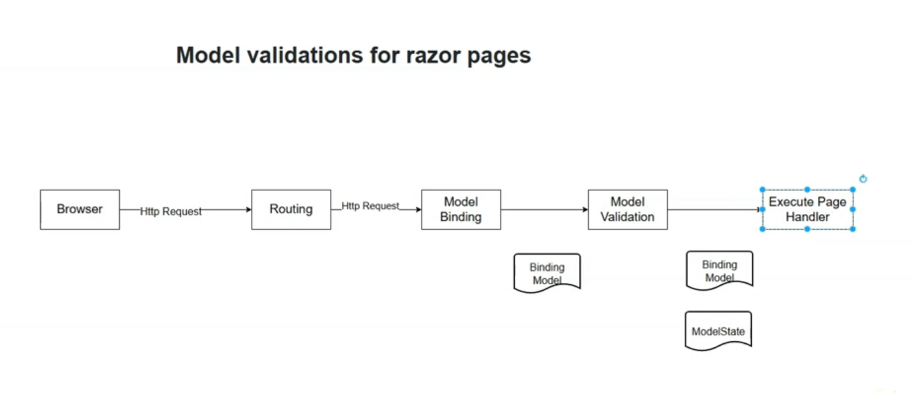

# Introduction to Razor Pages: A Page-Focused Alternative to MVC

ASP.NET Core offers two primary models for building server-rendered web applications: MVC (Model-View-Controller) and Razor Pages. While MVC is a powerful, pattern-driven framework, Razor Pages provides a simpler, more intuitive, page-focused alternative. This guide explains the "why" behind Razor Pages and contrasts its philosophy with that of MVC.

## The "Why": Addressing the Complexity of MVC

The MVC pattern is "technology-oriented." It organizes an application around technical concerns: a request comes in, a **Controller** finds the right **Action** method to handle it, processes logic, and then selects a **View** to render.

This separation is powerful but can introduce complexity and boilerplate code:

* **Scattered Files:** The code for a single piece of functionality is spread across multiple folders. The logic is in `/Controllers/MyController.cs`, and the UI is in `/Views/My/Index.cshtml`. This requires developers to jump between files and folders.
* **Mental Overhead:** Developers have to think in terms of controllers and actions, which is a layer of abstraction away from what the end-user sees: a web page.


## The Razor Pages Solution: A Page-Focused Model

Razor Pages was designed to offer a more intuitive and streamlined development experience by aligning the development model with the user's perspective. A web application is fundamentally a collection of pages, so Razor Pages organizes code on a per-page basis.

Each page in a Razor Pages application is a self-contained pair of files:

1. **The `.cshtml` file:** Contains the Razor markup for the UI (the "view").
2. **The `.cshtml.cs` file:** A C\# class called the **Page Model** (or "code-behind") that contains the properties and logic for the page.

This co-location means that everything you need for a single page—its UI and its server-side logic—is in one place, making it easier to find, understand, and maintain.

### Illustrating the Structural Difference

The core benefit of Razor Pages becomes clear when comparing the file structures for an equivalent page.

**Typical MVC Structure:**
The logic and view are in completely separate directory trees.

```
/Project
|
├── /Controllers
|   └── DepartmentsController.cs   // <-- Logic for the page lives here
|
└── /Views
    └── /Departments
        └── Index.cshtml           // <-- UI for the page lives here
```

**Typical Razor Pages Structure:**
The logic and view files are paired together in the same directory.

```
/Project
|
└── /Pages
    └── /Departments
        ├── Index.cshtml           // <-- UI for the page
        └── Index.cshtml.cs        // <-- Logic for the page (Page Model)
```

This structure is simpler and more closely reflects the final application's page-based navigation.

***

### Key Concepts Summary for Interviews

This table provides a high-level comparison between the MVC and Razor Pages development models.


| Feature | ASP.NET Core MVC | ASP.NET Core Razor Pages |
| :-- | :-- | :-- |
| **Core Philosophy** | **Controller-focused.** Organizes code around controllers and action methods. A single controller can handle many related actions/views. | **Page-focused.** Organizes code around the user-facing page. Each page is a self-contained unit. |
| **File Structure** | **Scattered.** Logic is in `/Controllers`, UI is in `/Views`. | **Co-located.** The UI (`.cshtml`) and logic (`.cshtml.cs`) for a page are kept together in the `/Pages` folder. |
| **Logic Location** | In **Controller** classes, within **Action** methods (e.g., `Index()`, `Details()`). | In the **Page Model** class, within handler methods (e.g., `OnGet()`, `OnPost()`). |
| **Routing** | Maps a URL to a `Controller` and `Action`. (e.g., `/Departments/Index`). | Maps a URL directly to the physical file path in the `/Pages` folder. (e.g., `/Departments/Index`). |
| **Best Use Case** | Complex applications with many related actions, REST APIs, or where a strict separation of concerns is critical. | Page-centric applications, such as forms, dashboards, and simple-to-medium CRUD apps. Excellent for rapid development. |

# Creating Your First Razor Pages Application

This guide walks through the process of setting up a new ASP.NET Core Razor Pages application from an empty project template. We will cover the project structure, essential configuration in `Program.cs`, and how to create and navigate between pages.

## 1. Project Setup and File Conventions

Razor Pages relies on conventions, with the most important one being the `/Pages` folder. This folder is the root for all your application's pages.

When you add a Razor Page, Visual Studio creates two files that are linked together:

* **`.cshtml` file:** The Razor template containing the HTML and C\# markup for the page's UI.
* **`.cshtml.cs` file:** The "code-behind" or **Page Model**. This C\# class inherits from `PageModel` and contains the properties and server-side logic (handler methods) for the page.

```csharp
// /Pages/Index.cshtml.cs - The Page Model (Logic)
using Microsoft.AspNetCore.Mvc.RazorPages;

public class IndexModel : PageModel
{
    // C# logic, properties, and handler methods go here.
    public void OnGet()
    {
    }
}
```

```csharp
@* /Pages/Index.cshtml - The Razor Page (UI) *@
@page
@model IndexModel

<h3>Hello World</h3>
```

The `@page` directive at the top of the `.cshtml` file is crucial; it marks the file as a Razor Page and activates the framework's routing and model binding features.

## 2. Configuring `Program.cs` for Razor Pages

To enable Razor Pages in an ASP.NET Core application, you must register its services and configure the middleware pipeline in `Program.cs`.

This involves three key steps:

1. **Add Services:** Call `builder.Services.AddRazorPages()` to register all the necessary services for Razor Pages in the dependency injection container.
2. **Enable Routing:** Add the routing middleware to the pipeline with `app.UseRouting()`.
3. **Map Endpoints:** Tell the routing system to map URLs to Razor Pages by calling `app.MapRazorPages()`.
```csharp
// Program.cs

var builder = WebApplication.CreateBuilder(args);

// 1. Add services to the container.
// This is similar to AddControllersWithViews() in MVC.
builder.Services.AddRazorPages();

var app = builder.Build();

// --- Middleware Pipeline Configuration ---

// For modern, top-level registration, this is all you need:
app.MapRazorPages();

// The expanded, traditional way of setting up the pipeline:
/*
app.UseRouting();
app.UseEndpoints(endpoints =>
{
    endpoints.MapRazorPages();
});
*/

app.Run();
```

The `app.MapRazorPages()` call is the modern, minimal way to set up the routing endpoints. It discovers all of the Razor Pages in the `/Pages` folder and sets up routes for them automatically.

## 3. Creating and Navigating Between Pages

Routing in Razor Pages is based on the physical file path within the `/Pages` folder. The framework handles this automatically without needing explicit route configuration for each page.

For example, if you create a new page at `/Pages/Employees.cshtml`:

```
/Pages
|-- Index.cshtml
|-- Index.cshtml.cs
|-- Employees.cshtml     <-- New Page
`-- Employees.cshtml.cs
```

You can access this new page by navigating to the `/employees` URL in your browser.

```csharp
@* /Pages/Employees.cshtml *@
@page
@model EmployeesModel
@{
    ViewData["Title"] = "Employees";
}

<h1>Employees</h1>
```

This page-focused approach is intuitive because the URL structure of your application directly mirrors your project's folder structure.

***

### Key Concepts Summary for Interviews

| Component / Concept | Role \& Responsibility | Key Code / Convention |
| :-- | :-- | :-- |
| **`/Pages` Folder** | The conventional root directory for all Razor Pages. The framework discovers and routes to pages within this folder. | Must be named `Pages`. |
| **`.cshtml` File** | The view part of a page. Contains the HTML and Razor markup for the UI. | Must start with the `@page` directive. |
| **`.cshtml.cs` File (Page Model)** | The logic part of a page ("code-behind"). A C\# class that handles requests and holds the page's data. | The class must inherit from `PageModel`. |
| **`AddRazorPages()`** | Registers the required services for the Razor Pages framework with the dependency injection container. | `builder.Services.AddRazorPages();` |
| **`MapRazorPages()`** | Configures the middleware pipeline to map URL requests to the corresponding physical page files. | `app.MapRazorPages();` |
| **File-Based Routing** | The core routing mechanism. A URL is automatically mapped to a page based on its location in the `/Pages` folder. | A request to `/Employees/Details` maps to `/Pages/Employees/Details.cshtml`. |

# Razor Pages Routing Basics

Routing in Razor Pages follows the same fundamental ASP.NET Core pipeline as MVC and Minimal APIs: the routing middleware matches an incoming URL to a pre-registered route, and the endpoint middleware executes the corresponding handler. However, Razor Pages simplifies this process by using a convention-based approach where routes are automatically generated from file paths.

## The Core Principle: File-Based Routing

The route for a Razor Page is determined by its physical location on disk, relative to the root `/Pages` folder. You do not need to configure routes manually; the framework handles it for you based on your file and folder structure.

The rules are simple:

1. The `/Pages` folder is the root (`/`) of your application's URL space.
2. Each subfolder within `/Pages` becomes a segment in the URL.
3. The name of the `.cshtml` file (without the extension) becomes the final segment of the URL.

### The `Index.cshtml` Exception

The only special case is for pages named `Index.cshtml`. This file name is considered the default for its directory and can be omitted from the URL. This means an `Index.cshtml` page will have *two* routes generated for it: one with `/index` and one without.

### Example: File Structure to URL Mapping

Consider the following file structure inside the `/Pages` folder:

```
/Pages
|
|-- Index.cshtml
|
|-- /Employees
|   |-- Index.cshtml
|   |-- Add.cshtml
|   `-- Edit.cshtml
|
`-- /Reports
    `-- /Sales
        `-- Index.cshtml
```

Based on this structure, the framework will generate the following routes:


| File Path | Generated URL(s) |
| :-- | :-- |
| `/Pages/Index.cshtml` | `/` and `/index` |
| `/Pages/Employees/Index.cshtml` | `/employees` and `/employees/index` |
| `/Pages/Employees/Add.cshtml` | `/employees/add` |
| `/Pages/Employees/Edit.cshtml` | `/employees/edit` |
| `/Pages/Reports/Sales/Index.cshtml` | `/reports/sales` and `/reports/sales/index` |

This convention makes routing predictable and intuitive, as the URL structure of your application directly mirrors the folder structure of your project.

***

### Key Concepts Summary for Interviews

| Concept | Description | Key Convention / Rule |
| :-- | :-- | :-- |
| **File-Based Routing** | The core routing mechanism in Razor Pages. Routes are not configured manually but are derived from file paths. | The URL directly corresponds to the file's location in the `/Pages` folder. |
| **The Root Path** | The `/Pages` folder acts as the application's URL root. All routes are relative to this folder. | `/Pages` folder ➞ `/` URL |
| **Route Generation** | The URL is built by taking the folder path and appending the file name (without the `.cshtml` extension). | `/Pages/Users/Profile.cshtml` ➞ `/users/profile` |
| **The `Index.cshtml` Rule** | Pages named `Index.cshtml` are the default for their directory. The `/index` part of their URL is optional. | `/Pages/Products/Index.cshtml` ➞ `/products` **and** `/products/index` |
| **ASP.NET Core Integration** | Razor Pages routing is built on the standard ASP.NET Core routing and endpoint middleware, making it consistent with the rest of the framework. | `app.MapRazorPages()` registers all file-based routes with the endpoint middleware. |


# How Razor Pages Work: Page Handlers as Endpoints

While Razor Pages provides a simpler, page-focused development model, it still operates on the same underlying ASP.NET Core request pipeline as MVC. This means that for every page request, an endpoint handler must be executed. This guide explains where these handlers live in the Razor Pages architecture and how they work.

## The Endpoint Handler in Razor Pages

In an MVC application, the endpoint handlers are the **action methods** inside a controller. In Razor Pages, the endpoint handlers are the methods inside the **Page Model** class (`.cshtml.cs` file). These are called **Page Handlers**.

By convention, page handler names are prefixed with "On" followed by the HTTP verb they respond to. The most common handler is `OnGet()`, which executes in response to an HTTP GET request for the page.

### Why Page Handlers Can Return `void`

A key difference from MVC is that page handlers can return `void`. In MVC, an action method must return an `IActionResult` (like `View("MyView")`) to tell the framework which view to render. This is because a single controller can be associated with many different views.

In Razor Pages, however, a Page Model is always tightly coupled to a single, specific Razor Page. Because the framework already knows exactly which `.cshtml` file to render, an explicit return value is not needed. When a page handler has a `void` return type, it is an implicit instruction to the framework: **"My logic is done; now render my associated page."**

### The Role of the View Engine

It's important to remember that the page handler itself does not generate the final HTML. The handler executes server-side logic, and its result (whether an explicit `IActionResult` or an implicit instruction from a `void` method) is passed to the ASP.NET Core **View Engine**.

The View Engine is the component that:

1. Takes the result from the page handler.
2. Locates and processes the associated `.cshtml` file.
3. Executes any C\# code within the Razor file.
4. Generates the final HTML.
5. Sends the generated HTML back to the browser as the HTTP response.

This process is identical in both Razor Pages and MVC.

```csharp
// /Pages/Employees/Add.cshtml.cs - The Page Model

using Microsoft.AspNetCore.Mvc.RazorPages;
using Microsoft.Extensions.Logging;

public class AddModel : PageModel
{
    private readonly ILogger<AddModel> _logger;

    public AddModel(ILogger<AddModel> logger)
    {
        _logger = logger;
    }

    // This is the PAGE HANDLER. It runs for a GET request to /Employees/Add.
    // It can return void because it's tied to Add.cshtml.
    public void OnGet()
    {
        _logger.LogInformation("The Add Employee page was requested.");
        // After this method completes, the framework knows to render Add.cshtml.
    }
}
```

```csharp
@* /Pages/Employees/Add.cshtml - The Razor Page *@
@page
@model AddModel
@{
    ViewData["Title"] = "Add Employee";
}

<h1>Add New Employee</h1>
<!-- The View Engine processes this file to generate the final HTML -->
```


***

### Key Concepts Summary for Interviews

| Concept | Description | Key Detail / Example |
| :-- | :-- | :-- |
| **Page Handler** | The endpoint handler in Razor Pages. It's a method within the Page Model that executes in response to a request. | `OnGet()`, `OnPost()`, `OnPostDeleteAsync()`. |
| **Page Model** | The C\# class (`.cshtml.cs`) containing the logic and data for a specific Razor Page. It is where Page Handlers are defined. | A class that inherits from `PageModel`. |
| **`void` Return Type** | A page handler can return `void` because it is tightly coupled to a single page. This implicitly tells the framework to render the associated `.cshtml` file. | `public void OnGet() { /* logic */ }` |
| **View Engine** | The ASP.NET Core component that processes the handler's result and the Razor file to generate the final HTML response. | This is a core framework component, consistent across MVC and Razor Pages. |
| **Handler vs. Action Method** | A **Page Handler** is the Razor Pages equivalent of an MVC **Action Method**. Both serve as the executable logic for a URL endpoint. | `OnGet()` in Razor Pages vs. `public IActionResult Index()` in MVC. |

# Customizing Route Templates in Razor Pages

While Razor Pages offers a convenient file-based routing system by default, there are times when you need to customize the URL for a specific page. ASP.NET Core provides a simple and powerful way to modify these default routes directly within the Razor Page itself using the `@page` directive.

There are two primary ways to customize a route: appending additional segments or completely replacing the default route.

## 1. Appending Segments to the Default Route

You can add one or more segments to the end of the default, file-based route. This is useful for adding more descriptive information to a URL without changing its base path.

To append a segment, provide a route template string to the `@page` directive **without a leading slash (`/`)**.

### Example: Appending

Consider a page located at `/Pages/Employees/Add.cshtml`.

* **Default Route:** `/employees/add`

By modifying the `@page` directive in `Add.cshtml`, we can extend this route.

```csharp
@* /Pages/Employees/Add.cshtml *@

@* This appends "/extra-segment" to the default route *@
@page "extra-segment"
@model AddModel

<h1>Add New Employee</h1>
```

* **New Route:** The page is now only accessible at `/employees/add/extra-segment`. The original `/employees/add` route will no longer work and will result in a 404 Not Found error.

You can also append multiple segments:

```csharp
@page "segment1/segment2"
// New Route: /employees/add/segment1/segment2
```


## 2. Replacing the Default Route

If you want to define a completely custom URL for a page that is independent of its file path, you can replace the default route entirely.

To replace a route, provide a route template string to the `@page` directive that **starts with a leading slash (`/`)**. This tells the framework to ignore the file-based route and use your new definition instead.

### Example: Replacing

Again, consider the page at `/Pages/Employees/Add.cshtml`.

To give it a simpler, top-level URL, we can replace its route.

```csharp
@* /Pages/Employees/Add.cshtml *@

@* This REPLACES the default route with "/add-employee" *@
@page "/add-employee"
@model AddModel

<h1>Add New Employee</h1>
```

* **New Route:** The page is now only accessible at `/add-employee`. The file-based route `/employees/add` is completely disabled.

***

### Key Concepts Summary for Interviews

| Concept | Description | Syntax / Example |
| :-- | :-- | :-- |
| **Default Routing** | The route is automatically generated based on the file's path relative to the `/Pages` folder. | `/Pages/Users/Profile.cshtml` → `/users/profile` |
| **The `@page` Directive** | The tool used within a `.cshtml` file to customize its route template. By itself (`@page`), it enables Razor Pages functionality. | `@page` or `@page "..."` |
| **Appending Segments** | Adds one or more segments to the *end* of the default file-based route. | `@page "extra-segment"`<br>(No leading `/`) |
| **Replacing a Route** | Completely overrides the default file-based route with a new, absolute route definition. | `@page "/new-custom-route"`<br>(Must have a leading `/`) |


# Using Route Parameters in Razor Pages

Route parameters are essential for building dynamic pages that display specific data, such as showing the details for a particular employee. In Razor Pages, route parameters are defined as segments in the route template using the `@page` directive and can be bound to your Page Model logic in two different ways.

## 1. Defining Route Parameters

Route parameters are added to a page's route template directly in the `.cshtml` file using the `@page` directive. This approach allows for required parameters, optional parameters, and route constraints, just like in ASP.NET Core MVC.

Consider a page at `/Pages/Employees/Edit.cshtml`.

* **Default Route:** `/employees/edit`

We can add a required `id` parameter to it:

```csharp
@* /Pages/Employees/Edit.cshtml *@

@* This appends a required "id" parameter segment. *@
@page "{id}"
@model EditModel

<h1>Edit Employee</h1>
```

* **New Route:** `/employees/edit/{id}` (e.g., `/employees/edit/100`)


### Adding Constraints and Optional Parameters

The same syntax from MVC routing applies here.

* **With a Route Constraint:** `@page "{id:int}"` (Ensures `id` is an integer)
* **As an Optional Parameter:** `@page "{id:int?}"` (The `id` segment is no longer required)


## 2. Receiving Parameter Values in the Page Model

Once a route parameter is defined, its value must be captured in the Page Model (`.cshtml.cs` file). There are two primary methods for this.

### Method 1: Handler Parameter Binding

The value can be passed directly as an argument to the page handler method. This is very similar to how action methods work in MVC.

```csharp
// /Pages/Employees/Edit.cshtml.cs

public class EditModel : PageModel
{
    // The "id" from the route is bound directly to this method parameter.
    public void OnGet(int id)
    {
        // Now you can use the 'id' value inside the handler.
        // For example, load an employee from the database.
        var employeeId = id; 
    }
}
```


### Method 2: Model Property Binding (Recommended)

A more common and powerful pattern in Razor Pages is to bind the route parameter value directly to a public property on the Page Model. This makes the value available to both the handler methods and the Razor view.

This requires decorating the property with the `[BindProperty]` attribute and setting `SupportsGet = true` to allow binding on HTTP GET requests.

```csharp
// /Pages/Employees/Edit.cshtml.cs

public class EditModel : PageModel
{
    // 1. Decorate the property with [BindProperty].
    // 2. Set SupportsGet = true to enable binding from the route on GET requests.
    [BindProperty(SupportsGet = true)]
    public int Id { get; set; }

    public void OnGet()
    {
        // The 'Id' property is automatically populated with the value from the route.
        // No need for a method parameter.
        var employeeId = this.Id;
    }
}
```

The main advantage of this method is that the property becomes part of the page's `Model`, making it directly accessible in the `.cshtml` file.

```csharp
@* /Pages/Employees/Edit.cshtml *@
@page "{id:int}"
@model EditModel

<h1>Edit Employee</h1>

@* You can directly access the Id property from the model *@
<h3>Editing Employee ID: @Model.Id</h3>
```


***

### Key Concepts Summary for Interviews

| Concept | Description | Key Code / Example |
| :-- | :-- | :-- |
| **Parameter Definition** | Route parameters are defined as segments in the string provided to the `@page` directive. | `@page "{id:int}"` |
| **Handler Parameter Binding** | The route value is passed as an argument to the handler method (e.g., `OnGet`). Simple and direct. | `public void OnGet(int id) { ... }` |
| **Model Property Binding** | The route value is bound to a public property on the `PageModel`. This is the preferred method in Razor Pages. | `[BindProperty(SupportsGet = true)]`<br>`public int Id { get; set; }` |
| **`[BindProperty(SupportsGet = true)]`** | The attribute required to bind a model property from the route or query string during an HTTP GET request. | Must be applied to the property in the Page Model. |
| **Access in View** | When using property binding, the parameter value is easily accessible in the Razor view via the `Model` property. | `@Model.Id` |
| **Constraints \& Optionality** | Standard route constraints (`:int`, `:alpha`) and optional syntax (`?`) work just as they do in MVC. | `@page "{id:int?}"` |


# Page Handler Selection in Razor Pages

In Razor Pages, a single page can handle multiple operations (like GET, POST for saving, POST for deleting). The framework needs a way to select the correct **Page Handler** method to execute for a given request. This selection is based on a combination of the HTTP verb and an optional handler name.

## 1. Selection by HTTP Verb (The Default)

The primary way to select a handler is by matching the request's HTTP verb to the handler's name. By convention, handler methods are named `On[Verb]`, where `[Verb]` is the HTTP method (e.g., `Get`, `Post`, `Put`).

* An **HTTP GET** request to a page will execute the `OnGet()` or `OnGetAsync()` handler.
* An **HTTP POST** request will execute the `OnPost()` or `OnPostAsync()` handler.

```csharp
// Edit.cshtml.cs
public class EditModel : PageModel
{
    // Handles GET requests
    public void OnGet()
    {
        // ... logic to show the form
    }

    // Handles POST requests
    public void OnPost()
    {
        // ... logic to process a default form submission
    }
}
```


## 2. Selection by Named Handlers

Often, a single page needs to handle multiple actions for the same HTTP verb. For example, an edit page might have both a "Save" button and a "Delete" button, both of which should use HTTP POST. To distinguish between these actions, we use **Named Handlers**.

The convention for named handlers is `On[Verb][HandlerName]`.

* `OnPostSave()`: A POST handler named "Save".
* `OnPostDelete()`: A POST handler named "Delete".


### Invoking Named Handlers

To invoke a specific named handler, you must pass its name in the request. The default way to do this is with a `handler` query string parameter.

**Example: Page Model with Named Handlers**

```csharp
// /Pages/Employees/Edit.cshtml.cs
public class EditModel : PageModel
{
    [BindProperty(SupportsGet = true)]
    public int Id { get; set; }

    public void OnGet() { /* ... */ }

    // Named handler for the "Save" action
    public IActionResult OnPostSave()
    {
        // Logic to save the employee...
        return Page(); // Re-render the current page
    }

    // Named handler for the "Delete" action
    public IActionResult OnPostDelete()
    {
        // Logic to delete the employee...
        return RedirectToPage("/Employees/Index"); // Redirect to another page
    }
}
```

**Example: Razor View with Forms Targeting Named Handlers**

In the `.cshtml` file, you create separate forms. Each form's `action` URL includes the `?handler=[HandlerName]` query string to target the correct handler.

```csharp
@* /Pages/Employees/Edit.cshtml *@
@page "{id:int}"
@model EditModel

<h3>Save Employee</h3>
<form method="post" asp-page-handler="Save" asp-route-id="@Model.Id">
    @* Tag helpers automatically add the anti-forgery token *@
    <button type="submit">Save</button>
</form>

<hr />

<h3>Delete Employee</h3>
<form method="post" asp-page-handler="Delete" asp-route-id="@Model.Id">
    <button type="submit">Delete</button>
</form>
```

The `asp-page-handler` tag helper is the recommended way to generate the correct URL with the handler query string.

### Anti-Forgery Protection

Razor Pages enforces anti-forgery checks on POST requests by default for security. The `<form method="post">` tag helper automatically includes the necessary anti-forgery token. If you write a manual `<form>` tag, you must include the token yourself with `@Html.AntiForgeryToken()`.

***

### Key Concepts Summary for Interviews

| Concept | Description | Syntax / Example |
| :-- | :-- | :-- |
| **Handler Selection** | The framework selects a handler based on the HTTP verb and, optionally, a handler name. | GET request → `OnGet()`. POST request → `OnPost()`. |
| **Handler Naming Convention** | `On[Verb][HandlerName][Async]`. The `HandlerName` and `Async` parts are optional. | `OnGet()`, `OnPostAsync()`, `OnPostDeleteAsync()` |
| **Named Handlers** | Used to create multiple handlers for the same HTTP verb on a single page. | `OnPostSave()`, `OnPostDelete()` |
| **Invoking Named Handlers** | By default, this is done via a query string: `?handler=...`. The `asp-page-handler` tag helper is the best way to generate this. | `asp-page-handler="Save"` → `?handler=Save` |
| **Alternative Invocation** | You can optionally configure a route parameter (`{handler?}`) in the `@page` directive to use a URL segment instead of a query string. | `@page "{id:int}/{handler?}"` → `/employees/edit/1/save` |
| **Anti-Forgery Token** | Enforced by default for POST requests in Razor Pages. The `<form>` tag helper handles this automatically. | The framework will reject POSTs that lack a valid token. |


# Implicit Page Handlers in Razor Pages

In Razor Pages, handler selection is precise: a request for a named handler like `?handler=save` will try to execute a corresponding method like `OnPostSave()`. But what happens if a request specifies a handler name that doesn't exist in the Page Model?

Instead of failing with an error, Razor Pages gracefully handles this situation using an **implicit page handler**. The framework effectively generates an empty, on-the-fly handler that does nothing and then returns a default `PageResult`, which simply re-renders the associated page.

## How Implicit Handlers Work

This behavior ensures that the application remains robust. If a form is submitted to a non-existent handler, the user isn't shown an error page; instead, the form is just displayed again. This is a forgiving default that prevents crashes due to typos or outdated client-side code.

### Example: Invoking a Non-Existent Handler

Let's demonstrate this with a practical example. Imagine we have a page model with specific handlers for "Save" and "Delete".

**1. The Page Model with Defined Handlers**
The `PageModel` only contains handlers for `Save` and `Delete`. There is no handler for `SaveV2`.

```csharp
// /Pages/Employees/Edit.cshtml.cs
public class EditModel : PageModel
{
    private readonly ILogger<EditModel> _logger;

    public EditModel(ILogger<EditModel> logger)
    {
        _logger = logger;
    }

    public void OnGet() { }

    // This handler exists and will be executed.
    public IActionResult OnPostSave()
    {
        _logger.LogInformation("--- OnPostSave handler was executed! ---");
        return Page();
    }

    // This handler also exists.
    public IActionResult OnPostDelete()
    {
        _logger.LogInformation("--- OnPostDelete handler was executed! ---");
        return Page();
    }

    // NOTE: There is NO OnPostSaveV2() method here.
}
```

**2. The Razor View with a Mismatched Handler**
The view contains two forms. One correctly targets the `Save` handler, while the other incorrectly targets a non-existent `SaveV2` handler.

```csharp
@* /Pages/Employees/Edit.cshtml *@
@page "{id:int}"
@model EditModel

<h3>Correct Handler</h3>
<form method="post" asp-page-handler="Save">
    <button type="submit">Invoke "Save" Handler</button>
</form>

<hr />

<h3>Incorrect (Implicit) Handler</h3>
<form method="post" asp-page-handler="SaveV2">
    <button type="submit">Invoke "SaveV2" Handler (Does Not Exist)</button>
</form>
```

**Behavior:**

* Clicking the first button ("Invoke 'Save' Handler") will execute the `OnPostSave` method, and you will see its log message.
* Clicking the second button ("Invoke 'SaveV2' Handler") will **not** execute any of the defined handlers in the `EditModel`. Instead, the implicit handler will be invoked, doing nothing, and the page will simply reload as if nothing happened.

This mechanism provides a silent and graceful fallback when an explicit handler cannot be found.

***

### Key Concepts Summary for Interviews

| Concept | Description | Key Behavior |
| :-- | :-- | :-- |
| **Implicit Handler** | An empty, on-the-fly page handler that the framework executes when a request arrives for a page but no explicit handler matches the HTTP verb and handler name. | Prevents the application from throwing an error for a missing handler. |
| **When It's Invoked** | When a request is made with a handler name (e.g., `?handler=saveV2`) that has no corresponding method (e.g., `OnPostSaveV2`) in the `PageModel`. | The route to the page must be valid, but the specific handler is not. |
| **Result** | The implicit handler does nothing and effectively returns a `PageResult` for the current page. | The page is simply re-rendered, often making it seem like the button click had no effect. |
| **Why It's Useful** | It provides a forgiving default behavior, making the application more resilient to mismatches between the client-side code (forms) and server-side handlers. | It's a form of "graceful degradation." |


# Model Binding in Razor Pages

Model binding is the ASP.NET Core process of extracting data from an HTTP request (from route data, query strings, form fields, etc.) and converting it into C\# objects or parameters that can be used by your application logic.

While the underlying mechanism for model binding in Razor Pages is **exactly the same as in ASP.NET Core MVC**, the preferred patterns and conventions differ slightly to align with the page-focused nature of the framework.

## Model Binding Approaches in Razor Pages

There are two primary ways to bind incoming data to your Page Model.

### 1. Handler Parameter Binding

This approach is identical to MVC. Data from the request is bound to parameters on the handler method. This is straightforward but scopes the bound data only to that specific handler.

```csharp
// /Pages/Employees/Edit.cshtml.cs
public class EditModel : PageModel
{
    // The "id" from the route and "name" from the form are bound to method parameters.
    // The data is only available inside this method.
    public IActionResult OnPost(int id, string name)
    {
        // ... logic using id and name
        return Page();
    }
}
```


### 2. Model Property Binding (Preferred Method)

This is the more common and powerful pattern in Razor Pages. Data is bound to public properties on the `PageModel` class itself. This is achieved by decorating the property with the `[BindProperty]` attribute.

The key advantage is that the bound data is available to **all handlers** within the Page Model and, importantly, is also directly accessible in the Razor view via the `@Model` property.

```csharp
// /Pages/Employees/Edit.cshtml.cs
public class EditModel : PageModel
{
    // Bind the "Id" from the route data. SupportsGet = true is required for GET requests.
    [BindProperty(SupportsGet = true)]
    public int Id { get; set; }

    // Create a property for a complex type to bind form data.
    [BindProperty]
    public InputModel Input { get; set; }

    // This handler can now access both Id and Input without any parameters.
    public IActionResult OnPost()
    {
        var employeeId = this.Id;
        var employeeName = this.Input.Name;
        // ... logic to save the data
        return Page();
    }

    // A nested class for organizing form inputs
    public class InputModel
    {
        public string Name { get; set; }
    }
}
```


## Binding to Complex Types

For model binding to a complex type (like the `InputModel` class above) to work, the `name` attributes of your HTML form inputs must follow a specific `PropertyName.NestedPropertyName` convention.

```html
@* /Pages/Employees/Edit.cshtml *@
@page "{id:int}"
@model EditModel

<form method="post">
    <!-- 
      The name "Input.Name" tells the model binder to map this field 
      to the 'Name' property of the 'Input' property on the Page Model.
    -->
    <input type="text" name="Input.Name" />
    
    <button type="submit">Save</button>
</form>
```


## Binding All Properties with `[BindProperties]`

As a shortcut, you can decorate the entire `PageModel` class with the `[BindProperties]` attribute. This will automatically apply model binding to **all public properties** in the class, saving you from having to add `[BindProperty]` to each one individually.

While convenient, this can lead to accidental over-posting if not used carefully. Explicitly decorating individual properties is often considered a safer practice.

```csharp
// This attribute applies model binding to all public properties in the class.
[BindProperties(SupportsGet = true)]
public class EditModel : PageModel
{
    public int Id { get; set; } // This is now automatically bound
    public InputModel Input { get; set; } // This is also automatically bound
    // ...
}
```


***

### Key Concepts Summary for Interviews

| Concept | Description | Key Code / Example |
| :-- | :-- | :-- |
| **Model Binding** | The automatic process of mapping HTTP request data (route, query, form) to C\# objects and parameters. | Request data → C\# property/parameter |
| **Handler Parameter Binding** | Binding data directly to a handler method's parameters. Same as MVC. | `public void OnPost(int id) { ... }` |
| **Model Property Binding** | Binding data to a public property on the `PageModel` class. **This is the idiomatic Razor Pages approach.** | `[BindProperty] public string Name { get; set; }` |
| **`[BindProperty]` Attribute** | Marks a property as a target for model binding. By default, it only works for non-GET verbs. | `[BindProperty(SupportsGet = true)]` is needed for GET requests. |
| **Complex Type Binding** | Binding form data to properties of a nested class. Requires specific naming in the HTML form. | C\#: `public InputModel Input { get; set; }`<br>HTML: `<input name="Input.Name">` |
| **`[BindProperties]` Attribute** | A class-level attribute that applies `[BindProperty]` to all public properties of the `PageModel`. | `[BindProperties] public class MyModel : PageModel` |
| **Consistency with MVC** | The underlying binding sources (form, route, query), priority rules, and validation mechanisms are identical to those in ASP.NET Core MVC. | If you know model binding in MVC, you know it in Razor Pages. |


# Model Validation in Razor Pages

Model validation in Razor Pages is fundamentally the same as in ASP.NET Core MVC. It relies on a workflow where incoming data is bound, validated against rules, and the results are stored in the `ModelState` object, which must be checked by the developer before processing the data.
- 

## The Model Validation Workflow

The process for handling a request that involves validation follows these steps:

1. **Request \& Routing:** An HTTP request is made to a URL, and the routing middleware matches it to the correct Razor Page.
2. **Model Binding:** The framework extracts data from the request (form fields, route data, query strings) and populates the properties of the Page Model.
3. **Model Validation:** The framework then validates the bound data against data annotation attributes (e.g., `[Required]`) on the model's properties.
4. **`ModelState` Population:** Instead of throwing an exception, validation errors are collected and stored in the `ModelState` dictionary.
5. **Page Handler Execution:** The appropriate page handler (e.g., `OnPost()`) is finally executed. At this point, the developer is responsible for checking `ModelState.IsValid`.
6. **Conditional Logic:** If `ModelState` is not valid, the developer should stop processing and return to the page, typically displaying error messages. If it is valid, the application logic (e.g., saving to a database) can proceed.

This is different from Minimal APIs, where validation failures often result in an immediate HTTP 400 Bad Request response without giving the developer a chance to handle the state.

## Practical Implementation

### Step 1: Add Data Annotations to the Model

Define validation rules on your model properties using attributes from the `System.ComponentModel.DataAnnotations` namespace. This is supported by default in Razor Pages.

```csharp
// In Edit.cshtml.cs
public class EditModel : PageModel
{
    [BindProperty]
    public InputModel Input { get; set; }
    
    // ... handlers ...

    // A nested class for organizing form inputs
    public class InputModel
    {
        // Add a validation attribute
        [Required(ErrorMessage = "The employee name is required.")]
        public string Name { get; set; }

        // A property to hold error messages to display on the page
        public List<string> ErrorMessages { get; set; } = new();
    }
}
```


### Step 2: Check `ModelState` in the Page Handler

Inside your page handler, always begin by checking the `ModelState.IsValid` property.

```csharp
// In Edit.cshtml.cs
public class EditModel : PageModel
{
    // ... properties ...

    public void OnPostSave()
    {
        // Always check if the model state is valid first
        if (!ModelState.IsValid)
        {
            // If not valid, extract the error messages from ModelState
            // and store them in our model property to be displayed on the page.
            Input.ErrorMessages = ModelState.Values
                .SelectMany(v => v.Errors)
                .Select(e => e.ErrorMessage)
                .ToList();

            // Return to the page to show the errors.
            return; 
        }

        // --- If we get here, the data is valid ---
        // TODO: Do something with the valid data (e.g., save to DB).
    }
}
```


### Step 3: Display Validation Errors in the View

In the `.cshtml` file, add logic to conditionally render the error messages you collected.

```html
@* /Pages/Employees/Edit.cshtml *@
@page "{id:int}"
@model EditModel

@* Check if the ErrorMessages list has been populated *@
@if (Model.Input?.ErrorMessages?.Any() == true)
{
    <div style="color: red;">
        <strong>Please correct the following errors:</strong>
        <ul>
            @foreach (var error in Model.Input.ErrorMessages)
            {
                <li>@error</li>
            }
        </ul>
    </div>
}

<form method="post" asp-page-handler="Save">
    <div>
        <label asp-for="Input.Name"></label>
        <input asp-for="Input.Name" />
    </div>
    <button type="submit">Save</button>
</form>
```

When the user submits an empty form, the `ModelState` will be invalid, the `OnPostSave` handler will populate the `ErrorMessages` list, and the view will render the error message to the user.

***

### Key Concepts Summary for Interviews

| Concept | Description | Key Detail / Example |
| :-- | :-- | :-- |
| **Validation Workflow** | A multi-step process: Routing → Model Binding → Model Validation → Handler Execution. Validation happens *before* your code runs. | This flow is consistent between Razor Pages and MVC. |
| **Data Annotations** | Attributes placed on model properties to declare validation rules. These are checked during the model validation step. | `[Required]`, `[StringLength(50)]`, `[Range(1, 100)]` |
| **`ModelState` Object** | A dictionary that collects errors found during model binding and validation. It does **not** stop the request pipeline. | `ModelState` contains a collection of errors and a boolean `IsValid` property. |
| **`ModelState.IsValid`** | The property you must check in your handler to determine if validation passed. This is a mandatory step for any data processing. | `if (!ModelState.IsValid) { return Page(); }` |
| **Developer Responsibility** | Unlike in Minimal APIs, the framework does not automatically reject invalid requests. The developer must explicitly check `ModelState` and decide how to handle errors. | This gives developers more control over the user experience for displaying validation errors. |


# Producing Results in Razor Pages

While Razor Page handlers can return `void` to implicitly render their associated page, this approach is inflexible. To handle real-world scenarios like form validation and redirection, page handlers should return an `IActionResult`. This is the same interface used in ASP.NET Core MVC and unlocks the ability to return different types of results based on conditional logic.

In Razor Pages, you will primarily work with two types of results: `PageResult` and `RedirectToPageResult`.

## 1. Returning a `PageResult`

A `PageResult` instructs the framework to render the `.cshtml` view that is associated with the current `PageModel`. This is the equivalent of a handler returning `void`, but it's used explicitly when the handler's return type is `IActionResult`.

The most common use case is re-displaying a form after a validation error. You can create a `PageResult` using the `Page()` helper method.

**Key Point:** The `Page()` helper method does not require you to pass a model. The Razor Page is already strongly typed to its `PageModel` class, so all of the model's properties are automatically available to the view.

```csharp
// /Pages/Employees/Edit.cshtml.cs
public class EditModel : PageModel
{
    [BindProperty]
    public InputModel Input { get; set; }

    public IActionResult OnPost()
    {
        if (!ModelState.IsValid)
        {
            // If validation fails, return a PageResult to re-display the form.
            // The validation errors stored in ModelState will be available to the view.
            return Page();
        }

        // ... logic to save data ...

        return RedirectToPage("/Index");
    }
    // ... other code
}
```


## 2. Returning a `RedirectToPageResult`

A `RedirectToPageResult` performs an HTTP redirect, instructing the user's browser to navigate to a different page. This is the standard practice after a successful POST operation, following the Post-Redirect-Get (PRG) pattern. This prevents issues with users refreshing the page and re-submitting the form.

The `RedirectToPage()` helper method is used to create this result. It has several overloads, allowing you to specify the target page name, route values, and even a specific page handler.

```csharp
// /Pages/Employees/Edit.cshtml.cs
public class EditModel : PageModel
{
    // ... properties ...

    public IActionResult OnPostSave()
    {
        if (!ModelState.IsValid)
        {
            return Page();
        }

        // Logic to save the data to the database...

        // After a successful save, redirect to the main employee list page.
        return RedirectToPage("/Employees/Index");
    }

    public IActionResult OnPostDelete()
    {
        // Logic to delete the data...

        // After a successful delete, also redirect.
        return RedirectToPage("/Employees/Index");
    }
}
```


## Other Result Types

Because page handlers can return `IActionResult`, you have access to all the same result types as in MVC, such as `ContentResult` (`Content()`), `FileResult` (`File()`), and `JsonResult` (`Json()`). However, these are used far less frequently in Razor Pages, as the primary goal is typically to render an HTML page.

***

### Key Concepts Summary for Interviews

| Result Type / Concept | Description | Key Code / Example |
| :-- | :-- | :-- |
| **`void` Return Type** | The simplest case. Implicitly tells the framework to render the associated page. Lacks flexibility. | `public void OnGet() { /* ... */ }` |
| **`IActionResult` Return Type** | The recommended return type for handlers. Allows you to return different types of results based on logic (e.g., success vs. validation error). | `public IActionResult OnPost() { /* ... */ }` |
| **`Page()`** | Returns a `PageResult`, which renders the current page. Used to re-display a form, especially after validation fails. | `if (!ModelState.IsValid) { return Page(); }` |
| **`RedirectToPage()`** | Returns a `RedirectToPageResult`, which issues an HTTP redirect to another page. Used after a successful POST to prevent re-submission. | `return RedirectToPage("/Index");` |
| **Post-Redirect-Get (PRG)** | The design pattern of responding to a successful POST with a redirect. This is a best practice for form submissions. | `OnPost()` → `RedirectToPage()` → `OnGet()` |
| **Consistency with MVC** | Using `IActionResult` makes Razor Pages' result-producing capabilities almost identical to those of MVC controllers. | Both use the same underlying result types (`PageResult`, `ViewResult`, `RedirectResult`, etc.). |


# Shared UI Logic in Razor Pages: Layouts, Sections, and Imports

In Razor Pages, creating a consistent look and feel across your application is achieved using the same powerful features found in ASP.NET Core MVC: Layouts, Sections, `_ViewStart`, and `_ViewImports`. The functionality of these components is identical to their MVC counterparts, with the primary difference being their conventional file location.

## 1. The Layout File (`_Layout.cshtml`)

A layout file defines the common structure of your web pages, such as the header, navigation, and footer. Individual pages then render their specific content within this shared structure.

* **Convention:** Layout files are placed in the `/Pages/Shared/` folder.
* **Key Method:** The `@RenderBody()` method acts as a placeholder where the content of a specific Razor Page will be injected.

```csharp
@* /Pages/Shared/_Layout.cshtml *@
<!DOCTYPE html>
<html>
<head>
    <title>My App</title>
    @* Render an optional section for page-specific styles *@
    @await RenderSectionAsync("Styles", required: false)
</head>
<body>
    <header>
        <h1>Header Bar</h1>
    </header>

    <main role="main">
        @* This is where the content of the individual page will be rendered *@
        @RenderBody()
    </main>

    <footer>
        <p>&copy; 2025 - My App</p>
    </footer>
</body>
</html>
```


## 2. Using Sections for Optional Content

Sections allow individual pages to inject content into specific, named placeholders within the layout file. This is useful for adding page-specific scripts, styles, or sidebars.

* **Defined in Layout:** Use `@RenderSection("SectionName", required: false)` in `_Layout.cshtml`.
* **Implemented in Page:** Use `@section SectionName { ... }` in a specific Razor Page.

```csharp
@* /Pages/Employees/Edit.cshtml *@
@page "{id:int}"
@model EditModel

@* This section will be rendered where @RenderSection("MessageBar") is called in the layout *@
@section MessageBar {
    <div class="alert alert-info">
        You are now editing an employee.
    </div>
}

<h1>Edit Employee</h1>
<!-- ... rest of the page content ... -->
```


## 3. Centralizing Logic with `_ViewStart.cshtml`

To avoid repeating the `Layout = "_Layout";` declaration on every single page, you can place this logic in a `_ViewStart.cshtml` file. The code in this file is executed before any page in its folder (or subfolders) is rendered.

* **Convention:** Place `_ViewStart.cshtml` at the root of the `/Pages` folder to apply it to all pages.

```csharp
@* /Pages/_ViewStart.cshtml *@
@{
    // This sets the layout for all Razor Pages in the application.
    Layout = "_Layout";
}
```


## 4. Global Directives with `_ViewImports.cshtml`

The `_ViewImports.cshtml` file is used to declare directives that should be available to all pages. This is the perfect place for common `using` statements, registering tag helpers, or setting a shared namespace.

* **Convention:** Place `_ViewImports.cshtml` at the root of the `/Pages` folder.

```csharp
@* /Pages/_ViewImports.cshtml *@

@* Make this namespace available to all pages without explicit using statements *@
@using MyWebApp.Models

@* Register all built-in tag helpers for use in pages *@
@addTagHelper *, Microsoft.AspNetCore.Mvc.TagHelpers

@* Sets the root namespace for pages *@
@namespace MyWebApp.Pages
```


***

### Key Concepts Summary for Interviews

| Feature | Convention/Location | Purpose | Key Code Example |
| :-- | :-- | :-- | :-- |
| **Layout (`_Layout.cshtml`)** | `/Pages/Shared/` | Defines the shared UI template (header, footer, navigation) for all pages. | `@RenderBody()` |
| **Sections** | Defined in `_Layout.cshtml`, implemented in individual pages. | Allows pages to inject content into specific, named placeholders in the layout. | Layout: `@RenderSection("Scripts")`<br>Page: `@section Scripts { ... }` |
| **ViewStart (`_ViewStart.cshtml`)** | `/Pages/` | Code that runs before each page renders. Primarily used to set a default layout for all pages. | `@{ Layout = "_Layout"; }` |
| **ViewImports (`_ViewImports.cshtml`)** | `/Pages/` | Provides global directives like `using` statements and tag helper registrations to all pages. | `@using MyWebApp.Models`<br>`@addTagHelper *, ...` |


# Componentization in Razor Pages: Partial Views \& View Components

To create reusable UI components in Razor Pages, you don't need to learn any new technologies. The same powerful features from ASP.NET Core MVC—**Partial Views** and **View Components**—are available and work in exactly the same way. This guide serves as a refresher on how to implement both in a Razor Pages application.

It's important to note that while you may hear about "Razor Components," that technology belongs to Blazor, not Razor Pages.

## 1. Using Partial Views

Partial Views are snippets of Razor markup that can be rendered inside a page. They are ideal for breaking up large pages into smaller, more manageable pieces or for content that is reused across multiple pages. The discovery mechanism and rendering process are identical to MVC.

### Example: A Simple Partial View

First, create the partial view file. By convention, shared partials are placed in the `/Pages/Shared/` folder.

```csharp
@* /Pages/Shared/_MyPartialView.cshtml *@

@* If the partial view needs data, declare its model *@
@model int

<div class="alert alert-info">
    This is my message from a partial view for ID: @Model
</div>
```

Next, render the partial view from any Razor Page using the `Html.PartialAsync` helper. You can pass a model to it if required.

```html
@* /Pages/Employees/Edit.cshtml *@
@page "{id:int}"
@model EditModel

<h1>Edit Employee</h1>

<!-- ... other content ... -->

<hr />

@* Render the partial view, passing the current page's ID as its model *@
@await Html.PartialAsync("_MyPartialView", Model.Id)
```

This will render the contents of `_MyPartialView.cshtml` at that location, displaying the ID passed from the parent `EditModel`.

## 2. Using View Components

View Components are more powerful than Partial Views because they are fully self-contained, with their own logic to fetch data. They are perfect for widgets like a shopping cart, a tag cloud, or a dynamic navigation menu.

The implementation is the same as in MVC, with the only difference being the conventional folder structure: `/Pages/Shared/Components/`.

### Example: A Dynamic Message View Component

**Step 1: Create the View Component Class and View**
The class contains the logic, and the view contains the markup.

```csharp
// /Pages/Shared/Components/MyViewComponent/MyViewComponent.cs

using Microsoft.AspNetCore.Mvc;

public class MyViewComponent : ViewComponent
{
    // The component accepts a 'message' parameter
    public IViewComponentResult Invoke(string message)
    {
        // Pass the message to the view via ViewData
        ViewData["Message"] = message;
        return View();
    }
}
```

```csharp
@* /Pages/Shared/Components/MyViewComponent/Default.cshtml *@

<div class="card">
    <div class="card-body">
        Message from View Component: <strong>@ViewData["Message"]</strong>
    </div>
</div>
```

**Step 2: Invoke the View Component from a Razor Page**
Use the `Component.InvokeAsync` helper to render the component, passing any required arguments as an anonymous object.

```html
@* /Pages/Employees/Index.cshtml *@
@page
@model IndexModel

<h1>Employees</h1>

@await Component.InvokeAsync("MyView", new { message = "This is from the Index page!" })
```

This will execute the `MyViewComponent`, which will then render its `Default.cshtml` view, displaying the message passed from the `Index` page.

***

### Key Concepts Summary for Interviews

| Feature | Description | Key Code / Convention |
| :-- | :-- | :-- |
| **Componentization in Razor Pages** | No new technology is introduced. It uses the same Partial View and View Component models from MVC. | If you know them in MVC, you know them in Razor Pages. |
| **Partial View** | A reusable snippet of Razor markup (`.cshtml`) without its own logic. Data is passed to it from the parent page. | `@await Html.PartialAsync("_MyPartial", Model)` |
| **View Component** | A self-contained component with its own C\# class for logic and a `.cshtml` file for rendering. Fetches its own data. | `@await Component.InvokeAsync("MyComponent", new { ... })` |
| **File Location (Convention)** | The main difference from MVC. Shared files and components are conventionally located under the `/Pages` folder. | Partial Views: `/Pages/Shared/`<br>View Components: `/Pages/Shared/Components/` |

# Razor Pages vs. MVC: A Comparative Analysis

Now that we have explored both ASP.NET Core MVC and Razor Pages, it's time to compare them. While both are used to build server-rendered web applications and are built on the same underlying ASP.NET Core framework, they promote different architectural philosophies and development workflows. Understanding their pros and cons will help you choose the right tool for your project.

## The Architectural Differences

### ASP.NET Core MVC: The Classic Pattern

MVC enforces a strict **separation of concerns** by organizing an application into three distinct parts:

1. **Model:** A set of classes that represent the application's data and business logic.
2. **View:** The UI templates (`.cshtml` files) responsible for rendering the data from the model.
3. **Controller:** The coordinator that handles incoming requests, interacts with the model to fetch or update data, and selects a view to render.

In this pattern, the controller is a central hub, but it is distinct from the model it uses and the view it returns. This separation is technically clean and well-understood.

```csharp
// The MVC approach: Controller coordinates separate Model and View

// 1. The Model: A plain C# object for data
public class EmployeeViewModel
{
    public int Id { get; set; }
    public string Name { get; set; }
}

// 2. The Controller: Handles logic, creates the model, selects the view
public class EmployeesController : Controller
{
    public IActionResult Details(int id)
    {
        // Controller logic to fetch data
        var employee = _repository.GetById(id); 

        // Creates a separate view model
        var viewModel = new EmployeeViewModel { Id = employee.Id, Name = employee.Name };

        // Passes the model to a separate view file
        return View("Details", viewModel);
    }
}
```


### Razor Pages: The Page-Centric Model

Razor Pages simplifies the MVC pattern by combining the roles of the controller and the model into a single class: the **Page Model**.

1. **Page Model (`.cshtml.cs`):** This class acts as both the **controller** (its handler methods like `OnGet()` contain the logic) and the **model** (its public properties hold the data).
2. **Page (`.cshtml`):** The UI template, which is tightly coupled to its Page Model.

This approach blurs the line between controller and model, which can be seen as less "clean" from a pure architectural standpoint. However, it makes the development process more intuitive and page-focused.

```csharp
// The Razor Pages approach: PageModel is both Controller and Model

// 1. The PageModel: Handles logic and IS the model
public class DetailsModel : PageModel
{
    // Property acts as the model
    [BindProperty(SupportsGet = true)]
    public int Id { get; set; }
    public string EmployeeName { get; set; }

    // Handler acts as the controller action
    public void OnGet()
    {
        var employee = _repository.GetById(this.Id);
        this.EmployeeName = employee.Name; // Populates itself
    }
}

// 2. The Page: Is tightly coupled to the PageModel
/* In Details.cshtml */
// @Model.EmployeeName can be used directly
```


## Pros and Cons: Which to Choose?

The choice between MVC and Razor Pages often comes down to the nature of the project and team preference.

* **ASP.NET Core MVC** is developer-oriented. Its strength is its clear separation of concerns, which is excellent for large, complex applications, APIs, and situations where multiple actions operate on the same model. The drawback is that this technical structure can be disconnected from the page-based way that business requirements are usually written, potentially making long-term maintenance more challenging.
* **ASP.NET Core Razor Pages** is page-oriented. Its structure directly mirrors the structure of a website (one page = one set of files). This makes it incredibly intuitive to map business requirements to the codebase. It's often faster for developing form-based and page-centric applications. The main criticism is its less-strict separation of concerns.

There is no "wrong" choice, and it's even possible to use both in the same project. The best practice is to understand both and choose the one that best fits the problem you are trying to solve.

***

### Key Concepts Summary for Interviews

| Feature | ASP.NET Core MVC | ASP.NET Core Razor Pages |
| :-- | :-- | :-- |
| **Core Pattern** | **Strict Separation of Concerns.** The Controller is a coordinator between a separate Model and View. | **Page-Centric.** The `PageModel` combines the roles of the Controller and the Model. |
| **Logic \& Data** | **Controller:** Handles logic.<br>**Model:** A separate class for data. | **PageModel:** Its methods handle logic, and its properties hold the data. |
| **File Structure** | **Scattered.** Logic and UI files are in separate folders (`/Controllers`, `/Views`). | **Co-located.** The UI (`.cshtml`) and its logic (`.cshtml.cs`) are paired together in the `/Pages` folder. |
| **Main Advantage** | Architecturally "clean" and highly testable due to clear separation. Great for complex applications and APIs. | Intuitive and aligns directly with page-based business requirements, which can simplify development and maintenance. |
| **Main Disadvantage** | The developer-focused structure can be harder to map to user-facing pages, potentially complicating long-term maintenance. | Less strict separation of concerns, as the `PageModel` has multiple responsibilities. |
| **When to Choose** | Large-scale applications, REST APIs, or when a team strongly prefers a strict separation of concerns. | Most server-rendered web apps, especially those that are form-heavy or page-centric (CRUD apps, dashboards, etc.). |


