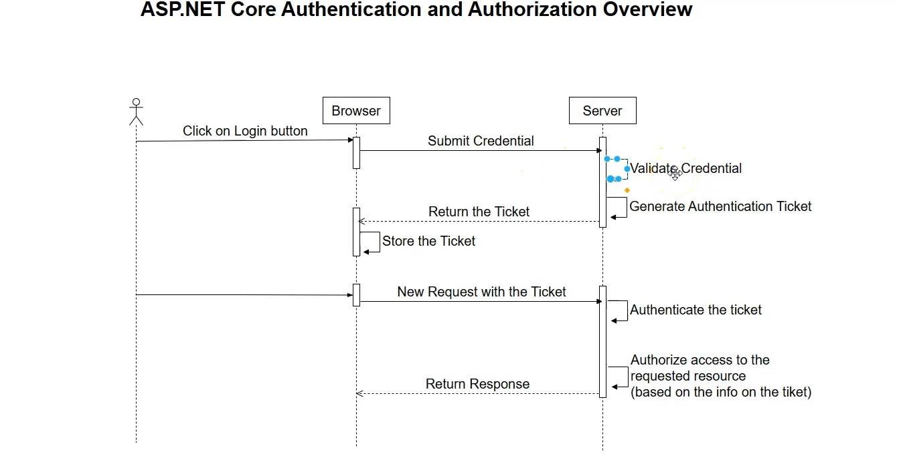
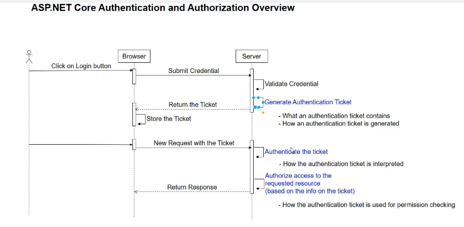
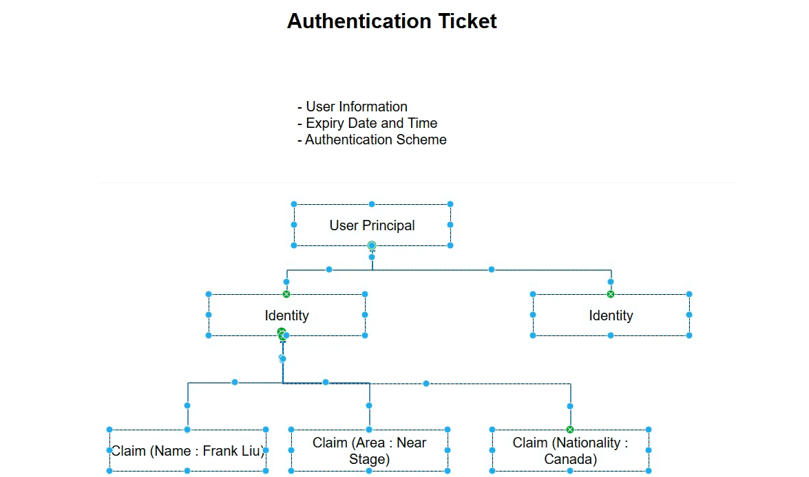
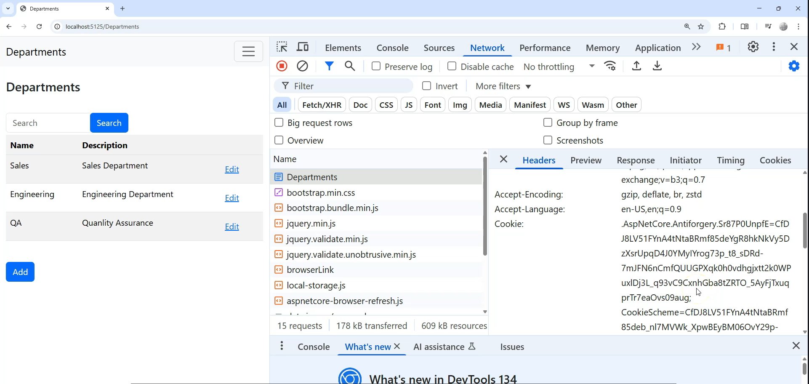

# Authentication and Authorization Process

### Summary

This transcript provides a high-level overview of the authentication and authorization process in ASP.NET Core. It distinguishes between the two concepts by explaining that **authentication** is the process of verifying a user's identity and issuing a ticket, while **authorization** is the process of checking that ticket to determine if the authenticated user has permission to access a specific resource. The entire workflow is described using a sequence diagram, from the initial login to subsequent requests for protected resources, and finally, the logout process.

***

### Main Points \& The Authentication/Authorization Flow

The entire process can be broken down into a sequence of interactions between the user's browser and the web server.

**Diagram: Authentication and Authorization Sequence**

```mermaid
sequenceDiagram
    participant User/Browser
    participant Server

    %% Step 1: Initial Login and Ticket Generation %%
    User/Browser->>+Server: Submits credentials (username/password)
    Server->>Server: 1. Validates credentials
    alt Credentials are valid
        Server->>Server: 2. Generates Authentication Ticket
        Server-->>-User/Browser: Returns ticket (e.g., in a cookie)
    else Credentials are invalid
        Server-->>-User/Browser: Returns login error
    end
    User/Browser->>User/Browser: 3. Stores the ticket

    %% Step 2: Accessing a Protected Resource %%
    User/Browser->>+Server: Requests a protected resource (sends ticket automatically)
    Server->>Server: 4. Authenticates the ticket (checks existence, validity, expiration)
    alt Ticket is valid
        Server->>Server: 5. Authorizes the request (checks permissions/claims in ticket)
        alt User is authorized
            Server-->>-User/Browser: Returns the requested resource
        else User is not authorized
            Server-->>-User/Browser: Returns 'Access Denied' (e.g., HTTP 403)
        end
    else Ticket is invalid/missing
        Server-->>-User/Browser: Redirects to login page (e.g., HTTP 401)
    end

    %% Step 3: Logout %%
    User/Browser->>+Server: Sends logout request
    Server->>Server: Invalidates/removes the ticket
    Server-->>-User/Browser: Confirms logout and removes ticket from browser
```

- 


#### Breakdown of Key Server-Side Processes

The server's role in this flow can be summarized into three core processes:

1. **Generate Authentication Ticket:** After validating the user's credentials for the first time, the server creates a secure "ticket." This ticket contains information about the user (e.g., user ID, roles) and is digitally signed to prevent tampering.
2. **Authenticate the Ticket:** On every subsequent request, the server performs authentication. This does **not** involve re-checking the user's password. Instead, it validates the ticket itself to confirm the user has already logged in. This includes:
    * Checking for the ticket's existence.
    * Verifying its digital signature to ensure it hasn't been altered.
    * Checking that it has not expired.
3. **Authorize Based on the Ticket:** After a ticket is successfully authenticated, the server proceeds to authorization. It inspects the claims within the ticket (e.g., is the user in the "Admin" role?) to decide if the user is permitted to access the requested resource.

***

### Key Points for Interviews

This table highlights the core concepts from the transcript that are valuable in a technical interview setting.


| Concept | Key Point \& "Why It's Important" | Potential Interview Questions |
| :-- | :-- | :-- |
| **Authentication vs. Authorization** | **Authentication** is proving *who you are*. **Authorization** is determining *what you are allowed to do*. This is the most fundamental distinction in security. | "What is the difference between authentication and authorization?" |
| **Authentication Ticket** | A piece of data (like a cookie or JWT) issued by the server after a successful login. It acts as a temporary proof of identity for subsequent requests, eliminating the need to send the password every time. | "What is an authentication ticket and what is its purpose?" |
| **The Process Flow** | The flow is: **1.** User logs in with credentials. **2.** Server validates credentials and issues a ticket. **3.** Browser sends the ticket with every subsequent request. **4.** Server authenticates the ticket. **5.** Server authorizes the request based on claims in the ticket. | "Can you walk me through the typical authentication and authorization workflow for a web application?" |
| **Credential Validation vs. Ticket Validation** | User credentials (password) are only validated **once** during the initial login. All subsequent authentication steps involve validating the **ticket**, not the password. | "Does the server check the user's password on every request to a protected page?" |
| **Role of Claims** | The authentication ticket contains **claims**, which are statements about the user (e.g., `role: admin`, `userId: 123`). The authorization process uses these claims to make access control decisions. | "What are 'claims' and how are they used in authorization?" |


# More about Authentication Ticket

### Summary

This transcript provides a detailed breakdown of the **authentication ticket**, a central component in the ASP.NET Core security model. It explains that a ticket is more than just a random token; it's a structured, encrypted container for user information. The lesson details the three main components of a ticket: user information, expiration data, and the **authentication scheme**, which dictates how the ticket is created and interpreted (e.g., as a cookie or a JWT). A significant portion of the video is dedicated to explaining how user information is modeled hierarchically using the concepts of **ClaimsPrincipal**, **ClaimsIdentity**, and **Claims**.

***

### Main Points \& Technical Breakdown

#### 1. What is an Authentication Ticket?

- 

An authentication ticket is a secure, digitally signed token issued by the server after a user successfully logs in. It serves as proof of identity for all subsequent requests, eliminating the need to send credentials repeatedly. Its primary contents are:

* **User Information:** Who the user is and what they can do.
* **Expiration Information:** When the ticket becomes invalid.
* **Authentication Scheme:** How the ticket was generated and how it should be read.


#### 2. The Authentication Scheme

The authentication scheme defines the *format* and *protocol* for the authentication ticket. It answers the question, "How should this ticket be created, sent, and validated?" The server uses the scheme to know how to interpret an incoming ticket.

* **Common Schemes:**
    * **Cookie Authentication:** The ticket is stored in a secure, encrypted browser cookie. This is common for traditional server-rendered web applications (MVC, Razor Pages).
    * **JWT Bearer Authentication:** The ticket is a JSON Web Token (JWT) sent in the `Authorization` header of the request. This is common for SPAs (Single Page Applications) and Web APIs.


#### 3. The Structure of User Information: Principal, Identity, and Claims

ASP.NET Core uses a specific, hierarchical model to represent all information about a user. This model is what gets serialized, encrypted, and stored inside the authentication ticket.

* **Claim:** The most granular piece of information. It is a simple key-value pair that makes an assertion about the user (e.g., `name: "Frank Liu"`, `role: "Admin"`).
* **ClaimsIdentity:** A collection of claims that represents a single form of identity for the user. Think of it as an identity document, like a passport or driver's license, which contains multiple pieces of information (claims). A user usually has at least one primary identity.
* **ClaimsPrincipal:** The top-level container that represents the user. It holds one or more `ClaimsIdentity` objects. The `ClaimsPrincipal` is what is attached to the `HttpContext.User` property and represents the currently authenticated user.

**Diagram: The User Information Hierarchy**

This diagram illustrates how claims are grouped into an identity, and identities are grouped into a principal.

```
+-------------------------------------------------+
|               ClaimsPrincipal                   |  (The User)
|      (Represents the user as a whole)           |
|                                                 |
|  +-------------------------------------------+  |
|  |             ClaimsIdentity                |  |  (A single form of ID, e.g., "Password" auth)
|  |     (A set of claims from one source)     |  |
|  |                                           |  |
|  |  +-------------------------------------+  |  |
|  |  | Claim(type: name, value: "Frank")   |  |  |
|  |  +-------------------------------------+  |  |
|  |  | Claim(type: role, value: "Admin")   |  |  |
|  |  +-------------------------------------+  |  |
|  |  | Claim(type: email, value: "...")    |  |  |
|  |  +-------------------------------------+  |  |
|  |                                           |  |
|  +-------------------------------------------+  |
|                                                 |
+-------------------------------------------------+
```


#### 4. The Ticket Generation Process

1. **Create Claims:** After validating a user's credentials, the application gathers information about them and creates a list of `Claim` objects.
2. **Create Identity:** These claims are used to create a `ClaimsIdentity`.
3. **Create Principal:** The identity is used to create a `ClaimsPrincipal`.
4. **Serialize \& Encrypt:** The ASP.NET Core framework takes the `ClaimsPrincipal` object, serializes it into a string, and encrypts it to prevent tampering.
5. **Package the Ticket:** This encrypted string is then packaged according to the configured **authentication scheme** (e.g., placed inside a cookie) and sent to the browser.

***

### Key Points for Interviews

This table highlights the core concepts from the transcript that are valuable in a technical interview setting.


| Concept | Key Point \& "Why It's Important" | Potential Interview Questions |
| :-- | :-- | :-- |
| **Authentication Scheme** | Defines the format and protocol for the authentication ticket (e.g., Cookies, JWT). The server needs this to know how to create and validate tickets. | "What is an authentication scheme in ASP.NET Core? Can you name two common schemes?" |
| **Claims** | A claim is a key-value pair representing a single piece of information about a user (e.g., name, role, user ID). They are the fundamental building blocks of authorization. | "What are claims in the context of identity?" |
| **`ClaimsIdentity`** | A collection of claims from a single issuer. It represents one form of identity for the user. | "What is a `ClaimsIdentity`?" |
| **`ClaimsPrincipal`** | The object that represents the user and contains their identity/identities. The `HttpContext.User` property is a `ClaimsPrincipal`. | "What is a `ClaimsPrincipal` and what is its relationship to `ClaimsIdentity`?" |
| **The Ticket's Core** | The core data of an authentication ticket is a **serialized and encrypted `ClaimsPrincipal` object**. | "What is actually stored inside an authentication ticket?" |


# Authentication Ticket Generation in ASP.NET Core - Summary

## Overview

This tutorial covers how to generate authentication tickets in ASP.NET Core using cookie-based authentication. The instructor demonstrates creating a login system that validates credentials and generates encrypted authentication tickets stored as cookies.

## Key Components Implemented

### 1. Project Setup

- Updated course project to use 100% API endpoints
- Added employees API repository alongside departments API repository
- Configured dependency injection in Program.cs


### 2. Login Controller \& Model

```csharp
// AccountController.cs
public class AccountController : Controller
{
    public IActionResult Login()
    {
        return View(new CredentialViewModel());
    }
    
    [HttpPost]
    [EnsureValidModelStateFilter]
    public async Task<IActionResult> Login(CredentialViewModel credential)
    {
        // Validation logic here
    }
}

// CredentialViewModel.cs
public class CredentialViewModel
{
    [Required]
    [EmailAddress]
    [Display(Name = "Email Address")]
    public string EmailAddress { get; set; }
    
    [Required]
    [DataType(DataType.Password)]
    public string Password { get; set; }
}
```


### 3. Authentication Ticket Generation Process

## Authentication Flow Diagram

```
┌─────────────────┐    ┌──────────────────┐    ┌─────────────────────┐
│   User Login    │───▶│  Validate        │───▶│  Generate Auth      │
│   Credentials   │    │  Credentials     │    │  Ticket             │
└─────────────────┘    └──────────────────┘    └─────────────────────┘
                                                           │
                                                           ▼
┌─────────────────┐    ┌──────────────────┐    ┌─────────────────────┐
│   Redirect to   │◀───│  Store as        │◀───│  Encrypt & Sign     │
│   Home Page     │    │  Cookie          │    │  Ticket             │
└─────────────────┘    └──────────────────┘    └─────────────────────┘
```


## Authentication Ticket Structure

```
Authentication Ticket
├── User Information (Claims Principal)
│   ├── Claims Identity
│   │   ├── Name Claim (Email)
│   │   └── Role Claim (Admin)
│   └── Authentication Scheme
├── Expiry Information
└── Encryption/Signing Data
```

- 


### 4. Implementation Code Examples

#### Credential Validation \& Ticket Generation

```csharp
[HttpPost]
[EnsureValidModelStateFilter]
public async Task<IActionResult> Login(CredentialViewModel credential)
{
    // Hard-coded validation (for learning purposes)
    if (credential.EmailAddress == "admin@company.com" && 
        credential.Password == "password")
    {
        // Create claims
        var claims = new List<Claim>
        {
            new Claim(ClaimTypes.Name, credential.EmailAddress),
            new Claim(ClaimTypes.Role, "admin")
        };
        
        // Create identity
        var claimsIdentity = new ClaimsIdentity(claims, "cookie-scheme");
        
        // Create principal
        var userPrincipal = new ClaimsPrincipal(claimsIdentity);
        
        // Generate authentication ticket and sign in
        await HttpContext.SignInAsync("cookie-scheme", userPrincipal);
        
        return RedirectToAction("Index", "Home");
    }
    
    ModelState.AddModelError("", "Not able to login");
    return View(credential);
}
```


#### Authentication Configuration in Program.cs

```csharp
// Configure authentication scheme
builder.Services.AddAuthentication("cookie-scheme")
    .AddCookie("cookie-scheme", options =>
    {
        options.Cookie.Name = "cookie-scheme";
        options.ExpireTimeSpan = TimeSpan.FromMinutes(5);
    });
```

- 


#### Login View (Razor)

```html
@model CredentialViewModel

<div class="row">
    <div class="col-md-6 offset-md-3">
        <form asp-controller="Account" asp-action="Login" method="post">
            <div asp-validation-summary="All" class="text-danger"></div>
            
            <div class="form-group">
                <label asp-for="EmailAddress"></label>
                <input asp-for="EmailAddress" class="form-control" />
                <span asp-validation-for="EmailAddress" class="text-danger"></span>
            </div>
            
            <div class="form-group">
                <label asp-for="Password"></label>
                <input asp-for="Password" class="form-control" />
                <span asp-validation-for="Password" class="text-danger"></span>
            </div>
            
            <button type="submit" class="btn btn-primary">Login</button>
        </form>
    </div>
</div>
```


## Cookie Storage Analysis

When authentication is successful, the system creates an encrypted cookie containing:

- **Cookie Name**: "cookie-scheme"
- **Encrypted Value**: Contains user claims and identity
- **Expiration**: 5 minutes from creation
- **Path**: Application root
- **Security**: HttpOnly, Secure flags


## Interview Tips Table

| Topic | Key Points | Sample Questions | Best Answers |
| :-- | :-- | :-- | :-- |
| **Authentication vs Authorization** | Authentication verifies identity, Authorization controls access | "What's the difference between authentication and authorization?" | "Authentication answers 'who are you?' while authorization answers 'what can you do?'" |
| **Claims-Based Authentication** | Claims contain user information, grouped into identities and principals | "Explain the claims-based model" | "Claims are key-value pairs containing user info, grouped into ClaimsIdentity objects, which form a ClaimsPrincipal" |
| **Cookie Authentication** | Cookies store encrypted authentication tickets client-side | "How does cookie authentication work?" | "Server creates encrypted ticket with user info, stores as cookie, client sends cookie with each request" |
| **Authentication Schemes** | Named configurations for authentication methods | "What is an authentication scheme?" | "A named configuration that defines how authentication tokens are created, validated, and processed" |
| **Security Best Practices** | Use HTTPS, proper expiration, secure error messages | "What security considerations for auth?" | "Always use HTTPS, set appropriate timeouts, avoid revealing specific failure reasons, validate on server-side" |
| **Ticket Components** | Principal, Identity, Claims, Scheme, Expiration | "What's in an authentication ticket?" | "User principal containing identities with claims, authentication scheme, and expiration information" |
| **Model Validation** | Server-side validation, data annotations, custom filters | "How do you validate login forms?" | "Use data annotations, custom action filters, and always validate server-side regardless of client validation" |
| **Dependency Injection** | Configure services in Program.cs, use interfaces | "How do you configure authentication services?" | "Register authentication services in Program.cs using AddAuthentication() and scheme-specific methods like AddCookie()" |

## Key Takeaways

1. **Authentication Ticket Generation** happens during the login process after credential validation
2. **Claims Structure**: Claims → Identity → Principal → Authentication Ticket
3. **Cookie Storage** provides automatic inclusion in HTTP requests
4. **Security Considerations**: Use encrypted cookies, proper expiration, and secure error messages
5. **Configuration** requires both controller implementation and Program.cs service registration
6. **Naming Consistency** is crucial - authentication scheme names must match across all components

This foundation sets up the authentication ticket generation process. The next step would be configuring the application to interpret and validate these tickets on subsequent requests.

# ASP.NET Core Authentication Ticket Interpretation - Summary

## Overview

This tutorial explains how ASP.NET Core interprets authentication tickets sent from the browser as HTTP cookies. The process involves configuring authentication middleware in the pipeline to decrypt and deserialize the authentication ticket back into a ClaimsPrincipal object available in HttpContext.User.

## Authentication Flow Diagram

```
┌─────────────────┐    ┌──────────────────┐    ┌─────────────────────┐
│   Browser       │───▶│  HTTP Request    │───▶│  Authentication     │
│   Sends Cookie  │    │  with Cookie     │    │  Middleware         │
│                 │    │  Header          │    │                     │
└─────────────────┘    └──────────────────┘    └─────────────────────┘
                                                          │
                                                          ▼
┌─────────────────┐    ┌──────────────────┐    ┌─────────────────────┐
│ HttpContext     │◀───│  Deserialize     │◀───│  Find Matching      │
│ User Object     │    │  Authentication  │    │  Authentication     │
│ (ClaimsPrincipal│    │  Ticket          │    │  Scheme             │
└─────────────────┘    └──────────────────┘    └─────────────────────┘
```


## Middleware Pipeline Configuration

```
HTTP Request Flow:
┌─────────┐    ┌─────────┐    ┌──────────────┐    ┌──────────────┐    ┌─────────┐
│ Request │───▶│ Routing │───▶│Authentication│───▶│Authorization │───▶│Endpoint │
│         │    │         │    │ Middleware   │    │ Middleware   │    │         │
└─────────┘    └─────────┘    └──────────────┘    └──────────────┘    └─────────┘
                                       │
                                       ▼
                              Interprets Cookie &
                              Populates HttpContext.User
```


## Code Implementation

### 1. Program.cs Middleware Configuration

```csharp
var builder = WebApplication.CreateBuilder(args);

// Add services to the container
builder.Services.AddControllersWithViews();

// Configure Authentication Services
builder.Services.AddAuthentication("cookie-scheme")
    .AddCookie("cookie-scheme", options =>
    {
        options.Cookie.Name = "cookie-scheme";
        options.ExpireTimeSpan = TimeSpan.FromMinutes(5);
    });

var app = builder.Build();

// Configure the HTTP request pipeline
if (!app.Environment.IsDevelopment())
{
    app.UseExceptionHandler("/Home/Error");
    app.UseHsts();
}

app.UseHttpsRedirection();
app.UseStaticFiles();

// Routing middleware
app.UseRouting();

// CRITICAL: Authentication middleware must be added here
app.UseAuthentication();  // Interprets authentication tickets
app.UseAuthorization();   // Uses interpreted user info for authorization

app.MapControllerRoute(
    name: "default",
    pattern: "{controller=Home}/{action=Index}/{id?}");

app.Run();
```


### 2. Testing Authentication State in Controller

```csharp
public class HomeController : Controller
{
    public IActionResult Index()
    {
        // Access the interpreted authentication ticket
        var user = HttpContext.User;
        
        // Check authentication state
        bool isAuthenticated = user.Identity.IsAuthenticated;
        
        // Access user claims
        var nameClaim = user.FindFirst(ClaimTypes.Name)?.Value;
        var roleClaim = user.FindFirst(ClaimTypes.Role)?.Value;
        
        // Access all claims
        var allClaims = user.Claims.ToList();
        
        // Access identity information
        var identity = user.Identity as ClaimsIdentity;
        string authenticationType = identity?.AuthenticationType; // "cookie-scheme"
        
        return View();
    }
}
```


### 3. Debugging Authentication State

```csharp
public class HomeController : Controller
{
    public IActionResult Index()
    {
        // Set breakpoint here to inspect HttpContext.User
        var user = HttpContext.User;
        
        // Before login: user.Identity.IsAuthenticated = false
        // After login: user.Identity.IsAuthenticated = true
        
        if (user.Identity.IsAuthenticated)
        {
            // Authenticated user properties
            var userName = user.Identity.Name; // "admin@company.com"
            var authType = user.Identity.AuthenticationType; // "cookie-scheme"
            
            // Access specific claims
            foreach (var claim in user.Claims)
            {
                // claim.Type: "http://schemas.xmlsoap.org/ws/2005/05/identity/claims/name"
                // claim.Value: "admin@company.com"
                // 
                // claim.Type: "http://schemas.microsoft.com/ws/2008/06/identity/claims/role" 
                // claim.Value: "admin"
            }
        }
        
        return View();
    }
}
```


## Authentication State Comparison

### Before Authentication (Anonymous User)

```csharp
HttpContext.User Properties:
├── Identity.IsAuthenticated: false
├── Identity.AuthenticationType: null
├── Identity.Name: null
├── Claims: [] (empty)
└── Identities: [AnonymousIdentity]
```


### After Authentication (Authenticated User)

```csharp
HttpContext.User Properties:
├── Identity.IsAuthenticated: true
├── Identity.AuthenticationType: "cookie-scheme"
├── Identity.Name: "admin@company.com"
├── Claims: [
│   ├── Name: "admin@company.com"
│   └── Role: "admin"
│   ]
└── Identities: [ClaimsIdentity("cookie-scheme")]
```


## HTTP Request/Response Flow

### 1. Initial Login Request

```
POST /Account/Login
Content-Type: application/x-www-form-urlencoded

EmailAddress=admin@company.com&Password=password

Response:
Set-Cookie: cookie-scheme=<encrypted-ticket>; expires=...
Location: /Home/Index
```


### 2. Subsequent Requests

```
GET /Home/Index
Cookie: cookie-scheme=<encrypted-ticket>

Authentication Middleware:
1. Reads cookie-scheme cookie
2. Matches with configured authentication scheme
3. Decrypts and deserializes ticket
4. Populates HttpContext.User with ClaimsPrincipal
```


## Authentication Middleware Process

```csharp
// Conceptual representation of what authentication middleware does
public class AuthenticationMiddleware
{
    public async Task InvokeAsync(HttpContext context, RequestDelegate next)
    {
        // 1. Check for authentication cookie in request
        if (context.Request.Cookies.TryGetValue("cookie-scheme", out var cookieValue))
        {
            // 2. Find matching authentication scheme configuration
            var scheme = authenticationSchemes["cookie-scheme"];
            
            // 3. Decrypt and deserialize the authentication ticket
            var ticket = scheme.Decrypt(cookieValue);
            
            // 4. Extract ClaimsPrincipal from ticket
            var principal = ticket.Principal;
            
            // 5. Set HttpContext.User
            context.User = principal;
        }
        else
        {
            // No authentication cookie - user remains anonymous
            context.User = new ClaimsPrincipal(new ClaimsIdentity());
        }
        
        // Continue to next middleware
        await next(context);
    }
}
```


## Key Configuration Points

### Scheme Name Consistency

All authentication scheme references must match:

```csharp
// Program.cs - Service registration
builder.Services.AddAuthentication("cookie-scheme")  // ← Same name
    .AddCookie("cookie-scheme", options => {         // ← Same name
        options.Cookie.Name = "cookie-scheme";       // ← Same name
    });

// AccountController - Sign in
await HttpContext.SignInAsync("cookie-scheme", userPrincipal); // ← Same name

// ClaimsIdentity constructor
var identity = new ClaimsIdentity(claims, "cookie-scheme"); // ← Same name
```


## Interview Tips Table

| **Topic** | **Key Points** | **Sample Questions** | **Best Answers** |
| :-- | :-- | :-- | :-- |
| **Authentication Middleware** | Interprets cookies, populates HttpContext.User | "How does ASP.NET Core authenticate users on each request?" | "Authentication middleware reads authentication cookies, decrypts tickets using configured schemes, and populates HttpContext.User with ClaimsPrincipal." |
| **Middleware Pipeline Order** | Authentication before authorization, after routing | "Where should authentication middleware be placed?" | "After UseRouting() but before UseAuthorization(). Order: Routing → Authentication → Authorization → Endpoints." |
| **HttpContext.User** | Contains ClaimsPrincipal with user identity and claims | "What's in HttpContext.User?" | "ClaimsPrincipal object containing user identity, authentication state, and claims. Populated by authentication middleware from decrypted tickets." |
| **Authentication Schemes** | Named configurations for ticket interpretation | "How does middleware know which scheme to use?" | "Scheme name is embedded in the authentication ticket. Middleware matches it with registered schemes to use correct decryption/validation logic." |
| **Cookie Flow** | Browser automatically sends cookies with requests | "How are authentication cookies transmitted?" | "Browser automatically includes cookies in Cookie header for same-origin requests. Server reads specific cookie based on scheme configuration." |
| **Claims Access** | Multiple ways to access user claims | "How do you access user claims in controllers?" | "Use HttpContext.User.Claims, User.FindFirst(), User.IsInRole(), or User.Identity properties to access claims and authentication state." |
| **Anonymous vs Authenticated** | Different HttpContext.User states | "What's the difference between authenticated and anonymous users?" | "Anonymous: IsAuthenticated=false, no claims, AnonymousIdentity. Authenticated: IsAuthenticated=true, has claims, named identity with scheme." |
| **Debugging Authentication** | Use breakpoints and inspect HttpContext.User | "How do you debug authentication issues?" | "Set breakpoints in controllers, inspect HttpContext.User properties, check browser dev tools for cookies, verify middleware registration order." |
| **Ticket Lifecycle** | Created on login, interpreted on each request | "What happens to authentication tickets?" | "Created during login with SignInAsync, stored as encrypted cookies, automatically sent by browser, interpreted by middleware on each request." |
| **Security Considerations** | Automatic expiration, encryption, HttpOnly flags | "What security features protect authentication cookies?" | "Automatic expiration, server-side encryption/signing, HttpOnly flag prevents JavaScript access, Secure flag for HTTPS-only transmission." |

## Key Takeaways

1. **Middleware Dependency**: Authentication requires `UseAuthentication()` middleware in the pipeline
2. **Automatic Processing**: Authentication middleware automatically processes cookies on every request
3. **HttpContext.User**: The interpreted authentication ticket is available as `HttpContext.User`
4. **Scheme Matching**: Middleware uses scheme names to match cookies with configurations
5. **Pipeline Order**: Authentication must come before authorization in the middleware pipeline
6. **State Persistence**: User authentication state persists across requests via cookies
7. **Debugging**: Use breakpoints to inspect `HttpContext.User` properties and authentication state
8. **Security**: Tickets are encrypted and signed to prevent tampering

This authentication ticket interpretation mechanism enables stateless authentication where user identity and claims are reconstructed from encrypted cookies on each request, providing the foundation for authorization decisions throughout the application.

# ASP.NET Core Authorization Based on Authentication Tickets - Summary

## Overview

This tutorial demonstrates how to implement three levels of authorization in ASP.NET Core: no authorization, simple authentication-based authorization, and role-based authorization using policies. Authorization determines what authenticated users can access based on their claims and roles.

## Authorization Levels Diagram

```
Authorization Levels
│
├── Level 1: No Authorization
│   └── Public access (Home Controller)
│
├── Level 2: Authentication Required
│   └── Must be logged in ([Authorize])
│
└── Level 3: Role-Based Authorization  
    └── Specific claims required ([Authorize(Policy = "AdminOnly")])
```


## Authorization Flow Diagram

```
┌─────────────────┐    ┌──────────────────┐    ┌─────────────────────┐
│ HTTP Request    │───▶│ Authentication   │───▶│ Authorization       │
│ with Cookie     │    │ Middleware       │    │ Middleware          │
└─────────────────┘    └──────────────────┘    └─────────────────────┘
                                │                        │
                                ▼                        ▼
                   ┌──────────────────┐    ┌─────────────────────┐
                   │ HttpContext.User │    │ Check Authorization │
                   │ (ClaimsPrincipal)│    │ Requirements        │
                   └──────────────────┘    └─────────────────────┘
                                                       │
                                                       ▼
                                          ┌─────────────────────┐
                                          │ Allow/Deny Access   │
                                          │ or Redirect         │
                                          └─────────────────────┘
```


## Code Implementation

### 1. Program.cs Configuration

```csharp
var builder = WebApplication.CreateBuilder(args);

// Add services to the container
builder.Services.AddControllersWithViews();

// Configure Authentication
builder.Services.AddAuthentication("cookie-scheme")
    .AddCookie("cookie-scheme", options =>
    {
        options.Cookie.Name = "cookie-scheme";
        options.ExpireTimeSpan = TimeSpan.FromMinutes(5);
        options.LoginPath = "/Account/Login"; // Default redirect for unauthorized access
        options.AccessDeniedPath = "/Account/AccessDenied"; // Custom access denied page
    });

// Configure Authorization with Policies
builder.Services.AddAuthorization(options =>
{
    options.AddPolicy("AdminOnly", policy =>
    {
        policy.RequireClaim(ClaimTypes.Role, "Admin"); // Case-sensitive!
    });
});

var app = builder.Build();

// Configure the HTTP request pipeline
if (!app.Environment.IsDevelopment())
{
    app.UseExceptionHandler("/Home/Error");
    app.UseHsts();
}

app.UseHttpsRedirection();
app.UseStaticFiles();
app.UseRouting();

// CRITICAL: Order matters!
app.UseAuthentication();    // First: Interpret authentication tickets
app.UseAuthorization();     // Second: Apply authorization policies

app.MapControllerRoute(
    name: "default",
    pattern: "{controller=Home}/{action=Index}/{id?}");

app.Run();
```


### 2. Controller Authorization Examples

#### Level 1: No Authorization (Public Access)

```csharp
public class HomeController : Controller
{
    // No [Authorize] attribute = Public access
    public IActionResult Index()
    {
        return View();
    }
    
    public IActionResult Privacy()
    {
        return View();
    }
}
```


#### Level 2: Authentication Required

```csharp
[Authorize] // Requires authentication ticket (any logged-in user)
public class DepartmentController : Controller
{
    // All actions require authentication
    public IActionResult Index()
    {
        return View();
    }
    
    public IActionResult Details(int id)
    {
        return View();
    }
    
    // Level 3: Role-based authorization on specific actions
    [Authorize(Policy = "AdminOnly")] // Only admin role can access
    public IActionResult Create()
    {
        return View();
    }
    
    [HttpPost]
    [Authorize(Policy = "AdminOnly")]
    public IActionResult Create(Department department)
    {
        // Only admins can create departments
        return View();
    }
    
    [Authorize(Policy = "AdminOnly")]
    public IActionResult Edit(int id)
    {
        return View();
    }
    
    [HttpPost]
    [Authorize(Policy = "AdminOnly")]
    public IActionResult Edit(Department department)
    {
        // Only admins can edit departments
        return View();
    }
    
    [Authorize(Policy = "AdminOnly")]
    public IActionResult Delete(int id)
    {
        // Only admins can delete departments
        return View();
    }
}
```


### 3. Enhanced Login Logic with Multiple User Types

```csharp
[HttpPost]
[EnsureValidModelStateFilter]
public async Task<IActionResult> Login(CredentialViewModel credential)
{
    // Support multiple user types
    if ((credential.EmailAddress == "admin@company.com" || 
         credential.EmailAddress == "user@company.com") && 
        credential.Password == "password")
    {
        // Create base claims (always include name)
        var claims = new List<Claim>
        {
            new Claim(ClaimTypes.Name, credential.EmailAddress)
        };

        // Add role-specific claims
        if (credential.EmailAddress == "admin@company.com")
        {
            claims.Add(new Claim(ClaimTypes.Role, "Admin")); // Note: Case-sensitive!
        }
        else
        {
            claims.Add(new Claim(ClaimTypes.Role, "User"));
        }

        var claimsIdentity = new ClaimsIdentity(claims, "cookie-scheme");
        var userPrincipal = new ClaimsPrincipal(claimsIdentity);

        await HttpContext.SignInAsync("cookie-scheme", userPrincipal);
        return RedirectToAction("Index", "Home");
    }

    ModelState.AddModelError("", "Not able to login");
    return View(credential);
}
```


### 4. Access Denied Page

```csharp
public class AccountController : Controller
{
    public IActionResult AccessDenied()
    {
        return View();
    }
}
```

```html
<!-- Views/Account/AccessDenied.cshtml -->
@{
    ViewData["Title"] = "Access Denied";
}

<h2>Access Denied</h2>

<div class="row">
    <div class="col-md-12">
        <p class="text-danger">You don't have access to the page requested.</p>
        <a href="@Url.Action("Index", "Home")" class="btn btn-primary">Return to Home</a>
    </div>
</div>
```


### 5. Authorization Policy Variations

```csharp
// In Program.cs - AddAuthorization configuration
builder.Services.AddAuthorization(options =>
{
    // Require specific role
    options.AddPolicy("AdminOnly", policy =>
        policy.RequireClaim(ClaimTypes.Role, "Admin"));
    
    // Require multiple roles (OR condition)
    options.AddPolicy("AdminOrManager", policy =>
        policy.RequireClaim(ClaimTypes.Role, "Admin", "Manager"));
    
    // Require authentication + custom requirements
    options.AddPolicy("EmployeeOnly", policy =>
    {
        policy.RequireAuthenticatedUser();
        policy.RequireClaim("Department", "IT", "HR", "Finance");
    });
    
    // Complex policy with custom requirements
    options.AddPolicy("SeniorStaff", policy =>
    {
        policy.RequireAuthenticatedUser();
        policy.RequireRole("Manager", "Admin");
        policy.RequireClaim("Experience", "5+");
    });
});
```


## Authorization Behavior Examples

### Scenario 1: Anonymous User

```
Request: GET /Department/Index
Result: Redirect to /Account/Login
Reason: [Authorize] attribute requires authentication
```


### Scenario 2: Regular User (user@company.com)

```
Request: GET /Department/Index
Result: ✅ Success (Department list displayed)
Reason: User is authenticated

Request: POST /Department/Create
Result: Redirect to /Account/AccessDenied
Reason: Policy "AdminOnly" requires Role = "Admin", user has Role = "User"
```


### Scenario 3: Admin User (admin@company.com)

```
Request: GET /Department/Index
Result: ✅ Success (Department list displayed)
Reason: User is authenticated

Request: POST /Department/Create
Result: ✅ Success (Department created)
Reason: User has Role = "Admin", satisfies "AdminOnly" policy
```


## Authorization Decision Flow

```
Authorization Process:
┌─────────────────┐
│ Check if action │
│ has [Authorize] │
└─────────┬───────┘
          │
          ▼
┌─────────────────┐    No     ┌─────────────────┐
│ Is user         │──────────▶│ Allow access    │
│ authenticated?  │           │                 │
└─────────┬───────┘           └─────────────────┘
          │ Yes
          ▼
┌─────────────────┐    No     ┌─────────────────┐
│ Does action     │──────────▶│ Redirect to     │
│ have policy?    │           │ Login           │
└─────────┬───────┘           └─────────────────┘
          │ Yes
          ▼
┌─────────────────┐    No     ┌─────────────────┐
│ Does user meet  │──────────▶│ Redirect to     │
│ policy reqs?    │           │ AccessDenied    │
└─────────┬───────┘           └─────────────────┘
          │ Yes
          ▼
┌─────────────────┐
│ Allow access    │
│                 │
└─────────────────┘
```


## Interview Tips Table

| **Topic** | **Key Points** | **Sample Questions** | **Best Answers** |
| :-- | :-- | :-- | :-- |
| **Authorization vs Authentication** | Authentication = who you are, Authorization = what you can do | "What's the difference between authentication and authorization?" | "Authentication verifies identity ('who are you?'), Authorization controls access ('what can you access?'). Authentication happens first, then authorization uses that identity for access decisions." |
| **Authorization Levels** | Three levels: None, Authentication, Role-based | "What are different authorization approaches?" | "No authorization (public), authentication-required ([Authorize]), and policy-based ([Authorize(Policy)] with specific claims/roles)." |
| **Middleware Order** | Authentication before authorization in pipeline | "Why does middleware order matter for auth?" | "Authentication must run before authorization because authorization decisions depend on the authenticated user identity populated by authentication middleware." |
| **Authorization Attributes** | [Authorize] at controller/action level | "How do you apply authorization in ASP.NET Core?" | "Use [Authorize] attribute on controllers or actions. Can specify policies: [Authorize(Policy = 'AdminOnly')] or roles: [Authorize(Roles = 'Admin')]." |
| **Authorization Policies** | Define reusable authorization rules | "What are authorization policies?" | "Named sets of requirements defined in Program.cs using AddAuthorization(). Policies can check claims, roles, or custom requirements." |
| **Claims-Based Authorization** | Check specific claims in user's identity | "How do you implement role-based authorization?" | "Create policies that require specific claims: policy.RequireClaim(ClaimTypes.Role, 'Admin'). Claims are case-sensitive and must match exactly." |
| **Access Denied Handling** | Custom pages for authorization failures | "How do you handle access denied scenarios?" | "Configure AccessDeniedPath in cookie options, create AccessDenied action/view, provide clear user feedback without revealing sensitive information." |
| **Policy Configuration** | Define policies in Program.cs services | "Where do you configure authorization policies?" | "In Program.cs using builder.Services.AddAuthorization(options => options.AddPolicy()). Policies define requirements like RequireClaim, RequireRole." |
| **Case Sensitivity** | Claims and roles are case-sensitive | "Common authorization gotchas?" | "Claims are case-sensitive - 'admin' ≠ 'Admin'. Middleware order matters. Always test different user types. Secure error messages." |
| **Testing Authorization** | Test with different user roles | "How do you test authorization?" | "Create test users with different roles, test public/protected endpoints, verify redirects to login/access denied, check claims in debugger." |

## Key Takeaways

1. **Three Authorization Levels**: No auth, authentication required, policy-based
2. **Middleware Order**: Authentication → Authorization in pipeline
3. **Attribute Placement**: [Authorize] on controllers (all actions) or specific actions
4. **Policy Definition**: Configure in Program.cs using AddAuthorization
5. **Case Sensitivity**: Claims values are case-sensitive - must match exactly
6. **Redirect Behavior**: LoginPath for unauthenticated, AccessDeniedPath for unauthorized
7. **Testing Strategy**: Test with different user roles to verify access control
8. **Security Practice**: Use generic error messages, don't reveal internal details

This authorization system provides fine-grained control over resource access based on user identity and claims, enabling secure multi-role applications with clear separation between authentication and authorization concerns.


# ASP.NET Core Authentication Ticket Removal (Sign Out) - Summary

## Overview

This tutorial demonstrates how to implement secure sign-out functionality in ASP.NET Core by removing authentication tickets and creating a dynamic login/logout button system that responds to user authentication state.

## Sign Out Flow Diagram

```
┌─────────────────┐    ┌──────────────────┐    ┌─────────────────────┐
│ User Clicks     │───▶│ HTTP POST to     │───▶│ SignOutAsync()      │
│ Logout Button   │    │ /Account/Logout  │    │ Removes Cookie      │
└─────────────────┘    └──────────────────┘    └─────────────────────┘
                                                          │
                                                          ▼
┌─────────────────┐    ┌──────────────────┐    ┌─────────────────────┐
│ Redirect to     │◀───│ User becomes     │◀───│ Authentication      │
│ Home Page       │    │ Anonymous        │    │ Ticket Deleted      │
└─────────────────┘    └──────────────────┘    └─────────────────────┘
```


## Login Status UI Logic

```
UI Display Logic:
┌─────────────────┐
│ Check User      │
│ Authentication  │
└─────────┬───────┘
          │
    ┌─────▼─────┐
    │Is User    │
    │Authenticated?│
    └─────┬─────┘
          │
    ┌─────▼─────┐         ┌─────────────────┐
    │    Yes    │────────▶│ Show: Welcome + │
    │           │         │ Logout Button   │
    └───────────┘         └─────────────────┘
          │
    ┌─────▼─────┐         ┌─────────────────┐
    │    No     │────────▶│ Show: Login     │
    │           │         │ Button          │
    └───────────┘         └─────────────────┘
```


## Code Implementation

### 1. Account Controller Logout Action

```csharp
public class AccountController : Controller
{
    [HttpPost]
    public async Task<IActionResult> Logout()
    {
        // Remove authentication ticket from browser
        await HttpContext.SignOutAsync("cookie-scheme");
        
        // Redirect to home page (public area)
        return RedirectToAction("Index", "Home");
    }
    
    // Existing login methods...
    public IActionResult Login()
    {
        return View(new CredentialViewModel());
    }
    
    [HttpPost]
    [EnsureValidModelStateFilter]
    public async Task<IActionResult> Login(CredentialViewModel credential)
    {
        if ((credential.EmailAddress == "admin@company.com" || 
             credential.EmailAddress == "user@company.com") && 
            credential.Password == "password")
        {
            var claims = new List<Claim>
            {
                // IMPORTANT: Use ClaimTypes.Name for proper identity recognition
                new Claim(ClaimTypes.Name, credential.EmailAddress)
            };

            if (credential.EmailAddress == "admin@company.com")
            {
                claims.Add(new Claim(ClaimTypes.Role, "Admin"));
            }
            else
            {
                claims.Add(new Claim(ClaimTypes.Role, "User"));
            }

            var claimsIdentity = new ClaimsIdentity(claims, "cookie-scheme");
            var userPrincipal = new ClaimsPrincipal(claimsIdentity);

            await HttpContext.SignInAsync("cookie-scheme", userPrincipal);
            return RedirectToAction("Index", "Home");
        }

        ModelState.AddModelError("", "Not able to login");
        return View(credential);
    }
}
```


### 2. Login Status Partial View

```html
<!-- Views/Shared/_LoginStatusPartial.cshtml -->
@if (User != null && User.Identity != null && User.Identity.IsAuthenticated)
{
    <!-- User is logged in - Show logout button -->
    <form class="form-inline" asp-controller="Account" asp-action="Logout" method="post">
        Welcome @User.Identity.Name
        <button type="submit" class="btn btn-link ml-2">Logout</button>
    </form>
}
else
{
    <!-- User is not logged in - Show login button -->
    <a class="btn btn-link" asp-controller="Account" asp-action="Login">Login</a>
}
```


### 3. Layout Integration

```html
<!-- Views/Shared/_Layout.cshtml -->
<!DOCTYPE html>
<html lang="en">
<head>
    <!-- Head content -->
</head>
<body>
    <header>
        <nav class="navbar navbar-expand-sm navbar-toggleable-sm navbar-light bg-white border-bottom box-shadow mb-3">
            <div class="container-fluid">
                <a class="navbar-brand" asp-area="" asp-controller="Home" asp-action="Index">MyApp</a>
                
                <div class="navbar-collapse collapse d-sm-inline-flex justify-content-between">
                    <ul class="navbar-nav flex-grow-1">
                        <li class="nav-item">
                            <a class="nav-link text-dark" asp-area="" asp-controller="Home" asp-action="Index">Home</a>
                        </li>
                        <li class="nav-item">
                            <a class="nav-link text-dark" asp-area="" asp-controller="Department" asp-action="Index">Departments</a>
                        </li>
                    </ul>
                    
                    <!-- Login/Logout status -->
                    <div class="mr-3">
                        @await Html.RenderPartialAsync("_LoginStatusPartial")
                    </div>
                </div>
            </div>
        </nav>
    </header>
    
    <div class="container">
        <main role="main" class="pb-3">
            @RenderBody()
        </main>
    </div>
    
    <!-- Footer content -->
</body>
</html>
```


### 4. Alternative Logout Implementation with Constants

```csharp
// Constants.cs - Better practice for production
public static class AuthenticationSchemes
{
    public const string CookieScheme = "cookie-scheme";
}

// AccountController.cs - Using constants
public class AccountController : Controller
{
    [HttpPost]
    public async Task<IActionResult> Logout()
    {
        await HttpContext.SignOutAsync(AuthenticationSchemes.CookieScheme);
        return RedirectToAction("Index", "Home");
    }
    
    // Update other methods to use the constant as well
}

// Program.cs - Using constants
builder.Services.AddAuthentication(AuthenticationSchemes.CookieScheme)
    .AddCookie(AuthenticationSchemes.CookieScheme, options =>
    {
        options.Cookie.Name = AuthenticationSchemes.CookieScheme;
        options.ExpireTimeSpan = TimeSpan.FromMinutes(5);
        options.LoginPath = "/Account/Login";
        options.AccessDeniedPath = "/Account/AccessDenied";
    });
```


### 5. Enhanced Partial View with Bootstrap Styling

```html
<!-- Views/Shared/_LoginStatusPartial.cshtml -->
@if (User?.Identity?.IsAuthenticated == true)
{
    <div class="d-flex align-items-center">
        <span class="navbar-text mr-2">
            Welcome, <strong>@User.Identity.Name</strong>
        </span>
        <form asp-controller="Account" asp-action="Logout" method="post" class="d-inline">
            <button type="submit" class="btn btn-outline-secondary btn-sm">
                <i class="fas fa-sign-out-alt"></i> Logout
            </button>
        </form>
    </div>
}
else
{
    <div class="d-flex align-items-center">
        <a class="btn btn-primary btn-sm" asp-controller="Account" asp-action="Login">
            <i class="fas fa-sign-in-alt"></i> Login
        </a>
    </div>
}
```


## Security Considerations

### Why Use HTTP POST for Logout?

```html
<!-- SECURE: POST request prevents CSRF and accidental logouts -->
<form asp-controller="Account" asp-action="Logout" method="post">
    <button type="submit" class="btn btn-link">Logout</button>
</form>

<!-- INSECURE: GET request can be triggered accidentally -->
<!-- <a href="/Account/Logout">Logout</a> -->
```


### Authentication State Check Best Practice

```csharp
// Robust authentication check
@if (User?.Identity?.IsAuthenticated == true)
{
    // User is authenticated
}

// Alternative using User.Identity null check
@if (User != null && User.Identity != null && User.Identity.IsAuthenticated)
{
    // User is authenticated
}
```


## Troubleshooting Common Issues

### Issue 1: User.Identity.Name is null

**Problem**: Display shows "Welcome " without username

```csharp
// WRONG: Using hardcoded string for name claim
new Claim("name", credential.EmailAddress)

// CORRECT: Using ClaimTypes.Name
new Claim(ClaimTypes.Name, credential.EmailAddress)
```


### Issue 2: Authentication scheme mismatch

**Problem**: "Did you forget to add cookie?" error

```csharp
// Ensure ALL scheme names match exactly
// Login
new ClaimsIdentity(claims, "cookie-scheme")
await HttpContext.SignInAsync("cookie-scheme", userPrincipal)

// Logout  
await HttpContext.SignOutAsync("cookie-scheme") // Must match exactly

// Configuration
builder.Services.AddAuthentication("cookie-scheme")
    .AddCookie("cookie-scheme", ...)
```


## Complete User Flow Example

### 1. Anonymous User Visits Site

- Sees "Login" button in navigation
- Can access public pages (Home)
- Redirected to login for protected pages


### 2. User Logs In

- Submits credentials via POST
- Authentication ticket created and stored as cookie
- Navigation shows "Welcome [username]" and "Logout" button
- Can access protected resources


### 3. User Logs Out

- Clicks "Logout" button (POST request)
- `SignOutAsync()` removes authentication cookie
- Redirected to home page
- Navigation shows "Login" button again


## Interview Tips Table

| **Topic** | **Key Points** | **Sample Questions** | **Best Answers** |
| :-- | :-- | :-- | :-- |
| **SignOut Implementation** | Use SignOutAsync with scheme name | "How do you implement logout in ASP.NET Core?" | "Use HttpContext.SignOutAsync(scheme) to remove authentication ticket, then redirect to public page. Always use POST for security." |
| **UI State Management** | Dynamic login/logout buttons based on auth state | "How do you show different UI for authenticated users?" | "Create partial view that checks User.Identity.IsAuthenticated, render login button for anonymous users, logout button for authenticated users." |
| **Security Best Practices** | POST for logout, not GET requests | "Why use POST for logout instead of GET?" | "POST prevents CSRF attacks and accidental logouts from URL sharing, link prefetching, or browser history. More secure than GET requests." |
| **Claims and Identity** | Use ClaimTypes.Name for proper username display | "Why might User.Identity.Name be null?" | "Must use ClaimTypes.Name when creating claims, not hardcoded strings. ASP.NET Core maps ClaimTypes.Name to Identity.Name property." |
| **Scheme Consistency** | Same scheme name everywhere | "Common logout implementation issues?" | "Scheme name mismatches between SignInAsync/SignOutAsync and configuration. Use constants instead of magic strings. Check spelling carefully." |
| **Cookie Behavior** | Automatic removal from browser | "What happens to cookies during logout?" | "SignOutAsync removes authentication cookie from browser, user becomes anonymous immediately, subsequent requests don't include authentication ticket." |
| **Partial Views** | Reusable UI components | "How do you create reusable login/logout UI?" | "Create partial view (_LoginStatusPartial.cshtml) with conditional logic, render in layout with Html.RenderPartialAsync() for consistent navigation." |
| **Redirect Strategy** | Logout redirects to public areas | "Where should users go after logout?" | "Redirect to public pages like Home. Don't redirect to protected pages that would immediately redirect back to login, creating confusion." |
| **Testing Logout** | Verify cookie removal and UI changes | "How do you test logout functionality?" | "Check browser dev tools for cookie removal, verify UI changes from logout to login button, test access to protected resources fails after logout." |
| **Error Handling** | Handle logout failures gracefully | "What if logout fails?" | "Rare but possible. Wrap SignOutAsync in try-catch, log errors, still redirect user to safe page. Consider clearing cookies manually if needed." |

## Key Takeaways

1. **HTTP POST Security**: Always use POST for logout to prevent CSRF and accidental logouts
2. **SignOutAsync Method**: Use `HttpContext.SignOutAsync(scheme)` to remove authentication tickets
3. **Scheme Consistency**: Authentication scheme names must match across all operations
4. **ClaimTypes.Name**: Use proper claim types for ASP.NET Core to recognize identity properties
5. **Dynamic UI**: Create partial views that respond to authentication state
6. **Cookie Removal**: SignOut automatically removes cookies from browser
7. **Redirect Strategy**: Send users to public pages after logout
8. **Constants vs Magic Strings**: Use constants for scheme names in production code
9. **User Experience**: Provide clear visual feedback about authentication state
10. **Testing**: Always test the complete login/logout cycle with cookie inspection

This sign-out implementation provides secure, user-friendly logout functionality with proper cookie cleanup and dynamic UI that responds to authentication state changes.


# Enabling HTTPS in ASP.NET Core - Summary

## Overview

This tutorial explains how to enable HTTPS (HTTP Secure) in ASP.NET Core applications to encrypt data transmission between client and server. HTTPS combines HTTP protocol with SSL/TLS encryption, protecting sensitive information like login credentials from being intercepted.

## HTTP vs HTTPS Comparison

### HTTP (Insecure)

```
Client ──────► Server
   Plain Text Data
   (Easily Intercepted)
   
Example Captured Data:
- Email: admin@company.com
- Password: password
- All headers visible
- Form data readable
```


### HTTPS (Secure)

```
Client ──────► Server
   Encrypted Data
   (Protected by SSL/TLS)
   
Benefits:
- All data encrypted
- Headers encrypted
- Form data encrypted
- Certificate validation
```


## Security Threat Visualization

```
HTTP Traffic Interception:
┌─────────────┐    ┌─────────────┐    ┌─────────────┐
│   Browser   │───▶│  Attacker   │───▶│   Server    │
│             │    │ (Fiddler/   │    │             │
│             │    │  Wireshark) │    │             │
└─────────────┘    └─────────────┘    └─────────────┘
                        │
                        ▼
                ┌─────────────┐
                │ Captures:   │
                │ • Username  │
                │ • Password  │
                │ • Session   │
                │ • All Data  │
                └─────────────┘

HTTPS Traffic Protection:
┌─────────────┐    ┌─────────────┐    ┌─────────────┐
│   Browser   │────┼─────────────┼───▶│   Server    │
│             │    │  Encrypted  │    │             │
│             │    │   Tunnel    │    │             │
└─────────────┘    └─────────────┘    └─────────────┘
                        │
                        ▼
                ┌─────────────┐
                │ Attacker    │
                │ Sees Only:  │
                │ • Encrypted │
                │   Data      │
                │ • No Secrets│
                └─────────────┘
```


## Implementation Steps

### 1. Program.cs Configuration

```csharp
var builder = WebApplication.CreateBuilder(args);

// Add services to the container
builder.Services.AddControllersWithViews();

// Configure Authentication (existing)
builder.Services.AddAuthentication("cookie-scheme")
    .AddCookie("cookie-scheme", options =>
    {
        options.Cookie.Name = "cookie-scheme";
        options.ExpireTimeSpan = TimeSpan.FromMinutes(5);
        options.LoginPath = "/Account/Login";
        options.AccessDeniedPath = "/Account/AccessDenied";
        // IMPORTANT: Secure cookies for HTTPS
        options.Cookie.SecurePolicy = CookieSecurePolicy.Always; // Recommended
    });

builder.Services.AddAuthorization(options =>
{
    options.AddPolicy("AdminOnly", policy =>
        policy.RequireClaim(ClaimTypes.Role, "Admin"));
});

var app = builder.Build();

// Configure the HTTP request pipeline
if (!app.Environment.IsDevelopment())
{
    app.UseExceptionHandler("/Home/Error");
    
    // HTTPS Middleware #1: HTTP Strict Transport Security
    app.UseHsts(); // Forces browsers to use HTTPS for future requests
}

app.UseHttpsRedirection(); // HTTPS Middleware #2: Redirects HTTP to HTTPS

app.UseStaticFiles();
app.UseRouting();
app.UseAuthentication();
app.UseAuthorization();

app.MapControllerRoute(
    name: "default",
    pattern: "{controller=Home}/{action=Index}/{id?}");

app.Run();
```


### 2. Launch Settings Configuration

```json
// Properties/launchSettings.json
{
  "$schema": "https://json.schemastore.org/launchsettings.json",
  "iisSettings": {
    "windowsAuthentication": false,
    "anonymousAuthentication": true,
    "iisExpress": {
      "applicationUrl": "https://localhost:44300", // Changed from http
      "sslPort": 44300
    }
  },
  "profiles": {
    "http": {
      "commandName": "Project",
      "dotnetRunMessages": true,
      "launchBrowser": true,
      "applicationUrl": "https://localhost:7001", // Changed from http
      "environmentVariables": {
        "ASPNETCORE_ENVIRONMENT": "Development"
      }
    },
    "IIS Express": {
      "commandName": "IISExpress",
      "launchBrowser": true,
      "environmentVariables": {
        "ASPNETCORE_ENVIRONMENT": "Development"
      }
    }
  }
}
```


### 3. Enhanced Security Configuration with Security Headers

```csharp
// Enhanced HTTPS configuration for production
var app = builder.Build();

if (!app.Environment.IsDevelopment())
{
    app.UseExceptionHandler("/Home/Error");
    
    // Configure HSTS with enhanced options
    app.UseHsts(options =>
    {
        options.MaxAge = TimeSpan.FromDays(365); // Browser remembers HTTPS requirement for 1 year
        options.IncludeSubdomains = true;        // Apply HTTPS requirement to all subdomains
        options.Preload = true;                  // Allow inclusion in browser HSTS preload lists
    });
}

// Force HTTPS redirection
app.UseHttpsRedirection();

// Additional security headers middleware
app.Use(async (context, next) =>
{
    // X-Frame-Options: Prevents clickjacking attacks by controlling if page can be embedded in iframe
    // DENY = Never allow embedding, SAMEORIGIN = Only allow same domain embedding
    context.Response.Headers.Add("X-Frame-Options", "DENY");
    
    // X-Content-Type-Options: Prevents MIME-type confusion attacks
    // Stops browsers from trying to guess content types, forces use of declared Content-Type
    context.Response.Headers.Add("X-Content-Type-Options", "nosniff");
    
    // X-XSS-Protection: Legacy XSS filter (mostly replaced by CSP, but still useful)
    // Enables browser's built-in XSS protection and blocks page if attack detected
    context.Response.Headers.Add("X-XSS-Protection", "1; mode=block");
    
    // Referrer-Policy: Controls how much referrer information is sent with requests
    // strict-origin-when-cross-origin = Send full URL to same origin, only origin to cross-origin
    context.Response.Headers.Add("Referrer-Policy", "strict-origin-when-cross-origin");
    
    // Content-Security-Policy: Powerful protection against XSS and data injection attacks
    // Defines trusted sources for scripts, styles, images, etc.
    context.Response.Headers.Add("Content-Security-Policy", 
        "default-src 'self'; " +           // Only allow resources from same origin by default
        "script-src 'self' 'unsafe-inline'; " + // Allow same-origin scripts and inline scripts
        "style-src 'self' 'unsafe-inline'; " +  // Allow same-origin styles and inline styles
        "img-src 'self' data: https:; " +       // Allow same-origin images, data URLs, and HTTPS images
        "font-src 'self'; " +                   // Only allow same-origin fonts
        "connect-src 'self'; " +                // Only allow AJAX/WebSocket to same origin
        "frame-ancestors 'none'");              // Prevent embedding in frames (similar to X-Frame-Options)
    
    // Permissions-Policy: Controls which browser features can be used
    // Restricts access to sensitive APIs like camera, microphone, geolocation
    context.Response.Headers.Add("Permissions-Policy", 
        "camera=(), " +        // Disable camera access
        "microphone=(), " +    // Disable microphone access
        "geolocation=(), " +   // Disable location access
        "payment=()");         // Disable payment API
    
    await next();
});
```


## HTTPS Middleware Explanation

### UseHsts() - HTTP Strict Transport Security

```csharp
app.UseHsts();
```

**Purpose**: Tells browsers to always use HTTPS for future requests
**Behavior**:

- Adds `Strict-Transport-Security` header
- Prevents protocol downgrade attacks
- Only works for non-development environments
- Browsers remember HTTPS requirement


### UseHttpsRedirection()

```csharp
app.UseHttpsRedirection();
```

**Purpose**: Automatically redirects HTTP requests to HTTPS
**Behavior**:

- HTTP requests get 301/302 redirect to HTTPS
- Changes `http://localhost:5000` to `https://localhost:5001`
- Works in all environments


## Cookie Security Enhancement

```csharp
// Enhanced cookie security for HTTPS
builder.Services.AddAuthentication("cookie-scheme")
    .AddCookie("cookie-scheme", options =>
    {
        options.Cookie.Name = "cookie-scheme";
        options.ExpireTimeSpan = TimeSpan.FromMinutes(5);
        options.LoginPath = "/Account/Login";
        options.AccessDeniedPath = "/Account/AccessDenied";
        
        // HTTPS-specific security settings
        options.Cookie.SecurePolicy = CookieSecurePolicy.Always; // HTTPS only - prevents sending over HTTP
        options.Cookie.HttpOnly = true;     // Prevent JavaScript access - stops XSS cookie theft
        options.Cookie.SameSite = SameSiteMode.Strict; // CSRF protection - only send with same-site requests
    });
```


## Development vs Production Configuration

### Development Environment

```csharp
if (app.Environment.IsDevelopment())
{
    // Don't use HSTS in development - allows easier testing with HTTP
    // Uses development SSL certificate - self-signed, trusted locally
    // Less strict security for debugging - easier to inspect traffic
}
else
{
    // Production security measures
    app.UseHsts();              // Enforce HTTPS for all future requests
    // Strict cookie policies    // Secure, HttpOnly, SameSite cookies
    // Enhanced security headers // CSP, X-Frame-Options, etc.
}
```


### Testing HTTPS Implementation

```csharp
// Controller for testing HTTPS behavior
public class SecurityTestController : Controller
{
    public IActionResult TestHttps()
    {
        var isHttps = Request.IsHttps;
        var scheme = Request.Scheme; // "https" or "http"
        var host = Request.Host.Value;
        var fullUrl = $"{scheme}://{host}{Request.Path}";
        
        ViewBag.IsHttps = isHttps;
        ViewBag.Scheme = scheme;
        ViewBag.FullUrl = fullUrl;
        
        return View();
    }
}
```


## Verification Steps

### 1. Browser Verification

- URL shows `https://` prefix
- Browser shows lock icon
- Certificate information accessible
- "Connection is secure" message


### 2. Network Traffic Analysis

```
Before HTTPS (HTTP):
POST /Account/Login HTTP/1.1
Content-Type: application/x-www-form-urlencoded
Content-Length: 233

EmailAddress=admin%40company.com&Password=password
↑ Plaintext - Easily readable

After HTTPS:
- Encrypted tunnel established
- All data encrypted
- Headers encrypted  
- Fiddler shows "Tunnel to" instead of actual data
```


### 3. Development Tools Inspection

```javascript
// Browser console - check security
console.log('Protocol:', location.protocol); // Should be "https:"
console.log('Secure:', location.protocol === 'https:');
```


## Common Issues and Solutions

### Issue 1: Certificate Warnings in Development

```
Problem: "Your connection is not private" warning
Solution: Trust the development certificate
Command: dotnet dev-certs https --trust
```


### Issue 2: Mixed Content Warnings

```html
<!-- WRONG: HTTP resources on HTTPS page -->
<script src="http://example.com/script.js"></script>

<!-- CORRECT: HTTPS or protocol-relative URLs -->
<script src="https://example.com/script.js"></script>
<script src="//example.com/script.js"></script>
```


### Issue 3: Authentication Cookies Not Working

```csharp
// Problem: Cookies not secure
options.Cookie.SecurePolicy = CookieSecurePolicy.None; // Wrong

// Solution: Make cookies secure for HTTPS
options.Cookie.SecurePolicy = CookieSecurePolicy.Always; // Correct
```


## Interview Tips Table

| **Topic** | **Key Points** | **Sample Questions** | **Best Answers** |
| :-- | :-- | :-- | :-- |
| **HTTPS vs HTTP** | HTTPS encrypts data, HTTP transmits in plaintext | "What's the difference between HTTP and HTTPS?" | "HTTP sends data in plaintext that can be intercepted. HTTPS adds SSL/TLS encryption, protecting data in transit from eavesdropping and tampering." |
| **SSL/TLS** | Secure Socket Layer / Transport Layer Security | "What is SSL/TLS?" | "Cryptographic protocols that provide secure communication over networks. TLS is the modern version of SSL, providing encryption, authentication, and integrity." |
| **HTTPS Implementation** | Two key middlewares: UseHsts() and UseHttpsRedirection() | "How do you enable HTTPS in ASP.NET Core?" | "Add UseHsts() and UseHttpsRedirection() middlewares in Program.cs, update launchSettings.json to use HTTPS URLs, configure secure cookies." |
| **HSTS** | HTTP Strict Transport Security prevents downgrade attacks | "What is HSTS?" | "HTTP Strict Transport Security tells browsers to only use HTTPS for future requests, preventing protocol downgrade attacks and mixed content issues." |
| **Cookie Security** | SecurePolicy ensures cookies only sent over HTTPS | "How do cookies work with HTTPS?" | "Set SecurePolicy to Always for HTTPS-only transmission, HttpOnly to prevent JavaScript access, SameSite for CSRF protection." |
| **Security Headers** | Additional protection against various web attacks | "What security headers should you add?" | "X-Frame-Options prevents clickjacking, CSP prevents XSS, X-Content-Type-Options prevents MIME confusion, Referrer-Policy controls referrer leakage." |
| **Development vs Production** | Different security requirements | "How does HTTPS differ between dev and production?" | "Development uses self-signed certificates and may skip HSTS. Production requires valid certificates, strict HSTS policies, and enhanced security headers." |
| **Certificate Validation** | Browser verifies server identity | "How do SSL certificates work?" | "Certificates prove server identity through trusted Certificate Authorities. Browsers verify certificate chain, validity period, and domain matching." |
| **Mixed Content** | Mixing HTTP and HTTPS resources causes warnings | "What are mixed content issues?" | "Loading HTTP resources on HTTPS pages creates security warnings. All resources should use HTTPS or protocol-relative URLs on secure pages." |
| **Performance Impact** | HTTPS adds minimal overhead with modern hardware | "Does HTTPS affect performance?" | "Minimal impact with modern hardware and HTTP/2. Initial TLS handshake adds latency, but subsequent requests reuse connections. Security benefits outweigh costs." |

## Key Takeaways

1. **Essential Security**: HTTPS is crucial for protecting sensitive data like authentication credentials
2. **Simple Implementation**: Two middlewares (`UseHsts()` and `UseHttpsRedirection()`) enable HTTPS
3. **Configuration Changes**: Update launch settings to use HTTPS URLs
4. **Cookie Security**: Configure secure cookie policies for HTTPS environments
5. **Security Headers**: Additional headers provide defense-in-depth against various attacks
6. **Environment Differences**: Development and production have different HTTPS requirements
7. **Certificate Trust**: Development certificates need to be trusted to avoid browser warnings
8. **Mixed Content**: All resources must use HTTPS on secure pages
9. **Headers Security**: HSTS and other security headers enhance protection
10. **Performance**: Modern HTTPS has minimal performance impact

HTTPS is not optional for production web applications - it's a fundamental security requirement that protects user data and maintains trust. The implementation in ASP.NET Core is straightforward and should be enabled from the beginning of development.
