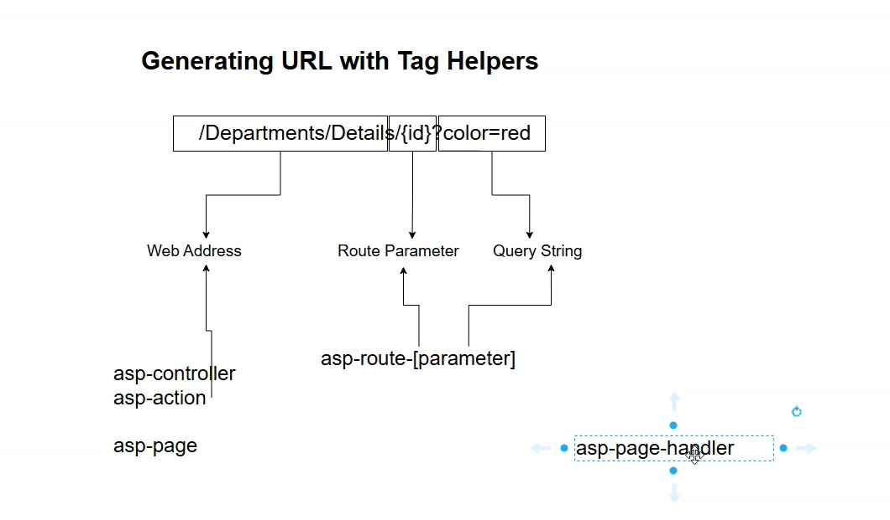
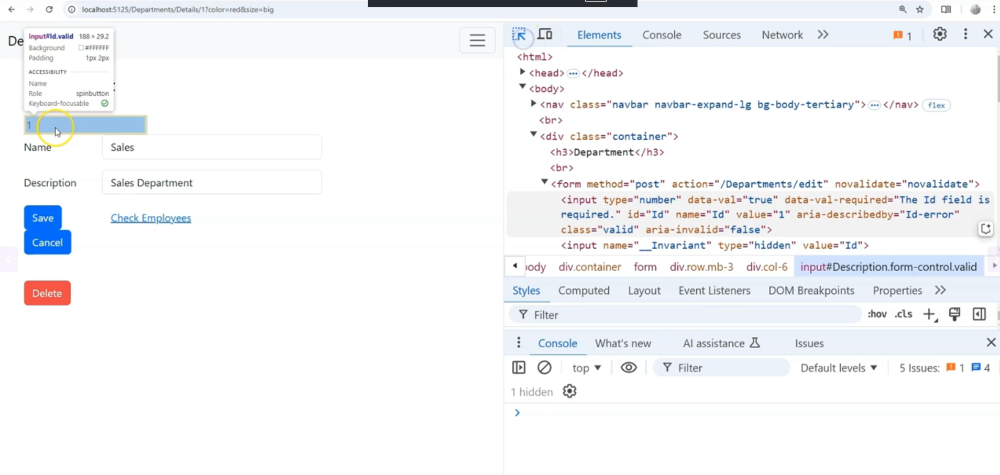
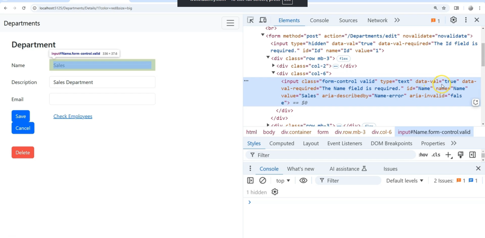
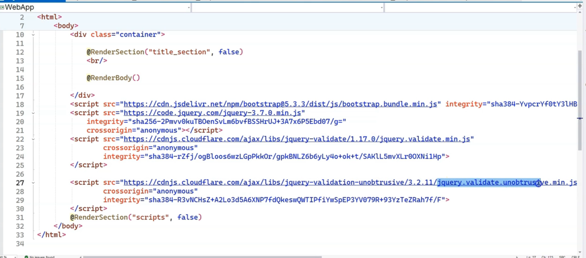
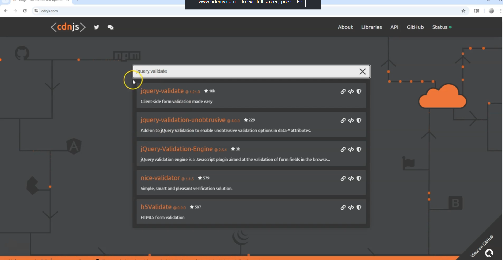
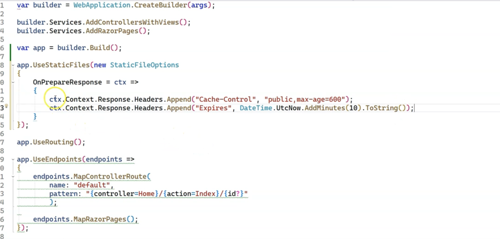
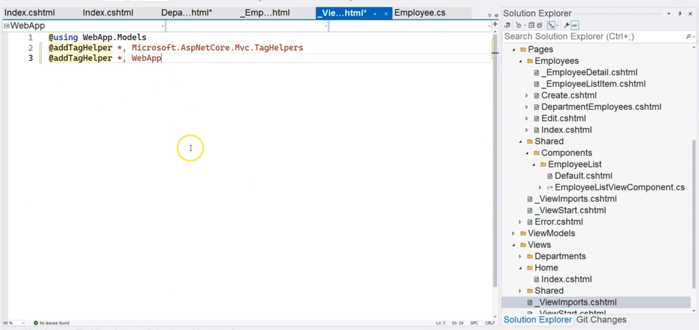

# ASP.NET Core Tag Helpers

* **What are Tag Helpers?** Tag Helpers are a server-side feature in ASP.NET Core that automatically generates HTML in your Razor views. They look like custom attributes added to standard HTML tags, always prefixed with `asp-`.
* **The Goal:** Their purpose is to replace manual HTML coding with a more robust and maintainable server-side process. Instead of hardcoding URLs or form field names, you describe your intent using `asp-` attributes, and the framework generates the correct HTML for you.
* **How They Work:** They bind to your server-side C\# code, such as model properties or controller actions, and use that information to render the final HTML. For example, they can read a model property's name, data type, and validation rules to build a complete `<input>` tag.
* **Key Benefit:** This makes your Razor views cleaner, more readable, and less prone to errors from typos or changes in your application's routing or model structure.


### Illustrations with Code Examples and a Diagram

Tag Helpers allow you to write code that looks like HTML but has server-side power.

#### **Diagram: The Tag Helper Process**

This diagram shows how Razor code with Tag Helpers is transformed into standard HTML before being sent to the user's browser.

```
+-----------------------------------+
| 1. Razor View (.cshtml)           |
|                                   |
| You write HTML with `asp-` tags:  |
| <a asp-controller="Home"          |
|    asp-action="Index">Home</a>    |
|                                   |
| <input asp-for="Employee.Name" /> |
+-----------------------------------+
                  |
                  v
+-----------------------------------+
| 2. ASP.NET Core Server            |
|                                   |
| The Razor engine processes the    |
| file and executes the Tag Helpers.|
+-----------------------------------+
                  |
                  v
+-----------------------------------+
| 3. Final HTML to Browser          |
|                                   |
| The browser receives pure HTML:   |
| <a href="/Home/Index">Home</a>    |
|                                   |
| <input type="text" id="Name"      |
|        name="Employee.Name"       |
|        value="John Doe" />        |
+-----------------------------------+
```


#### **Code Example 1: Anchor Tag Helper**

This helper generates URLs without hardcoding them, making your links resilient to changes in your routing configuration.

**Your Razor Code:**

```html
<!-- This points to the Index action in the EmployeesController -->
<a asp-controller="Employees" asp-action="Index">View All Employees</a>
```

**Generated HTML:**
The server processes the `asp-` attributes and generates a standard `href`.

```html
<a href="/Employees/Index">View All Employees</a>
```


#### **Code Example 2: Input and Label Tag Helpers**

These helpers bind directly to a model property to generate form elements. They automatically handle the `id`, `name`, and `value` attributes, and set the `for` attribute on the label to match the input's `id`.

**Your C\# Model:**

```csharp
public class Employee
{
    public string Name { get; set; }
    public int Salary { get; set; }
}
```

**Your Razor Code:**

```html
@model Employee

<!-- Label Tag Helper -->
<label asp-for="Name"></label>

<!-- Input Tag Helper -->
<input asp-for="Name" />

<!-- It also inspects the data type! -->
<label asp-for="Salary"></label>
<input asp-for="Salary" />
```

**Generated HTML:**
Assuming the `Employee.Name` is "Frank" and `Salary` is 60000.

```html
<label for="Name">Name</label>
<input type="text" id="Name" name="Name" value="Frank">

<label for="Salary">Salary</label>
<input type="number" id="Salary" name="Salary" value="60000">
```

Notice it correctly set `type="text"` for a `string` and `type="number"` for an `int`.

***

### Interview Summary Table: Tag Helpers

| Concept | Description | Key Points for Interviews |
| :-- | :-- | :-- |
| **What are Tag Helpers?** | Server-side components in ASP.NET Core that generate HTML in Razor views. They are written as attributes prefixed with `asp-` on standard HTML elements. | "Tag Helpers allow you to write more expressive and maintainable Razor views by replacing manual HTML with server-side logic that looks like standard HTML attributes." |
| **Core Purpose** | To automate HTML generation based on server-side models and routing. This reduces errors, improves maintainability, and follows the **DRY (Don't Repeat Yourself)** principle. | They bridge the gap between your C\# models and your HTML markup. If you change a property name in your C\# model, the HTML generated by the Tag Helper updates automatically. |
| **Key Examples** | **`asp-controller` \& `asp-action`**: Used on `<a>` tags to generate URLs to controller actions. <br><br> **`asp-for`**: Used on `<label>` and `<input>` to bind them to a model property. Automatically sets `id`, `name`, `value`, and `type`. <br><br> **`asp-validation-for`**: Displays validation error messages for a specific model property. | Be ready to name these specific Tag Helpers and explain what they do. `asp-for` is a powerful example of how they use model metadata (name, data type, validation rules). |
| **Main Advantage** | They provide a much more natural, HTML-centric development experience compared to older methods like HTML Helpers (`@Html.ActionLink()`, etc.). The Razor markup is cleaner and easier for front-end developers to read. | "The key advantage is that the syntax is very close to pure HTML, making views more readable and easier to design. You aren't mixing C\# method calls directly into your markup." |


# Are they are a replacement for Html Helpers like @Html.TextboxFor like we had earlier in ASP.NET MVC

Yes, for the most part, **Tag Helpers are the modern and recommended replacement for HTML Helpers** in ASP.NET Core. While HTML Helpers still exist and work, Tag Helpers are designed to provide a more natural, HTML-like syntax for server-side rendering.[^1][^5]

You can think of Tag Helpers as the evolution of HTML Helpers. They solve the same problem—generating HTML from server-side code—but in a way that is much cleaner and more intuitive for developers, especially those familiar with HTML.[^1]

### Highlighted Important Points

* **Syntax and Readability:** The primary advantage of Tag Helpers is their syntax. They look like standard HTML attributes, making the Razor code cleaner and easier to read than the C\# method calls of HTML Helpers. This is especially beneficial for front-end developers who may not be familiar with C\# syntax.[^5][^1]
* **Not a Total Replacement:** It's important to recognize that Tag Helpers don't replace HTML Helpers entirely; you can use both in the same project, or even the same view, if needed. However, for most common scenarios like creating forms and links, Tag Helpers are the preferred approach.[^9][^5][^1]
* **Improved Tooling:** Modern development environments like Visual Studio provide better IntelliSense and tooling support for Tag Helpers, making development faster and less error-prone.[^1]


### Illustrations with Code Examples and Diagram

The difference becomes very clear when you see the syntax side-by-side.

#### **Diagram: Authoring Experience**

This diagram illustrates the fundamental difference in how you write the code in your Razor view.

```
            +-----------------------------------+
            |           Your Goal               |
            | Create a link to /Home/Privacy    |
            +-----------------------------------+
                           |
          +----------------+------------------+
          |                                   |
          v                                   v
+-----------------------+          +---------------------------+
| HTML Helper Approach  |          | Tag Helper Approach       |
| (C# Method Call)      |          | (HTML-like Attribute)     |
|-----------------------|          |---------------------------|
| @Html.ActionLink(     |          | <a asp-controller="Home"  |
|   "Privacy",          |          |    asp-action="Privacy">  |
|   "Privacy",          |          |   Privacy                 |
|   "Home")             |          | </a>                      |
+-----------------------+          +---------------------------+
          |                                   |
          +----------------+------------------+
                           |
                           v
            +-----------------------------------+
            |        Generated HTML             |
            |  <a href="/Home/Privacy">Privacy</a> |
            +-----------------------------------+
```


#### **Code Example: Creating a Text Input for a Model**

Let's compare creating a text input for a `User.FirstName` property.

**The Old Way (HTML Helper):**
This syntax requires you to remember the C\# method signature and use an anonymous object for HTML attributes, which can be cumbersome.

```csharp
@model User

@Html.LabelFor(m => m.FirstName, "First Name:")
@Html.TextBoxFor(m => m.FirstName, new { @class = "form-control", placeholder = "Enter first name" })
```

**The Modern Way (Tag Helper):**
This syntax looks almost exactly like standard HTML. It's cleaner, more readable, and easier to write.[^5]

```html
@model User

<label asp-for="FirstName">First Name:</label>
<input asp-for="FirstName" class="form-control" placeholder="Enter first name" />
```

Both snippets generate similar final HTML, but the Tag Helper version is far more intuitive and maintainable.[^1]

***

### Interview Summary Table: Tag Helpers vs. HTML Helpers

| Feature | Tag Helpers | HTML Helpers |
| :-- | :-- | :-- |
| **Syntax** | HTML-like attributes (`<a asp-action="...">`). Looks like native HTML[^5]. | C\# method calls (`@Html.ActionLink(...)`). Mixes C\# and HTML markup[^1]. |
| **Readability** | **High**. Easier for front-end developers and designers to understand[^1]. | **Lower**. Can clutter the view and make the HTML structure harder to see[^1]. |
| **Primary Use Case** | The modern, standard way to do server-side rendering in ASP.NET Core for forms, links, etc[^3]. | Legacy approach from older ASP.NET MVC versions. Still supported but not the primary recommendation[^1]. |
| **Maintainability** | **Easier**. The structure is closer to standard HTML, making it easier to manage[^1]. | **Harder**. The tight coupling of C\# code in the view can make maintenance more difficult[^1]. |
| **Tooling** | Excellent IntelliSense and tooling support in modern IDEs[^1]. | Basic support, but less intuitive than the attribute-based suggestions for Tag Helpers. |
| **Verdict** | **Preferred Replacement**. Use them as the default choice in ASP.NET Core applications. | **Fallback/Legacy**. Use them if a Tag Helper alternative doesn't exist or for complex scenarios where direct C\# logic is needed. |


## Generating URLs for Tag Helpers
* **Tag Helpers Generate URLs Dynamically:** Instead of hardcoding URLs like `<a href="/Departments/Details/1">`, you use Tag Helpers (`asp-controller`, `asp-page`, etc.) to build the URL from your application's routing rules and controller/page structure. This makes your application much easier to maintain.
* **Enabling Tag Helpers:** You must first enable Tag Helpers for your project by adding the `@addTagHelper` directive to your `_ViewImports.cshtml` file. This makes the `asp-` attributes available in all your views.
* **MVC vs. Razor Pages Have Different Tag Helpers:**
    * For **MVC**, you use `asp-controller` and `asp-action` to target a specific action method in a controller.
    * For **Razor Pages**, you use `asp-page` to target a specific `.cshtml` page.
* **Handling URL Parameters:**
    * The `asp-route-{parameterName}` Tag Helper is used to add parameters to a URL.
    * **Crucial Logic:** If the parameter name (e.g., `id`) is a defined part of the target route, it becomes a route parameter in the URL path (e.g., `/Details/1`). If the parameter name (e.g., `color`) is *not* part of the route, it automatically becomes a query string parameter (e.g., `?color=red`).
* **Targeting Specific Page Handlers:** For Razor Pages, you can use the `asp-page-handler` Tag Helper to generate a URL that targets a specific named handler (e.g., `OnGetTest()`), not just the default `OnGet()` or `OnPost()`.

- 


### Illustrations with Code Examples and Diagram

#### **Diagram: Mapping URL Parts to Tag Helpers**

This diagram shows which Tag Helpers correspond to the different parts of a URL.

```
                  ┌───────────────────┐
                  │ /Departments/Edit/5?color=blue&size=large │
                  └───────────────────┘
                           │
       ┌───────────────────┼───────────────────┬───────────────────┐
       │                   │                   │                   │
       v                   v                   v                   v
+----------------+  +---------------+   +----------------+  +----------------+
|  Base Address  |  | Route Param   |   | Query String 1 |  | Query String 2 |
|----------------|  |---------------|   |----------------|  |----------------|
| asp-controller |  | asp-route-id  |   | asp-route-color|  | asp-route-size |
|   "Departments"|  |   ="5"        |   |   ="blue"      |  |   ="large"     |
| asp-action     |  |               |   |                |  |                |
|   "Edit"       |  |               |   |                |  |                |
|----------------|  | (Known route) |   | (Unknown route)|  | (Unknown route)|
|      OR        |  |               |   |                |  |                |
| asp-page       |  |               |   |                |  |                |
|   "/Dept/Edit" |  |               |   |                |  |                |
+----------------+  +---------------+   +----------------+  +----------------+

```


#### **Code Examples**

**1. Enabling Tag Helpers (in `_ViewImports.cshtml`)**

You must add this line to make `asp-` attributes work.

```csharp
@addTagHelper *, Microsoft.AspNetCore.Mvc.TagHelpers
```

**2. Generating an MVC URL (Controller/Action)**

This example shows how to create a link to the `Details` action in the `DepartmentsController`, passing `id` as a route parameter and `color` as a query string.

**Your Razor Code:**

```html
<a asp-controller="Departments"
   asp-action="Details"
   asp-route-id="@Model.DepartmentId"
   asp-route-color="red">
   View Details
</a>
```

**Generated HTML:**
(Assuming the route is defined as `/Departments/Details/{id}` and `@Model.DepartmentId` is `123`)

```html
<a href="/Departments/Details/123?color=red">View Details</a>
```

**3. Generating a Razor Page URL**

This example links to an `Edit.cshtml` page in the `/Employees` folder and targets a specific page handler.

**Your Razor Code:**

```html
<a asp-page="/Employees/Edit"
   asp-route-id="@Model.EmployeeId"
   asp-page-handler="Test">
   Test Edit
</a>
```

**Generated HTML:**
(Assuming `@Model.EmployeeId` is `456`)

```html
<a href="/Employees/Edit/456?handler=Test">Test Edit</a>
```


***

### Interview Summary Table: URL Generation with Tag Helpers

| Tag Helper | Used For | Description / Key Points |
| :-- | :-- | :-- |
| **`asp-controller`** | MVC | Specifies the name of the Controller to target (without the "Controller" suffix). |
| **`asp-action`** | MVC | Specifies the name of the action method within the target controller. |
| **`asp-page`** | Razor Pages | Specifies the path to the Razor Page (e.g., `/Employees/Edit`). You can omit `/Index` for index pages. |
| **`asp-route-{name}`** | Both | Adds a parameter to the URL. **Crucially**, it becomes a **route parameter** (`/path/value`) if `{name}` is defined in the route template. Otherwise, it becomes a **query string** (`?name=value`). |
| **`asp-page-handler`** | Razor Pages | Targets a specific named page handler (e.g., `OnGetTest` is targeted by `handler="Test"`). If omitted, it targets the default handler (`OnGet` for a link). |
| **`@addTagHelper`** | Project Setup | A directive in `_ViewImports.cshtml` that imports and enables the use of Tag Helpers across all views in that folder and its subfolders. |


# Form Tag Helpers

* **Dual Functionality of Form Tag Helpers:** When you add `asp-` Tag Helpers to a `<form>` element, they perform two key functions automatically:

1. **Generate the `action` URL:** They use the same Tag Helpers as anchor tags (`asp-controller`, `asp-action`, `asp-page`, `asp-route-*`, etc.) to dynamically create the form's submission URL. This ensures your form targets the correct endpoint based on your application's routing.
2. **Add an Anti-Forgery Token:** They automatically inject a hidden input field containing a `__RequestVerificationToken`. This is a critical security feature to prevent Cross-Site Request Forgery (CSRF) attacks.
* **You Can Remove Manual Anti-Forgery Tokens:** Because the Form Tag Helper adds the token automatically, you can and should delete any manual calls to `@Html.AntiForgeryToken()` from your forms. This simplifies the markup and removes redundancy.
* **Razor Pages Convention:** For Razor Pages, if you create a form with `method="post"` but *without* any `asp-page` or `asp-action` attributes, the form will automatically post back to the same page. This is a common and convenient pattern for Create and Edit pages where the `OnGet` and `OnPost` handlers are in the same PageModel. The anti-forgery token is still generated automatically in this case.


### Illustrations with Code Examples and a Diagram

#### **Diagram: The Form Tag Helper Transformation**

This diagram shows how a cluttered, manual form is simplified using Tag Helpers, while still producing the same secure, functional HTML.

```
+-------------------------------------------------+
| BEFORE: Manual HTML & Helper                  |
|-------------------------------------------------|
| <form action="/Departments/Delete/1" method="post"> |
|   @Html.AntiForgeryToken()                      |
|   ...                                           |
| </form>                                         |
+-------------------------------------------------+
                         |
                         v
+-------------------------------------------------+
| AFTER: Your Clean Razor Code with Tag Helpers   |
|-------------------------------------------------|
| <form asp-controller="Departments"              |
|       asp-action="Delete"                       |
|       asp-route-id="1"                          |
|       method="post">                            |
|   ...                                           |
| </form>                                         |
+-------------------------------------------------+
                         |
                         v
+------------------------------------------------------+
| FINAL GENERATED HTML (Same for Both Approaches)      |
|------------------------------------------------------|
| <form action="/Departments/Delete/1" method="post">  |
|   <input name="__RequestVerificationToken"           |
|          type="hidden" value="...token_value...">    |
|   ...                                                |
| </form>                                              |
+------------------------------------------------------+
```


#### **Code Example 1: MVC Form for Editing**

This example refactors a form in an MVC view to use Tag Helpers.

**Before (Manual):**

```html
<!-- Hardcoded URL and manual token helper -->
<form action="/Departments/Edit" method="post">
    @Html.AntiForgeryToken()
    <!-- Form fields... -->
    <button type="submit">Save</button>
</form>
```

**After (Tag Helper):**

```html
<!-- Tag Helpers generate the URL and the token automatically -->
<form asp-controller="Departments" asp-action="Edit" method="post">
    <!-- Form fields... -->
    <button type="submit">Save</button>
</form>
```


#### **Code Example 2: Razor Page Form for Deleting**

This shows how to target a specific page handler in a Razor Page form.

**Before (Manual):**

```html
<form action="/Employees/Edit/5?handler=DeleteEmployee" method="post">
    @Html.AntiForgeryToken()
    <button type="submit">Delete</button>
</form>
```

**After (Tag Helper):**

```html
<form asp-page="/Employees/Edit"
      asp-route-id="5"
      asp-page-handler="DeleteEmployee"
      method="post">
    <button type="submit">Delete</button>
</form>
```


***

### Interview Summary Table: Form Tag Helpers

| Concept | Description | Key Points for Interviews |
| :-- | :-- | :-- |
| **Form Tag Helpers** | `asp-` attributes placed on a `<form>` tag that dynamically generate the `action` URL and automatically include an anti-forgery token. | "The Form Tag Helpers in ASP.NET Core serve a dual purpose: they generate the form's `action` URL based on routing, and critically, they automatically inject an anti-forgery token for security." |
| **Automatic Anti-Forgery** | Any form using an `asp-` Tag Helper (`asp-controller`, `asp-page`, etc.) gets a hidden `__RequestVerificationToken` field added by default. | This is a major benefit. It provides CSRF protection by default for all POST forms using Tag Helpers, making applications more secure with less boilerplate code. |
| **URL Generation** | Uses the same helpers as anchor tags (`asp-controller`, `asp-action`, `asp-page`) to populate the `action` attribute. | This keeps your form submission logic consistent with your application's routing rules and avoids hardcoded URLs, which are brittle and hard to maintain. |
| **Removing `@Html.AntiForgeryToken()`** | Since the token is added automatically by the Form Tag Helper, the manual `@Html.AntiForgeryToken()` call becomes redundant and should be removed. | This demonstrates practical knowledge of modern ASP.NET Core conventions. It cleans up the Razor view and prevents duplicate tokens. |
| **Razor Pages "Post-to-Self"** | A `<form method="post">` in a Razor Page with no `asp-page` or `asp-action` attribute will post back to the same page by default. | This is a standard and convenient pattern for pages that handle their own submissions, like a Create or Edit page with `OnGet` and `OnPost` handlers. |

# Input Elements for Tag Helpers
* **`asp-for` is the Core Tag Helper for Form Inputs:** The `asp-for` Tag Helper is used on `<input>` and `<label>` elements to bind them directly to a property on your C\# model. This is the modern replacement for manual attributes.
* **Automatic Attribute Generation:** A single `asp-for` attribute replaces the need to manually set `id`, `name`, `type`, and `value`. The Tag Helper inspects the bound model property and generates these attributes automatically.
* **It's "Intelligent" and Uses Model Metadata:** The `asp-for` Tag Helper is powerful because it reads the metadata of your C\# model property:
    * **Data Type:** Determines the `type` attribute (e.g., `string` becomes `type="text"`, `int` becomes `type="number"`).
    * **Property Name:** Sets the `id` and `name` attributes.
    * **Property Value:** Populates the `value` attribute.
- 
* **Data Annotations Drive Functionality:** You can control the generated HTML further using Data Annotations on your model properties. The Tag Helper will recognize them:
    * `[HiddenInput]` generates `type="hidden"`.
    * `[EmailAddress]` generates `type="email"`.
    * `[Password]` generates `type="password"`.
    * `[StringLength(50)]` adds client-side validation attributes like `maxlength="50"`.
* **Label Generation and Accessibility:** Using `asp-for` on a `<label>` automatically sets the `for` attribute to match the `id` of its corresponding input. This is crucial for accessibility (screen readers) and improves user experience (clicking the label focuses the input). You can customize the label's text with the `[Display(Name = "...")]` annotation.


### Illustrations with Code Examples and a Diagram

#### **Diagram: How `asp-for` Uses Model Metadata**

This diagram shows how information from a C\# model property is used by the `asp-for` Tag Helper to build a complete HTML input.

```
+-------------------------------------------------+
| 1. Your C# Model Property                       |
|-------------------------------------------------|
| [Display(Name = "Email Address")]               |
| [EmailAddress]                                  |
| public string Email { get; set; } = "a@b.com";  |
+-------------------------------------------------+
                         |
                         v
+-------------------------------------------------+
| 2. Your Clean Razor Code with Tag Helpers       |
|-------------------------------------------------|
| <label asp-for="Email"></label>                 |
| <input asp-for="Email" />                       |
+-------------------------------------------------+
                         |
                         v
+------------------------------------------------------+
| 3. Final Generated HTML                              |
|------------------------------------------------------|
| <label for="Email">Email Address</label>             |
| <input type="email" id="Email" name="Email"          |
|        value="a@b.com" data-val-email="..." />       |
+------------------------------------------------------+
```


#### **Code Example 1: Basic Input Generation**

This shows the dramatic simplification of the markup.

**Before (Manual):**

```html
<label for="Name">Name</label>
<input type="text" id="Name" name="Name" value="@Model.Name" />
```

**After (Tag Helper):**

```html
<label asp-for="Name"></label>
<input asp-for="Name" />
```


#### **Code Example 2: Customizing with Data Annotations**

This shows how to control the label text and input type for a `DepartmentId` property.

**The C\# Model (`EmployeeViewModel.cs`):**

```csharp
[Display(Name = "Department")] // This controls the label text
public int DepartmentId { get; set; }
```

**The Razor View:**

```html
<!-- asp-for reads the [Display] attribute for the label text -->
<label asp-for="DepartmentId"></label>

<!-- This will create a <select> dropdown, not an input -->
<select asp-for="DepartmentId" asp-items="@Model.DepartmentList"></select>
```

*Note: The `select` tag uses `asp-items` to populate the options, which will be covered separately, but the label binding principle is the same.*

***

### Interview Summary Table: Input and Label Tag Helpers

| Concept | Description | Key Points for Interviews |
| :-- | :-- | :-- |
| **`asp-for` (on `<input>`)** | Binds an `<input>` element to a C\# model property. Automatically generates `id`, `name`, `type`, and `value` attributes. | "The `asp-for` tag helper is the cornerstone of building forms in ASP.NET Core. It uses reflection on the model property to intelligently generate the correct HTML attributes, which drastically reduces boilerplate code." |
| **`asp-for` (on `<label>`)** | Binds a `<label>` to a model property. It sets the `for` attribute to match the input's `id` and uses the property's name for the label text. | "Using `asp-for` on labels is critical for accessibility. It correctly generates the `for` attribute, linking the label to its input, which is essential for screen readers." |
| **Role of Data Annotations** | C\# attributes like `[HiddenInput]`, `[EmailAddress]`, `[DataType]`, and `[Display]` on model properties are read by the Tag Helper to customize the generated HTML. | This is a key feature. Mentioning specific examples like `[EmailAddress]` generating `type="email"` or `[Display]` controlling the label text shows a deep understanding of the mechanism. |
| **Client-Side Validation** | `asp-for` also reads validation annotations like `[Required]` or `[StringLength]` and adds the corresponding `data-val-*` attributes to the HTML for client-side validation. | "A major benefit of `asp-for` is that it bridges server-side validation rules (from Data Annotations) to the client by automatically generating the `data-val-*` attributes used by jQuery Unobtrusive Validation." |


# Generate Options Element for Tag Helpers
* **`asp-items` is the Tag Helper for Options:** The `asp-items` Tag Helper, used on a `<select>` element, is responsible for automatically generating the list of `<option>` elements for a dropdown list.
* **It Requires a Specific Data Type:** The `asp-items` Tag Helper does not work with just any list. It specifically requires a collection of `SelectListItem` objects (`IEnumerable<SelectListItem>`).
* **The `SelectListItem` Class:** This is a special class designed for dropdown options. Its most important properties are:
    * `Text`: The display text the user sees in the dropdown (e.g., "Engineering").
    * `Value`: The underlying value that gets submitted with the form (e.g., the department's ID "2").
    * `Selected`: A boolean (`true`/`false`) that determines if this option should be pre-selected when the page loads.
* **Convert Your Data with LINQ:** You typically have a list of domain objects (e.g., `List<Department>`). You must convert this list into a `List<SelectListItem>` using a LINQ `.Select()` projection directly within the Razor view.
* **Hardcoded Options are Appended:** The `asp-items` Tag Helper will *not* overwrite any manually coded `<option>` elements inside your `<select>` tag. It appends its generated options after them. This is useful for adding a default prompt like `<option value="">Please select...</option>`.


### Illustrations with Code Examples and a Diagram

#### **Diagram: The `asp-items` Data Transformation**

This diagram shows how a list of C\# objects is converted and used by `asp-items` to generate the final HTML.

```
+-------------------------------------------------+
| 1. Your C# ViewModel Data                       |
|-------------------------------------------------|
| public class EmployeeViewModel {                |
|   public List<Department> Departments { get; }  |
| }                                               |
+-------------------------------------------------+
                         |
                         v
+-------------------------------------------------+
| 2. Razor View with LINQ Projection              |
|-------------------------------------------------|
| <select asp-for="Employee.DepartmentId"         |
|         asp-items="@Model.Departments.Select(d => |
|           new SelectListItem {                  |
|             Text = d.Name,                      |
|             Value = d.Id.ToString()             |
|           })">                                  |
| </select>                                       |
+-------------------------------------------------+
                         |
                         v
+------------------------------------------------------+
| 3. Final Generated HTML                              |
|------------------------------------------------------|
| <select id="Employee_DepartmentId" name="Employee.DepartmentId"> |
|   <option value="1">Sales</option>                  |
|   <option value="2" selected="selected">Engineering</option> |
|   <option value="3">QA</option>                     |
| </select>                                            |
+------------------------------------------------------+
```

*(Note: The `asp-for` Tag Helper automatically handles which option is `selected` based on the value of `Employee.DepartmentId`.)*

#### **Code Example: Generating a Department Dropdown**

This example shows the "before" (manual loop) and "after" (Tag Helper) approach.

**Before (Manual Loop):**
This is verbose, mixes C\# logic heavily with HTML, and is hard to read.

```html
<select id="DepartmentId" name="DepartmentId" class="form-control">
    <option value="">-- Please Select --</option>
    @foreach (var dept in Model.Departments)
    {
        if (dept.Id == Model.Employee.DepartmentId)
        {
            <option value="@dept.Id" selected>@dept.Name</option>
        }
        else
        {
            <option value="@dept.Id">@dept.Name</option>
        }
    }
</select>
```

**After (Tag Helper):**
This is clean, declarative, and moves the complex logic into a single attribute.

```html
<select asp-for="Employee.DepartmentId" class="form-control"
        asp-items="@Model.Departments.Select(d => new SelectListItem
                  {
                      Text = d.Name,
                      Value = d.Id.ToString()
                  })">
    <!-- This hardcoded option will appear first -->
    <option value="">-- Please Select --</option>
</select>
```

The `asp-for="Employee.DepartmentId"` automatically matches the value and adds the `selected` attribute to the correct option.

***

### Interview Summary Table: Select/Option Tag Helpers

| Concept | Description | Key Points for Interviews |
| :-- | :-- | :-- |
| **`asp-items`** | A Tag Helper on the `<select>` element that populates its child `<option>` elements from a collection. | "The `asp-items` helper streamlines the creation of dropdown lists by binding directly to a data source, eliminating the need for manual `foreach` loops in the view." |
| **`SelectListItem`** | A dedicated class in ASP.NET Core with `Text`, `Value`, and `Selected` properties, representing a single `<option>` element. | "The key to using `asp-items` is providing it with an `IEnumerable<SelectListItem>`. This class acts as a bridge, mapping your domain model properties to the required `Text` and `Value` of an HTML option." |
| **LINQ `.Select()` Projection** | The standard technique to convert a list of your domain objects (e.g., `List<Department>`) into the required `IEnumerable<SelectListItem>` on the fly. | "In practice, you use a LINQ projection directly in the Razor view to transform your data source into a collection of `SelectListItem` objects for the `asp-items` helper to consume." |
| **Combined with `asp-for`** | When `asp-items` is used with `asp-for` on the same `<select>` tag, the framework automatically sets the `selected` attribute on the option whose `Value` matches the `asp-for` model property's value. | "The real power comes from combining `asp-for` and `asp-items`. `asp-items` builds the list, and `asp-for` automatically handles selecting the correct default item, which is perfect for edit forms." |


# Client Side Validations using Tag Helpers and Unobtrusive Javascript

* **Client-Side Validation is Driven by Server-Side Rules:** ASP.NET Core uses the same Data Annotations (`[Required]`, `[StringLength]`, `[EmailAddress]`, etc.) on your C\# models to drive *both* server-side and client-side validation. This is a key principle of DRY (Don't Repeat Yourself).
* **`asp-for` Generates `data-val-*` Attributes:** The `asp-for` Tag Helper reads the Data Annotations on your model and automatically generates special HTML attributes, like `data-val="true"`, `data-val-required="The Name field is required."`, etc., on your input elements.
* **JavaScript is Required for Execution:** These `data-val-*` attributes are just metadata. To make them functional, you must include three specific JavaScript libraries in the correct order:

1. **jQuery:** The base library.
2. **jQuery Validate:** The core validation logic library.
3. **jQuery Validate Unobtrusive:** The "magic" script that reads the `data-val-*` attributes and applies the validation rules without you writing any custom JavaScript.
* **Displaying Error Messages:** You use two specific Tag Helpers to display the validation errors generated by the JavaScript:
    * **`asp-validation-for`:** Used in a `<span>` tag to display an error message for a single, specific field, right next to that field.
    * **`asp-validation-summary`:** Used in a `<div>` tag to display a summary list of all validation errors on the form, typically at the top.
* **Making Dropdowns Required:** To validate that a user has selected an option from a dropdown (and not the default "Please select..." option with `value="0"`), you use the `[Range(1, int.MaxValue)]` Data Annotation on the model's ID property.

- 


### Illustrations with Code Examples and a Diagram

#### **Diagram: The Client-Side Validation Flow**

This diagram shows the end-to-end process, from the C\# model to the final validation message in the browser.

```
+---------------------------------+      +------------------------------+
| 1. C# Model with                |      | 2. Razor View with           |
|    Data Annotations             |      |    Tag Helpers               |
|---------------------------------|----->|------------------------------|
| public class Department {       |      | <input asp-for="Name" />     |
|   [Required]                    |      | <span                       |
|   public string Name { get; }   |      |   asp-validation-for="Name"> |
| }                               |      | </span>                     |
+---------------------------------+      +------------------------------+
                                                     |
                                                     v
+----------------------------------------------------+
| 3. Generated HTML with `data-val-*` Attributes     |
|----------------------------------------------------|
| <input type="text" id="Name" name="Name"           |
|        data-val="true"                             |
|        data-val-required="The Name field is required." /> |
| <span class="field-validation-valid"              |
|        data-valmsg-for="Name"                      |
|        data-valmsg-replace="true"></span>          |
+----------------------------------------------------+
                         |
                         v
+----------------------------------------------------+
| 4. JavaScript Libraries (in _Layout.cshtml)        |
|----------------------------------------------------|
| <!-- jQuery, jQuery Validate, jQuery Unobtrusive --> |
| These scripts read the `data-val-*` attributes.    |
| They prevent form submission and inject the error  |
| message into the `<span>` if validation fails.     |
+----------------------------------------------------+
```


#### **Code Examples**

**1. The Model with Data Annotations (`Department.cs`)**

```csharp
public class Department
{
    // Customizing the error message for the Required rule
    [Required(ErrorMessage = "You must specify the department name.")]
    [StringLength(50)]
    public string Name { get; set; }

    [EmailAddress]
    public string Email { get; set; }
}
```

**2. The Required Scripts (in `_Layout.cshtml` or a relevant partial view)**
These must be included, usually at the bottom of the body, in this specific order.

```html
<script src="~/lib/jquery/dist/jquery.min.js"></script>
<script src="~/lib/jquery-validation/dist/jquery.validate.min.js"></script>
<script src="~/lib/jquery-validation-unobtrusive/jquery.validate.unobtrusive.min.js"></script>
```
- 
- 

**3. The View with Validation Helpers (`_DepartmentDetails.cshtml`)**

```html
<!-- Example of a validation summary at the top of the form -->
<div asp-validation-summary="All" class="text-danger"></div>

<div class="form-group">
    <label asp-for="Name"></label>
    <input asp-for="Name" class="form-control" />
    <!-- Displays the error message specifically for the Name field -->
    <span asp-validation-for="Name" class="text-danger"></span>
</div>

<div class="form-group">
    <label asp-for="Email"></label>
    <input asp-for="Email" class="form-control" />
    <span asp-validation-for="Email" class="text-danger"></span>
</div>
```


***

### Interview Summary Table: Client-Side Validation

| Concept | Description | Key Points for Interviews |
| :-- | :-- | :-- |
| **`data-val-*` Attributes** | HTML attributes automatically generated by `asp-for` Tag Helpers based on the model's Data Annotations. They hold the validation rules and error messages. | "ASP.NET Core enables unobtrusive client-side validation by using `asp-for` to bake validation rules from server-side Data Annotations directly into the HTML as `data-val-*` attributes." |
| **Unobtrusive JavaScript** | The technique of using JavaScript to add behavior to HTML without mixing JS code directly into the HTML markup. The `jquery.validate.unobtrusive.js` library is the key component. | "The system is 'unobtrusive' because the JavaScript is completely separate from the HTML. The script simply scans the DOM for the `data-val-*` attributes and attaches the validation logic dynamically." |
| **Required Libraries** | **jQuery**, **jQuery Validate**, and **jQuery Validate Unobtrusive**. They must be loaded in this specific order due to dependencies. | Knowing these three libraries and their load order is a fundamental piece of knowledge for ASP.NET Core UI development. |
| **`asp-validation-for`** | A Tag Helper that creates a placeholder `<span>` where the validation error message for a single, specific field will be displayed. | "You use `asp-validation-for` to control the placement of individual error messages, typically right below the input field it corresponds to." |
| **`asp-validation-summary`** | A Tag Helper that displays a list of all validation errors on the form. It has modes like `All`, `ModelOnly`, and `None`. | "For a centralized error display, you use `asp-validation-summary`. Setting it to `All` will show both property-level and model-level errors." |
| **Server-Side Validation** | Still essential. Client-side validation is a user experience enhancement, but a malicious user can bypass it. The server must *always* re-validate the data. | **Crucial Point:** "Client-side validation is for the user's convenience; server-side validation is for the application's security." |


## Append Version Number with Tag Helpers

* **The Caching Problem:** Web browsers aggressively cache static resources like images, JavaScript (`.js`), and stylesheet (`.css`) files. When you update one of these files on the server but keep the same filename, a returning user's browser will often continue to use the old, cached version instead of downloading the new one.
* **The Solution is "Cache Busting":** To solve this, you can append a unique version string to the file's URL as a query parameter (e.g., `?v=some_unique_string`). Since the URL is now different, the browser is forced to ignore its cache and download the file again from the server.
* **`asp-append-version` Automates Cache Busting:** ASP.NET Core provides the `asp-append-version` Tag Helper. When you set it to `true` on a tag that links to a static resource (like ``, `<script>`, or `<link>`), the framework automatically handles the cache-busting process.
* **How it Works:** The Tag Helper calculates a hash of the static file's content on the server. It then appends this hash to the URL as a version query string (e.g., `?v=R4v...`). If the file's content changes, the hash changes, resulting in a new URL that forces the browser to re-fetch the updated file. This eliminates the need for developers to manually change version numbers.


### Illustrations with Code Examples and a Diagram

#### **Diagram: The Cache Busting Process**

This diagram illustrates how `asp-append-version` solves the browser caching issue.

```
+--------------------------------+
|           Scenario 1: No Tag Helper           |
+--------------------------------+
| Browser Asks for: logo.png                    |
| Server Sends: logo.png (Version 1)            |
|                                               |
| --> File is updated on server to Version 2    |
|                                               |
| Browser Asks for: logo.png                    |
| Browser Uses: Cached logo.png (Version 1) <-- PROBLEM!
+--------------------------------+

+--------------------------------+
|        Scenario 2: With `asp-append-version`      |
+--------------------------------+
| Browser Asks for: logo.png?v=HASH_A             |
| Server Sends: logo.png (Version 1)            |
|                                               |
| --> File is updated on server to Version 2    |
|                                               |
| Browser Asks for: logo.png?v=HASH_B (New URL) |
| Server Sends: logo.png (Version 2)      <-- SOLVED!
+--------------------------------+
```


#### **Code Example: Using the Tag Helper**

This example shows how to apply the Tag Helper to an `` tag and a `<script>` tag.

**1. Enable Static Files (in `Program.cs`)**

First, you must ensure your application is configured to serve static files from the `wwwroot` folder.

```csharp
var builder = WebApplication.CreateBuilder(args);
var app = builder.Build();

// This middleware is required
app.UseStaticFiles();

// ... other middleware
app.Run();
```
- 

**2. Applying the Tag Helper in a Razor View**

You add `asp-append-version="true"` to the tags that reference your static files.

**Before (Standard HTML):**

```html
<!-- The browser might cache this and not get updates -->

<script src="~/js/site.js"></script>
```

**After (With Tag Helper):**

```html
<!-- The Tag Helper will automatically add a version query string -->

<script src="~/js/site.js" asp-append-version="true"></script>
```

**Generated HTML:**
The framework processes the Tag Helper and generates HTML with a version parameter. The `v` value will change automatically whenever the file content changes.

```html

<script src="/js/site.js?v=Abc12_xYz9..."></script>
```


***

### Interview Summary Table: `asp-append-version`

| Concept | Description | Key Points for Interviews |
| :-- | :-- | :-- |
| **Cache Busting** | The technique of forcing a browser to re-download a cached file by appending a unique string (a version number or hash) to its URL. | "Cache busting is a strategy to overcome aggressive browser caching for static assets. By changing the file's URL, you trick the browser into thinking it's a completely new resource that it must download." |
| **`asp-append-version`** | A boolean Tag Helper that, when set to `true`, automatically appends a unique version identifier to a static file's URL. | "The `asp-append-version` Tag Helper is ASP.NET Core's built-in solution for cache busting. It's used on tags like ``, `<script>`, and `<link>`." |
| **How it Generates the Version** | It calculates a hash based on the **content of the file** on disk. If the file's content changes, the hash changes, and therefore the generated URL changes. | "The key is that the version isn't a random number; it's a hash of the file's content. This means the version only changes when the file *actually* changes, which is very efficient." |
| **Primary Benefit** | **Automation and Reliability.** It solves a common and frustrating deployment problem without requiring any manual intervention from developers, ensuring that users always receive the latest versions of static files. | "This Tag Helper automates a critical deployment task. It guarantees that when you push an update to a CSS or JavaScript file, your users will get it immediately, preventing bugs caused by stale, cached assets." |


# Load Partial Views or Viewcomponents with Tag Helpers

* **HTML-like Syntax for Loading Components:** Tag Helpers provide a declarative, HTML-like way to render partial views and view components, which is often cleaner and more readable than the C\# method calls of HTML Helpers (`@Html.PartialAsync` or `@await Component.InvokeAsync`).
* **The `<partial>` Tag Helper:** This is the direct replacement for rendering partial views. It uses:
    * `name`: The name of the partial view file to render.
    * `model`: An optional attribute to pass a model to the partial view.
* **The `<vc:...>` Tag Helper for View Components:** View Components are rendered using a special syntax:
    * The tag name starts with `vc:`.
    * This is followed by the name of the View Component, converted to **kebab-case** (e.g., a component named `EmployeeList` becomes `employee-list`).
    * Parameters are passed as attributes, also converted to **kebab-case** (e.g., a parameter named `departmentId` becomes `department-id`).
* **Crucial Setup for Custom View Components:** For your application's own View Components to be recognized as Tag Helpers (e.g., for `<vc:employee-list>` to work), you **must** add a reference to your project's assembly in the `_ViewImports.cshtml` file using `@addTagHelper *, YourProjectAssemblyName`.


### Illustrations with Code Examples and a Diagram

#### **Diagram: HTML Helpers vs. Tag Helpers for Component Loading**

This diagram shows the syntactic difference between the old and new methods.

```
+-------------------------------------------------+
| Your Goal: Render a Reusable UI Component       |
+-------------------------------------------------+
                         |
      +------------------+------------------+
      |                                     |
      v                                     v
+-----------------------------+   +-----------------------------+
|        Partial View         |   |        View Component       |
+-----------------------------+   +-----------------------------+
|                             |   |                             |
| HTML Helper:                |   | HTML Helper:                |
| @await Html.PartialAsync(   |   | @await Component.InvokeAsync( |
|   "_MyPartial", model)      |   |   "EmployeeList",            |
|                             |   |   new { departmentId = 5 }) |
|                             |   |                             |
| Tag Helper (Cleaner):       |   | Tag Helper (Cleaner):       |
| <partial name="_MyPartial"  |   | <vc:employee-list           |
|          model="model" />   |   |   department-id="5" />      |
|                             |   |                             |
+-----------------------------+   +-----------------------------+

```


#### **Code Example 1: Loading a Partial View**

**Before (HTML Helper):**

```csharp
@await Html.PartialAsync("_EmployeeDetails", Model.EmployeeViewModel)
```

**After (Tag Helper):**
The syntax is much closer to standard HTML.

```html
<partial name="_EmployeeDetails" model="Model.EmployeeViewModel" />
```


#### **Code Example 2: Loading a View Component**

This example shows the critical kebab-case conversion.

**C\# View Component:**

```csharp
public class EmployeeListViewComponent : ViewComponent
{
    // The parameter is named DepartmentId
    public IViewComponentResult Invoke(int departmentId) { ... }
}
```

**Before (HTML Helper):**

```csharp
@await Component.InvokeAsync("EmployeeList", new { departmentId = 5 })
```

**After (Tag Helper):**
Note how `EmployeeList` becomes `vc:employee-list` and `departmentId` becomes `department-id`.

```html
<vc:employee-list department-id="5"></vc:employee-list>
```

**Crucial Setup (in `_ViewImports.cshtml`):**
This line is required for the `<vc:...>` Tag Helper to work.

```csharp
// Replace "WebApp" with your actual project's assembly name
@addTagHelper *, WebApp
```
- 


***

### Interview Summary Table: Partial View \& View Component Tag Helpers

| Concept | Description | Key Points for Interviews |
| :-- | :-- | :-- |
| **`<partial>` Tag Helper** | The Tag Helper used to render a partial view. It uses `name` to specify the view file and an optional `model` attribute to pass data. | "The `<partial>` tag helper is the modern, declarative replacement for `@Html.PartialAsync`. Its main benefit is a cleaner, more HTML-centric syntax." |
| **`<vc:...>` Tag Helper** | The Tag Helper used to render a View Component. The tag name is `vc:` followed by the component name in kebab-case. | "To invoke a view component, you use the `<vc:...>` syntax. A key detail is that both the component name and its parameters must be converted to kebab-case." |
| **Kebab-case Convention** | The naming convention required by the View Component Tag Helper. PascalCase names are converted to lowercase words separated by dashes. (e.g., `MyNewComponent` becomes `my-new-component`). | "This is a specific convention you must follow. A parameter like `employeeId` in C\# becomes the `employee-id` attribute in the Tag Helper." |
| **`@addTagHelper` for Custom VCs** | A directive in `_ViewImports.cshtml` that makes your project's custom View Components discoverable by the Tag Helper system. | "For the framework to find your custom view components and treat them as Tag Helpers, you have to explicitly import your own assembly using `@addTagHelper *, YourAssemblyName` in `_ViewImports`." |
